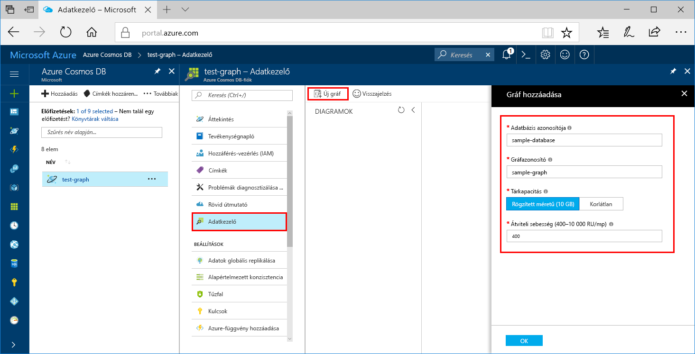

# <a name="azure-cosmos-db-create-a-graph-database-using-java-and-the-azure-portal"></a>Azure Cosmos DB: Gráfadatbázis létrehozása a Java és az Azure Portal használatával

Az Azure Cosmos DB a Microsoft globálisan elosztott többmodelles adatbázis-szolgáltatása. Azure Cosmos DB használja, gyorsan hozzon létre és lekérdezni a felügyelt dokumentumokban, a táblának és a graph-adatbázisokat. 

A gyors üzembe helyezés adatbázist hoz létre egyszerű grafikon az Azure portál tools for Azure Cosmos DB használatával. A rövid útmutató emellett bemutatja, hogyan hozhat létre gyorsan egy Java-konzolalkalmazást az OSS [Gremlin Java](https://mvnrepository.com/artifact/org.apache.tinkerpop/gremlin-driver)-illesztőprogramot használó gráfadatbázissal. A rövid útmutatóban lévő utasítások bármilyen, Java-programok futtatására alkalmas operációs rendszeren végrehajthatók. A gyors üzembe helyezés familiarizes létrehozásával és módosításával vagy a felhasználói felület vagy programozott módon, amelyik igény szerint grafikonjai. 

## <a name="prerequisites"></a>Előfeltételek
[!INCLUDE [quickstarts-free-trial-note](../../includes/quickstarts-free-trial-note.md)]

Továbbá:

* [Java fejlesztői készlet (JDK) 1.7+](http://www.oracle.com/technetwork/java/javase/downloads/jdk8-downloads-2133151.html)
    * Ubuntu rendszeren futtassa az `apt-get install default-jdk` parancsot a JDK telepítéséhez.
    * Ügyeljen arra, hogy a JAVA_HOME környezeti változó arra a mappára mutasson, ahová a JDK telepítve lett.
* [Maven](http://maven.apache.org/download.cgi) bináris archívum [letöltése](http://maven.apache.org/install.html) és [telepítése](http://maven.apache.org/)
    * Ubuntu rendszeren futtathatja az `apt-get install maven` parancsot a Maven telepítéséhez.
* [Git](https://www.git-scm.com/)
    * Ubuntu rendszeren futtathatja a `sudo apt-get install git` parancsot a Git telepítéséhez.

## <a name="create-a-database-account"></a>Adatbázisfiók létrehozása

A gráfadatbázis létrehozásához először létre kell hoznia egy Gremlin- (Graph-) adatbázisfiókot az Azure Cosmos DB segítségével.

[!INCLUDE [cosmos-db-create-dbaccount-graph](../../includes/cosmos-db-create-dbaccount-graph.md)]

## <a name="add-a-graph"></a>Gráf hozzáadása

Az Azure Portal Adatkezelő eszközét mostantól gráfadatbázisok létrehozására is használhatja. 

1. Kattintson a **adatkezelő** > **új diagram**.

    A **hozzáadása Graph** területen jelenik meg a képernyő jobb szélén, görgessen jobbra látható szeretne.

    

2. Az a **Hozzáadás graph** lapján adja meg az új diagram beállításait.

    Beállítás|Ajánlott érték|Leírás
    ---|---|---
    Adatbázis-azonosító|sample-database|Adja meg *-mintaadatbázist* , az új adatbázis nevét. Az adatbázis neve 1–255 karakter hosszúságú lehet, és nem tartalmazhat `/ \ # ?` karaktereket vagy záró szóközt.
    Gráfazonosító|sample-graph|Adja meg *minta-grafikon* az új gyűjtemény néven. Graph nevek rendelkezik adatbázis azonosítók megegyező karakter követelmények vonatkoznak.
    Tárkapacitás|Rögzített méretű (10 GB)|Módosítsa a beállítást **rögzített (10 GB-os)**. Ez az érték az adatbázis tárkapacitása.
    Teljesítmény|400 kérelemegység|Módosítsa az átviteli sebesség 400 kérelemegység (RU/mp) másodpercenként. Később lehetősége lesz növelni az átviteli sebességet a késés csökkentése érdekében.
    Partíciókulcs|Hagyja üresen|A rövid útmutató során hagyja üresen a Partíciókulcs mezőt.

3. Miután kitöltötte az űrlapot, kattintson az **OK** elemre.

## <a name="clone-the-sample-application"></a>A mintaalkalmazás klónozása

Most pedig váltsunk át kódok használatára. Most klónozni egy grafikonon API-alkalmazást a Githubból, állítsa be a kapcsolati karakterláncot, és futtassa. Látni fogja, milyen egyszerű az adatokkal programozott módon dolgozni.  

1. Nyisson meg egy git terminálablakot, például a git bash eszközt, és használja a `cd` parancs futtatásával módosíthatja a mintaalkalmazás telepítése mappába.  

    ```bash
    cd "C:\git-samples"
    ```

2. Futtassa a következő parancsot a minta tárház klónozásához. Ezzel a paranccsal létrejön egy mintaalkalmazás példányát a számítógépen. 

    ```bash
    git clone https://github.com/Azure-Samples/azure-cosmos-db-graph-java-getting-started.git
    ```

## <a name="review-the-code"></a>A kód áttekintése

Ez a lépés nem kötelező megadni. Ha most szeretné ismerni az a kód létrehozását az adatbázis-erőforrások, az alábbi kódtöredékek tekintheti meg. Kódtöredékek a rendszer az összes átveszi a `Program.java` a C:\git-samples\azure-cosmos-db-graph-java-getting-started\src\GetStarted mappában. Egyéb esetben ugorjon előre [frissítse a kapcsolati karakterlánc](#update-your-connection-string). 

* A rendszer a Gremlin `Client` alkalmazást az `src/remote.yaml` fájlban megadott konfiguráció szerint inicializálja.

    ```java
    cluster = Cluster.build(new File("src/remote.yaml")).create();
    ...
    client = cluster.connect();
    ```

* A `client.submit` metódus használatával a program Gremlinnel kapcsolatos lépések sorozatát hajtja végre.

    ```java
    ResultSet results = client.submit(gremlin);

    CompletableFuture<List<Result>> completableFutureResults = results.all();
    List<Result> resultList = completableFutureResults.get();

    for (Result result : resultList) {
        System.out.println(result.toString());
    }
    ```

## <a name="update-your-connection-information"></a>A kapcsolati adatok frissítése

Most lépjen vissza a kapcsolat adatait, és másolja az alkalmazásba az Azure portálon. Ezek a beállítások engedélyezése az alkalmazásban, az üzemeltetett adatbázissal való kommunikációhoz.

1. Az a [Azure-portálon](http://portal.azure.com/), kattintson a **kulcsok**. 

    Másolja az URI érték első része.

    
2. Nyissa meg a src/remote.yaml fájlt, és illessze be az érték keresztül `$name$` a `hosts: [$name$.graphs.azure.com]`.

    1. sorában remote.yaml most hasonlóan kell kinéznie 

    `hosts: [test-graph.graphs.azure.com]`

3. Az Azure portálon, használja a Másolás gombra az elsődleges kulcs másolása és beillesztése azt `$masterKey$` a `password: $masterKey$`.

    Remote.yaml 4 üzletági most hasonlóan kell kinéznie 

    `password: 2Ggkr662ifxz2Mg==`

4. Üzletági 3 remote.yaml a módosítása

    `username: /dbs/$database$/colls/$collection$`

    erre: 

    `username: /dbs/sample-database/colls/sample-graph`

5. Mentse a remote.yaml fájlt.

## <a name="run-the-console-app"></a>A konzolalkalmazás futtatása

1. A git terminálablakában a `cd` paranccsal lépjen az azure-cosmos-db-graph-java-getting-started mappába.

    ```git
    cd "C:\git-samples\azure-cosmos-db-graph-java-getting-started"
    ```

2. A git terminálablakába írja be az `mvn package` parancsot a szükséges Java-csomagok telepítéséhez.

3. A git-terminál ablakban futtassa `mvn exec:java -D exec.mainClass=GetStarted.Program` a Java-alkalmazás indításához.

    A terminálablakban megjelennek a gráfhoz hozzáadandó csúcspontok. Ha a program leáll, lépjen vissza az Azure-portálon az internetböngészőben. 

<a id="add-sample-data"></a>
## <a name="review-and-add-sample-data"></a>Áttekintés és mintaadatok hozzáadása

Ezután visszaléphet az Adatkezelőbe, és megtekintheti a gráfhoz hozzáadott csúcspontokat, valamint további adatpontokat is hozzáadhat.

1. Kattintson a **adatkezelő**, bontsa ki a **minta-diagram**, kattintson a **Graph**, és kattintson a **szűrés**. 

   

2. A **Találatok** listában megjelennek a gráfhoz hozzáadott új felhasználók. Ha kiválasztja a **ben** elemet, láthatja, hogy a robin elemhez kapcsolódik. Áthelyezheti a csúcsban körül húzással, az egér kerekének görgetésével nagyítás növelésére és csökkentésére, és bontsa ki a diagram a dupla nyíl méretét. 

   

3. Adjunk néhány új felhasználó. Adatok a gráfhoz való hozzáadásához kattintson az **Új csúcspont** gombra.

   

4. Adjon meg egy címkét a *személy*.

5. Kattintson a **tulajdonság hozzáadása** hozzáadásához minden, az alábbi tulajdonságok közül. Egyedi tulajdonságokat hozhat létre a gráfban található minden egyes személy számára. Csak az id kulcsot kötelező megadni.

    kulcs|érték|Megjegyzések
    ----|----|----
    id|ashley|A csúcspont egyedi azonosítója. Ha nem ad meg azonosítót, a rendszer létrehoz egyet.
    gender|female| 
    tech | java | 

    > [!NOTE]
    > Ebben a rövid útmutatóban egy nem particionált gyűjteményt hozunk létre. Ha azonban a gyűjtemény létrehozásakor megad egy partíciókulcsot és particionált gyűjteményt hoz létre, minden új csúcspontban meg kell adnia kulcsként a partíciókulcsot. 

6. Kattintson az **OK** gombra. Előfordulhat, hogy ki kell terjesztenie a képernyőt a képernyő alján lévő **OK** gomb megjelenítéséhez.

7. Kattintson ismét az **Új csúcspont** lehetőségre, és adjon hozzá még egy új felhasználót. 

8. Adjon meg egy címkét a *személy*.

9. Kattintson a **tulajdonság hozzáadása** hozzáadásához minden, az alábbi tulajdonságok közül:

    kulcs|érték|Megjegyzések
    ----|----|----
    id|rakesh|A csúcspont egyedi azonosítója. Ha nem ad meg azonosítót, a rendszer létrehoz egyet.
    gender|male| 
    school|MIT| 

10. Kattintson az **OK** gombra. 

11. Kattintson a **szűrés** az alapértelmezett `g.V()` összes érték a diagramon megjelenítendő szűrő. Most már az összes felhasználó megjelenik a **Találatok** listában. 

    Ha további adatokat ad meg, szűrőkkel csökkentheti a találatok számát. Alapértelmezés szerint adatkezelő használja `g.V()` egy grafikonon összes csúcsban beolvasása. Módosíthatja egy másik [graph lekérdezés](tutorial-query-graph.md), például a `g.V().count()`, hogy a csúcsban számát adja vissza a grafikonon JSON formátumban. Ha módosította a szűrőt, módosítsa a szűrőt biztonsági `g.V()` kattintson **szűrés** újra az összes eredmény megjelenítéséhez.

12. Most már összekapcsolhatjuk a rakesh és az ashley elemet. Győződjön meg arról, hogy az **ashley** elem van kijelölve a **Találatok** listában, majd kattintson a jobb alsó sarokban, a **Célok** elem mellett lévő Szerkesztés gombra. Előfordulhat, hogy szélesebbre kell állítania az ablakot a **Tulajdonságok** terület megjelenítéséhez.

   

13. A a **cél** mezőbe írja be *rakesh*, majd a a **peremhálózati címke** mezőbe írja be *tudja*, majd kattintson az ellenőrzés.

   

14. Ezután válassza ki a **rakesh** elemet a találatok listájából. Láthatja, hogy az ashley és a rakesh elem össze van kapcsolva. 

   

   Ezzel befejezte az oktatóanyag erőforrás létrehozása részét. Továbbra is a csomópontok hozzáadása a diagramon, módosítsa a meglévő csomópontok vagy lekérdezések módosítása. Most tegyük tekintse át a metrikákat Azure Cosmos DB biztosít, valamint az erőforrások majd törlése. 

## <a name="review-slas-in-the-azure-portal"></a>Az SLA-k áttekintése az Azure Portalon

[!INCLUDE [cosmosdb-tutorial-review-slas](../../includes/cosmos-db-tutorial-review-slas.md)]

## <a name="clean-up-resources"></a>Az erőforrások eltávolítása

[!INCLUDE [cosmosdb-delete-resource-group](../../includes/cosmos-db-delete-resource-group.md)]

## <a name="next-steps"></a>Következő lépések

Ebben a rövid útmutatóban bemutattuk, hogyan lehet Azure Cosmos DB-fiókot létrehozni, hogyan lehet az Adatkezelő segítségével gráfot készíteni, és hogyan lehet futtatni az alkalmazást. Most már készen áll arra, hogy a Gremlin használatával összetettebb lekérdezéseket hozzon létre és hatékony gráfbejárási logikákat implementáljon. 

> [!div class="nextstepaction"]
> [Lekérdezés a Gremlin használatával](tutorial-query-graph.md)

