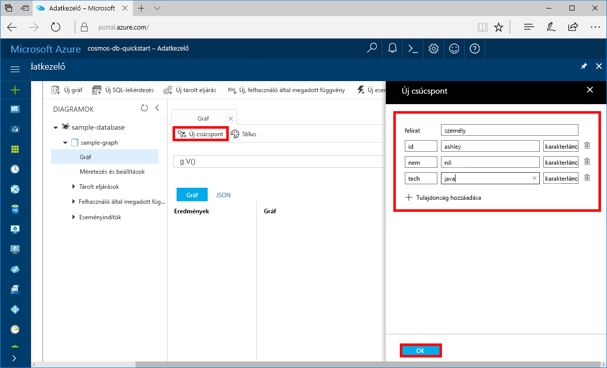
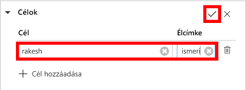

# <a name="azure-cosmos-db-create-a-graph-database-using-php-and-the-azure-portal"></a>Azure Cosmos DB: Gráfadatbázis létrehozása a PHP és az Azure Portal használatával

> [!div class="op_single_selector"]
> * [Gremlin-konzol](create-graph-gremlin-console.md)
> * [.NET](create-graph-dotnet.md)
> * [Java](create-graph-java.md)
> * [Node.js](create-graph-nodejs.md)
> * [Python](create-graph-python.md)
> * [PHP](create-graph-php.md)
>  

Ez a rövid útmutató azt ismerteti, hogy miként használható a PHP és az Azure Cosmos DB [Gremlin API](graph-introduction.md) egy konzolalkalmazás egy GitHubról származó példa klónozásával történő létrehozására. A rövid útmutató emellett azt is bemutatja, hogyan hozható létre egy Azure Cosmos DB-fiók a webes alapú Azure Portal használatával.   

Az Azure Cosmos DB a Microsoft globálisan elosztott többmodelles adatbázis-szolgáltatása. Segítségével gyorsan létrehozhat és lekérdezhet dokumentum, tábla, kulcs-érték és gráf típusú adatbázisokat, amelyek mindegyike felhasználja az Azure Cosmos DB középpontjában álló globális elosztási és horizontális skálázhatósági képességeket.  

## <a name="prerequisites"></a>Előfeltételek

[!INCLUDE [quickstarts-free-trial-note](../../includes/quickstarts-free-trial-note.md)] Alternatív lehetőségként [kipróbálhatja ingyenesen az Azure Cosmos DB-t](https://azure.microsoft.com/try/cosmosdb/) Azure-előfizetés, díjfizetés és elköteleződés nélkül.

Továbbá:
* A [PHP](https://php.net/) 5.6-os vagy újabb verziója
* [Composer](https://getcomposer.org/download/)

## <a name="create-a-database-account"></a>Adatbázisfiók létrehozása

A gráfadatbázis létrehozásához először létre kell hoznia egy Gremlin- (Graph-) adatbázisfiókot az Azure Cosmos DB segítségével.

[!INCLUDE [cosmos-db-create-dbaccount-graph](../../includes/cosmos-db-create-dbaccount-graph.md)]

## <a name="add-a-graph"></a>Gráf hozzáadása

[!INCLUDE [cosmos-db-create-graph](../../includes/cosmos-db-create-graph.md)]

## <a name="clone-the-sample-application"></a>A mintaalkalmazás klónozása

Most pedig váltsunk át kódok használatára. A következő lépésekben elvégezheti a Gremlin API-alkalmazás klónozását a GitHubról, beállíthatja a kapcsolati sztringet, és futtathatja az alkalmazást. Látni fogja, milyen egyszerű az adatokkal programozott módon dolgozni.  

1. Nyisson meg egy parancssort, hozzon létre egy git-samples nevű új mappát, majd zárja be a parancssort.

    ```bash
    md "C:\git-samples"
    ```

2. Nyisson meg egy git terminálablakot, például a git bash eszközt, és a `cd` parancs használatával váltson a mappára, ahol telepíteni szeretné a mintaalkalmazást.  

    ```bash
    cd "C:\git-samples"
    ```

3. Futtassa a következő parancsot a minta tárház klónozásához. Ez a parancs másolatot hoz létre a mintaalkalmazásról az Ön számítógépén. 

    ```bash
    git clone https://github.com/Azure-Samples/azure-cosmos-db-graph-php-getting-started.git
    ```

## <a name="review-the-code"></a>A kód áttekintése

Ez a lépés nem kötelező. Ha meg szeretné ismerni, hogyan jönnek létre az adatbázis erőforrásai a kódban, tekintse át a következő kódrészleteket. A kódrészletek mind a C:\git-samples\azure-cosmos-db-graph-php-getting-started\ mappában található connect.php fájlból származnak. Egyéb esetben ugorhat [A kapcsolati sztring frissítése](#update-your-connection-information) szakaszra. 

* A Gremlin `connection` inicializálása megtörténik a `connect.php` fájl elején a `$db` objektum használatával.

    ```php
    $db = new Connection([
        'host' => '<your_server_address>.graphs.azure.com',
        'username' => '/dbs/<db>/colls/<coll>',
        'password' => 'your_primary_key'
        ,'port' => '443'

        // Required parameter
        ,'ssl' => TRUE
    ]);
    ```

* A `$db->send($query);` metódus használatával a program Gremlinnel kapcsolatos lépések sorozatát hajtja végre.

    ```php
    $query = "g.V().drop()";
    ...
    $result = $db->send($query);
    $errors = array_filter($result);
    }
    ```

## <a name="update-your-connection-information"></a>A kapcsolatadatok frissítése

Lépjen vissza az Azure Portalra a kapcsolati adatokért, majd másolja be azokat az alkalmazásba. Ezek a beállítások lehetővé teszik az alkalmazás számára, hogy kommunikáljon az üzemeltetett adatbázissal.

1. Az [Azure Portalon](https://portal.azure.com/) kattintson a **Kulcsok** lehetőségre. 

    Másolja az URI érték első részét.

    
2. Nyissa meg a `connect.php` fájlt, és a 8. sorba illessze be az URI értéket a `your_server_address` helyére.

    A kapcsolatobjektum inicializálásának most a következő kódhoz hasonlóan kell kinéznie:

    ```php
    $db = new Connection([
        'host' => 'testgraphacct.graphs.azure.com',
        'username' => '/dbs/<db>/colls/<coll>',
        'password' => 'your_primary_key'
        ,'port' => '443'

        // Required parameter
        ,'ssl' => TRUE
    ]);
    ```

3. Ha a gráfadatbázis-fiókot 2017. december 20-án vagy azután hozta létre, módosítsa a gazdagép nevében a `graphs.azure.com` karakterláncot a következőre: `gremlin.cosmosdb.azure.com`.

4. Módosítsa a kapcsolat objektumban lévő `username` paramétert az adatbázis és a gráf nevével. Ha a `sample-database` és `sample-graph` javasolt értékeket használta, a következő kódhoz hasonlóan kell kinéznie:

    `'username' => '/dbs/sample-database/colls/sample-graph'`

    A teljes kapcsolatobjektumnak ekkor az alábbi kódrészlethez hasonlóan kell kinéznie:

    ```php
    $db = new Connection([
        'host' => 'testgraphacct.graphs.azure.com',
        'username' => '/dbs/sample-database/colls/sample-graph',
        'password' => 'your_primary_key',
        'port' => '443'

        // Required parameter
        ,'ssl' => TRUE
    ]);
    ```

5. Az Azure Portalon a másolás gombbal másolja az ELSŐDLEGES KULCSOT, és illessze a `your_primary_key` helyére a jelszóparaméterben.

    A kapcsolatobjektum inicializálásának most a következő kódhoz hasonlóan kell kinéznie:

    ```php
    $db = new Connection([
        'host' => 'testgraphacct.graphs.azure.com',
        'username' => '/dbs/sample-database/colls/sample-graph',
        'password' => '2Ggkr662ifxz2Mg==',
        'port' => '443'

        // Required parameter
        ,'ssl' => TRUE
    ]);
    ```

6. Mentse a `connect.php` fájlt.

## <a name="run-the-console-app"></a>A konzolalkalmazás futtatása

1. A git terminálablakban a `cd` paranccsal lépjen az azure-cosmos-db-graph-php-getting-started mappába.

    ```git
    cd "C:\git-samples\azure-cosmos-db-graph-php-getting-started"
    ```

2. A git terminálablakban használja a következő parancsot a kötelező PHP-függőségek telepítéséhez.

   ```
   composer install
   ```

3. A git terminálablakban használja a következő parancsot a PHP-alkalmazás elindításához.
    
    ```
    php connect.php
    ```

    A terminálablakban megjelennek a gráfhoz hozzáadandó csúcspontok. 
    
    Ha időtúllépési hibákat észlel, ellenőrizze, hogy megfelelően frissítette-e a kapcsolati adatokat [A kapcsolati adatok frissítése](#update-your-connection-information) szakaszban, és próbálja meg újból futtatni az utolsó parancsot. 
    
    Amikor a program leáll, nyomja le az Enter billentyűt, és lépjen vissza az Azure Portalra a webböngészőben. 

<a id="add-sample-data"></a>
## <a name="review-and-add-sample-data"></a>Áttekintés és mintaadatok hozzáadása

Ezután visszaléphet az Adatkezelőbe, és megtekintheti a gráfhoz hozzáadott csúcspontokat, valamint további adatpontokat is hozzáadhat.

1. Kattintson az **Adatkezelőre**, bontsa ki a **sample-graph** csomópontot, és kattintson a **Gráf**, majd a **Szűrő alkalmazása** lehetőségre. 

   

2. A **Találatok** listában megjelennek a gráfhoz hozzáadott új felhasználók. Ha kiválasztja a **ben** elemet, láthatja, hogy a robin elemhez kapcsolódik. A csúcspontokat szabadon mozgathatja húzással, nagyíthat és kicsinyíthet az egérgörgő görgetésével, illetve megnövelheti a gráf méretét a duplaszárú nyíllal. 

   

3. Adjunk hozzá néhány új felhasználót. Adatok a gráfhoz való hozzáadásához kattintson az **Új csúcspont** gombra.

   

4. Adja meg a *person* címkét.

5. Kattintson a **Tulajdonság hozzáadása** lehetőségre a következő tulajdonságok hozzáadásához. Egyedi tulajdonságokat hozhat létre a gráfban található minden egyes személy számára. Csak az id kulcsot kötelező megadni.

    kulcs|érték|Megjegyzések
    ----|----|----
    id|ashley|A csúcspont egyedi azonosítója. Ha nem ad meg azonosítót, a rendszer létrehoz egyet.
    gender|female| 
    tech | java | 

    > [!NOTE]
    > Ebben a rövid útmutatóban egy nem particionált gyűjteményt fog létrehozni. Ha azonban a gyűjtemény létrehozásakor megad egy partíciókulcsot és particionált gyűjteményt hoz létre, minden új csúcspontban meg kell adnia kulcsként a partíciókulcsot. 

6. Kattintson az **OK** gombra. Előfordulhat, hogy ki kell terjesztenie a képernyőt a képernyő alján lévő **OK** gomb megjelenítéséhez.

7. Kattintson ismét az **Új csúcspont** lehetőségre, és adjon hozzá még egy új felhasználót. 

8. Adja meg a *person* címkét.

9. Kattintson a **Tulajdonság hozzáadása** lehetőségre a következő tulajdonságok hozzáadásához:

    kulcs|érték|Megjegyzések
    ----|----|----
    id|rakesh|A csúcspont egyedi azonosítója. Ha nem ad meg azonosítót, a rendszer létrehoz egyet.
    gender|male| 
    school|MIT| 

10. Kattintson az **OK** gombra. 

11. Kattintson a **Szűrő alkalmazása** gombra a gráf összes értékének megtekintéséhez az alapértelmezett `g.V()` szűrővel. Most már az összes felhasználó megjelenik a **Találatok** listában. 

    Ha további adatokat ad meg, szűrőkkel csökkentheti a találatok számát. Az Adatkezelő alapértelmezés szerint a `g.V()` lekérdezést használja a gráf összes csúcspontjának lekéréséhez. Ezt más [gráflekérdezésre](tutorial-query-graph.md) is módosíthatja, például a `g.V().count()` lekérdezésre, ha azt szeretné, hogy a rendszer JSON formátumban adja vissza a gráf csúcspontjainak számát. Ha módosította a szűrőt, állítsa vissza a szűrőt a `g.V()` lekérdezésre, majd kattintson a **Szűrő alkalmazása** lehetőségre az eredmények újbóli megjelenítéséhez.

12. Most már összekapcsolhatja a rakesh és az ashley elemet. Győződjön meg arról, hogy az **ashley** elem van kijelölve a **Találatok** listában, majd kattintson a jobb alsó sarokban, a **Célok** elem mellett lévő Szerkesztés gombra. Előfordulhat, hogy szélesebbre kell állítania az ablakot a **Tulajdonságok** terület megjelenítéséhez.

   

13. A **Cél** mezőbe írja be a *rakesh* nevet, az **Élcímke** mezőbe pedig a *knows* karakterláncot, majd jelölje be a jelölőnégyzetet.

   

14. Ezután válassza ki a **rakesh** elemet a találatok listájából. Láthatja, hogy az ashley és a rakesh elem össze van kapcsolva. 

   

   Ezzel befejezte a gyors útmutató erőforrások létrehozására vonatkozó részét. A gráfhoz továbbra is hozzáadhat csúcspontokat, módosíthatja a meglévő csúcspontokat, és megváltoztathatja a lekérdezéseket. Most pedig tekintsük át az Azure Cosmos DB által biztosított mérőszámokat, majd távolítsuk el az erőforrásokat. 

## <a name="review-slas-in-the-azure-portal"></a>Az SLA-k áttekintése az Azure Portalon

[!INCLUDE [cosmosdb-tutorial-review-slas](../../includes/cosmos-db-tutorial-review-slas.md)]

## <a name="clean-up-resources"></a>Az erőforrások eltávolítása

[!INCLUDE [cosmosdb-delete-resource-group](../../includes/cosmos-db-delete-resource-group.md)]

## <a name="next-steps"></a>További lépések

Ebben a rövid útmutatóban bemutattuk, hogyan lehet Azure Cosmos DB-fiókot létrehozni, hogyan lehet az Adatkezelő segítségével gráfot készíteni, és hogyan lehet futtatni az alkalmazást. Most már készen áll arra, hogy a Gremlin használatával összetettebb lekérdezéseket hozzon létre és hatékony gráfbejárási logikákat implementáljon. 

> [!div class="nextstepaction"]
> [Lekérdezés a Gremlin használatával](tutorial-query-graph.md)

