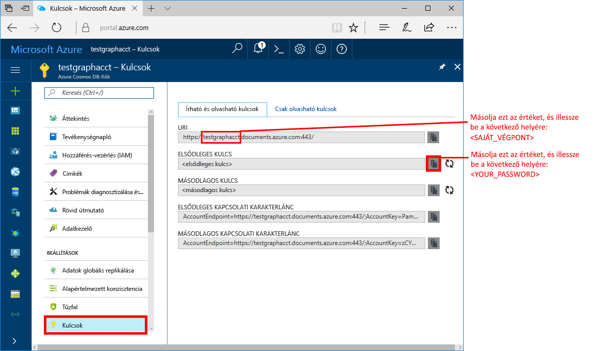
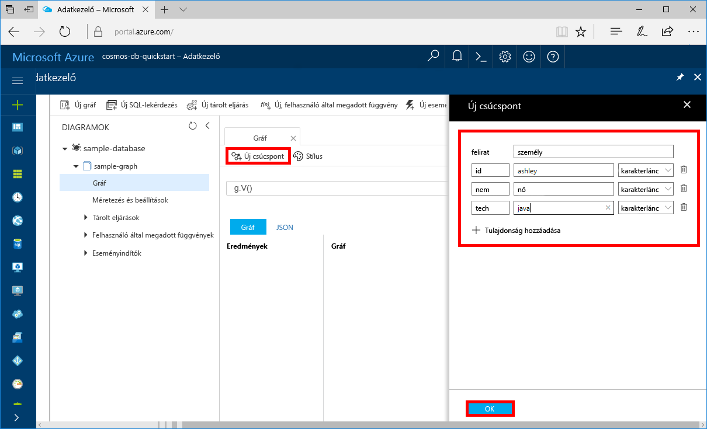

# <a name="quickstart-create-a-graph-database-in-azure-cosmos-db-using-python-and-the-azure-portal"></a>Rövid útmutató: Graph-adatbázis létrehozása az Azure Cosmos DB-ben a Python és az Azure Portal használatával

> [!div class="op_single_selector"]
> * [Gremlin-konzol](create-graph-gremlin-console.md)
> * [.NET](create-graph-dotnet.md)
> * [Java](create-graph-java.md)
> * [Node.js](create-graph-nodejs.md)
> * [Python](create-graph-python.md)
> * [Php](create-graph-php.md)
>  

Ebben a rövid útmutatóban hozzon létre és kezeljen egy Azure Cosmos DB Gremlin (graph) API-fiókot az Azure Portalról, és adjon hozzá adatokat a GitHubról klónozott Python-alkalmazás használatával. Az Azure Cosmos DB egy többmodelles adatbázis-szolgáltatás, amely lehetővé teszi a dokumentumok, a tábla, a kulcsérték és a grafikonadatbázisok gyors létrehozását és lekérdezését globális terjesztési és horizontális méretezési képességekkel.

## <a name="prerequisites"></a>Előfeltételek
- Egy aktív előfizetéssel rendelkező Azure-fiók. [Hozzon létre egyet ingyen.](https://azure.microsoft.com/free/?ref=microsoft.com&utm_source=microsoft.com&utm_medium=docs&utm_campaign=visualstudio) Vagy [próbálja ki az Azure Cosmos DB-t ingyenesen](https://azure.microsoft.com/try/cosmosdb/) Azure-előfizetés nélkül.
- [Python 3.5+](https://www.python.org/downloads/) beleértve [a pip](https://pip.pypa.io/en/stable/installing/) csomag telepítőt.
- [Python driver a Gremlin](https://github.com/apache/tinkerpop/tree/master/gremlin-python).
- [Git](https://git-scm.com/downloads).

> [!NOTE]
> Ehhez a rövid útmutatóhoz 2017. december 20. után készült gráfadatbázis-fiókra van szükség. A meglévő fiókok azután támogatják a Pythont, hogy az általános elérhetőség érdekében migrálva lettek.

## <a name="create-a-database-account"></a>Adatbázisfiók létrehozása

A gráfadatbázis létrehozásához először létre kell hoznia egy Gremlin- (Graph-) adatbázisfiókot az Azure Cosmos DB segítségével.

[!INCLUDE [cosmos-db-create-dbaccount-graph](../../includes/cosmos-db-create-dbaccount-graph.md)]

## <a name="add-a-graph"></a>Gráf hozzáadása

[!INCLUDE [cosmos-db-create-graph](../../includes/cosmos-db-create-graph.md)]

## <a name="clone-the-sample-application"></a>A mintaalkalmazás klónozása

Most pedig váltsunk át kódok használatára. A következő lépésekben elvégezheti a Gremlin API-alkalmazás klónozását a GitHubról, beállíthatja a kapcsolati sztringet, és futtathatja az alkalmazást. Látni fogja, mennyire egyszerű programozott módon dolgozni az adatokkal.  

1. Nyisson meg egy parancssort, hozzon létre egy git-samples nevű mappát, majd zárja be a parancssort.

    ```bash
    md "C:\git-samples"
    ```

2. Nyisson meg egy git terminálablakot, például a git bash eszközt, és a `cd` parancs használatával váltson a mappára, ahol telepíteni szeretné a mintaalkalmazást.  

    ```bash
    cd "C:\git-samples"
    ```

3. Futtassa a következő parancsot a mintatárház klónozásához. Ez a parancs másolatot hoz létre a mintaalkalmazásról az Ön számítógépén. 

    ```bash
    git clone https://github.com/Azure-Samples/azure-cosmos-db-graph-python-getting-started.git
    ```

## <a name="review-the-code"></a>A kód áttekintése

Ez a lépés nem kötelező. Ha meg szeretné ismerni, hogyan jönnek létre az adatbázis erőforrásai a kódban, tekintse át a következő kódrészleteket. A kódrészletek mind a *C:\git-samples\azure-cosmos-db-graph-python-getting-started\\ * mappában lévő *connect.py* fájlból származnak. Egyéb esetben ugorhat [A kapcsolati sztring frissítése](#update-your-connection-information) szakaszra. 

* A Gremlin `client` inicializálva a 104-es sorban *connect.py:*

    ```python
    ...
    client = client.Client('wss://<YOUR_ENDPOINT>.gremlin.cosmosdb.azure.com:443/','g', 
        username="/dbs/<YOUR_DATABASE>/colls/<YOUR_COLLECTION_OR_GRAPH>", 
        password="<YOUR_PASSWORD>")
    ...
    ```

* A *connect.py* fájl elején gremlin lépések sorozata lesz deklarálva. Végrehajtásuk a `client.submitAsync()` metódus használatával történik:

    ```python
    client.submitAsync(_gremlin_cleanup_graph)
    ```

## <a name="update-your-connection-information"></a>A kapcsolatadatok frissítése

Lépjen vissza az Azure Portalra a kapcsolati adatokért, majd másolja be azokat az alkalmazásba. Ezek a beállítások lehetővé teszik az alkalmazás számára, hogy kommunikáljon az üzemeltetett adatbázissal.

1. Az Azure Cosmos DB-fiókjában az [Azure Portalon](https://portal.azure.com/)válassza a **Kulcsok lehetőséget.** 

    Másolja az URI érték első részét.

    

2. Nyissa meg a *connect.py* fájlt, és a 104-es sorban illessze be `<YOUR_ENDPOINT>` az URI-értéket ide:

    ```python
    client = client.Client('wss://<YOUR_ENDPOINT>.gremlin.cosmosdb.azure.com:443/','g', 
        username="/dbs/<YOUR_DATABASE>/colls/<YOUR_COLLECTION_OR_GRAPH>", 
        password="<YOUR_PASSWORD>")
    ```

    Az ügyfélobjektum URI részének most a következőhöz hasonlóan kell kinéznie:

    ```python
    client = client.Client('wss://test.gremlin.cosmosdb.azure.com:443/','g', 
        username="/dbs/<YOUR_DATABASE>/colls/<YOUR_COLLECTION_OR_GRAPH>", 
        password="<YOUR_PASSWORD>")
    ```

3. Módosítsa a `client` objektum második paraméterét a `<YOUR_DATABASE>` és `<YOUR_COLLECTION_OR_GRAPH>` sztringek lecseréléséhez. Ha a javasolt értékeket használta, a paraméternek ehhez a kódhoz hasonlóan kell kinéznie:

    `username="/dbs/sample-database/colls/sample-graph"`

    A teljes `client` objektumnak ehhez a kódhoz hasonlóan kell kinéznie:

    ```python
    client = client.Client('wss://test.gremlin.cosmosdb.azure.com:443/','g', 
        username="/dbs/sample-database/colls/sample-graph", 
        password="<YOUR_PASSWORD>")
    ```

4. A **Kulcsok** lapon a másolás gombbal másolja a főkulcsot, és illessze be `<YOUR_PASSWORD>` a `password=<YOUR_PASSWORD>` paraméterbe.

    A teljes `client` objektumdefiníciónak ehhez a kódhoz hasonlóan kell kinéznie:
    ```python
    client = client.Client('wss://test.gremlin.cosmosdb.azure.com:443/','g', 
        username="/dbs/sample-database/colls/sample-graph", 
        password="asdb13Fadsf14FASc22Ggkr662ifxz2Mg==")
    ```

6. Mentse a *connect.py* fájlt.

## <a name="run-the-console-app"></a>A konzolalkalmazás futtatása

1. A git terminálablakban a `cd` paranccsal lépjen az azure-cosmos-db-graph-python-getting-started mappába.

    ```git
    cd "C:\git-samples\azure-cosmos-db-graph-python-getting-started"
    ```

2. A git terminálablakában futtassa a következő parancsot a szükséges Python-csomagok telepítéséhez.

   ```
   pip install -r requirements.txt
   ```

3. A git terminálablakában futtassa a következő parancsot a Python-alkalmazás elindításához.
    
    ```
    python connect.py
    ```

    A terminálablakban megjelennek a gráfhoz hozzáadandó csúcspontok és élek. 
    
    Ha időtúllépési hibákat észlel, ellenőrizze, hogy megfelelően frissítette-e a kapcsolati adatokat [A kapcsolati adatok frissítése](#update-your-connection-information) szakaszban, és próbálja meg újból futtatni az utolsó parancsot. 
    
    Amikor a program leáll, nyomja le az Enter billentyűt, és lépjen vissza az Azure Portalra a webböngészőben.

<a id="add-sample-data"></a>
## <a name="review-and-add-sample-data"></a>Áttekintés és mintaadatok hozzáadása

A csúcsok és élek beszúrása után visszatérhet az Adatkezelőhöz, megtekintheti a diagramhoz hozzáadott csúcsokat, és további adatpontokat adhat hozzá.

1. Az Azure Cosmos DB-fiókjában válassza az **Adatkezelő**lehetőséget, bontsa ki a **mintagrafikont,** válassza a **Grafikon**lehetőséget, majd válassza a **Szűrő alkalmazása**lehetőséget. 

   

2. Az **Eredmények** listában figyelje meg, hogy három új felhasználó kerül a diagramra. A csúcspontokat szabadon mozgathatja húzással, nagyíthat és kicsinyíthet az egérgörgő görgetésével, illetve megnövelheti a gráf méretét a duplaszárú nyíllal. 

   

3. Adjunk hozzá néhány új felhasználót. Az **Új csúcspont** gombra kattintva adjon hozzá adatokat a diagramhoz.

   

4. Adja meg a *person* címkét.

5. Válassza **a Tulajdonság hozzáadása** lehetőséget az alábbi tulajdonságok hozzáadásához. Egyedi tulajdonságokat hozhat létre a gráfban található minden egyes személy számára. Csak az id kulcsot kötelező megadni.

    kulcs|érték|Megjegyzések
    ----|----|----
    Pk|/pk| 
    id|ashley|A csúcspont egyedi azonosítója. Ha nem ad meg azonosítót, a rendszer létrehoz egyet.
    gender|female| 
    tech | java | 

    > [!NOTE]
    > Ebben a rövid útmutatóban egy nem particionált gyűjteményt hozunk létre. Ha azonban a gyűjtemény létrehozásakor megad egy partíciókulcsot és particionált gyűjteményt hoz létre, minden új csúcspontban meg kell adnia kulcsként a partíciókulcsot. 

6. Válassza **az OK gombot.** Előfordulhat, hogy ki kell terjesztenie a képernyőt a képernyő alján lévő **OK** gomb megjelenítéséhez.

7. Válassza ismét **az Új csúcspont lehetőséget,** és vegyen fel egy új felhasználót. 

8. Adja meg a *person* címkét.

9. Válassza **a Tulajdonság hozzáadása** lehetőséget az alábbi tulajdonságok hozzáadásához:

    kulcs|érték|Megjegyzések
    ----|----|----
    Pk|/pk| 
    id|rakesh|A csúcspont egyedi azonosítója. Ha nem ad meg azonosítót, a rendszer létrehoz egyet.
    gender|male| 
    school|MIT| 

10. Válassza **az OK gombot.** 

11. A szűrő **alkalmazása** gombra `g.V()` az alapértelmezett szűrővel a diagram összes értékének megjelenítéséhez. Most már az összes felhasználó megjelenik a **Találatok** listában. 

    Ha további adatokat ad meg, szűrőkkel csökkentheti a találatok számát. Az Adatkezelő alapértelmezés szerint a `g.V()` lekérdezést használja a gráf összes csúcspontjának lekéréséhez. Ezt más [gráflekérdezésre](tutorial-query-graph.md) is módosíthatja, például a `g.V().count()` lekérdezésre, ha azt szeretné, hogy a rendszer JSON formátumban adja vissza a gráf csúcspontjainak számát. Ha módosította a szűrőt, módosítsa `g.V()` vissza a szűrőt, és válassza a **Szűrő alkalmazása** lehetőséget az összes eredmény ismételt megjelenítéséhez.

12. Most már összekapcsolhatjuk a rakesh és az ashley elemet. Győződjön meg arról, hogy **Ashley** ki van jelölve az **Eredmények** listában, majd válassza a Szerkesztés gombot a **Célok** gomb mellett a jobb alsó oldalon. Előfordulhat, hogy szélesebbre kell állítania az ablakot a **Tulajdonságok** terület megjelenítéséhez.

    

13. A **Cél** mező *rakesh*mezőjében és az **Edge címkemezőjében** *ismeri*a mezőt, majd jelölje be a pipa jelölőnégyzetet.

    

14. Ezután válassza ki a **rakesh** elemet a találatok listájából. Láthatja, hogy az ashley és a rakesh elem össze van kapcsolva. 

    

Ezzel befejezte az oktatóanyag erőforrások létrehozásra vonatkozó részét. A gráfhoz továbbra is hozzáadhat csúcspontokat, módosíthatja a meglévő csúcspontokat, és megváltoztathatja a lekérdezéseket. Most pedig tekintsük át az Azure Cosmos DB által biztosított mérőszámokat, majd távolítsuk el az erőforrásokat. 

## <a name="review-slas-in-the-azure-portal"></a>Tekintse át az SLA-kat az Azure Portalon

[!INCLUDE [cosmosdb-tutorial-review-slas](../../includes/cosmos-db-tutorial-review-slas.md)]

## <a name="clean-up-resources"></a>Az erőforrások eltávolítása

[!INCLUDE [cosmosdb-delete-resource-group](../../includes/cosmos-db-delete-resource-group.md)]

## <a name="next-steps"></a>További lépések

Ebben a rövid útmutatóban megtanulta, hogyan hozhat létre egy Azure Cosmos DB-fiókot, hogyan hozhat létre egy grafikont az Adatkezelő vel, és futtathatja a Python-alkalmazást adatok hozzáadásához a diagramhoz. Az útmutató információira támaszkodva összetett lekérdezéseket hozhat létre és hatékony gráfbejárási logikákat helyezhet üzembe a Gremlin használatával. 

> [!div class="nextstepaction"]
> [Lekérdezés a Gremlin használatával](tutorial-query-graph.md)

