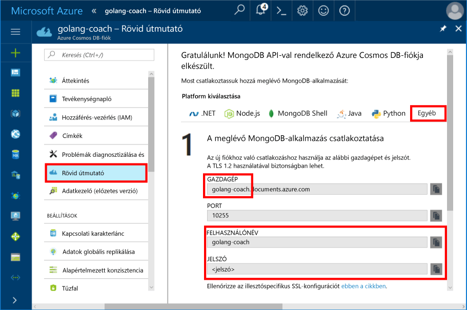
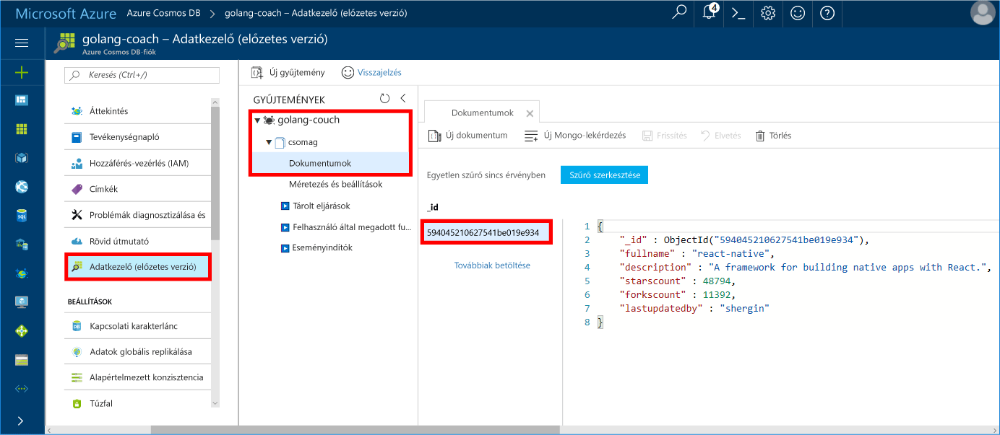

# <a name="azure-cosmos-db-build-a-mongodb-api-console-app-with-golang-and-the-azure-portal"></a>Azure Cosmos DB: MongoDB API konzolalkalmazás létrehozása a Golang és az Azure Portal használatával

Az Azure Cosmos DB a Microsoft globálisan elosztott többmodelles adatbázis-szolgáltatása. Segítségével gyorsan létrehozhat és lekérdezhet dokumentum-, kulcs/érték és gráf típusú adatbázisokat, melyek mindegyike felhasználja az Azure Cosmos DB középpontjában álló globális elosztási és horizontális skálázhatósági képességeket.

Ez a bevezető ismerteti a [Golang](https://golang.org/) nyelven írt, meglévő [MongoDB](https://docs.microsoft.com/en-us/azure/cosmos-db/mongodb-introduction)-alkalmazások használatát, valamint azok összekapcsolásának menetét a MongoDB-ügyfélkapcsolatokat támogató Azure Cosmos DB-adatbázissal.

Más szóval a Golang-alkalmazás csak azt tudja, hogy a MongoDB API-k használatával csatlakozott egy adatbázishoz. Az alkalmazás nem látja, hogy az adatokat az Azure Cosmos DB tárolja.

## <a name="prerequisites"></a>Előfeltételek

- Azure-előfizetés. Ha nem rendelkezik Azure-előfizetéssel, mindössze néhány perc alatt létrehozhat egy [ingyenes fiókot](https://azure.microsoft.com/free) a virtuális gép létrehozásának megkezdése előtt.
- [Lépjen a ](https://golang.org/dl/) oldalra a [Go](https://golang.org/) nyelvre vonatkozó általános ismertetőért.
- Egy IDE– [Gogland](https://www.jetbrains.com/go/) a Jetbrains-től, [Visual Studio Code](https://code.visualstudio.com/) a Microsofttól vagy [Atom](https://atom.io/). Ebben az oktatóanyagban a Goglang használatára kerül sor.

<a id="create-account"></a>
## <a name="create-a-database-account"></a>Adatbázisfiók létrehozása

[!INCLUDE [cosmos-db-create-dbaccount](../../includes/cosmos-db-create-dbaccount-mongodb.md)]

## <a name="clone-the-sample-application"></a>A mintaalkalmazás klónozása

Klónozza a mintaalkalmazást, és telepítse a szükséges csomagokat.

1. Hozza létre a CosmosDBSample mappát a GOROOT\src mappában, amely alapértelmezés szerint a C:\Go\ mappa.
2. Futtassa a következő parancsot egy git bash git terminálablakot használva a minta-tárház klónozásához a CosmosDBSample mappába. 

    ```bash
    git clone https://github.com/Azure-Samples/azure-cosmos-db-mongodb-golang-getting-started.git
    ```
3.  Futtassa a következő parancsot az mgo csomag lekéréséhez. 

    ```
    go get gopkg.in/mgo.v2
    ```

Az [mgo](http://labix.org/mgo) (ejtsd: *mango*) illesztőprogram egy [MongoDB](http://www.mongodb.org/)-illesztőprogram a [Go nyelvhez](http://golang.org/), amely egy hatékony és alaposan tesztelt funkciókészletet valósít meg egy nagyon egyszerű API-val a standard Go nyelv szintaxisát követve.

<a id="connection-string"></a>

## <a name="update-your-connection-string"></a>A kapcsolati karakterlánc frissítése

Lépjen vissza az Azure Portalra a kapcsolati karakterlánc adataiért, majd másolja be azokat az alkalmazásba.

1. Kattintson az **Első lépések** elemre a bal oldali navigációs menüben, majd az **Egyéb** elemre a Go-alkalmazáshoz szükséges kapcsolati sztring adatainak megtekintéséhez.

2. A Goglangban nyissa meg a main.go fájlt a GOROOT\CosmosDBSample könyvtárban, és frissítse a kapcsolati sztring adatait az Azure portálról az alábbi képernyőfelvételen látható módon, az alábbi kódsorok használatával. 

    Az adatbázisnév az Azure-portálon a kapcsolati sztring ablaktábla **Host** (Gazdgép) értékének előtagja. Az alábbi képen látható fiók esetében az adatbázisnév golang-coach.

    ```go
    Database: "The prefix of the Host value in the Azure portal",
    Username: "The Username in the Azure portal",
    Password: "The Password in the Azure portal",
    ```

    

3. Mentse a main.go fájlt.

## <a name="review-the-code"></a>A kód áttekintése

Tekintsük át, hogy mi történik a main.go fájlban. 

### <a name="connecting-the-go-app-to-azure-cosmos-db"></a>Az alkalmazás csatlakoztatása az Azure Cosmos DB-hez

Az Azure Cosmos DB támogatja az SSL-kompatibilis MongoDB-t. Egy SSL-kompatibilis MongoDB-hez való csatlakozáshoz definiálja a **DialServer** függvényt az [mgo.DialInfo](http://gopkg.in/mgo.v2#DialInfo) fájlban, és használja a [tls.*Dial* ](http://golang.org/pkg/crypto/tls#Dial) függvényt a csatlakozás végrehajtására.

A következő Golang kódrészlet csatlakoztatja a Go-alkalmazást az Azure Cosmos DB MongoDB API-hoz. A *DialInfo* osztály egy MongoDB-fürttel munkamenetet létrehozó beállításokat tartalmaz.

```go
// DialInfo holds options for establishing a session with a MongoDB cluster.
dialInfo := &mgo.DialInfo{
    Addrs:    []string{"golang-couch.documents.azure.com:10255"}, // Get HOST + PORT
    Timeout:  60 * time.Second,
    Database: "database", // It can be anything
    Username: "username", // Username
    Password: "Azure database connect password from Azure Portal", // PASSWORD
    DialServer: func(addr *mgo.ServerAddr) (net.Conn, error) {
        return tls.Dial("tcp", addr.String(), &tls.Config{})
    },
}

// Create a session which maintains a pool of socket connections
// to our Azure Cosmos DB MongoDB database.
session, err := mgo.DialWithInfo(dialInfo)

if err != nil {
    fmt.Printf("Can't connect to mongo, go error %v\n", err)
    os.Exit(1)
}

defer session.Close()

// SetSafe changes the session safety mode.
// If the safe parameter is nil, the session is put in unsafe mode, 
// and writes become fire-and-forget,
// without error checking. The unsafe mode is faster since operations won't hold on waiting for a confirmation.
// 
session.SetSafe(&mgo.Safe{})
```

A **mgo.Dial()** metódust akkor használatos, amikor nincs SSL-kapcsolat. Az SSL-kapcsolathoz a **mgo. DialWithInfo()** metódusra van szükség.

A **DialWIthInfo{}** objektum egy példánya a munkamenet-objektum létrehozásához használatos. A munkamenet létrehozását követően a következő kódrészlet használatával érhető el a gyűjtemény:

```go
collection := session.DB(“database”).C(“package”)
```

<a id="create-document"></a>

### <a name="create-a-document"></a>Dokumentum létrehozása

```go
// Model
type Package struct {
    Id bson.ObjectId  `bson:"_id,omitempty"`
    FullName      string
    Description   string
    StarsCount    int
    ForksCount    int
    LastUpdatedBy string
}

// insert Document in collection
err = collection.Insert(&Package{
    FullName:"react",
    Description:"A framework for building native apps with React.",
    ForksCount: 11392,
    StarsCount:48794,
    LastUpdatedBy:"shergin",

})

if err != nil {
    log.Fatal("Problem inserting data: ", err)
    return
}
```

### <a name="query-or-read-a-document"></a>Dokumentum lekérdezése vagy olvasása

Az Azure Cosmos DB támogatja az egyes gyűjteményekben tárolt JSON-dokumentumokon végzett részletes lekérdezéseket. Az alábbi mintakód egy olyan lekérdezést mutat be, amelyet a gyűjteményben található dokumentumokra vonatkozóan futtathat le.

```go
// Get a Document from the collection
result := Package{}
err = collection.Find(bson.M{"fullname": "react"}).One(&result)
if err != nil {
    log.Fatal("Error finding record: ", err)
    return
}

fmt.Println("Description:", result.Description)
```


### <a name="update-a-document"></a>Dokumentum frissítése

```go
// Update a document
updateQuery := bson.M{"_id": result.Id}
change := bson.M{"$set": bson.M{"fullname": "react-native"}}
err = collection.Update(updateQuery, change)
if err != nil {
    log.Fatal("Error updating record: ", err)
    return
}
```

### <a name="delete-a-document"></a>Dokumentum törlése

Az Azure Cosmos DB támogatja a JSON-dokumentumok törlését.

```go
// Delete a document
query := bson.M{"_id": result.Id}
err = collection.Remove(query)
if err != nil {
   log.Fatal("Error deleting record: ", err)
   return
}
```
    
## <a name="run-the-app"></a>Az alkalmazás futtatása

1. A Goglangban ellenőrizze, hogy a GOPATH (elérése: **File**, **Settings**, **Go**, **GOPATH**) változó tartalmazza a gopkg telepítésének helyét, ami alapértelmezés szerint a USERPROFILE\go könyvtár. 
2. Tegye megjegyzésbe a dokumentumot törlő sorokat (91–96. sor), hogy az alkalmazás futtatása után megtekinthesse a dokumentumot.
3. A Goglangban kattintson a **Run** (Futtatás), majd a **Run 'Build main.go and run'** (A main.go létrehozása és futtatás) parancsra.

    Az alkalmazás befejeződik, és megjeleníti a létrehozott dokumentum leírását a [Dokumentum létrehozása](#create-document) területen.
    
    ```
    Description: A framework for building native apps with React.
    
    Process finished with exit code 0
    ```

    
    
## <a name="review-your-document-in-data-explorer"></a>A dokumentum ellenőrzése az Adatkezelőben

Lépjen vissza az Azure portálon, ha az Adatkezelőben szeretné megjeleníteni a dokumentumot.

1. Kattintson a bal oldali navigációs menü **Adatkezelő (előzetes verzió)** pontjára, bontsa ki a **golang-coach**, **package** csomópontokat, majd kattintson a **Dokumentumok** elemre. A **Dokumentumok** lapon kattintson a \_id-re a dokumentum megjelenítéséhez a jobb oldali ablaktáblán. 

    
    
2. Ezután dolgozzon a dokumentumban, majd kattintson a **Frissítés** elemre a mentéshez. Törölheti is a dokumentumot, vagy létrehozhat új dokumentumokat és lekérdezéseket is.

## <a name="review-slas-in-the-azure-portal"></a>Tekintse át az SLA-kat az Azure Portalon

[!INCLUDE [cosmosdb-tutorial-review-slas](../../includes/cosmos-db-tutorial-review-slas.md)]

## <a name="clean-up-resources"></a>Az erőforrások eltávolítása

Ha az alkalmazást már nem használja, akkor a következő lépésekkel a mintaalkalmazás által létrehozott összes erőforrást törölheti az Azure Portalon:

1. Az Azure Portal bal oldali menüjében kattintson az **Erőforráscsoportok** lehetőségre, majd kattintson a létrehozott erőforrás nevére. 
2. Az erőforráscsoport lapján kattintson a **Törlés** elemre, írja be a törölni kívánt erőforrás nevét a szövegmezőbe, majd kattintson a **Törlés** gombra.

## <a name="next-steps"></a>Következő lépések

Ebben a rövid útmutatóban bemutattuk, hogyan lehet Azure Cosmos DB-fiókot létrehozni, és a MongoDB-hez tartozó API használatával Golang-alkalmazást futtatni. Most további adatokat importálhat a Cosmos DB-fiókba. 

> [!div class="nextstepaction"]
> [Adatok importálása az Azure Cosmos DB-be a MongoDB API-hoz](mongodb-migrate.md)

