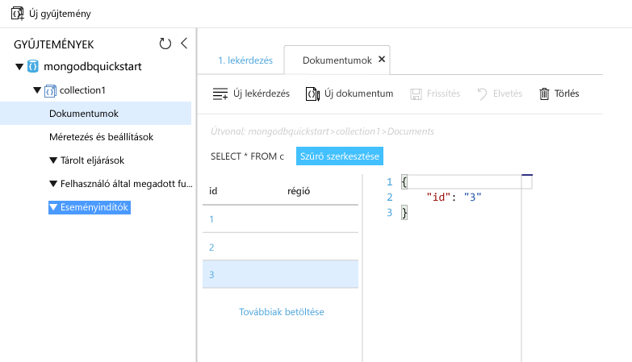

# <a name="azure-cosmos-db-migrate-an-existing-nodejs-mongodb-web-app"></a>Az Azure Cosmos DB: Egy meglévő Node.js MongoDB-webalkalmazás migrálása 

> [!div class="op_single_selector"]
> * [.NET](create-mongodb-dotnet.md)
> * [Java](create-mongodb-java.md)
> * [Node.js](create-mongodb-nodejs.md)
> * [Python](create-mongodb-flask.md)
> * [Xamarin](create-mongodb-xamarin.md)
> * [Golang](create-mongodb-golang.md)
>  

Az Azure Cosmos DB a Microsoft globálisan elosztott, többmodelles adatbázis-szolgáltatása. Segítségével gyorsan létrehozhat és lekérdezhet dokumentum, kulcs/érték és gráf típusú adatbázisokat, amelyek mindegyike felhasználja az Azure Cosmos DB középpontjában álló globális elosztási és horizontális skálázhatósági képességeket. 

Ez a rövid útmutató ismerteti a Node.js-ben írt, meglévő MongoDB-alkalmazások [MongoDB API-val](mongodb-introduction.md) való használatát, valamint azok összekapcsolásának menetét a MongoDB-ügyfélkapcsolatokat támogató Azure Cosmos DB-adatbázissal. Más szóval a Node.js-alkalmazás csak azt tudja, hogy a MongoDB API-k használatával csatlakozott egy adatbázishoz. Az alkalmazás nem látja, hogy az adatokat az Azure Cosmos DB tárolja.

Az útmutató végére a MEAN-alkalmazás (MongoDB, Express, Angular és Node.js) az [Azure Cosmos DB](https://azure.microsoft.com/services/cosmos-db/) rendszert használva fog futni. 


[!INCLUDE [cloud-shell-try-it](../../includes/cloud-shell-try-it.md)]

Ha a parancssori felület helyi telepítése és használata mellett dönt, a témakörben leírt lépésekhez az Azure parancssori felületének 2.0-s vagy annál újabb verzióját kell futtatnia. A verzió azonosításához futtassa a következőt: `az --version`. Ha telepíteni vagy frissíteni szeretne: [Az Azure CLI telepítése]( /cli/azure/install-azure-cli). 

## <a name="prerequisites"></a>Előfeltételek 
Ha nem rendelkezik Azure-előfizetéssel, mindössze néhány perc alatt létrehozhat egy [ingyenes fiókot](https://azure.microsoft.com/free/?WT.mc_id=A261C142F) a virtuális gép létrehozásának megkezdése előtt. 
[!INCLUDE [cosmos-db-emulator-mongodb](../../includes/cosmos-db-emulator-mongodb.md)]

Az Azure parancssori felülete mellett helyileg telepített [Node.js](https://nodejs.org/) és [Git](https://www.git-scm.com/downloads) rendszerre is szükség van az `npm`- és `git`-parancsok futtatásához.

Emellett ajánlott rendelkeznie a Node.js használatához szükséges ismeretekkel. A rövid útmutatónak nem célja általános segítséget nyújtani a Node.js-alkalmazások fejlesztéséhez.

## <a name="clone-the-sample-application"></a>A mintaalkalmazás klónozása

Az alábbi parancsok futtatásával klónozza a mintatárházat. Ez a mintatárház az alapértelmezett [MEAN.js](https://meanjs.org/)-alkalmazást tartalmazza.

1. Nyisson meg egy parancssort, hozzon létre egy git-samples nevű új mappát, majd zárja be a parancssort.

    ```bash
    md "C:\git-samples"
    ```

2. Nyisson meg egy git terminálablakot, például a git bash eszközt, és a `cd` parancs használatával váltson az új mappára, ahol telepíteni szeretné a mintaalkalmazást.

    ```bash
    cd "C:\git-samples"
    ```

3. Futtassa a következő parancsot a minta tárház klónozásához. Ez a parancs másolatot hoz létre a mintaalkalmazásról az Ön számítógépén. 

    ```bash
    git clone https://github.com/prashanthmadi/mean
    ```

## <a name="run-the-application"></a>Az alkalmazás futtatása

Telepítse a szükséges csomagokat, és indítsa el az alkalmazást.

```bash
cd mean
npm install
npm start
```
Az alkalmazás sikertelenül megkísérel csatlakozni egy MongoDB-forráshoz. Lépjen ki az alkalmazásból, amikor a kimenet a következőt adja vissza: „[MongoError: connect ECONNREFUSED 127.0.0.1:27017]”.

## <a name="log-in-to-azure"></a>Jelentkezzen be az Azure-ba

Telepített Azure-os parancssori felület használata esetén jelentkezzen be az Azure-előfizetésébe az [az login](/cli/azure/reference-index#az-login) paranccsal, és kövesse a képernyőn látható utasításokat. Az Azure Cloud Shell használata esetén kihagyhatja ezt a lépést.

```azurecli
az login 
``` 
   
## <a name="add-the-azure-cosmos-db-module"></a>Az Azure Cosmos DB modul hozzáadása

Telepített Azure-os parancssori felület használata esetén az `az` parancs futtatásával ellenőrizze, hogy a `cosmosdb` összetevő telepítve van-e. Ha a `cosmosdb` szerepel az alapparancsok listáján, lépjen tovább a következő parancsra. Az Azure Cloud Shell használata esetén kihagyhatja ezt a lépést.

Ha a `cosmosdb` nincs az alapparancsok listáján, telepítse újra az [Azure CLI-t]( /cli/azure/install-azure-cli).

## <a name="create-a-resource-group"></a>Hozzon létre egy erőforráscsoportot

Hozzon létre egy [erőforráscsoportot](../azure-resource-manager/resource-group-overview.md) az [az group create](/cli/azure/group#az-group-create) paranccsal. Az Azure-erőforráscsoport olyan logikai tároló, amelyben a rendszer üzembe helyezi és kezeli az Azure-erőforrásokat (például webappokat, adatbázisokat és tárfiókokat). 

A következő példában létrehozunk egy erőforráscsoportot a nyugat-európai régióban. Adjon egyedi nevet az erőforráscsoportnak.

Az Azure Cloud Shell használata esetén kattintson a **Try It** (Kipróbálás) elemre, kövesse a képernyőn látható utasításokat a bejelentkezéshez, majd másolja a parancsot a parancssorba.

```azurecli-interactive
az group create --name myResourceGroup --location "West Europe"
```

## <a name="create-an-azure-cosmos-db-account"></a>Azure Cosmos DB-fiók létrehozása

Hozzon létre egy Azure Cosmos DB-fiókot az [az cosmosdb create](/cli/azure/cosmosdb#az-cosmosdb-create) paranccsal.

A következő parancsban a `<cosmosdb-name>` helyőrző helyett írja be Azure Cosmos DB-fiókjának egyedi nevét. A nevet a rendszer Azure Cosmos DB-végpontként (`https://<cosmosdb-name>.documents.azure.com/`) fogja használni, így annak egyedinek kell lennie az összes Azure-beli Azure Cosmos DB-fiók között. 

```azurecli-interactive
az cosmosdb create --name <cosmosdb-name> --resource-group myResourceGroup --kind MongoDB
```

A `--kind MongoDB` paraméter lehetővé teszi a MongoDB-ügyfélkapcsolatok használatát.

Az Azure Cosmos DB-fiók létrehozása után az Azure CLI az alábbi példához hasonló információkat jelenít meg. 

> [!NOTE]
> Ez a példa az alapértelmezett JSON formátumot használja az Azure CLI kimeneti formátumaként. Más kimeneti formátum használatához lásd: [Az Azure CLI-parancsok kimeneti formátumai](https://docs.microsoft.com/cli/azure/format-output-azure-cli).

```json
{
  "databaseAccountOfferType": "Standard",
  "documentEndpoint": "https://<cosmosdb-name>.documents.azure.com:443/",
  "id": "/subscriptions/00000000-0000-0000-0000-000000000000/resourceGroups/myResourceGroup/providers/Microsoft.Document
DB/databaseAccounts/<cosmosdb-name>",
  "kind": "MongoDB",
  "location": "West Europe",
  "name": "<cosmosdb-name>",
  "readLocations": [
    {
      "documentEndpoint": "https://<cosmosdb-name>-westeurope.documents.azure.com:443/",
      "failoverPriority": 0,
      "id": "<cosmosdb-name>-westeurope",
      "locationName": "West Europe",
      "provisioningState": "Succeeded"
    }
  ],
  "resourceGroup": "myResourceGroup",
  "type": "Microsoft.DocumentDB/databaseAccounts",
  "writeLocations": [
    {
      "documentEndpoint": "https://<cosmosdb-name>-westeurope.documents.azure.com:443/",
      "failoverPriority": 0,
      "id": "<cosmosdb-name>-westeurope",
      "locationName": "West Europe",
      "provisioningState": "Succeeded"
    }
  ]
} 
```

## <a name="connect-your-nodejs-application-to-the-database"></a>A Node.js-alkalmazás csatlakoztatása az adatbázishoz

Ebben a lépésben a MEAN.js-mintaalkalmazást a MongoDB-kapcsolati sztring használatával egy korábban létrehozott Azure Cosmos DB-adatbázishoz fogjuk csatlakoztatni. 

<a name="devconfig"></a>
## <a name="configure-the-connection-string-in-your-nodejs-application"></a>A kapcsolati sztring konfigurálása a Node.js-alkalmazásban

A MEAN.js-tárházban nyissa meg a `config/env/local-development.js` fájlt.

Cserélje le a fájl tartalmát a következő kódra. Cserélje le a két `<cosmosdb-name>` helyőrzőt az Azure Cosmos DB-fiók nevére.

```javascript
'use strict';

module.exports = {
  db: {
    uri: 'mongodb://<cosmosdb-name>:<primary_master_key>@<cosmosdb-name>.documents.azure.com:10255/mean-dev?ssl=true&sslverifycertificate=false'
  }
};
```

## <a name="retrieve-the-key"></a>A kulcs lekérése

Az Azure Cosmos DB-adatbázishoz való csatlakozáshoz adatbáziskulcs szükséges. Az [az cosmosdb list-keys](/cli/azure/cosmosdb#az-cosmosdb-list-keys) parancs használatával kérje le az elsődleges kulcsot.

```azurecli-interactive
az cosmosdb list-keys --name <cosmosdb-name> --resource-group myResourceGroup --query "primaryMasterKey"
```

Az Azure CLI az alábbi példához hasonló formában jeleníti meg a kimeneti adatokat. 

```json
"RUayjYjixJDWG5xTqIiXjC..."
```

Másolja a `primaryMasterKey` értékét. Illessze be a `<primary_master_key>` fölé a `local-development.js` fájlban.

Mentse a módosításokat.

### <a name="run-the-application-again"></a>Futtassa ismét az alkalmazást.

Futtassa ismét az `npm start` parancsot. 

```bash
npm start
```

Ekkor egy konzolüzenet arról értesíti, hogy a fejlesztőkörnyezet fut. 

Egy böngészőben nyissa meg a `http://localhost:3000` oldalt. A felső menüben kattintson a **Regisztráció** lehetőségre, és hozzon létre két tesztfelhasználót. 

A MEAN.js-mintaalkalmazás a felhasználói adatokat az adatbázisban tárolja. Ha a MEAN.js-nek sikerül automatikusan bejelentkeznie a létrehozott felhasználói fiókba, akkor az Azure Cosmos DB-adatbázissal létesített kapcsolat megfelelően működik. 


## <a name="view-data-in-data-explorer"></a>Adatok megtekintése az Adatkezelőben

Az Azure Cosmos DB-adatbázisokban tárolt adatok az Azure Portalon megtekinthetők, lekérdezhetők, valamint azokon üzleti logika futtatható.

Az előző lépésben létrehozott felhasználói adatok megtekintéséhez, lekérdezéséhez, valamint az azokkal való munkához böngészőjében jelentkezzen be az [Azure Portalra](https://portal.azure.com).

A felső keresőmezőbe írja be az Azure Cosmos DB kifejezést. Amikor megnyílik a Cosmos DB-fiók panelje, válassza ki Cosmos DB-fiókját. A bal oldali navigációs panelen kattintson az Adatkezelőre. A Gyűjtemények panelen bontsa ki gyűjteményét. Ezt követően megtekintheti a gyűjteményhez tartozó dokumentumokat, lekérdezhet adatokat, valamint létrehozhat és futtathat tárolt eljárásokat, eseményindítókat és felhasználói függvényeket. 




## <a name="deploy-the-nodejs-application-to-azure"></a>A Node.js-alkalmazás központi telepítése az Azure-ban

Ebben a lépésben a MongoDB-hez csatlakoztatott Node.js-alkalmazást telepítjük az Azure Cosmos DB-adatbázisba.

Talán észrevette, hogy a korábban módosított konfigurációs fájl a fejlesztési környezetre vonatkozik (`/config/env/local-development.js`). Miután az alkalmazást központilag telepíti az App Service-be, az alapértelmezés szerint az éles környezetben fog futni. Ezért az arra vonatkozó konfigurációs fájlban is el kell végezni a korábbi módosításokat.

A MEAN.js-tárházban nyissa meg a `config/env/production.js` fájlt.

A `db` objektumban cserélje le az `uri` értékét az alábbi példa szerint. A korábbiakhoz hasonlóan, most se felejtse el lecserélni a helyőrzőket.

```javascript
'mongodb://<cosmosdb-name>:<primary_master_key>@<cosmosdb-name>.documents.azure.com:10255/mean?ssl=true&sslverifycertificate=false',
```

> [!NOTE] 
> Az `ssl=true` beállítás azért fontos, mert az [Azure Cosmos DB-adatbázis SSL használatát igényli](connect-mongodb-account.md#connection-string-requirements). 
>
>

A terminálban mentse a módosításait a Gitbe. Mindkét parancsot lemásolhatja és azokat egyszerre is futtathatja.

```bash
git add .
git commit -m "configured MongoDB connection string"
```
## <a name="clean-up-resources"></a>Az erőforrások eltávolítása

[!INCLUDE [cosmosdb-delete-resource-group](../../includes/cosmos-db-delete-resource-group.md)]

## <a name="next-steps"></a>További lépések

Ebben a rövid útmutatóban bemutattuk az Azure Cosmos DB-fiókok létrehozásának menetét, valamint bemutattuk, hogyan hozható létre MongoDB-gyűjtemény az Adatkezelő segítségével. Így már áttelepítheti a MongoDB-adatait az Azure Cosmos DB-adatbázisba.  

> [!div class="nextstepaction"]
> [MongoDB adatok importálása az Azure Cosmos DB-be](mongodb-migrate.md)
