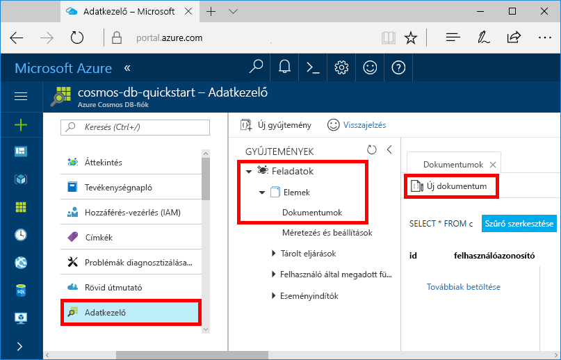

# <a name="quickstart-build-a-net-web-app-with-azure-cosmos-db-using-the-sql-api-and-the-azure-portal"></a>Rövid útmutató: .NET-webalkalmazás létrehozása Azure Cosmos DB-vel, az SQL API és az Azure Portal használatával

[!INCLUDE [cosmos-db-sql-api](../../includes/cosmos-db-sql-api.md)] 

Az Azure Cosmos DB a Microsoft globálisan elosztott, többmodelles adatbázis-szolgáltatása. Segítségével gyorsan létrehozhat és lekérdezhet dokumentum, kulcs/érték és gráf típusú adatbázisokat, amelyek mindegyike felhasználja az Azure Cosmos DB középpontjában álló globális elosztási és horizontális skálázhatósági képességeket. 

Ebből a rövid útmutatóból megtudhatja, hogyan hozhat létre az Azure Portal segítségével Azure Cosmos DB-fiókot, dokumentum-adatbázist és gyűjteményt. Ezután megtudhatja, hogyan hozhat létre és hogyan helyezhet üzembe egy, az [SQL .NET API](sql-api-sdk-dotnet.md)-n alapuló teendőlista-kezelő webalkalmazást. (Lásd az alábbi képernyőfelvételen.) 


## <a name="prerequisites"></a>Előfeltételek

Ha nincs telepítve a Visual Studio 2017, letöltheti és használhatja az **ingyenes** [Visual Studio 2017 Community Edition](https://www.visualstudio.com/downloads/)t. Ügyeljen arra, hogy engedélyezze az **Azure Development** használatát a Visual Studio telepítése során.

[!INCLUDE [quickstarts-free-trial-note](../../includes/quickstarts-free-trial-note.md)] 
[!INCLUDE [cosmos-db-emulator-docdb-api](../../includes/cosmos-db-emulator-docdb-api.md)]  

<a id="create-account"></a>
## <a name="create-a-database-account"></a>Adatbázisfiók létrehozása

[!INCLUDE [cosmos-db-create-dbaccount](../../includes/cosmos-db-create-dbaccount.md)]

<a id="create-collection"></a>
## <a name="add-a-collection"></a>Gyűjtemény hozzáadása

[!INCLUDE [cosmos-db-create-collection](../../includes/cosmos-db-create-collection.md)]

<a id="add-sample-data"></a>
## <a name="add-sample-data"></a>Mintaadatok hozzáadása

Az Adatkezelő segítségével adatokat adhat hozzá az új gyűjteményhez.

1. Az új adatbázis az Adatkezelőben a Gyűjtemények ablaktáblán jelenik meg. Bontsa ki a **Feladatok** adatbázist, majd az **Elemek** gyűjteményt, végül kattintson a **Dokumentumok**, majd pedig az **Új dokumentumok** lehetőségre. 

   
  
2. Adjon hozzá egy dokumentumot a gyűjteményhez az alábbi struktúrával.

     ```json
     {
         "id": "1",
         "category": "personal",
         "name": "groceries",
         "description": "Pick up apples and strawberries.",
         "isComplete": false
     }
     ```

3. A JSON hozzáadása után a **Dokumentumok** lapon kattintson a **Mentés** gombra.

    

4.  Hozzon létre és mentsen még egy dokumentumot, amelyben egyedi értéket szúr be az `id` tulajdonság számára, és tetszés szerint módosítja a többi tulajdonságot. Mivel az Azure Cosmos DB nem kötelezi egy adott adatséma használatára, új dokumentumaihoz bármilyen struktúrát választhat.

     Az Adatkezelővel így már lekérdezések használatával lekérheti adatait. Az Adatkezelő alapértelmezés szerint a `SELECT * FROM c` lekérdezést használja a gyűjteményben lévő összes dokumentum lekéréséhez, de ezt más [SQL-lekérdezésre](sql-api-sql-query.md) is módosíthatja, például a `SELECT * FROM c ORDER BY c._ts DESC` lekérdezésre, ha azt szeretné, hogy a rendszer a dokumentumokat időbélyegzőik szerint csökkenő sorrendben adja vissza.
 
     Az Adatkezelővel létrehozhat tárolt eljárásokat is, felhasználói függvényeket és a kiszolgálóoldali üzleti logikákat végrehajtó eseményindítókat, valamint szabályozhatja az átviteli sebességet. Az Adatkezelő hozzáférhetővé teszi az API-k összes beépített, programozható adatelérési funkcióját, és az Azure Portalon tárolt adataihoz is egyszerű hozzáférést biztosít.

## <a name="clone-the-sample-application"></a>A mintaalkalmazás klónozása

Most pedig váltsunk át kódok használatára. Klónozunk egy SQL API-alkalmazást a GitHubról, beállítjuk a kapcsolati karakterláncot, és futtatjuk az alkalmazást. Látni fogja, milyen egyszerű az adatokkal programozott módon dolgozni. 

1. Nyisson meg egy git terminálablakot, például a git bash eszközt, és a `CD` paranccsal lépjen egy munkakönyvtárba.  

2. Futtassa a következő parancsot a minta tárház klónozásához. 

    ```bash
    git clone https://github.com/Azure-Samples/documentdb-dotnet-todo-app.git
    ```

3. Ezután nyissa meg a teendő megoldásfájlját a Visual Studióban. 

## <a name="review-the-code"></a>A kód áttekintése

Tekintsük át, hogy mi történik az alkalmazásban. Nyissa meg a DocumentDBRepository.cs fájlt: az itt található kódsorok hozzák létre az Azure Cosmos DB-erőforrásokat. 

* A DocumentClient inicializálva van a 76. sorban.

    ```csharp
    client = new DocumentClient(new Uri(ConfigurationManager.AppSettings["endpoint"]), ConfigurationManager.AppSettings["authKey"]);
    ```

* A rendszer létrehozza az új adatbázist a 91. sorban.

    ```csharp
    await client.CreateDatabaseAsync(new Database { Id = DatabaseId });
    ```

* A rendszer létrehozza az új gyűjteményt a 110. sorban.

    ```csharp
    await client.CreateDocumentCollectionAsync(
        UriFactory.CreateDatabaseUri(DatabaseId),
        new DocumentCollection { Id = CollectionId },
        new DocumentCollection
            {
               Id = CollectionId
            },
        new RequestOptions { OfferThroughput = 400 });
    ```

## <a name="update-your-connection-string"></a>A kapcsolati karakterlánc frissítése

Lépjen vissza az Azure Portalra a kapcsolati karakterlánc adataiért, majd másolja be azokat az alkalmazásba.

1. Az [Azure Portalon](http://portal.azure.com/) az Azure Cosmos DB-fiókban a bal oldalsávon kattintson a **Kulcsok** elemre, majd kattintson az **Írási/olvasási kulcsok** lehetőségre. A következő lépésben a képernyő jobb oldalán lévő másolási gombokkal másolhatja az URI-t és az elsődleges kulcsot a web.config fájlba.

    

2. Nyissa meg a web.config fájlt a Visual Studio 2017 alkalmazásban. 

3. A másolási gomb használatával másolja ki az URI érteket a Portalról, és azt adja meg a végpont kulcs értékeként a web.config fájlban. 

    `<add key="endpoint" value="FILLME" />`

4. Ezután másolja ki az ELSŐDLEGES KULCS értékét a Portalról, és azt adja meg az authKey értékeként a web.config fájlban. Az alkalmazás frissítve lett minden olyan információval, amely az Azure Cosmos DB-vel való kommunikációhoz szükséges. 

    `<add key="authKey" value="FILLME" />`
    
## <a name="run-the-web-app"></a>A webalkalmazás futtatása
1. A Visual Studióban kattintson a jobb gombbal a projektre a **Megoldáskezelőben**, majd kattintson a **NuGet-csomagok kezelése** elemre. 

2. A NuGet **Tallózás** mezőjébe írja be a *DocumentDB* szöveget.

3. Az eredmények közül telepítse a **Microsoft.Azure.DocumentDB** kódtárat. Ez telepíti a Microsoft.Azure.DocumentDB csomagot, valamint annak összes függőségét.

4. Az alkalmazás futtatásához nyomja le a CTRL + F5 billentyűkombinációt. Az alkalmazás megjelenik a böngészőben. 

5. Kattintson a **Új létrehozása** lehetőségre a böngészőben, és hozzon létre néhány új feladatot a teendőkezelő alkalmazásban.

   

Lépjen vissza az Adatkezelőbe, ahol lekérdezheti és módosíthatja az új adatokat, valamint dolgozhat azokkal. 

## <a name="review-slas-in-the-azure-portal"></a>Az SLA-k áttekintése az Azure Portalon

[!INCLUDE [cosmosdb-tutorial-review-slas](../../includes/cosmos-db-tutorial-review-slas.md)]

## <a name="clean-up-resources"></a>Az erőforrások eltávolítása

Ha az alkalmazást már nem használja, akkor a következő lépésekkel a mintaalkalmazás által létrehozott összes erőforrást törölheti az Azure Portalon:

1. Az Azure Portal bal oldali menüjében kattintson az **Erőforráscsoportok** lehetőségre, majd kattintson a létrehozott erőforrás nevére. 
2. Az erőforráscsoport lapján kattintson a **Törlés** elemre, írja be a törölni kívánt erőforrás nevét a szövegmezőbe, majd kattintson a **Törlés** gombra.

## <a name="next-steps"></a>További lépések

Ebben a rövid útmutatóban megtudtuk, hogyan lehet Azure Cosmos DB-fiókot létrehozni, hogyan lehet az Adatkezelő segítségével gyűjteményt készíteni, és hogyan lehet futtatni a webalkalmazást. Így már további adatokat importálhat a Cosmos DB-fiókba. 

> [!div class="nextstepaction"]
> [Adatok importálása az Azure Cosmos DB-be](import-data.md)


