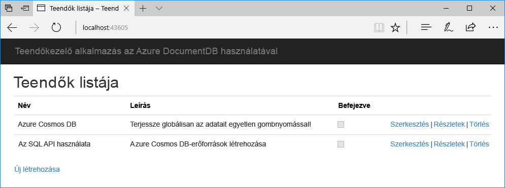
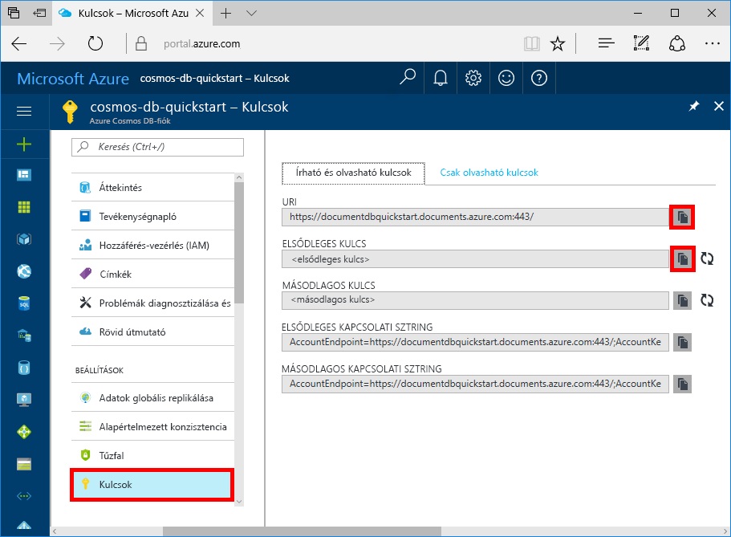

# <a name="quickstart-build-a-net-web-app-using-azure-cosmos-db-sql-api-account"></a>Gyors útmutató: Egy .NET-webalkalmazás létrehozása az Azure Cosmos DB SQL API-fiók használatával

> [!div class="op_single_selector"]
> * [.NET](create-sql-api-dotnet.md)
> * [.NET (előzetes verzió)](create-sql-api-dotnet-preview.md)
> * [Java](create-sql-api-java.md)
> * [Node.js](create-sql-api-nodejs.md)
> * [Python](create-sql-api-python.md)
> * [Xamarin](create-sql-api-xamarin-dotnet.md)
>  
> 

Az Azure Cosmos DB a Microsoft globálisan elosztott, többmodelles adatbázis-szolgáltatása. Segítségével gyorsan létrehozhat és lekérdezhet dokumentum, kulcs/érték és gráf típusú adatbázisokat, amelyek mindegyike felhasználja az Azure Cosmos DB középpontjában álló globális elosztási és horizontális skálázhatósági képességeket. 

Ebből a rövid útmutatóból megtudhatja, hogyan hozhat létre az Azure Portal segítségével Azure Cosmos DB [SQL API](sql-api-introduction.md)-fiókot, dokumentum-adatbázist és gyűjteményt. Ezután megtudhatja, hogyan hozhat létre és hogyan helyezhet üzembe egy, az [SQL .NET API](sql-api-sdk-dotnet.md)-n alapuló teendőlista-kezelő webalkalmazást. (Lásd az alábbi képernyőfelvételen.) 



## <a name="prerequisites"></a>Előfeltételek

Ha nincs telepítve a Visual Studio 2017, letöltheti és használhatja az **ingyenes** [Visual Studio 2017 Community Edition](https://www.visualstudio.com/downloads/)t. Ügyeljen arra, hogy engedélyezze az **Azure Development** használatát a Visual Studio telepítése során.

[!INCLUDE [quickstarts-free-trial-note](../../includes/quickstarts-free-trial-note.md)] 
[!INCLUDE [cosmos-db-emulator-docdb-api](../../includes/cosmos-db-emulator-docdb-api.md)]  

<a id="create-account"></a>
## <a name="create-a-database-account"></a>Adatbázisfiók létrehozása

[!INCLUDE [cosmos-db-create-dbaccount](../../includes/cosmos-db-create-dbaccount.md)]

<a id="create-collection"></a>
## <a name="add-a-collection"></a>Gyűjtemény hozzáadása

[!INCLUDE [cosmos-db-create-collection](../../includes/cosmos-db-create-collection.md)]

<a id="add-sample-data"></a>
## <a name="add-sample-data"></a>Mintaadatok hozzáadása

[!INCLUDE [cosmos-db-create-sql-api-add-sample-data](../../includes/cosmos-db-create-sql-api-add-sample-data.md)]

## <a name="query-your-data"></a>Adatok lekérdezése

[!INCLUDE [cosmos-db-create-sql-api-query-data](../../includes/cosmos-db-create-sql-api-query-data.md)]

## <a name="clone-the-sample-application"></a>A mintaalkalmazás klónozása

Most pedig váltsunk át kódok használatára. Klónozunk egy [SQL API-alkalmazást a GitHubról](https://github.com/Azure-Samples/documentdb-dotnet-todo-app), beállítjuk a kapcsolati karakterláncot, és futtatjuk az alkalmazást. Látni fogja, milyen egyszerű az adatokkal programozott módon dolgozni. 

1. Nyisson meg egy parancssort, hozzon létre egy git-samples nevű új mappát, majd zárja be a parancssort.

    ```bash
    md "C:\git-samples"
    ```

2. Nyisson meg egy git terminálablakot, például a git bash eszközt, és a `cd` parancs használatával váltson az új mappára, ahol telepíteni szeretné a mintaalkalmazást.

    ```bash
    cd "C:\git-samples"
    ```

3. Futtassa a következő parancsot a minta tárház klónozásához. Ez a parancs másolatot hoz létre a mintaalkalmazásról az Ön számítógépén.

    ```bash
    git clone https://github.com/Azure-Samples/documentdb-dotnet-todo-app.git
    ```

4. Ezután nyissa meg a teendő megoldásfájlját a Visual Studióban. 

## <a name="review-the-code"></a>A kód áttekintése

Ez a lépés nem kötelező. Ha meg szeretné ismerni, hogyan jönnek létre az adatbázis erőforrásai a kódban, tekintse át a következő kódrészleteket. Egyéb esetben ugorhat [A kapcsolati sztring frissítése](#update-your-connection-string) szakaszra. 

Az alábbi kódrészletek mind a DocumentDBRepository.cs fájlból származnak.

* A DocumentClient inicializálva van a 76. sorban.

    ```csharp
    client = new DocumentClient(new Uri(ConfigurationManager.AppSettings["endpoint"]), ConfigurationManager.AppSettings["authKey"]);
    ```

* A rendszer létrehozza az új adatbázist a 91. sorban.

    ```csharp
    await client.CreateDatabaseAsync(new Database { Id = DatabaseId });
    ```

* A rendszer létrehozza az új gyűjteményt a 110. sorban.

    ```csharp
    await client.CreateDocumentCollectionAsync(
        UriFactory.CreateDatabaseUri(DatabaseId),
        new DocumentCollection
            {
               Id = CollectionId
            },
        new RequestOptions { OfferThroughput = 400 });
    ```

## <a name="update-your-connection-string"></a>A kapcsolati sztring frissítése

Lépjen vissza az Azure Portalra a kapcsolati sztring adataiért, majd másolja be azokat az alkalmazásba.

1. Az [Azure Portalon](https://portal.azure.com/) az Azure Cosmos DB-fiókban a bal oldalsávon válassza a **Kulcsok** elemet, majd válassza az **Írási/olvasási kulcsok** lehetőséget. A következő lépésben a képernyő jobb oldalán lévő másolási gombokkal másolhatja az URI-t és az elsődleges kulcsot a web.config fájlba.

    

2. Nyissa meg a web.config fájlt a Visual Studio 2017 alkalmazásban. 

3. A másolási gomb használatával másolja ki az URI érteket a Portalról, és azt adja meg a végpont kulcs értékeként a web.config fájlban. 

    `<add key="endpoint" value="FILLME" />`

4. Ezután másolja ki az ELSŐDLEGES KULCS értékét a Portalról, és azt adja meg az authKey értékeként a web.config fájlban. 

    `<add key="authKey" value="FILLME" />`
    
5. Ezután frissítse az adatbázis értékét, hogy megegyezzen a korábban létrehozott adatbázis nevével. Az alkalmazás frissítve lett minden olyan információval, amely az Azure Cosmos DB-vel való kommunikációhoz szükséges. 

    `<add key="database" value="Tasks" />`    
    
## <a name="run-the-web-app"></a>A webalkalmazás futtatása
1. A Visual Studióban kattintson a jobb gombbal a projektre a **Megoldáskezelőben**, majd válassza a **NuGet-csomagok kezelése** elemet. 

2. A NuGet **Tallózás** mezőjébe írja be a *DocumentDB* szöveget.

3. Az eredmények közül telepítse a **Microsoft.Azure.DocumentDB** kódtárat. Ez telepíti a Microsoft.Azure.DocumentDB csomagot, valamint annak összes függőségét.

4. Az alkalmazás futtatásához nyomja le a CTRL + F5 billentyűkombinációt. Az alkalmazás megjelenik a böngészőben. 

5. Válassza az **Új létrehozása** lehetőséget a böngészőben, és hozzon létre néhány új feladatot a teendőkezelő alkalmazásban.

   

Lépjen vissza az Adatkezelőbe, ahol lekérdezheti és módosíthatja az új adatokat, valamint dolgozhat azokkal. 

## <a name="review-slas-in-the-azure-portal"></a>Az SLA-k áttekintése az Azure Portalon

[!INCLUDE [cosmosdb-tutorial-review-slas](../../includes/cosmos-db-tutorial-review-slas.md)]

## <a name="clean-up-resources"></a>Az erőforrások eltávolítása

[!INCLUDE [cosmosdb-delete-resource-group](../../includes/cosmos-db-delete-resource-group.md)]

## <a name="next-steps"></a>További lépések

Ebben a rövid útmutatóban megtudtuk, hogyan lehet Azure Cosmos DB-fiókot létrehozni, hogyan lehet az Adatkezelő segítségével gyűjteményt készíteni, és hogyan lehet futtatni a webalkalmazást. Így már további adatokat importálhat a Cosmos DB-fiókba. 

> [!div class="nextstepaction"]
> [Adatok importálása az Azure Cosmos DB-be](import-data.md)


