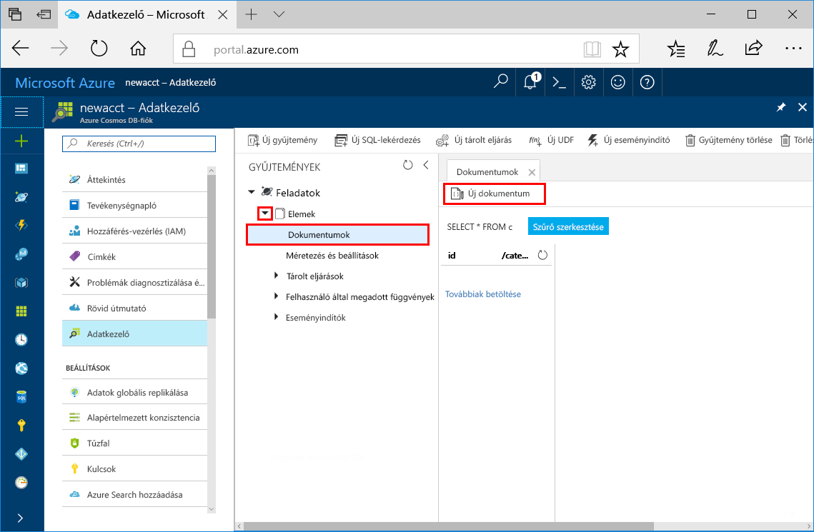
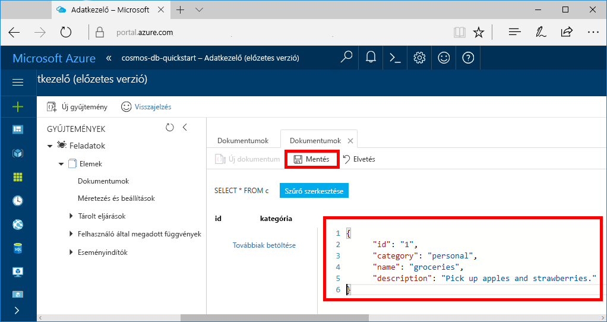
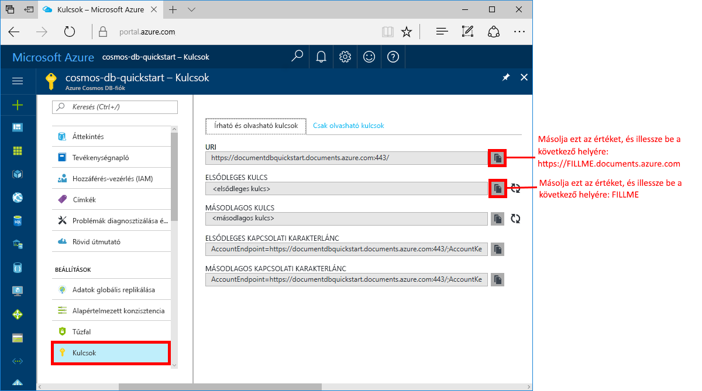

# <a name="azure-cosmos-db-create-a-document-database-using-java-and-the-azure-portal"></a>Azure Cosmos DB: Dokumentum-adatbázis létrehozása a Java és az Azure Portal használatával

Az Azure Cosmos DB a Microsoft globálisan elosztott, többmodelles adatbázis-szolgáltatása. Az Azure Cosmos DB segítségével gyorsan létrehozhat és lekérdezhet felügyelt dokumentum, tábla, kulcs-érték és gráf típusú adatbázisokat.

Ez a rövid útmutató létrehoz egy dokumentum-adatbázist az Azure Cosmos DB [SQL API](sql-api-introduction.md)-hoz készült Azure Portal-eszközök használatával. A rövid útmutató emellett bemutatja, hogyan hozhat létre gyorsan egy Java-konzolalkalmazást az [SQL Java API](sql-api-sdk-java.md) használatával. A rövid útmutatóban lévő utasítások bármilyen, Java-programok futtatására alkalmas operációs rendszeren végrehajthatók. A rövid útmutató követésével megismerheti a dokumentumadatbázis-erőforrások létrehozását és módosítását a felhasználói felületen vagy programozás útján.

## <a name="prerequisites"></a>Előfeltételek

[!INCLUDE [quickstarts-free-trial-note](../../includes/quickstarts-free-trial-note.md)] 
[!INCLUDE [cosmos-db-emulator-docdb-api](../../includes/cosmos-db-emulator-docdb-api.md)]

Továbbá: 

* [Java fejlesztői készlet (JDK) 1.7+](http://www.oracle.com/technetwork/java/javase/downloads/jdk8-downloads-2133151.html)
    * Ubuntu rendszeren futtassa az `apt-get install default-jdk` parancsot a JDK telepítéséhez.
    * Ügyeljen arra, hogy a JAVA_HOME környezeti változó arra a mappára mutasson, ahová a JDK telepítve lett.
* [Maven](http://maven.apache.org/download.cgi) bináris archívum [letöltése](http://maven.apache.org/install.html) és [telepítése](http://maven.apache.org/)
    * Ubuntu rendszeren futtathatja az `apt-get install maven` parancsot a Maven telepítéséhez.
* [Git](https://www.git-scm.com/)
    * Ubuntu rendszeren futtathatja a `sudo apt-get install git` parancsot a Git telepítéséhez.

## <a name="create-a-database-account"></a>Adatbázisfiók létrehozása

A dokumentum-adatbázis létrehozásához először létre kell hoznia egy SQL API-fiókot az Azure Cosmos DB segítségével.

[!INCLUDE [cosmos-db-create-dbaccount](../../includes/cosmos-db-create-dbaccount.md)]

## <a name="add-a-collection"></a>Gyűjtemény hozzáadása

[!INCLUDE [cosmos-db-create-collection](../../includes/cosmos-db-create-collection.md)]

<a id="add-sample-data"></a>
## <a name="add-sample-data"></a>Mintaadatok hozzáadása

Az Adatkezelő segítségével adatokat adhat hozzá az új gyűjteményhez.

1. Bontsa ki az **Elemek** gyűjteményt, majd kattintson a **Dokumentumok** > **Új dokumentumok** lehetőségre.

   
  
2. Adjon hozzá egy dokumentumot a gyűjteményhez az alábbi struktúrával, majd kattintson a **Mentés**lehetőségre. A json másolásához használja a kódmezőben lévő **Másolás** gombot.

     ```json
     {
         "id": "1",
         "category": "personal",
         "name": "groceries",
         "description": "Pick up apples and strawberries.",
         "isComplete": false
     }
     ```

    

3.  Hozzon létre és mentsen még egy dokumentumot, amelyben az `id` tulajdonság értékét 2-re állítja át, a többi tulajdonságot pedig tetszés szerint módosítja. Mivel az Azure Cosmos DB nem kötelezi egy adott adatséma használatára, új dokumentumaihoz bármilyen struktúrát választhat.

## <a name="query-your-data"></a>Adatok lekérdezése

Az Adatkezelővel így már lekérdezések használatával lekérheti és szűrheti adatait.

1. Alapértelmezés szerint a lekérdezés `SELECT * FROM c` értékre van állítva. Ez az alapértelmezett lekérdezés lekéri és megjeleníti a gyűjteményben szereplő összes dokumentumot. 

    

2. Maradjon a **Dokumentumok** lapon és módosítsa a lekérdezést a **Szűrő szerkesztése** gombra kattintva, a lekérdezési predikátumhoz adja hozzá az `ORDER BY c._ts DESC` elemet, végül pedig kattintson a **Szűrő alkalmazása** elemre.

    

A módosított lekérdezés az időbélyegük alapján csökkenő sorrendben listázza a dokumentumokat, így most már a második dokumentum van a lista elején. Ha ismeri az SQL szintaxisát, bármelyik támogatott [SQL-lekérdezést](sql-api-sql-query.md) megadhatja ebben a mezőben. 

Ezzel befejeződött az Adatkezelőben végzett munkánk. Mielőtt áttérünk a kódokra, ne felejtse el, hogy az Adatkezelővel létrehozhat tárolt eljárásokat, felhasználói függvényeket és a kiszolgálóoldali üzleti logikákat végrehajtó eseményindítókat is, valamint szabályozhatja az átviteli sebességet is. Az Adatkezelő hozzáférhetővé teszi az API-k összes beépített, programozható adatelérési funkcióját, és az Azure Portalon tárolt adataihoz is egyszerű hozzáférést biztosít.

## <a name="clone-the-sample-application"></a>A mintaalkalmazás klónozása

Most pedig váltsunk át kódok használatára. Klónozunk egy SQL API-alkalmazást a GitHubról, beállítjuk a kapcsolati karakterláncot, és futtatjuk az alkalmazást. Látni fogja, milyen egyszerű az adatokkal programozott módon dolgozni. 

1. Nyisson meg egy parancssort, hozzon létre egy git-samples nevű új mappát, majd zárja be a parancssort.

    ```bash
    md "C:\git-samples"
    ```

2. Nyisson meg egy git terminálablakot, például a git bash eszközt, és a `cd` parancs használatával váltson az új mappára, ahol telepíteni szeretné a mintaalkalmazást. 

    ```bash
    cd "C:\git-samples"
    ```

3. Futtassa a következő parancsot a minta tárház klónozásához. Ez a parancs másolatot hoz létre a mintaalkalmazásról az Ön számítógépén.

    ```bash
    git clone https://github.com/Azure-Samples/azure-cosmos-db-documentdb-java-getting-started.git
    ```

## <a name="review-the-code"></a>A kód áttekintése

Ez a lépés nem kötelező. Ha meg szeretné ismerni, hogyan jönnek létre az adatbázis erőforrásai a kódban, tekintse át a következő kódrészleteket. Egyéb esetben áttérhet [A kapcsolati karakterlánc frissítése](#update-your-connection-string) szakaszra. 

A következő kódrészletek mind a C:\git-samples\azure-cosmos-db-documentdb-java-getting-started\src\GetStarted\Program.java fájlból származnak.

* `DocumentClient` inicializálás. A [DocumentClient](https://docs.microsoft.com/java/api/com.microsoft.azure.documentdb._document_client) ügyféloldali logikai leképezést biztosít az Azure Cosmos DB adatbázis-szolgáltatáshoz. Ezzel az ügyféllel a szolgáltatásra irányuló kérések konfigurálhatók és hajthatók végre. A kód `FILLME` részletei később, a rövid útmutatóban lesznek frissítve.

    ```java
    this.client = new DocumentClient("https://FILLME.documents.azure.com",
            "FILLME", 
            new ConnectionPolicy(),
            ConsistencyLevel.Session);
    ```

* [Adatbázis](https://docs.microsoft.com/java/api/com.microsoft.azure.documentdb._database) létrehozása.

    ```java
    Database database = new Database();
    database.setId(databaseName);
    
    this.client.createDatabase(database, null);
    ```

* [DocumentCollection](https://docs.microsoft.com/java/api/com.microsoft.azure.documentdb._document_collection) létrehozása.

    ```java
    DocumentCollection collectionInfo = new DocumentCollection();
    collectionInfo.setId(collectionName);

    ...

    this.client.createCollection(databaseLink, collectionInfo, requestOptions);
    ```

* Dokumentum létrehozása a [createDocument](https://docs.microsoft.com/java/api/com.microsoft.azure.documentdb._document_client.createdocument) metódus használatával.

    ```java
    // Any Java object within your code can be serialized into JSON and written to Azure Cosmos DB
    Family andersenFamily = new Family();
    andersenFamily.setId("Andersen.1");
    andersenFamily.setLastName("Andersen");
    // More properties

    String collectionLink = String.format("/dbs/%s/colls/%s", databaseName, collectionName);
    this.client.createDocument(collectionLink, family, new RequestOptions(), true);
    ```

* A JSON-on végrehajtott SQL-lekérdezéseket a rendszer a [queryDocuments](https://docs.microsoft.com/java/api/com.microsoft.azure.documentdb._document_client.querydocuments) metódus használatával hajtja végre.

    ```java
    FeedOptions queryOptions = new FeedOptions();
    queryOptions.setPageSize(-1);
    queryOptions.setEnableCrossPartitionQuery(true);

    String collectionLink = String.format("/dbs/%s/colls/%s", databaseName, collectionName);
    FeedResponse<Document> queryResults = this.client.queryDocuments(
        collectionLink,
        "SELECT * FROM Family WHERE Family.lastName = 'Andersen'", queryOptions);

    System.out.println("Running SQL query...");
    for (Document family : queryResults.getQueryIterable()) {
        System.out.println(String.format("\tRead %s", family));
    }
    ```    

## <a name="update-your-connection-string"></a>A kapcsolati karakterlánc frissítése

Lépjen vissza az Azure Portalra a kapcsolati karakterlánc adataiért, majd másolja be azokat az alkalmazásba. Ez lehetővé teszi az alkalmazás számára, hogy kommunikáljon az üzemeltetett adatbázissal.

1. Az [Azure Portalon](http://portal.azure.com/) kattintson a **Kulcsok** lehetőségre. 

    A képernyő jobb oldalán található másolási gombok használatával másolja a vágólapra a felső értéket, az URI-t.

    

2. Nyissa meg a C:\git-samples\azure-cosmos-db-documentdb-java-getting-started\src\GetStarted mappában található `Program.java` fájlt. 

3. Illessze be a URI értéket a portálról a `https://FILLME.documents.azure.com` helyére a 45. sorban.

4. Lépjen vissza a portálra, és másolja a vágólapra a PRIMARY KEY (Elsődleges kulcs) értékét a képernyőképen látható módon. Illessze be a PRIMARY KEY értéket a portálról a `FILLME` helyére a 46. sorban.

    A getStartedDemo metódusnak ekkor a következőképp kell kinéznie: 
    
    ```java
    private void getStartedDemo() throws DocumentClientException, IOException {
        this.client = new DocumentClient("https://youraccountname.documents.azure.com:443/",
                "your-primary-key...RJhQrqQ5QQ==", 
                new ConnectionPolicy(),
                ConsistencyLevel.Session);
    ```

5. Mentse a Program.java fájlt.

## <a name="run-the-app"></a>Az alkalmazás futtatása

1. A git terminálablakában a `cd` paranccsal lépjen az azure-cosmos-db-documentdb-java-getting-started mappába.

    ```git
    cd "C:\git-samples\azure-cosmos-db-documentdb-java-getting-started"
    ```

2. A git terminálablakában futtassa a következő parancsot a szükséges Java-csomagok telepítéséhez.

    ```
    mvn package
    ```

3. A git terminálablakában futtassa a következő parancsot a Java-alkalmazás elindításához.

    ```
    mvn exec:java -D exec.mainClass=GetStarted.Program
    ```

    A terminálablakban értesítést kap a FamilyDB adatbázis létrejöttéről. 
    
4. Nyomjon le egy billentyűt az adatbázis létrehozásához, majd nyomjon le egy másikat a gyűjtemény létrehozásához. 

    A program futását követően minden erőforrás törlődni fog, ezért váltson át az Adatkezelőre, ahol láthatja, hogy az már tartalmazza a FamilyDB adatbázist és a FamilyCollection gyűjteményt.

5. Váltson a konzolablakra, és nyomjon le egy billentyűt az első dokumentum létrehozásához, majd egy másikat a második dokumentum létrehozásához. Ezután váltson vissza az Adatkezelőre, hogy megtekintse őket. 

6. Nyomjon le egy billentyűt a lekérdezés indításához. A kimenetet a konzolablakban láthatja. 

7. A következő billentyű lenyomása törli az erőforrásokat. Ha meg szeretné tartani az erőforrásokat, nyomja le a CTRL+C billentyűkombinációt a konzolablakban a program leállításához. Ellenkező esetben nyomja le bármelyik billentyűt az erőforrások a fiókjából való törléséhez a költségek elkerülése érdekében. 

    


## <a name="review-slas-in-the-azure-portal"></a>Az SLA-k áttekintése az Azure Portalon

[!INCLUDE [cosmosdb-tutorial-review-slas](../../includes/cosmos-db-tutorial-review-slas.md)]

## <a name="clean-up-resources"></a>Az erőforrások eltávolítása

[!INCLUDE [cosmosdb-delete-resource-group](../../includes/cosmos-db-delete-resource-group.md)]

## <a name="next-steps"></a>További lépések

Ebben a rövid útmutatóban bemutattuk, hogyan hozhat létre Azure Cosmos DB-fiókot, dokumentum-adatbázist és gyűjteményt az Adatkezelő segítségével, valamint hogyan futtathat egy alkalmazást, amely programozottan hajtja végre ugyanezt. Most már további adatokat importálhat az Azure Cosmos DB-gyűjteménybe. 

> [!div class="nextstepaction"]
> [Adatok importálása az Azure Cosmos DB-be](import-data.md)


