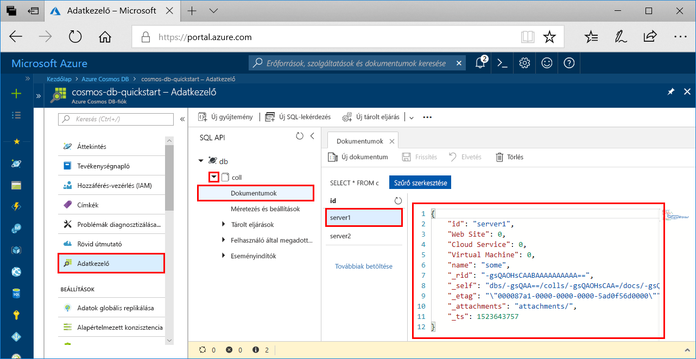

# <a name="azure-cosmos-db-build-a-sql-api-app-with-python-and-the-azure-portal"></a>Azure Cosmos DB: SQL API-alkalmazás létrehozása a Python és az Azure Portal használatával

> [!div class="op_single_selector"]
> * [.NET](create-sql-api-dotnet.md)
> * [Java](create-sql-api-java.md)
> * [Node.js](create-sql-api-nodejs.md)
> * [Python](create-sql-api-python.md)
> * [Xamarin](create-sql-api-xamarin-dotnet.md)
>  

Az Azure Cosmos DB a Microsoft globálisan elosztott, többmodelles adatbázis-szolgáltatása. Segítségével gyorsan létrehozhat és lekérdezhet dokumentum, kulcs/érték és gráf típusú adatbázisokat, amelyek mindegyike felhasználja az Azure Cosmos DB középpontjában álló globális elosztási és horizontális skálázhatósági képességeket. 

Ebből a rövid útmutatóból megtudhatja, hogyan hozhat létre az Azure Portal segítségével Azure Cosmos DB [SQL API](sql-api-introduction.md)-fiókot, dokumentum-adatbázist és gyűjteményt. Ezután megtudhatja, hogyan hozhat létre és futtathat egy, az [SQL Python API](sql-api-sdk-python.md)-val létrehozott konzolalkalmazást.

[!INCLUDE [quickstarts-free-trial-note](../../includes/quickstarts-free-trial-note.md)] [!INCLUDE [cosmos-db-emulator-docdb-api](../../includes/cosmos-db-emulator-docdb-api.md)]

## <a name="prerequisites"></a>Előfeltételek

* [Python 3.6](https://www.python.org/downloads/), a PATH környezeti változóhoz hozzáadott \<telepítési hely\>\Python36 és \<telepítési hely>\Python36\Scripts útvonallal. 
* [Visual Studio Code](https://code.visualstudio.com/)
* [Python-bővítmény a Visual Studio Code-hoz](https://marketplace.visualstudio.com/items?itemName=ms-python.python#overview)

## <a name="create-a-database-account"></a>Adatbázisfiók létrehozása

[!INCLUDE [cosmos-db-create-dbaccount](../../includes/cosmos-db-create-dbaccount.md)]

## <a name="add-a-collection"></a>Gyűjtemény hozzáadása

[!INCLUDE [cosmos-db-create-collection](../../includes/cosmos-db-create-collection.md)]

## <a name="add-sample-data"></a>Mintaadatok hozzáadása

[!INCLUDE [cosmos-db-create-sql-api-add-sample-data](../../includes/cosmos-db-create-sql-api-add-sample-data.md)]

## <a name="query-your-data"></a>Adatok lekérdezése

[!INCLUDE [cosmos-db-create-sql-api-query-data](../../includes/cosmos-db-create-sql-api-query-data.md)]

## <a name="clone-the-sample-application"></a>A mintaalkalmazás klónozása

Most pedig klónozunk egy SQL API-alkalmazást a GitHubról, beállítjuk a kapcsolati sztringet, és futtatjuk az alkalmazást. Ilyen egyszerű az adatokkal programozott módon dolgozni. 

1. Nyisson meg egy parancssort, hozzon létre egy git-samples nevű új mappát, majd zárja be a parancssort.

    ```bash
    md "C:\git-samples"
    ```

2. Nyisson meg egy git terminálablakot, például a git bash eszközt, és a `cd` parancs használatával váltson az új mappára, ahol telepíteni szeretné a mintaalkalmazást.

    ```bash
    cd "C:\git-samples"
    ```

3. Futtassa a következő parancsot a minta tárház klónozásához. Ez a parancs másolatot hoz létre a mintaalkalmazásról az Ön számítógépén. 

    ```bash
    git clone https://github.com/Azure-Samples/azure-cosmos-db-documentdb-python-getting-started.git
    ```  
    
## <a name="review-the-code"></a>A kód áttekintése

Ez a lépés nem kötelező. Ha meg szeretné ismerni, hogyan jönnek létre az adatbázis erőforrásai a kódban, tekintse át a következő kódrészleteket. Egyéb esetben ugorhat [A kapcsolati sztring frissítése](#update-your-connection-string) szakaszra. 

Az alábbi kódrészletek mind a DocumentDBGetStarted.py fájlból származnak.

* A DocumentClient inicializálva van.

    ```python
    # Initialize the Python client
    client = document_client.DocumentClient(config['ENDPOINT'], {'masterKey': config['MASTERKEY']})
    ```

* A rendszer létrehozza az új adatbázist.

    ```python
    # Create a database
    db = client.CreateDatabase({ 'id': config['SQL_DATABASE'] })
    ```

* A rendszer létrehozza az új gyűjteményt.

    ```python
    # Create collection options
    options = {
        'offerEnableRUPerMinuteThroughput': True,
        'offerVersion': "V2",
        'offerThroughput': 400
    }

    # Create a collection
    collection = client.CreateCollection(db['_self'], { 'id': config['SQL_COLLECTION'] }, options)
    ```

* A rendszer létrehoz néhány dokumentumot.

    ```python
    # Create some documents
    document1 = client.CreateDocument(collection['_self'],
        { 
            'id': 'server1',
            'Web Site': 0,
            'Cloud Service': 0,
            'Virtual Machine': 0,
            'name': 'some' 
        })
    ```

* A rendszer végrehajt egy lekérdezést az SQL használatával

    ```python
    # Query them in SQL
    query = { 'query': 'SELECT * FROM server s' }    
            
    options = {} 
    options['enableCrossPartitionQuery'] = True
    options['maxItemCount'] = 2

    result_iterable = client.QueryDocuments(collection['_self'], query, options)
    results = list(result_iterable);

    print(results)
    ```

## <a name="update-your-connection-string"></a>A kapcsolati sztring frissítése

Lépjen vissza az Azure Portalra a kapcsolati sztring adataiért, majd másolja be azokat az alkalmazásba.

1. Az [Azure Portalon](http://portal.azure.com/), az Azure Cosmos DB-fiók bal oldali navigációs sávján kattintson a **Kulcsok** elemre. A következő lépésben a képernyő jobb oldalán lévő másolási gombokkal másolhatja az **URI**-t és az **Elsődleges kulcsot** a DocumentDBGetStarted.py fájlba.

    

2. Nyissa meg a C:\git-samples\azure-cosmos-db-documentdb-python-getting-startedDocumentDBGetStarted.py fájlt a Visual Studio Code-ban. 

3. A másolási gomb használatával másolja a portálról az **URI** érteket a vágólapra, és adja azt meg az **endpoint** kulcs értékeként a DocumentDBGetStarted.py fájlban. 

    `'ENDPOINT': 'https://FILLME.documents.azure.com',`

4. Ezután másolja a portálról az **ELSŐDLEGES KULCS** értékét a vágólapra, és adja azt meg a **config.MASTERKEY** kulcs értékeként a DocumentDBGetStarted.py fájlban. Az alkalmazás frissítve lett minden olyan információval, amely az Azure Cosmos DB-vel való kommunikációhoz szükséges. 

    `'MASTERKEY': 'FILLME',`

5. Mentse a DocumentDBGetStarted.py fájlt.
    
## <a name="run-the-app"></a>Az alkalmazás futtatása

1. Válassza a Visual Studio Code-ban a **Nézet**>**Parancskatalógus** lehetőséget. 

2. A megjelenő panelen írja be a **Python: Select Interpreter** szöveget, majd válassza ki a használandó Python-verziót.

    A választott értelmező ekkor megjelenik a Visual Studio Code ablakának állapotsorában. 

3. Válassza a **Nézet** > **Beépített terminál** parancsot a Visual Studio Code beépített termináljának megnyitásához.

4. A beépített terminál ablakában győződjön meg róla, hogy az „azure-cosmos-db-documentdb-python-getting-started” mappában van. Ha más mappában van, akkor váltson erre a mintamappára az alábbi parancs futtatásával. 

    ```
    cd "C:\git-samples\azure-cosmos-db-documentdb-python-getting-started"`
    ```

5. Futtassa az alábbi parancsot a pydocumentdb csomag telepítéséhez. 

    ```
    pip3 install pydocumentdb
    ```

    Ha a pydocumentdb csomag telepítésekor „hozzáférés megtagadva” hibaüzenetet kap, akkor [rendszergazdaként kell futtatnia a VS Code alkalmazást](https://stackoverflow.com/questions/37700536/visual-studio-code-terminal-how-to-run-a-command-with-administrator-rights).

6. Hajtsa végre az alábbi parancsot az Azure Cosmos dB-ben az új dokumentumokat létrehozó és mentő mintakód futtatásához.

    ```
    python DocumentDBGetStarted.py
    ```

7. Az új dokumentumok létrehozásának és mentésének megerősítéséhez az Azure Portalon válassza az **Adatkezelő** lehetőséget, bontsa ki a **coll** elemet, bontsa ki a **Documents** elemet, és válassza a **server1** dokumentumot. A server1 dokumentum tartalmának meg kell egyeznie a beépített terminál ablakában visszaadott tartalommal. 

    

## <a name="review-slas-in-the-azure-portal"></a>Az SLA-k áttekintése az Azure Portalon

[!INCLUDE [cosmosdb-tutorial-review-slas](../../includes/cosmos-db-tutorial-review-slas.md)]

## <a name="clean-up-resources"></a>Az erőforrások eltávolítása

[!INCLUDE [cosmosdb-delete-resource-group](../../includes/cosmos-db-delete-resource-group.md)]

## <a name="next-steps"></a>További lépések

Ebben a rövid útmutatóban bemutattuk, hogyan lehet Azure Cosmos DB-fiókot létrehozni, hogyan lehet az Adatkezelő segítségével gyűjteményt készíteni, és hogyan lehet futtatni az alkalmazást. Így már további adatokat importálhat a Cosmos DB-fiókba. 

> [!div class="nextstepaction"]
> [Adatok importálása az Azure Cosmos DB-be az SQL API-hoz](import-data.md)


