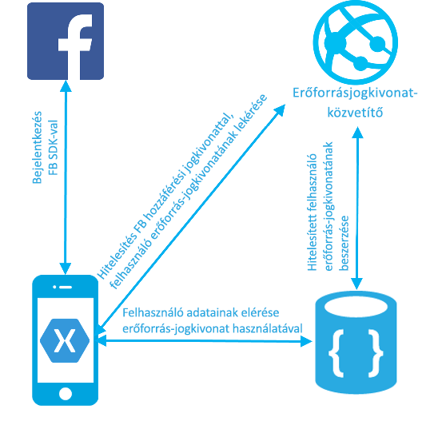
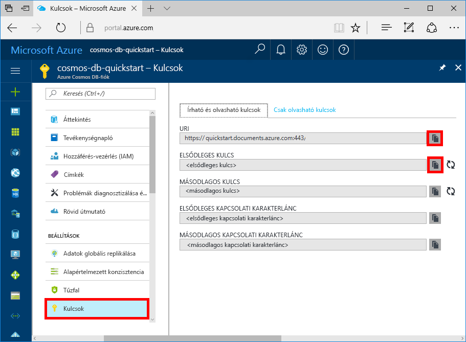

# <a name="azure-cosmos-db-build-a-web-app-with-net-xamarin-and-facebook-authentication"></a>Azure Cosmos DB: webalkalmazás fejlesztése .NET, Xamarin és Facebook-hitelesítés használatával

[!INCLUDE [cosmos-db-sql-api](../../includes/cosmos-db-sql-api.md)]

Az Azure Cosmos DB a Microsoft globálisan elosztott, többmodelles adatbázis-szolgáltatása. Segítségével gyorsan létrehozhat és lekérdezhet dokumentum, kulcs/érték és gráf típusú adatbázisokat, amelyek mindegyike felhasználja az Azure Cosmos DB középpontjában álló globális elosztási és horizontális skálázhatósági képességeket.

> [!NOTE]
> A GitHubon [itt](https://github.com/xamarinhq/app-geocontacts) megtalálható egy teljes Canonical Xamarin-mintaalkalmazás mintakódja, amely több Azure-ajánlatot is bemutat (például a CosmosDB-t). Ez az alkalmazás földrajzilag elosztott kapcsolattartók megtekintését mutatja be, és lehetővé teszi e kapcsolattartók számára, hogy frissítsék a tartózkodási helyüket.

Ebből a rövid útmutatóból megtudhatja, hogyan hozhat létre az Azure Portal segítségével Azure Cosmos DB-fiókot, dokumentum-adatbázist és gyűjteményt. Ezután megtudhatja, hogyan hozhat létre és hogyan helyezhet üzembe egy, az [SQL .NET API](sql-api-sdk-dotnet.md)-n, a [Xamarinon](https://www.xamarin.com/) és az Azure Cosmos DB engedélyezési motorján alapuló teendőlista-kezelő webalkalmazást. A teendőlista-kezelő webalkalmazás olyan felhasználónkénti adatmintát használ, amellyel a felhasználók a Facebook hitelesítési szolgáltatásán keresztül jelentkezhetnek be és kezelhetik saját teendőiket.

## <a name="prerequisites"></a>Előfeltételek

Ha nincs telepítve a Visual Studio 2017, letöltheti és használhatja az **ingyenes** [Visual Studio 2017 Community Edition](https://www.visualstudio.com/downloads/)t. Ügyeljen arra, hogy engedélyezze az **Azure Development** használatát a Visual Studio telepítése során.

[!INCLUDE [quickstarts-free-trial-note](../../includes/quickstarts-free-trial-note.md)]
[!INCLUDE [cosmos-db-emulator-docdb-api](../../includes/cosmos-db-emulator-docdb-api.md)]

## <a name="create-a-database-account"></a>Adatbázisfiók létrehozása

[!INCLUDE [cosmos-db-create-dbaccount](../../includes/cosmos-db-create-dbaccount.md)]

## <a name="add-a-collection"></a>Gyűjtemény hozzáadása

[!INCLUDE [cosmos-db-create-collection](../../includes/cosmos-db-create-collection.md)]

## <a name="clone-the-sample-application"></a>A mintaalkalmazás klónozása

Most pedig klónozunk egy SQL API-alkalmazást a GitHubról, beállítjuk a kapcsolati karakterláncot, és futtatjuk az alkalmazást. Látni fogja, milyen egyszerű az adatokkal programozott módon dolgozni. 

1. Nyisson meg egy git terminálablakot, például a git bash eszközt, és a `cd` paranccsal lépjen egy munkakönyvtárba.

2. Az alábbi parancs futtatásával klónozhatja a mintatárházat. 

    ```bash
    git clone https://github.com/Azure/azure-documentdb-dotnet.git
    ```

3. Ezután nyissa meg a DocumentDBTodo.sln fájlt a Visual Studio samples/xamarin/UserItems/xamarin.forms nevű mappájában.

## <a name="review-the-code"></a>A kód áttekintése

A Xamarin nevű mappában található kód az alábbiakat tartalmazza:

* Xamarin-alkalmazás. Az alkalmazás a felhasználók teendőit egy UserItems nevű particionált gyűjteményben tárolja.
* Az erőforrás-jogkivonat közvetítőjének API-ja. Egy egyszerű ASP.NET típusú webes API, amellyel Azure Cosmos DB-beli erőforrás-jogkivonatokat lehet közvetíteni az alkalmazás bejelentkezett felhasználóinak. Az erőforrás-jogkivonatok olyan rövid élettartamú hozzáférési jogkivonatok, amelyek biztosítják az alkalmazásnak a bejelentkezett felhasználók adataihoz való hozzáférést.

A hitelesítés és az adatfolyam az alábbi ábrán látható.

* A rendszer létrehozza az UserItems nevű gyűjteményt az /userid partíciós kulccsal. A gyűjtemény partíciós kulcsának megadásával az Azure Cosmos DB-t végtelenül lehet skálázni a felhasználók és az elemek számának növekedésével párhuzamosan.
* A Xamarin-alkalmazás lehetővé teszi a felhasználóknak a facebookos hitelesítő adatokkal való bejelentkezést.
* A Xamarin-alkalmazás a Facebook hozzáférési jogkivonatával hitelesíti a ResourceTokenBroker API-t
* Az erőforrás-jogkivonat közvetítői API-ja az App Service hitelesítési funkciójával hitelesíti a kérést, majd olyan Azure Cosmos DB-beli erőforrás-jogkivonatra nyújt be kérést, amely olvasási/írási hozzáféréssel rendelkezik a hitelesített felhasználó partíciós kulcsát megosztó összes dokumentumhoz.
* Az erőforrás-jogkivonat közvetítője az erőforrás-jogkivonatot az ügyfélalkalmazásnak adja vissza.
* Az alkalmazás a felhasználó teendőit az erőforrás-jogkivonat használatával éri el.



## <a name="update-your-connection-string"></a>A kapcsolati karakterlánc frissítése

Lépjen vissza az Azure Portalra a kapcsolati karakterlánc adataiért, majd másolja be azokat az alkalmazásba.

1. Az [Azure Portalon](http://portal.azure.com/) az Azure Cosmos DB-fiók bal oldali oldalsávjában kattintson a **Kulcsok** elemre, majd kattintson az **Írási/olvasási kulcsok** lehetőségre. A következő lépésben használja a képernyő jobb oldalán lévő másolási gombokat az URI és az elsődleges kulcs web.config fájlba való másolásához.

    

2. A Visual Studio 2017 alkalmazásban nyissa meg az azure-documentdb-dotnet/samples/xamarin/UserItems/ResourceTokenBroker/ResourceTokenBroker mappában lévő Web.config nevű fájlt. 

3. Végezze el a portálon lévő URI értek másolását (a másolási gomb használatával), és adja meg az accountUrl értékeként a Web.config fájlban. 

    `<add key="accountUrl" value="{Azure Cosmos DB account URL}"/>`

4. Ezután másolja ki az ELSŐDLEGES KULCS értékét a Portalról, és azt adja meg az accountKey értékeként a Web.config fájlban.

    `<add key="accountKey" value="{Azure Cosmos DB secret}"/>`

Az alkalmazás frissítve lett minden olyan információval, amely az Azure Cosmos DB-vel való kommunikációhoz szükséges. 

## <a name="build-and-deploy-the-web-app"></a>A webalkalmazás létrehozása és üzembe helyezése

1. Az Azure Portalon egy App Service-webhely létrehozásával végezheti el az erőforrás-jogkivonat közvetítői API-jának üzemeltetését.
2. Az Azure Portalon nyissa meg az erőforrás-jogkivonat közvetítői API-jának webhelyéhez tartozó Alkalmazás-beállítások panelt. Adja meg az alábbi alkalmazás-beállításokat:

    * accountUrl – az Azure Cosmos DB-fiók Kulcsok lapjáról származó Azure Cosmos DB-fiók URL-je.
    * accountKey – az Azure Cosmos DB-fiók Kulcsok lapjáról származó Azure Cosmos DB-fiók főkulcsa.
    * A létrehozott adatbázis és gyűjtemény databaseId és collectionId értékei

3. Végezze el a ResourceTokenBroker megoldás közzétételét a létrehozott webhelyen.

4. Nyissa meg a Xamarin-projektet, majd keresse meg a TodoItemManager.cs fájlt. Töltse ki az accountURL, a collectionId és a databaseId értékeit, valamint adja meg a resourceTokenBrokerURL értékét az erőforrás-jogkivonat közvetítői webhelyéhez tartozó https URL alapértékeként.

5. Az [App Service-alkalmazás Facebook-bejelentkezés használatához történő konfigurálását](../app-service/app-service-mobile-how-to-configure-facebook-authentication.md) ismertető oktatóanyag elvégzésével állíthatja be a Facebook-hitelesítést, valamint konfigurálhatja a ResourceTokenBroker webhelyét.

    Futtassa a Xamarin-alkalmazást.

## <a name="review-slas-in-the-azure-portal"></a>Az SLA-k áttekintése az Azure Portalon

[!INCLUDE [cosmosdb-tutorial-review-slas](../../includes/cosmos-db-tutorial-review-slas.md)]

## <a name="clean-up-resources"></a>Az erőforrások eltávolítása

Ha az alkalmazást már nem használja, akkor a következő lépésekkel a mintaalkalmazás által létrehozott összes erőforrást törölheti az Azure Portalon:

1. Az Azure Portal bal oldali menüjében kattintson az **Erőforráscsoportok** lehetőségre, majd kattintson a létrehozott erőforrás nevére.
2. Az erőforráscsoport lapján kattintson a **Törlés** elemre, írja be a törölni kívánt erőforrás nevét a szövegmezőbe, majd kattintson a **Törlés** gombra.

## <a name="next-steps"></a>További lépések

Ebben a rövid útmutatóban bemutattuk, hogyan hozhat létre Azure Cosmos DB-fiókot, hogyan hozhat létre gyűjteményt az Adatkezelő segítségével, valamint hogyan hozhat lére és helyezhet üzembe Xamarin-alkalmazásokat. Most már további adatokat importálhat a Cosmos DB-fiókba.

> [!div class="nextstepaction"]
> [Adatok importálása az Azure Cosmos DB-be](import-data.md)
