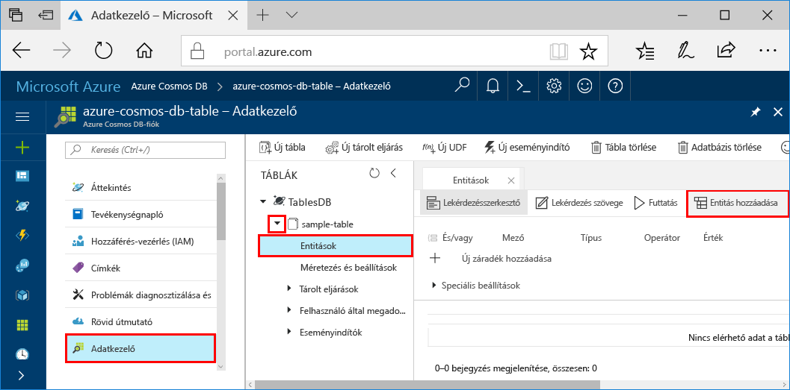
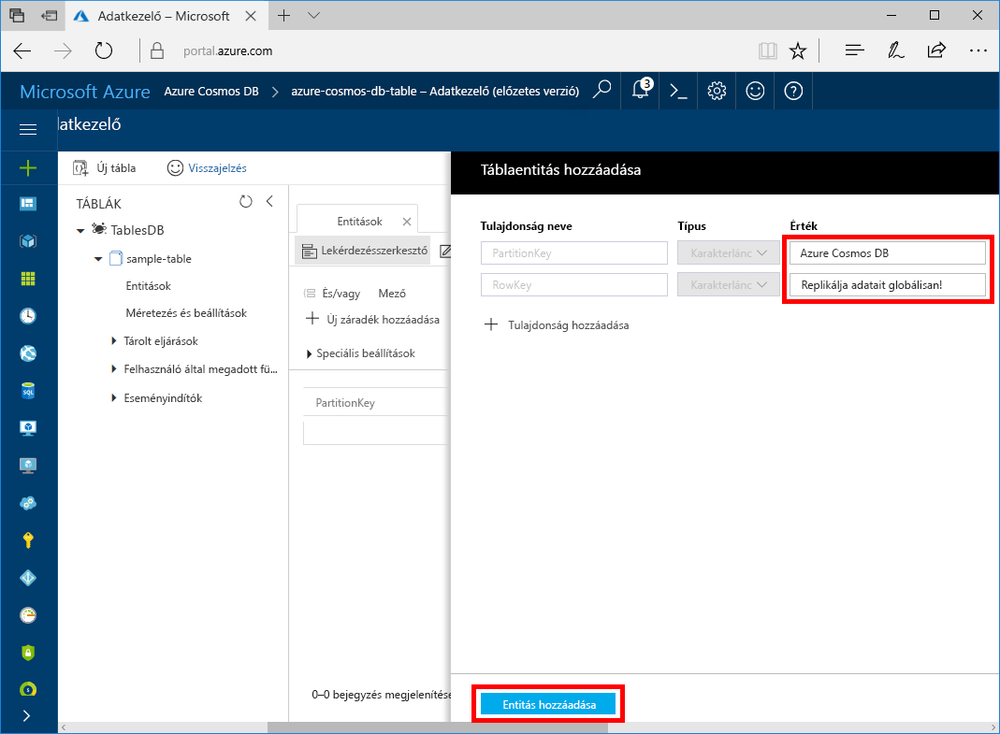
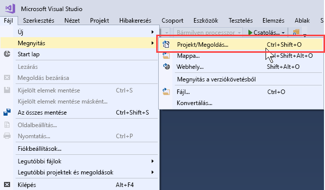
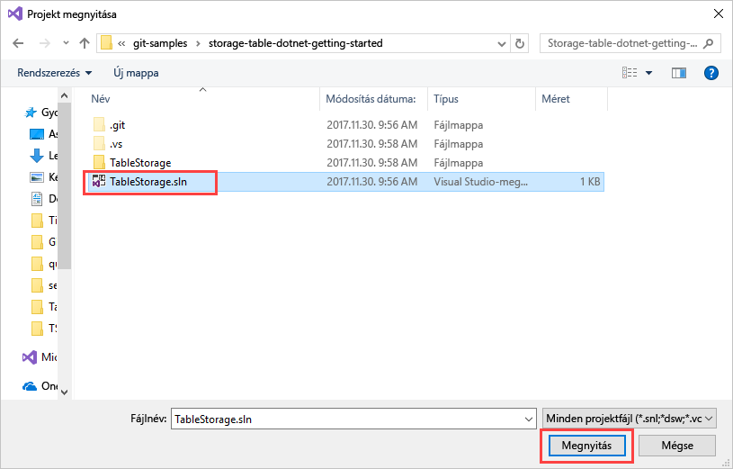
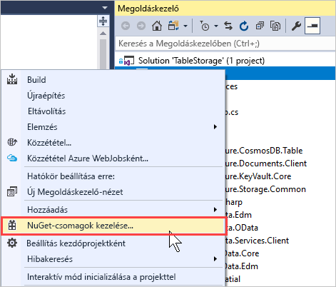
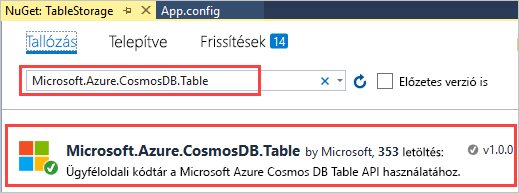
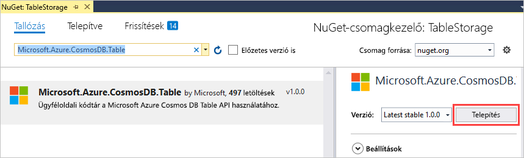
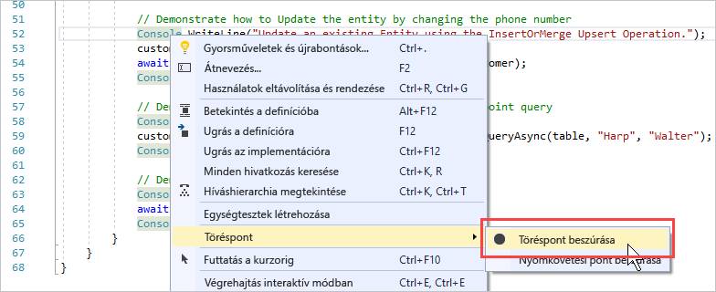
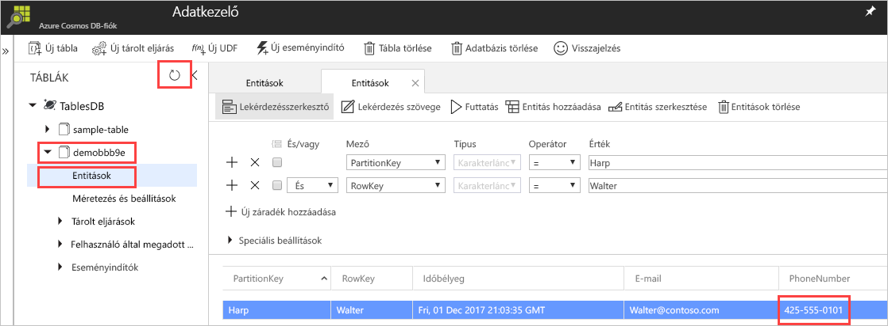

# <a name="quickstart-build-a-table-api-app-with-net-and-azure-cosmos-db"></a>Rövid útmutató: Table API-alkalmazás létrehozása a .NET és az Azure Cosmos DB használatával 

Ez a rövid útmutató ismerteti, hogyan használható a .NET és az Azure Cosmos DB [Table API](table-introduction.md) egy alkalmazás létrehozására egy, a GitHubról származó példa klónozásával. Ez a gyors útmutató emellett azt is bemutatja, hogyan hozható létre egy Azure Cosmos DB-fiók, és hogyan használható az Adatkezelő táblák és entitások létrehozására a webes alapú Azure Portalon.

Az Azure Cosmos DB a Microsoft globálisan elosztott, többmodelles adatbázis-szolgáltatása. Segítségével gyorsan létrehozhat és lekérdezhet dokumentum, kulcs/érték és gráf típusú adatbázisokat, amelyek mindegyike felhasználja az Azure Cosmos DB középpontjában álló globális elosztási és horizontális skálázhatósági képességeket. 

## <a name="prerequisites"></a>Előfeltételek

Ha nincs telepítve a Visual Studio 2017, letöltheti és használhatja az **ingyenes** [Visual Studio 2017 Community Edition](https://www.visualstudio.com/downloads/)t. Ügyeljen arra, hogy engedélyezze az **Azure Development** használatát a Visual Studio telepítése során.

[!INCLUDE [quickstarts-free-trial-note](../../includes/quickstarts-free-trial-note.md)]

## <a name="create-a-database-account"></a>Adatbázisfiók létrehozása

> [!IMPORTANT] 
> Létre kell hoznia egy új Table API-fiókot, amely használható az általánosan elérhető Table API SDK-kkal. Az általánosan elérhető SDK-k nem támogatják az előzetes verzióban létrehozott Table API-fiókokat.
>

[!INCLUDE [cosmos-db-create-dbaccount-table](../../includes/cosmos-db-create-dbaccount-table.md)]

## <a name="add-a-table"></a>Tábla hozzáadása

[!INCLUDE [cosmos-db-create-table](../../includes/cosmos-db-create-table.md)]

## <a name="add-sample-data"></a>Mintaadatok hozzáadása

Az Adatkezelő segítségével adatokat adhat hozzá az új táblához.

1. Az Adatkezelőben bontsa ki a **minta tábla** pontot, és kattintson az **Entitások**, ezután pedig az **Entitás hozzáadása** lehetőségre.

   
2. Adja meg a PartitionKey és a RowKey mező adatait és kattintson az **Entitás hozzáadása** lehetőségre.

   
  
    Most már az Adatkezelővel további entitásokat is hozzá tud adni a táblához, szerkesztheti őket, és lekérdezéseket is indíthat. Az Adatkezelőben továbbá skálázhatja az átviteli sebességet, és tárolt eljárásokat, felhasználói függvényeket és eseményindítókat adhat hozzá a táblához.

## <a name="clone-the-sample-application"></a>A mintaalkalmazás klónozása

Most pedig klónozunk egy Table-alkalmazást a GitHubról, beállítjuk a kapcsolati karakterláncot, majd futtatni fogjuk az alkalmazást. Látni fogja, milyen egyszerű az adatokkal programozott módon dolgozni. 

1. Nyisson meg egy git terminálablakot, például a Git Bash eszközt, és a `cd` parancs használatával váltson a mappára, ahol telepíteni szeretné a mintaalkalmazást. 

    ```bash
    cd "C:\git-samples"
    ```

2. Futtassa a következő parancsot a minta tárház klónozásához. Ez a parancs másolatot hoz létre a mintaalkalmazásról az Ön számítógépén. 

    ```bash
    git clone https://github.com/Azure-Samples/storage-table-dotnet-getting-started.git
    ```
## <a name="open-the-sample-application-in-visual-studio"></a>A mintaalkalmazás megnyitása a Visual Studióban

1. A Visual Studio **Fájl** menüjében válassza a **Megnyitás**, majd a **Projekt/Megoldás** elemet. 

    

2. Lépjen abba a mappába, amelybe a mintaalkalmazást klónozta, és nyissa meg TableStorage.sln fájlt.

    

## <a name="update-your-connection-string"></a>A kapcsolati karakterlánc frissítése

Lépjen vissza az Azure Portalra a kapcsolati karakterlánc adataiért, majd másolja be azokat az alkalmazásba. Ez lehetővé teszi az alkalmazás számára, hogy kommunikáljon az üzemeltetett adatbázissal. 

1. Az [Azure Portalon](http://portal.azure.com/) kattintson a **Kapcsolati karakterlánc** elemre. 

    Az ablak jobb oldalán található Másolás gomb használatával másolja a vágólapra a **PRIMARY CONNECTION STRING** (Elsődleges kapcsolati karakterlánc) értékét.

    

2. Nyissa meg az App.config fájlt a Visual Studióban. 

3. Állítsa vissza a 8. sorban található StorageConnectionString értéket, és tegye megjegyzésbe a 7. sorban szereplő StorageConnectionString értéket, mivel ebben az oktatóanyagban nem fogjuk használni az Azure SDK Storage Emulatort. A 7. és a 8. sornak így kell kinéznie:

    ```
    <!--key="StorageConnectionString" value="UseDevelopmentStorage=true;" />-->
    <add key="StorageConnectionString" value="DefaultEndpointsProtocol=https;AccountName=[AccountName];AccountKey=[AccountKey]" />
    ```

4. Illessze be a **PRIMARY CONNECTION STRING** (Elsődleges kapcsolati karakterlánc) értékét a portálról a 8. sor StorageConnectionString értékébe. Illessze be a karakterláncot az idézőjelek közé. 

    > [!IMPORTANT]
    > Ha a végpont a documents.azure.com címet használja, akkor előzetes fiókkal rendelkezik, és létre kell hoznia egy [új Table API-fiókot](#create-a-database-account), amely használható az általánosan elérhető Table API SDK-val. 
    > 

    A 8. sornak ekkor a következőképp kell kinéznie:

    ```
    <add key="StorageConnectionString" value="DefaultEndpointsProtocol=https;AccountName=<account name>;AccountKey=txZACN9f...==;TableEndpoint=https://<account name>.table.cosmosdb.azure.com;" />
    ```

5. A CTRL+S billentyűkombináció lenyomásával mentse az App.config fájlt.

Az alkalmazás frissítve lett minden olyan információval, amely az Azure Cosmos DB-vel való kommunikációhoz szükséges. 

## <a name="build-and-deploy-the-app"></a>Az alkalmazás létrehozása és üzembe helyezése

1. A Visual Studióban kattintson a jobb gombbal a **TableStorage** projektre a **Megoldáskezelőben**, majd kattintson a **NuGet-csomagok kezelése** elemre. 

   
2. A NuGet **Tallózás** mezőjébe írja be a következőt: *Microsoft.Azure.CosmosDB.Table*. Ezzel a Cosmos DB Table API-ügyfélkódtárát keresi meg.
   
   

3. A **Microsoft.Azure.CosmosDB.Table** kódtár telepítéséhez kattintson a **Telepítés** gombra. Ez telepíti az Azure Cosmos DB Table API csomagot és annak összes függőségét.

    

4. Nyissa meg a BasicSamples.cs fájlt. Kattintson a jobb gombbal az 52. sorra, válassza a **Töréspont**, majd a **Töréspont beszúrása** lehetőséget. Szúrjon be egy másik töréspontot az 55. sorban.

    

5. Az alkalmazás futtatásához nyomja le az F5 billentyűt.

    A konzolablakban láthatja az Azure Cosmos DB új táblaadatbázisának a nevét (esetünkben demo91ab4). 
    
    

    Ha hibaüzenetet kap a függőségekkel kapcsolatban, olvassa el a [Hibaelhárítás](table-sdk-dotnet.md#troubleshooting) részt.

    Az első töréspont elérésekor lépjen vissza az Adatkezelőbe az Azure Portalon. Kattintson a **Frissítés** gombra, bontsa ki a demo* táblát, majd kattintson az **Entitások** elemre. A jobb oldali **Entitások** lapon látható a Walter Harp számára újonnan hozzáadott entitás. Láthatja, hogy az új entitáshoz tartozó telefonszám 425-555-0101.

    
    
6. Zárja be az **Entitások** fület az Adatkezelőben.
    
7. Az F5 billentyű lenyomásával futtassa az alkalmazást a következő töréspontig. 

    A töréspont elérésekor váltson vissza az Azure Portalra, majd kattintson újból az **Entitások** elemre az **Entitások** lap megnyitásához, ahol láthatja, hogy a telefonszám a következőre frissült: 425-555-0105.

8. Az alkalmazás futtatásához nyomja le az F5 billentyűt. 
 
   Az alkalmazás által hozzáadott entitásokat egy fejlett mintaalkalmazás használja, amelyet a Table API jelenleg még nem támogat. Az alkalmazás ezután törli a mintaalkalmazás által létrehozott táblát.

9. A konzolablakban nyomja le az Enter billentyűt az alkalmazás futásának megszakításához. 
  

## <a name="review-slas-in-the-azure-portal"></a>Az SLA-k áttekintése az Azure Portalon

[!INCLUDE [cosmosdb-tutorial-review-slas](../../includes/cosmos-db-tutorial-review-slas.md)]

## <a name="clean-up-resources"></a>Az erőforrások eltávolítása

[!INCLUDE [cosmosdb-delete-resource-group](../../includes/cosmos-db-delete-resource-group.md)]

## <a name="next-steps"></a>További lépések

Ebben a rövid útmutatóban bemutattuk, hogyan lehet Azure Cosmos DB-fiókot létrehozni, hogyan lehet az Adatkezelő segítségével táblát készíteni, és hogyan lehet futtatni az alkalmazást.  Most már le tudja kérdezni adatait a Table API segítségével.  

> [!div class="nextstepaction"]
> [Táblaadatok importálása a Table API-ba](table-import.md)

