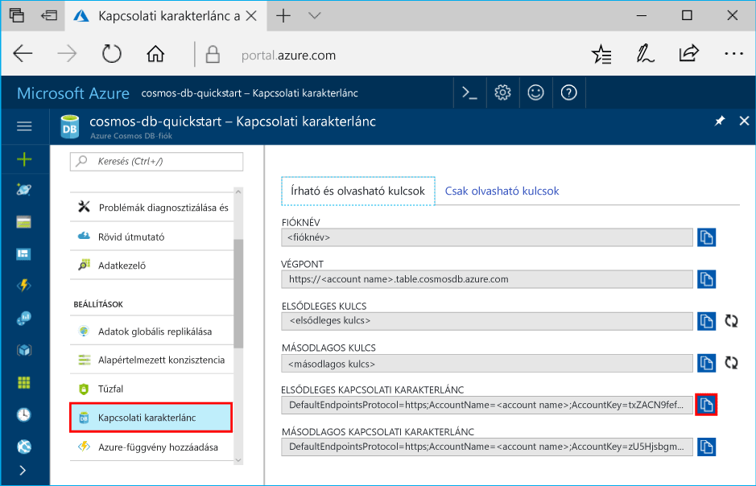

# <a name="quickstart-build-a-table-api-app-with-python-and-azure-cosmos-db"></a>Gyors útmutató: Table API-alkalmazás felépítése a Python és az Azure Cosmos DB használatával

> [!div class="op_single_selector"]
> * [.NET](create-table-dotnet.md)
> * [Java](create-table-java.md)
> * [Node.js](create-table-nodejs.md)
> * [Python](create-table-python.md)
> 

Ez a gyors útmutató azt ismerteti, hogy hogyan használható a Python és az Azure Cosmos DB [Table API](table-introduction.md) egy alkalmazás létrehozására egy GitHubról származó példa klónozásával. Ez a gyors útmutató emellett azt is bemutatja, hogyan hozható létre egy Azure Cosmos DB-fiók, és hogyan használható az Adatkezelő táblák és entitások létrehozására a webes alapú Azure Portalon.

Az Azure Cosmos DB a Microsoft globálisan elosztott, többmodelles adatbázis-szolgáltatása. Segítségével gyorsan létrehozhat és lekérdezhet dokumentum-, kulcs/érték, széles oszlopú és gráf típusú adatbázisokat, amelyek mindegyike felhasználja az Azure Cosmos DB középpontjában álló globális elosztási és horizontális skálázhatósági képességeket. 

## <a name="prerequisites"></a>Előfeltételek

[!INCLUDE [quickstarts-free-trial-note](../../includes/quickstarts-free-trial-note.md)]
[!INCLUDE [cosmos-db-emulator-docdb-api](../../includes/cosmos-db-emulator-docdb-api.md)]

Továbbá:

* Ha nincs telepítve a Visual Studio 2017, letöltheti és használhatja az **ingyenes** [Visual Studio 2017 Community Edition](https://www.visualstudio.com/downloads/)t. Ügyeljen arra, hogy az **Azure-fejlesztési** és a **Python-fejlesztési** számítási feladatot válassza ki a Visual Studio telepítése során.
* Ezenkívül a Python 2 lehetőséget is válassza ki a **Python-fejlesztési** számítási feladatban, vagy töltse le a Python 2.7-es verzióját a [python.org](https://www.python.org/downloads/release/python-2712/) webhelyről.

## <a name="create-a-database-account"></a>Adatbázisfiók létrehozása

> [!IMPORTANT] 
> Létre kell hoznia egy új Table API-fiókot, amely használható az általánosan elérhető Table API SDK-kkal. Az általánosan elérhető SDK-k nem támogatják az előzetes verzióban létrehozott Table API-fiókokat.
>

[!INCLUDE [cosmos-db-create-dbaccount-table](../../includes/cosmos-db-create-dbaccount-table.md)]

## <a name="add-a-table"></a>Tábla hozzáadása

[!INCLUDE [cosmos-db-create-table](../../includes/cosmos-db-create-table.md)]

## <a name="add-sample-data"></a>Mintaadatok hozzáadása

[!INCLUDE [cosmos-db-create-table-add-sample-data](../../includes/cosmos-db-create-table-add-sample-data.md)]

## <a name="clone-the-sample-application"></a>A mintaalkalmazás klónozása

Most pedig klónozunk egy Table-alkalmazást a GitHubról, beállítjuk a kapcsolati sztringet, majd futtatni fogjuk az alkalmazást. Látni fogja, milyen egyszerű az adatokkal programozott módon dolgozni. 

1. Nyisson meg egy parancssort, hozzon létre egy git-samples nevű új mappát, majd zárja be a parancssort.

    ```bash
    md "C:\git-samples"
    ```

2. Nyisson meg egy git terminálablakot, például a git bash eszközt, és a `cd` parancs használatával váltson az új mappára, ahol telepíteni szeretné a mintaalkalmazást.

    ```bash
    cd "C:\git-samples"
    ```

3. Futtassa a következő parancsot a minta tárház klónozásához. Ez a parancs másolatot hoz létre a mintaalkalmazásról az Ön számítógépén. 

    ```bash
    git clone https://github.com/Azure-Samples/storage-python-getting-started.git
    ```

3. Ezután nyissa meg a megoldásfájlt a Visual Studióban. 

## <a name="update-your-connection-string"></a>A kapcsolati sztring frissítése

Lépjen vissza az Azure Portalra a kapcsolati sztring adataiért, majd másolja be azokat az alkalmazásba. Ez lehetővé teszi az alkalmazás számára, hogy kommunikáljon az üzemeltetett adatbázissal. 

1. Az [Azure Portalon](http://portal.azure.com/) kattintson a **Kapcsolati sztring** elemre. 

    

2. Másolja az ACCOUNT NAME (Fiók neve) értékét a jobb oldalon található gombbal.

3. Nyissa meg a config.py fájlt, és illessze be az ACCOUNT NAME értékét a portálról a STORAGE_ACCOUNT_NAME mezőbe a 19. sorban.

4. Lépjen vissza a portálra, és másolja a vágólapra a PRIMARY KEY (Elsődleges kulcs) értékét.

5. Illessze be a PRIMARY KEY értékét a portálról a STORAGE_ACCOUNT_KEY mezőbe a 20. sorban.

3. Mentse a config.py fájlt.

## <a name="run-the-app"></a>Az alkalmazás futtatása

1. A Visual Studióban kattintson jobb gombbal a projekt lehetőségre a **Megoldáskezelőben**, válassza ki a jelenlegi Python-környezetet, majd kattintson a jobb gombbal.

2. Válassza ki az Install Python Package (Python-csomag telepítése) lehetőséget, majd írja be az **azure-storage-table** szöveget

3. Az alkalmazás futtatásához nyomja le az F5 billentyűt. Az alkalmazás megjelenik a böngészőben. 

Lépjen vissza az Adatkezelőbe, ahol lekérdezheti és módosíthatja az új adatokat, valamint dolgozhat azokkal. 

## <a name="review-slas-in-the-azure-portal"></a>Az SLA-k áttekintése az Azure Portalon

[!INCLUDE [cosmosdb-tutorial-review-slas](../../includes/cosmos-db-tutorial-review-slas.md)]

## <a name="clean-up-resources"></a>Az erőforrások eltávolítása

[!INCLUDE [cosmosdb-delete-resource-group](../../includes/cosmos-db-delete-resource-group.md)]

## <a name="next-steps"></a>További lépések

Ebben a rövid útmutatóban bemutattuk, hogyan lehet Azure Cosmos DB-fiókot létrehozni, hogyan lehet az Adatkezelő segítségével táblát készíteni, és hogyan lehet futtatni az alkalmazást.  Most már le tudja kérdezni adatait a Table API segítségével.  

> [!div class="nextstepaction"]
> [Táblaadatok importálása a Table API-ba](table-import.md)
