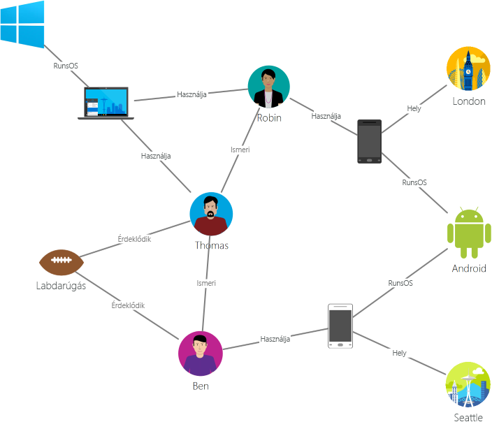

# Bevezetés az Azure Cosmos DB használatába: a Graph API

Az [Azure Cosmos DB](introduction.md) a Microsoft globálisan elosztott többmodelles adatbázis-szolgáltatása kritikus fontosságú alkalmazások számára. Az Azure Cosmos DB az alábbi funkciókat biztosítja [az iparág legjobb](https://azure.microsoft.com/support/legal/sla/cosmos-db/) szolgáltatásiszint-szerződéseivel támogatva:

* [Kulcsrakész globális terjesztés](distribute-data-globally.md)
* [A teljesítmény és a tárterület rugalmas méretezése](partition-data.md) világszerte
* Az esetek 99%-ában egyszámjegyű ezredmásodperces késés
* [Öt jól definiált konzisztenciaszint](consistency-levels.md)
* Garantáltan magas rendelkezésre állás 

Az Azure Cosmos DB [automatikusan indexeli az adatokat](http://www.vldb.org/pvldb/vol8/p1668-shukla.pdf) anélkül, hogy a felhasználónak sémákat és indexeket kellene kezelnie. Többmodelles szolgáltatás, amely támogatja a dokumentumokat, a kulcsértékeket, a diagramokat és az oszlopos adatmodelleket.

Javasoljuk, hogy tekintse meg a következő videót, amelyben Kirill Gavrylyuk a gráfok Azure Cosmos DB-ben való használatának első lépéseit ismerteti:

> [!VIDEO https://channel9.msdn.com/Shows/Azure-Friday/Graphs-with-Azure-Cosmos-DB-Gremlin-API/player]
> 
> 

Az Azure Cosmos DB Graph API a következőket biztosítja:

- Gráfmodellezés.
- Bejárási API-k.
- Kulcsrakész globális terjesztés.
- Rugalmasan méretezhető tárhely és teljesítmény 10 ms vagy a 99. percentilisben 15 ms alatti olvasási késéssel.
- Automatikus indexelés azonnali rendelkezésre állással a lekérdezésekhez.
- Beállítható konzisztenciaszintek.
- Átfogó SLA-k, beleértve egy 99,99%-os rendelkezésre állási SLA-t minden enyhén korlátozott konzisztenciájú egyrégiós és többrégiós fiókhoz, valamint 99,999%-os olvasási rendelkezésre állást minden többrégiós adatbázisfiókhoz.

Az Azure Cosmos DB lekérdezéséhez használhatja az [Apache TinkerPop](http://tinkerpop.apache.org) gráfbejárási nyelvet vagy a [Gremlint](http://tinkerpop.apache.org/docs/current/reference/#graph-traversal-steps).

A cikk áttekintést nyújt az Azure Cosmos DB Graph API-járól, és elmagyarázza, hogyan használhatja a nagyméretű, több milliárd csúcsot és élet tartalmazó gráfok tárolására. A gráfokat ezredmásodperces késéssel kérdezheti le, és könnyen fejlesztheti a gráfok struktúráját és sémáját.

## Gráfadatbázis
Az adatok a való világban természetes módon kapcsolódnak egymáshoz. A hagyományos adatmodellezés az entitásokra fókuszál. Számos alkalmazás esetében szükséges az entitások és a kapcsolatok természetes modellezése is.

A [gráf](http://mathworld.wolfram.com/Graph.html) egy [csúcsokból](http://mathworld.wolfram.com/GraphVertex.html) és [élekből](http://mathworld.wolfram.com/GraphEdge.html) álló struktúra. A csúcsok és az élek egyaránt tetszőleges számú tulajdonsággal rendelkezhetnek. A csúcsok diszkrét objektumokat jelölnek, például személyeket, helyeket vagy eseményeket. Az élek a csúcsok közötti kapcsolatokat jelölik. Például egy adott személy ismerhet egy másik személyt, részt vehet egy eseményen, vagy nemrégiben meglátogathatott egy helyszínt. A tulajdonságok a csúcsokkal és élekkel kapcsolatos információkat fejeznek ki. Ilyen tulajdonságok lehetnek például a csúcsok neve vagy kora és az élek időbélyege és/vagy súlya. Formálisabban ezt a modellt [tulajdonsággráfnak](http://tinkerpop.apache.org/docs/current/reference/#intro) is nevezik. Az Azure Cosmos DB támogatja a tulajdonsággráf modellt.

Például az alábbi mintagráf személyek, mobileszközök, érdeklődési körök és operációs rendszerek közti kapcsolatokat ábrázol:

A gráfok a legkülönfélébb adatkészletek ábrázolására alkalmasak a tudományok, a technológiák és az üzlet területén. A gráfadatbázisok segítségével a gráfok természetesen és hatékonyan modellezhetők és tárolhatók, így számos forgatókönyvben hasznosnak bizonyulnak. A gráfadatbázisok jellemzően NoSQL-adatbázisok, mivel az ilyen esetekben gyakran van szükség rugalmas sémákra és gyors iterációra.

A gráfok újszerű és hatékony adatmodellezési technikát kínálnak. Ez a tény magában azonban nem elegendő a gráfadatbázis használatához. A gráfbejárásokat tartalmazó alkalmazási esetek és minták esetében a gráfok nagyságrendekkel jobban teljesítenek a hagyományos SQL- és NoSQL-adatbázisoknál. A teljesítménybeli különbség további nő, amikor több kapcsolatot kell bejárni, például „egy barát barátja” esetében.

A gráfadatbázisok által lehetővé tett gyors bejárások kombinálhatók különféle gráfalgoritmusokkal, például mélységi (DFS) és szélességi (BFS) keresésekkel vagy Dijkstra-algoritmusokkal, a legkülönfélébb területekre (például közösségi hálózatok, tartalomkezelés, térinformatika vagy javaslatok kialakítása) tartozó problémák megoldása érdekében.

## Globális gráfok az Azure Cosmos DB-ben
Az Azure Cosmos DB egy teljes körűen felügyelt gráfadatbázis, amely globális elosztási, rugalmas tárhely- és teljesítményméretezési, automatikus indexelési és lekérdezési képességeket biztosít, valamint beállítható konzisztenciaszinteket és a TinkerPop szabvány támogatását.

Az Azure Cosmos DB a következő megkülönböztetett képességeket biztosítja a piacon elérhető többi gráfadatbázishoz képest:

* Rugalmasan méretezhető átviteli sebesség és tárterület

 A valós életben a gráfokat egyetlen kiszolgáló kapacitásán felül kell tudni méretezni. Az Azure Cosmos DB segítségével a gráfok zökkenőmentesen méretezhetők akár több kiszolgálóra is. Emellett a gráfok teljesítménye függetlenül méretezhető a hozzáférési mintáknak megfelelően. Az Azure Cosmos DB által támogatott gráfadatbázisok szinte korlátlanul méretezhető tárterületet és átviteli sebességet biztosítanak.

* Többrégiós replikáció

 Az Azure Cosmos DB transzparensen replikálja a gráfadatokat a fiókhoz társított összes régióba. A replikáció lehetővé teszi a globális adathozzáférést igénylő alkalmazások fejlesztését. Vannak azonban hátrányai a konzisztencia, a rendelkezésre állás és a teljesítmény, valamint a megfelelő garanciák terén. Az Azure Cosmos DB transzparens regionális feladatátvételt kínál többkiszolgálós API-k segítségével. A teljesítmény és a tárterület globális szinten rugalmasan méretezhető.

* Gyors lekérdezések és bejárások a már ismert Gremlin-szintaxissal

 Heterogén csúcsokat és éleket tárolhat, és a már ismerős Gremlin-szintaxis használatával kérdezheti le ezeket a dokumentumokat. Az Azure Cosmos DB az egyidejűséget támogató, zárolásmentes, naplószerkezetű indexelési technológiát alkalmaz a teljes tartalom indexeléséhez. Ez a képesség részletes, valós idejű lekérdezéseket és bejárásokat tesz lehetővé sémamutatók, másodlagos indexek vagy nézetek megadása nélkül. További információk: [Gráfok lekérdezése a Gremlin használatával](gremlin-support.md).

* Teljes körű felügyelet

 Az Azure Cosmos DB használatával nincs szükség az adatbázis és a gép erőforrásainak kezelésére. Teljes körűen felügyelt Microsoft Azure szolgáltatásként nincs szükség virtuális gépek kezelésére, szoftverek telepítésére és konfigurálására, a méretezés kezelésére vagy az összetett adatrétegek frissítésére. Minden gráfról automatikus biztonsági mentés készül, és védelmet élveznek a regionális meghibásodásokkal szemben. Könnyedén elvégezheti egy Azure Cosmos DB-fiók hozzáadását és a kapacitás szükség szerinti kiosztását, így az adatbázis üzemeltetése és kezelése helyett az alkalmazásra összpontosíthat.

* Automatikus indexelés

 Alapértelmezés szerint az Azure Cosmos DB automatikusan indexeli a gráf csúcsain és élein található összes tulajdonságot, és nem vár vagy igényel semmilyen sémát, valamint nem szükséges másodlagos indexek létrehozása sem.

* Kompatibilitás az Apache TinkerPoppal

 Az Azure Cosmos DB natív módon támogatja a nyílt forráskódú Apache TinkerPop szabványt, és integrálható más TinkerPop-kompatibilis rendszerekkel. Így egyszerűen válthat más gráfadatbázisokról (például Titan vagy Neo4j), vagy használhatja az Azure Cosmos DB-t különféle gráfelemző keretrendszerekkel (például Apache Spark GraphX).

* Beállítható konzisztenciaszintek

 Öt jól meghatározott konzisztenciaszint közül választhat a konzisztencia és a teljesítmény közötti optimális kompromisszum elérése érdekében. A lekérdezések és olvasási műveletek esetében az Azure Cosmos DB öt különböző konzisztenciaszintet kínál: erős, kötött elavulás, munkamenet, konzisztens előtag és végleges. Ezek a részletes, jól meghatározott konzisztenciaszintek lehetővé teszik, hogy ésszerű kompromisszumot alakítson ki a konzisztencia, a rendelkezésre állás és a késleltetés között. További információk: [Beállítható adatkonzisztencia-szintek az Azure Cosmos DB-ben](consistency-levels.md).

Az Azure Cosmos DB emellett képes többféle modellt (például dokumentumokat és gráfokat) alkalmazni egyazon tárolón/adatbázison belül. Dokumentumtárolók használatával a gráfadatokat a dokumentumokkal együtt tárolhatja. JSON-alapú SQL-lekérdezések és Gremlin-lekérdezések használatával egyaránt lekérdezheti a gráffal egyező adatokat.

## Bevezetés
Azure Cosmos DB-fiókokat a Graph API-t támogató Azure parancssori felület (CLI), Azure PowerShell vagy Azure Portal használatával hozhat létre. A fiókok létrehozását követően az Azure Portal szolgáltatásvégpontot biztosít (például `https://<youraccount>.gremlin.cosmosdb.azure.com`), amely egy WebSocket-előtér a Gremlin számára. TinkerPop-kompatibilis eszközeit, például a [Gremlin konzolt](http://tinkerpop.apache.org/docs/current/reference/#gremlin-console) beállíthatja, hogy ehhez a végponthoz kapcsolódjanak, és az alkalmazásokat a Java, a Node.js vagy bármely Gremlin ügyfél-illesztőprogram használatával hozzák létre.

Az alábbi táblázat az Azure Cosmos DB-n használható népszerű Gremlin-illesztőprogramokat foglalja össze:

| Letöltés | Dokumentáció | Első lépések |
| --- | --- | --- |
| [.NET](http://tinkerpop.apache.org/docs/3.3.1/reference/#gremlin-DotNet) | [Gremlin.NET on GitHub](https://github.com/apache/tinkerpop/tree/master/gremlin-dotnet) | [Gráf létrehozása a .NET használatával](create-graph-dotnet.md) |
| [Java](https://mvnrepository.com/artifact/com.tinkerpop.gremlin/gremlin-java) | [Gremlin JavaDoc](http://tinkerpop.apache.org/javadocs/current/full/) | [Gráf létrehozása a Java használatával](create-graph-java.md) |
| [Node.js](https://www.npmjs.com/package/gremlin) | [Gremlin-JavaScript a GitHubon](https://github.com/jbmusso/gremlin-javascript) | [Gráf létrehozása a Node.js használatával](create-graph-nodejs.md) |
| [Python](http://tinkerpop.apache.org/docs/3.3.1/reference/#gremlin-python) | [Gremlin-Python a GitHubon](https://github.com/apache/tinkerpop/tree/master/gremlin-python) | [Gráf létrehozása a Python használatával](create-graph-python.md) |
| [PHP](https://packagist.org/packages/brightzone/gremlin-php) | [Gremlin-PHP a GitHubon](https://github.com/PommeVerte/gremlin-php) | [Gráf létrehozása a PHP használatával](create-graph-php.md) |
| [Gremlin-konzol](https://tinkerpop.apache.org/downloads.html) | [TinkerPop dokumentumok](http://tinkerpop.apache.org/docs/current/reference/#gremlin-console) |  [Gráf létrehozása a Gremlin-konzol használatával](create-graph-gremlin-console.md) |

## Az Azure Cosmos DB gráftámogatásával kapcsolatos forgatókönyvek
Íme néhány forgatókönyv, amelyben az Azure Cosmos DB gráftámogatása hasznosítható:

* Közösségi hálózatok

 Az ügyfeleivel és ügyfeleinek más személyekkel való interakcióival kapcsolatos adatok kombinálásával személyre szabott élményeket dolgozhat ki, előre jelezheti az ügyfelek viselkedését, vagy összekötheti a hasonló érdeklődési körű személyeket. Az Azure Cosmos DB használatával felügyelhetők a közösségi hálózatok, és nyomon követhetők az ügyfelek preferenciái és adatai.

* Javaslati motorok

 Ezt a forgatókönyvet gyakran alkalmazzák a kiskereskedelemben. A termékekkel, a felhasználókkal és a felhasználók interakcióival (például vásárlások, böngészés vagy az egyes cikkek értékelése) kapcsolatos információk kombinálásával testre szabott javaslatokat állíthat össze. Az Azure Cosmos DB kis késleltetésű, rugalmasan méretezhető és natív gráftámogatása ideális ezeknek az interakcióknak a modellezéséhez.

* Térinformatikai

 Számos távközlési, logisztikai és utazástervezési alkalmazásban van szükség az egyes helyszínek egy területen belül való megkeresésére, vagy a két helyszín közötti legrövidebb/optimális útvonal megállapítására. Az Azure Cosmos DB természetes választás az ilyen problémákhoz.

* Eszközök internetes hálózata

 Ha a hálózatot és az IoT-eszközök közötti kapcsolatot gráfként modellezi, jobban megértheti az eszközök és adategységek állapotát. Azt is megértheti, hogy a hálózat egyes részeinek módosítása milyen potenciális hatással lehet a többi részre.

## További lépések
A gráfok Azure Cosmos DB általi támogatásával kapcsolatos további információkért lásd:

* Első lépésként kezdje [az Azure Cosmos DB-gráfokkal kapcsolatos oktatóanyaggal](create-graph-dotnet.md).
* Ismerje meg [az Azure Cosmos DB-ben kezelt gráfok Gremlinnel való lekérdésének](gremlin-support.md) módját.
