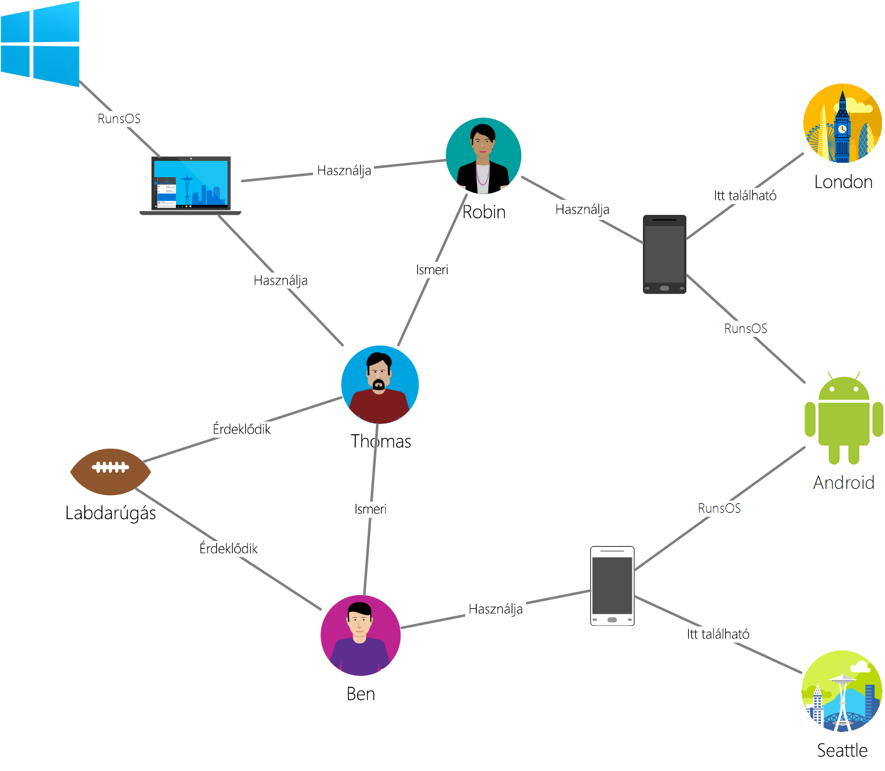

# <a name="azure-cosmos-db-gremlin-graph-support"></a>Azure Cosmos DB Gremlin graph-támogatás
Azure Cosmos-adatbázis támogatja [Apache Tinkerpop](http://tinkerpop.apache.org) átjárás nyelvi diagramot [Gremlin](http://tinkerpop.apache.org/docs/current/reference/#graph-traversal-steps), vagyis egy grafikonon API graph entitások létrehozására és a graph lekérdezés műveletet hajt végre. A Gremlin nyelv segítségével (csúcsban és szélek) graph entitásokat hozhatnak létre, belül entitásokból tulajdonságainak módosítása, hajtsa végre a lekérdezéseket és traversals és entitások törlésére. 

Azure Cosmos DB vállalati használatra kész szolgáltatások során az graph-adatbázishoz. Ez magában foglalja a globális terjesztési, független méretezése tárolási és átviteli, előre jelezhető egyjegyű ezredmásodperces késések fordulnak elő, az automatikus indexeléshez SLA-k, olvassa el a rendelkezésre állási adatbázis fiókok két vagy több Azure-régiók átfedés. Mivel az Azure Cosmos DB TinkerPop/Gremlin támogatja, egyszerűen áttelepítheti egy másik graph-adatbázis segítségével anélkül, hogy a kód módosítások írt alkalmazások. Emellett Gremlin támogatási címtár Azure Cosmos DB zökkenőmentesen integrálható a TinkerPop-kompatibilis analytics keretrendszerek, például a [Apache Spark GraphX](http://spark.apache.org/graphx/). 

Ebben a cikkben azt ismertetik a gyors Gremlin, és a Gremlin szolgáltatások és a Graph API által támogatott lépéseket számbavétele.

## <a name="gremlin-by-example"></a>Példa alapján gremlin
Egy minta graph használatával megérteni, hogyan lekérdezések Gremlin lehet megadni. Az alábbi ábrán egy üzleti alkalmazás, amely felügyeli a felhasználók, érdeklődési és egy grafikonon formájában eszközök adatait.  

 

Ehhez a diagramhoz tartozik a következő csúcspont ("címke" elnevezésű Gremlin):

- Személyek: A diagramnak van három személyek, multiplexelés Thomas és Ben
- Érdeklődési: Az érdeklődési, ebben a példában bemutatjuk a játék
- Eszközök: Az eszközöket, amelyek személyek használata
- Operációs rendszerek esetén: Az operációs rendszerek, amelyek az eszközök futnak

Ezen keresztül a következő biztonsági típusok és címkéket entitások közötti kapcsolatok azt mutatják be:

- Tudja: például "Thomas tudja multiplexelés"
- Érdekelt: Annak a személynek a Graph érdekében képviseli, például "Ben olyan iránt érdeklődik bemutatjuk"
- RunsOS: Hordozható számítógépen futtatja a Windows operációs rendszer
- Felhasználás: Képviselő eszköz egy személy használja. Például multiplexelés használ sorozatszámú 77 Motorola telefon

Most futtassa bizonyos műveleteket a graph használatával a [Gremlin konzol](http://tinkerpop.apache.org/docs/current/reference/#gremlin-console). Ezeket a műveleteket az Ön által választott (Java, Node.js, Python vagy .NET) platform Gremlin illesztőprogramokkal is elvégezheti.  Mielőtt úgy tekintünk, mi az Azure Cosmos Adatbázisba támogatott vizsgáljuk meg néhány példa, hogy megismerkedjen a szintaxist.

Első CRUD vizsgáljuk meg. A következő Gremlin utasítás a "Thomas" csúcspont szúr be a grafikon:

```
:> g.addV('person').property('id', 'thomas.1').property('firstName', 'Thomas').property('lastName', 'Andersen').property('age', 44)
```

Ezt követően a következő Gremlin utasítás szúr be egy "tudja" peremhálózati Thomas és multiplexelés között.

```
:> g.V('thomas.1').addE('knows').to(g.V('robin.1'))
```

A következő lekérdezés adja vissza a "személy" csúcsban csökkenő sorrendben első neveik:
```
:> g.V().hasLabel('person').order().by('firstName', decr)
```

Ha diagramokat izzólámpákhoz esetén meg kell válaszolnia kérdések például a "milyen operációs rendszerek Thomas barátok használnak?". Ez az információ lekérése a diagramon az egyszerű Gremlin átjárás futtathatja:

```
:> g.V('thomas.1').out('knows').out('uses').out('runsos').group().by('name').by(count())
```
Most nézzük Azure Cosmos DB tartalma Gremlin fejlesztők számára.

## <a name="gremlin-features"></a>Gremlin szolgáltatások
TinkerPop olyan szabvány, amely számos különböző graph technológiák lefedi. Ezért ismertetésében leírására, hogy funkciók egy grafikonon szolgáltató által biztosított rendelkezik. Azure Cosmos-adatbázis egy állandó, nagy feldolgozási, írható graph-adatbázis, amely több kiszolgálók vagy fürt lehet particionálni biztosít. 

A következő táblázat, amelyeket a rendszer Azure Cosmos DB TinkerPop szolgáltatásokat sorolja fel: 

| Kategória | Az Azure Cosmos DB végrehajtása |  Megjegyzések | 
| --- | --- | --- |
| Graph-funkciók | Adatmegőrzési és ConcurrentAccess biztosít. Hogy a tranzakciók támogatása | Számítógép-módszereket a Spark-összekötőn keresztül valósítható meg. |
| Változó szolgáltatások | Támogatja a logikai, egész, bájt, duplán, lebegőpontos, egész, hosszú, karakterlánc | Támogatja az egyszerű típusok, kompatibilis adatmodellt összetett típus |
| Csúcspont szolgáltatások | Támogatja a RemoveVertices, MetaProperties, AddVertices, MultiProperties, StringIds, UserSuppliedIds, AddProperty, RemoveProperty  | Támogatja a létrehozása, módosítása és törlése csúcsban |
| Csúcspont tulajdonság szolgáltatások | StringIds, UserSuppliedIds, AddProperty, RemoveProperty, BooleanValues, ByteValues, DoubleValues, FloatValues, IntegerValues, LongValues, StringValues | Támogatja a létrehozása, módosítása és törlése csúcspont tulajdonságai |
| Biztonsági szolgáltatások | AddEdges, RemoveEdges, StringIds, UserSuppliedIds, AddProperty, RemoveProperty | Támogatja a létrehozása, módosítása és törlése élei számára |
| Edge tulajdonság szolgáltatások | Tulajdonságok, BooleanValues, ByteValues, DoubleValues, FloatValues, IntegerValues, LongValues, StringValues | Támogatja a létrehozása, módosítása és törlése peremhálózati tulajdonságai |

## <a name="gremlin-wire-format-graphson"></a>Gremlin egybeírt: GraphSON

Azure Cosmos-adatbázis használja a [GraphSON formátum](https://github.com/thinkaurelius/faunus/wiki/GraphSON-Format) Gremlin származó eredmények visszaadásakor. GraphSON Gremlin szabványos formátuma csúcsban, szélek és tulajdonságok (egy- és többértékű tulajdonságai) használatával JSON. 

Például az alábbi kódrészletben láthatja a csúcspont GraphSON megjelenítése *küld vissza az ügyfélnek* a Azure Cosmos-Adatbázisból. 

```json
  {
    "id": "a7111ba7-0ea1-43c9-b6b2-efc5e3aea4c0",
    "label": "person",
    "type": "vertex",
    "outE": {
      "knows": [
        {
          "id": "3ee53a60-c561-4c5e-9a9f-9c7924bc9aef",
          "inV": "04779300-1c8e-489d-9493-50fd1325a658"
        },
        {
          "id": "21984248-ee9e-43a8-a7f6-30642bc14609",
          "inV": "a8e3e741-2ef7-4c01-b7c8-199f8e43e3bc"
        }
      ]
    },
    "properties": {
      "firstName": [
        {
          "value": "Thomas"
        }
      ],
      "lastName": [
        {
          "value": "Andersen"
        }
      ],
      "age": [
        {
          "value": 45
        }
      ]
    }
  }
```

A csúcsban GraphSON által használt tulajdonságok a következők:

| Tulajdonság | Leírás |
| --- | --- |
| id | Az a csomópont azonosítója. (A kombinációja értékű _partition, ha van ilyen) egyedinek kell lennie |
| Címke | A csúcspont címke. Ez egy nem kötelező, és használt leírására, entity Type típusként. |
| type | Használatával megkülönböztethetők csúcsban nem graph dokumentumból |
| properties | A csúcspont társított felhasználó által definiált tulajdonságok összessége. Minden egyes tulajdonsága több értékeket veheti fel. |
| _partition (konfigurálható) | A csúcspont partíciókulcs. Használható több kiszolgálón diagramjait bővíteni |
| outE | Ez a csúcspont szélek kimenő listáját tartalmazza. A csomópont Simuló információk tárolása lehetővé teszi a traversals gyors végrehajtása. Szegély a címkék alapján vannak csoportosítva. |

És a peremhálózati más részekkel gráf navigációs számára a következő információkat tartalmazza.

| Tulajdonság | Leírás |
| --- | --- |
| id | Az él azonosítója. (A kombinációja értékű _partition, ha van ilyen) egyedinek kell lennie |
| Címke | Az él címke. Ez a tulajdonság nem kötelező, de a kapcsolattípus leírására használt. |
| inV | Az él csúcsban lévő listáját tartalmazza. A peremhálózati rendelkező Simuló információk tárolása lehetővé teszi a traversals gyors végrehajtása. Csúcsban a címkék alapján vannak csoportosítva. |
| properties | Az él társított felhasználó által definiált tulajdonságok összessége. Minden egyes tulajdonsága több értékeket veheti fel. |

Minden egyes tulajdonság szerepel egy tömbben több érték is tárolható. 

| Tulajdonság | Leírás |
| --- | --- |
| érték | A tulajdonság értéke

## <a name="gremlin-partitioning"></a>Particionálás gremlin

Az Azure Cosmos DB, diagramjait belül is méretezhető tárolókhoz tároló egymástól függetlenül a tárolási és átviteli sebesség (a normalizált kérelmek / másodperc szerint megadva) tekintetében. Minden egyes tárolóban kell adnia egy nem kötelező, de ajánlott a partíciós kulcs tulajdonság határozza meg, hogy a logikai partíciót határ kapcsolódó adatok. Minden csomópont él kell lennie egy `id` tulajdonság, amely egyedi entitások belül, hogy a partíciós kulcs értéke. A részleteket lásd: [Azure Cosmos DB a particionálás](partition-data.md).

Gremlin műveletek problémamentesen működik, amelyek több partíciót az Azure Cosmos DB több Diagramadatok között. Azonban ajánlott válassza ki a diagramok egy partíciós kulcs, amely általában arra használják a lekérdezések szűrő hozzáféréssel rendelkezik az számos különböző értékeket, és hasonló gyakorisága ezeket az értékeket. 

## <a name="gremlin-steps"></a>Gremlin lépéseket
Mostantól az Azure Cosmos DB által támogatott Gremlin lépéseket vizsgáljuk meg. A Gremlin teljes referenciáért lásd: [TinkerPop hivatkozás](http://tinkerpop.apache.org/docs/current/reference).

| Lépés | Leírás | TinkerPop 3.2 dokumentáció |
| --- | --- | --- |
| `addE` | Két csúcsban közötti él hozzáadása | [addE lépés](http://tinkerpop.apache.org/docs/current/reference/#addedge-step) |
| `addV` | Egy csúcsának hozzáadja a diagramhoz | [addV lépés](http://tinkerpop.apache.org/docs/current/reference/#addvertex-step) |
| `and` | Biztosítja, hogy a traversals ad vissza értéket | [lépés](http://tinkerpop.apache.org/docs/current/reference/#and-step) |
| `as` | A lépés modulátor változó hozzárendelése a kimenet egy lépés | [lépéseként](http://tinkerpop.apache.org/docs/current/reference/#as-step) |
| `by` | A lépés modulátor használt `group` és `order` | [lépés](http://tinkerpop.apache.org/docs/current/reference/#by-step) |
| `coalesce` | Az első átjárás, amely visszaadja az eredményt adja vissza | [a Coalesce lépés](http://tinkerpop.apache.org/docs/current/reference/#coalesce-step) |
| `constant` | Konstans értéket ad vissza. Együtt `coalesce`| [állandó lépés](http://tinkerpop.apache.org/docs/current/reference/#constant-step) |
| `count` | A count ad vissza a átjárás | [Count lépés](http://tinkerpop.apache.org/docs/current/reference/#count-step) |
| `dedup` | Az értékeket ad vissza, amelyben az ismétlődő értékek eltávolításával | [a deduplikáció lépés](http://tinkerpop.apache.org/docs/current/reference/#dedup-step) |
| `drop` | Elutasítja azokat az értékeket (csúcspont/oldal) | [közvetlen lépés](http://tinkerpop.apache.org/docs/current/reference/#drop-step) |
| `fold` | A korlát, amely kiszámítja a összesítés eredmények sújtó| [modellrészek lépés](http://tinkerpop.apache.org/docs/current/reference/#fold-step) |
| `group` | Csoportok az értékeket a megadott címkék alapján| [a csoport lépés](http://tinkerpop.apache.org/docs/current/reference/#group-step) |
| `has` | Tulajdonságok csúcsban és szélek szűrésére használatos. Támogatja a `hasLabel`, `hasId`, `hasNot`, és `has` Variant adattípusban. | [lépés rendelkezik](http://tinkerpop.apache.org/docs/current/reference/#has-step) |
| `inject` | Értékek behelyezése adatfolyam| [lépés beszúrása](http://tinkerpop.apache.org/docs/current/reference/#inject-step) |
| `is` | Egy logikai kifejezés használatával szűrő végrehajtásához használt | [lépés](http://tinkerpop.apache.org/docs/current/reference/#is-step) |
| `limit` | Használható korlátozására a átjárás elemek száma| [korlát lépés](http://tinkerpop.apache.org/docs/current/reference/#limit-step) |
| `local` | Helyi becsomagolja a segédlekérdezés hasonló átjárás szakasza | [helyi lépés](http://tinkerpop.apache.org/docs/current/reference/#local-step) |
| `not` | A negálás egy szűrő létrehozásához használt | [nem lépés](http://tinkerpop.apache.org/docs/current/reference/#not-step) |
| `optional` | A megadott átjárás eredményét adja vissza, ha az eredményt adja eredményül ellenkező esetben a hívó elemet adja vissza | [nem kötelező lépés](http://tinkerpop.apache.org/docs/current/reference/#optional-step) |
| `or` | Biztosítja a traversals közül legalább egy értéket ad vissza | [vagy lépés](http://tinkerpop.apache.org/docs/current/reference/#or-step) |
| `order` | A megadott rendezési sorrend eredményez értéket ad vissza | [rendelés lépés](http://tinkerpop.apache.org/docs/current/reference/#order-step) |
| `path` | A átjárás elérési útját adja vissza | [elérési út lépés](http://tinkerpop.apache.org/docs/current/reference/#path-step) |
| `project` | A tulajdonságokat a térkép projektek | [Projekt lépés](http://tinkerpop.apache.org/docs/current/reference/#project-step) |
| `properties` | A megadott címkék tulajdonságainak beolvasása | [Tulajdonságok lépés](http://tinkerpop.apache.org/docs/current/reference/#properties-step) |
| `range` | Úgy, hogy az adott értéktartományhoz| [tartomány lépés](http://tinkerpop.apache.org/docs/current/reference/#range-step) |
| `repeat` | A megadott számú alkalommal megismétel egy a lépést. Ismétlési használt | [Ismételje meg a](http://tinkerpop.apache.org/docs/current/reference/#repeat-step) |
| `sample` | A átjárás való minta eredmények használt | [a minta lépés](http://tinkerpop.apache.org/docs/current/reference/#sample-step) |
| `select` | A átjárás el a projekt használt |  [Válassza ki a lépés](http://tinkerpop.apache.org/docs/current/reference/#select-step) | |
| `store` | Összesítések nem blokkoló a átjárás a használt | [tároló lépés](http://tinkerpop.apache.org/docs/current/reference/#store-step) |
| `tree` | Egy fába csúcspont összesített görbék | [fa lépés](http://tinkerpop.apache.org/docs/current/reference/#tree-step) |
| `unfold` | Az iterátor unroll lépésként| [unfold lépés](http://tinkerpop.apache.org/docs/current/reference/#unfold-step) |
| `union` | Több traversals eredményeinek egyesítése| [a UNION lépés](http://tinkerpop.apache.org/docs/current/reference/#union-step) |
| `V` | A csúcsban és szélek közötti traversals szükséges lépéseket `V`, `E`, `out`, `in`, `both`, `outE`, `inE`, `bothE`, `outV`, `inV` , `bothV`, és `otherV` számára | [csúcspont lépései](http://tinkerpop.apache.org/docs/current/reference/#vertex-steps) |
| `where` | A átjárás származó eredmények szűrésére használatos. Támogatja a `eq`, `neq`, `lt`, `lte`, `gt`, `gte`, és `between` operátorok  | [Ha a lépés](http://tinkerpop.apache.org/docs/current/reference/#where-step) |

Azure Cosmos DB által biztosított írási optimalizált motor támogatja az automatikus indexeléshez levő összes tulajdonság belül és a csúcsban alapértelmezés szerint. Ezért lekérdezi tartománnyal lekérdezések rendezésére, szűrők, vagy bármely tulajdonság összesíti az index a feldolgozott és hatékony és kiszolgálása között. További információ a hogyan indexelési működéséről az Azure Cosmos Adatbázisba, lásd a dokumentum [séma-független indexelő](http://www.vldb.org/pvldb/vol8/p1668-shukla.pdf).

## <a name="next-steps"></a>További lépések
* Első lépések egy grafikonon alkalmazás felépítése [az SDK-k használatával](create-graph-dotnet.md) 
* További információ [támogatási diagramot](graph-introduction.md) az Azure Cosmos-Adatbázisba
