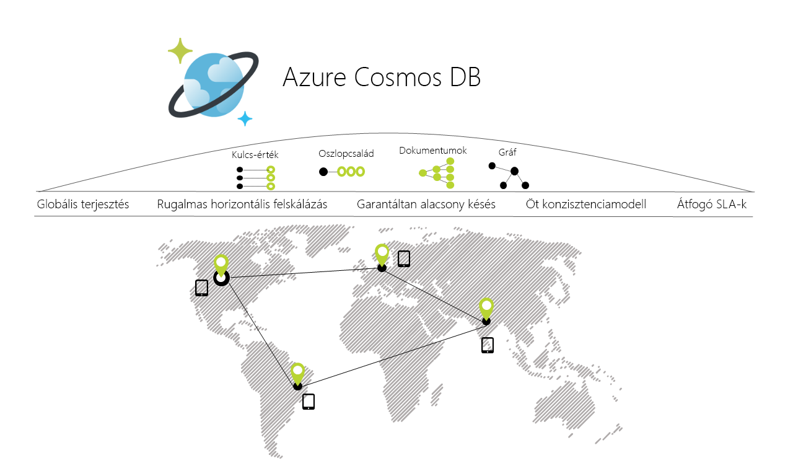

# Üdvözli az Azure Cosmos DB

A napjaink alkalmazásai válaszidejű, és mindig online szükségesek. Alacsony késéssel és magas rendelkezésre állás elérése érdekében ezeket az alkalmazásokat példányát kell üzembe helyezni a felhasználók közelében lévő adatközpontokban. Alkalmazások kell válaszolni a valós idejű használati nagy változások csúcsidőszakban, egyre növekvő mennyiségű adat tárolására, és az adatok elérhetővé tétele a felhasználók számára (MS).

Az Azure Cosmos DB a Microsoft globálisan elosztott, többmodelles adatbázis-szolgáltatása. Az Azure Cosmos DB segítségével egyetlen gombnyomással rugalmasan és függetlenül méretezhető az átviteli sebesség és a tárterület, akár több földrajzi Azure-régióra kiterjedően is. Rugalmasan méretezhető teljesítményt és tárolókapacitást, és gyors, számjegy-ezredmásodperces adatelérési kedvenc többek között az SQL, a MongoDB, a Cassandra, a táblák vagy a Gremlin API használata előnyeinek kihasználása. A cosmos DB kínál átfogó [szolgáltatói szerződések](https://aka.ms/acdbsla) (SLA) átviteli sebesség, a késés, a rendelkezésre állás és a konzisztencia megvalósulásának, valamit egyéb adatbázis-szolgáltatás biztosítani képes.

Az [Azure Cosmos DB-t kipróbálhatja ingyenesen](https://azure.microsoft.com/try/cosmosdb/), Azure-előfizetés, díjfizetés és elköteleződés nélkül.

> [!div class="nextstepaction"]
> [Az Azure Cosmos DB ingyenes kipróbálása](https://azure.microsoft.com/try/cosmosdb/)

## Főbb előnyök

### Kulcsrakész globális disztribúció

A cosmos DB lehetővé teszi, hogy hozhat létre a rendkívül rugalmas és magas rendelkezésre állású globális alkalmazások. A cosmos DB transzparensen replikálja az adatokat bárhol is vannak a felhasználók számára, így a felhasználók kezelhessék azokat azt az adatok replikáját.

A cosmos DB teszi lehetővé hozzáadása vagy eltávolítása az Azure-régiók és a Cosmos-fiók bármelyike bármikor, egyetlen kattintással. A cosmos DB zökkenőmentesen replikálja az adatokat a Cosmos-fiókjához társított, miközben az alkalmazás továbbra is a többkiszolgálós képességekkel a szolgáltatás magas rendelkezésre állásúak minden régióban.

További információkért lásd: a [globális terjesztés](distribute-data-globally.md) cikk.

### Mindig "be"

Szoros integráció az Azure infrastruktúra-hez tartozó és [transzparens több főkiszolgálós replikációs](global-dist-under-the-hood.md), Cosmos DB kínál 99,999 %-os [magas rendelkezésre állású](high-availability.md) mindkét olvasási és írási. A cosmos DB is lehetőséget nyújt a programozott módon (vagy a portálon keresztül) meghívni a regionális feladatátvétel Cosmos-fiókja. Ez a funkció segítségével győződjön meg arról, hogy egy Cosmos-adatbázis is automatikusan feladatátvétel, amíg az alkalmazás többi is célja, hogy a feladatátvevő regionális katasztrófa esetén.

### Rugalmasan méretezhető átviteli sebesség és tárterület, világszerte

A transzparens horizontális particionálást és több főkiszolgálós replikációt, Cosmos DB nyújt a páratlan rugalmas méretezhetőség az írási és olvasási, az összes világszerte. Vertikális felskálázás több száz vonatkozó kérelmek/másodperc, a világ minden pontján, egyetlen API hívással több millió, több ezer eszközről rugalmasan, és csak azért fizet az átviteli sebesség (és tárolási) van szüksége. Ez a képesség segít csúcsértéke a túltervezés nélkül a számítási feladatok nem várt kiugrások kezelésére. Lásd: [a Cosmos DB particionálási](partitioning-overview.md), [kiosztott átviteli sebesség a tárolók és adatbázisok](set-throughput.md), és [kiosztott átviteli kapacitás méretezése globálisan](scaling-throughput.md).

### Garantált alacsony késés 99 százalékon, világszerte

Cosmos DB használatával hozhat létre válaszidejű, globális méretű alkalmazások. Az új több főkiszolgálós replikációs protokollal és zárolástól mentes és [írásra optimalizált adatbázismotort](index-policy.md), Cosmos DB garantálja a kevesebb mint 10 ms késések is, olvassa be és 99 százalékon, a világ minden tájáról írási műveletek (indexelt) . Ez a funkció lehetővé teszi tartósan adatfeldolgozást és villámgyors lekérdezéseket válaszidejű alkalmazások.

### Pontosan definiált konzisztenciaválaszték több

Nem kell, hogy rendkívül [kompromisszumot kínál a konzisztencia, elérhetőség, késés és programozhatóság között](consistency-levels-tradeoffs.md). Cosmos DB több főkiszolgálós replikációs protokoll gondosan célja, hogy ajánlat [öt jól definiált konzisztenciaszintet](consistency-levels.md) – erős, korlátozott frissesség, konzisztens előtag, munkamenet és végleges – kínál egy intuitív programozási modellhez alacsony késéssel és magas rendelkezésre állású, globálisan elosztott alkalmazás.

### Nincs séma vagy index kezelése

Adatbázissémája és az indexek tartja szinkronban maradjon az alkalmazási sémának különösen nehéznek globálisan elosztott alkalmazások esetében. Azonban az, Cosmos dB-ben nem kell sémákat és indexeket kezelésére. A adatbázismotorja teljesen sémafüggetlen.  Nincs sémákat és indexeket felügyeleti nem szükséges, mivel is nem kell aggódnia az alkalmazások állásidő sémák áttelepítésekor. A cosmos DB [automatikusan indexeli az összes adatot](index-policy.md) – nincs séma, nem szükséges indexeket –, és gyors lekérdezéseket szolgál.

### Adatbázis-szolgáltatás többen tesztelték a gyakorlatban

A cosmos DB az eligazodást szolgáltatás az Azure-ban. Majdnem egy évtizede nyújt védelmet, a Cosmos DB rendelkezik használja számos Microsoft-termékek, az üzletmenet szempontjából kritikus fontosságú alkalmazások globális méretekben, beleértve a Skype, Xbox, az Office 365, Azure és sok más. Ma Cosmos DB az egyik leggyorsabb egyre bővülő szolgáltatás számos külső ügyfelek esetében, és rugalmasan méretezhető és/vagy kulcsrakész többszörös – datacenter/multi-régió, több főkiszolgálós replikációt a kis késésű és magas rendelkezésre állású mindkét igénylő alkalmazások által használt Azure-ban olvasási és írási műveletek.

### Széles körben használt területi jelenlét

A cosmos DB az összes Azure-régiókban világszerte, beleértve a nyilvános felhő, Azure China 21Vianet, Azure Germany, az Azure Government és Azure Government a védelmi Minisztérium 54 régióban érhető el. Lásd: [Cosmos DB regionális jelenlét](regional-presence.md).

### Alapértelmezés szerint és készen áll a vállalati védelme

A cosmos DB minősítéssel egy [számos megfelelőségi szabvány](compliance.md). Inaktív állapotban, és a mozgásban lévő Cosmos DB-ben minden adatokat is titkosítja. A cosmos DB szolgáltatás sor szintű hitelesítést, és szigorú biztonsági szabványoknak megfelelő.

### Teljes bekerülési Költséget jelentős megtakarítást

Mivel a Cosmos DB egy teljes körűen felügyelt szolgáltatás, nem kell többé kezelése és összetett több adatközpontban üzemelő példányok és az adatbázis-szoftver frissítései, a támogatás, a licencelési vagy a műveletek kell fizetnie. Lásd: [optimalizálhatja költségeit a Cosmos DB-vel](total-cost-ownership.md).

### Iparágvezető átfogó SLA-k

A cosmos DB, az első és az csak szolgáltatást kínáló [iparágvezető átfogó SLA-k](https://azure.microsoft.com/support/legal/sla/cosmos-db/) felölelő 99,999 %-os rendelkezésre állással, olvasási és írási késés 99 százalékon, átviteli sebesség és a konzisztencia garantált.

### Az Apache Spark és a Cosmos DB globális szintű működési elemzések =

Futtathat [Spark](spark-connector.md) Cosmos DB-ben tárolt adatokon. Ez a funkció lehetővé teszi a kis késésű, a üzemeltetési analytics globális méretekben tranzakciós munkaterhelések kezelésére közvetlenül a Cosmos DB szemben működő befolyásolása nélkül.

### A Cosmos DB, népszerű nosql-alapú API-k használata alkalmazások fejlesztéséhez

A cosmos DB kínál frissítése, és lekérdezheti az adatokat a Cosmos-adatbázisban tárolt API-k közül választhat. Alapértelmezés szerint [használhatja az SQL](how-to-sql-query.md) frissítése és az adatok lekérdezése a Cosmos database.

A cosmos DB is megvalósul [Cassandra](cassandra-introduction.md), [MongoDB](mongodb-introduction.md), [Gremlin](graph-introduction.md) és [Azure Table Storage](table-introduction.md) vezeték-protokollok közvetlenül a szolgáltatásban. Ez lehetővé teszi, hogy az ügyfél-illesztőprogramok (és eszközök) pont a gyakran használt nosql-alapú API-t közvetlenül, a Cosmos-adatbázis. Átviteli protokoll a gyakran használt nosql-alapú API-támogatásával, Cosmos DB teszi lehetővé:

* Könnyen migrálhatja az alkalmazás a Cosmos DB-hez az alkalmazáslogika jelentős részeinek megőrzése mellett.
* Hordozható tartani az alkalmazást, és továbbra is a felhőben gyártófüggetlen.
* Iparági vezető, pénzügyi felelősséggel vállalt szolgáltatói szerződésekkel kaphat a gyakori nosql-alapú API-k. 
* Rugalmasan skálázhatja a kiosztott átviteli sebesség és a tárolás igény szerint az adatbázisok, és csak azért fizet az átviteli sebesség és a storage van szüksége. Ez jelentős költségmegtakarítást vezet.

## Az Azure Cosmos DB előnyeit kihasználó megoldások

Bármely olyan [webes, mobil-, játék és IoT-alkalmazás](use-cases.md) esetén, amelynek nagy mennyiségű adatot, illetve írási és olvasási műveletet kell kezelnie [globálisan](distribute-data-globally.md), és csaknem valós válaszidőt kell biztosítania a különféle adatok kezelésekor, előnyt jelent az Azure Cosmos DB [garantált](https://azure.microsoft.com/support/legal/sla/cosmos-db/) magas szintű rendelkezésre állása, magas átviteli sebessége, kis késése és beállítható konzisztenciája. Megtudhatja, hogyan alkalmazható az Azure Cosmos DB az [IoT és telematika](use-cases.md#iot-and-telematics), a [kiskereskedelem és marketing](use-cases.md#retail-and-marketing), a [játékok](use-cases.md#gaming) és a [webes és mobilalkalmazások](use-cases.md#web-and-mobile-applications) területén.

## További lépések

További információ a Cosmos DB [globális terjesztés](distribute-data-globally.md) és [particionálás](partitioning-overview.md) képességeket.

Az alábbi rövid útmutatókkal könnyedén elkezdheti az Azure Cosmos DB használatát:

* [Bevezetés az Azure Cosmos DB SQL API használatába](create-sql-api-dotnet.md)
* [Ismerkedés az Azure Cosmos DB API a mongodb-hez](create-mongodb-nodejs.md)
* [Bevezetés az Azure Cosmos DB Cassandra API használatába](create-cassandra-dotnet.md)
* [Bevezetés az Azure Cosmos DB Gremlin API használatába](create-graph-dotnet.md)
* [Bevezetés az Azure Cosmos DB Table API használatába](create-table-dotnet.md)

> [!div class="nextstepaction"]
> [Az Azure Cosmos DB ingyenes kipróbálása](https://azure.microsoft.com/try/cosmosdb/)
