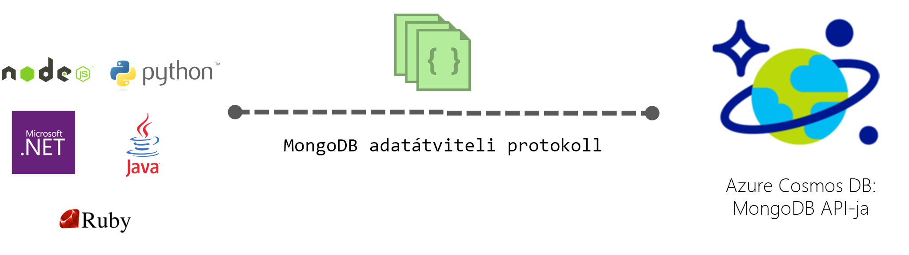

# Az Azure Cosmos DB MongoDB API-ügyfelek

Az [Azure Cosmos DB](introduction.md) a Microsoft globálisan elosztott, többmodelles adatbázis-szolgáltatása az alapvető fontosságú alkalmazásokhoz. Az Azure Cosmos DB az [iparág legjobb szolgáltatásiszint-szerződései](https://azure.microsoft.com/support/legal/sla/cosmos-db/) által biztosított [teljes körű, globális terjesztést](distribute-data-globally.md) kínál, valamint [a teljesítmény és a tárterület rugalmas méretezését](partition-data.md) világszerte, az esetek 99%-ában egyszámjegyű ezredmásodperces késéseket és garantált magas rendelkezésre állást. Az Azure Cosmos DB [automatikusan indexeli az adatokat](https://www.vldb.org/pvldb/vol8/p1668-shukla.pdf) anélkül, hogy a felhasználónak sémákat és indexeket kellene kezelnie. Többmodelles szolgáltatás, amely támogatja a dokumentumokat, a kulcs-értékeket, a diagramokat és az oszlopos adatmodelleket. Alapértelmezés szerint a Cosmos DB SQL API használatával is kezelheti. Ezenkívül a Cosmos DB szolgáltatás közös, például Cassandra, MongoDB, Gremlin és Azure Table Storage nosql-alapú API átviteli protokollt valósítja meg. Ez lehetővé teszi, hogy a jól ismert NoSQL-ügyfélillesztők és -eszközök használata a Cosmos-adatbázis.

## Átviteli protokoll kompatibilitása

A cosmos DB közös NoSQL-adatbázisok, például Cassandra, MongoDB, Gremlin és Azure Storage-táblák átviteli protokollt valósítja meg. Azáltal, hogy a natív megvalósításhoz, az átviteli protokollokat közvetlenül és hatékonyan Cosmos dB-ben, lehetővé teszi meglévő ügyfél SDK-k, illesztőprogramok és eszközök a NoSQL-adatbázisok a Cosmos DB transzparens módon kezelheti. A cosmos DB nem használja az adatbázisok forrás kód bármely, a NoSQL-adatbázisok, amelyek biztosítják az átviteli-kompatibilis API-k.

Alapértelmezés szerint az Azure Cosmos DB MongoDB API-hoz a protokoll 3.2-es verziójával kompatibilis. A protokoll 3.4-es verziójában hozzáadva lekérdezési operátorokkal vagy szolgáltatások jelenleg előzetes verzióként érhető el. Minden olyan ügyfél-illesztőprogram, amely együttműködik a protokollverziók a MongoDB API-hoz való csatlakozáshoz az Azure Cosmos DB natív módon képesnek kell lennie.

 

## Főbb előnyök

Fő előnyei a Cosmos DB egy teljes körűen felügyelt, globálisan elosztott adatbázis-szolgáltatás leírása [Itt](introduction.md). Továbbá által natív módon végrehajtási átviteli protokollokat, népszerű nosql-alapú API-t, Cosmos DB az alábbi előnyöket nyújtja:

* Könnyen migrálhatja az alkalmazás a Cosmos DB-hez az alkalmazáslogika jelentős részeinek megőrzése mellett.
* Hordozható tartani az alkalmazást, és továbbra is a felhőben gyártófüggetlen.
* Iparági vezető, pénzügyi felelősséggel vállalt szolgáltatói szerződésekkel kaphat a gyakori nosql-alapú API-k Cosmos DB segítségével.
* A kiosztott átviteli sebesség rugalmasan méretezhető, és a Cosmos-adatbázis tárolási igény szerint, és csak azért fizet az átviteli sebesség és a storage van szüksége. Ez jelentős költségmegtakarítást vezet.
* Kulcsrakész, globális, több főkiszolgálós replikációs terjesztési.

## A cosmos DB MongoDB API-ügyfelek

Kövesse a MongoDB rövid útmutatóinak lépéseit egy Azure Cosmos DB-fiók létrehozásához, és migrálja a meglévő MongoDB-alkalmazását az Azure Cosmos DB használatához, vagy hozzon létre egy újat:

* [Meglévő Node.js MongoDB-webalkalmazás migrálása](create-mongodb-nodejs.md).
* [-Webalkalmazás létrehozása .NET-tel és az Azure portal segítségével Azure Cosmos DB MongoDB API-hoz](create-mongodb-dotnet.md)
* [Konzolalkalmazás létrehozása Javával és az Azure portal segítségével Azure Cosmos DB MongoDB API-hoz](create-mongodb-java.md)

## További lépések

Íme, pár hivatkozás az első lépések megtételéhez:

* Kövesse a [Csatlakozás egy MongoDB-fiókhoz](connect-mongodb-account.md) című oktatóanyag lépéseit, amelyből megtudhatja, hogyan kérheti le a fiókja kapcsolati sztringjének adatait.
* Kövesse [A Studio 3T (MongoChef) használata Azure Cosmos DB-vel](mongodb-mongochef.md) című oktatóanyag lépéseit, amelyből megtudhatja, hogyan hozhat létre kapcsolatot az Azure Cosmos DB-adatbázis és a MongoDB-alkalmazás között a Studio 3T-ben.
* Kövesse a [adatok áttelepítése az Azure Cosmos DB-protokoll támogatja a MongoDB API-hoz](mongodb-migrate.md) oktatóanyag az adatok importálása egy Cosmos-adatbázis.
* Csatlakozhat egy Cosmos fiók használatával [Robomongo](mongodb-robomongo.md).
* Ismerje meg, hogyan [konfigurálhat olvasási beállításokat a globálisan elosztott alkalmazásokhoz](../cosmos-db/tutorial-global-distribution-mongodb.md).

Megjegyzés: Ez a cikk ismerteti az Azure Cosmos DB által biztosított átviteli protokoll kompatibilitás MongoDB adatbázisok funkciója. A Microsoft nem fut a szolgáltatás a MongoDB-adatbázisokat. Az Azure Cosmos DB sincs társítva a MongoDB, Inc.
