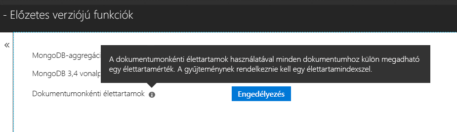

# <a name="expire-data-in-azure-cosmos-db-mongodb-api"></a>Adatok elévülése az Azure Cosmos DB MongoDB API-ban

Az élettartam- (TTL-) funkció lehetővé teszi, hogy az adatbázis adatai automatikusan elévüljenek. A MongoDB API az Azure Cosmos DB TTL-funkcióit használja. Két mód támogatott: alapértelmezett TTL-érték beállítása az egész gyűjteményhez és egyedi TTL-érték megadása az egyes dokumentumokhoz. A TTL-indexeket és a dokumentumonkénti TTL-értékeket szabályozó logika a MongoDB API-ban megegyezik az [Azure Cosmos DB-ben találhatóval](../cosmos-db/mongodb-indexing.md).

## <a name="ttl-indexes"></a>TTL-indexek
A TTL gyűjteményben történő univerzális engedélyezéséhez [TTL-index (élettartamindex)](../cosmos-db/mongodb-indexing.md) létrehozása szükséges. A TTL-index a _ts mező indexe expireAfterSeconds értékkel.

Példa:
```JavaScript
globaldb:PRIMARY> db.coll.createIndex({"_ts":1}, {expireAfterSeconds: 10})
{
        "_t" : "CreateIndexesResponse",
        "ok" : 1,
        "createdCollectionAutomatically" : true,
        "numIndexesBefore" : 1,
        "numIndexesAfter" : 4
}
```

A fenti példában lévő parancs létrehoz egy TTL-funkcióval rendelkező indexet. Miután létrejött az index, az adatbázis automatikusan töröl minden olyan dokumentumot a gyűjteményből, amely nem lett módosítva az elmúlt 10 másodpercben. 

> [!NOTE]
> A **_ts** egy Cosmos DB-specifikus mező, amely nem érhető el a MongoDB-ügyfelekből. Ez egy fenntartott (rendszer-) tulajdonság, amely tartalmazza a dokumentum utolsó módosításának időbélyegét.
>
    
Egy további C#-példa: 

```csharp
var options = new CreateIndexOptions {ExpireAfter = TimeSpan.FromSeconds(10)}; 
var field = new StringFieldDefinition<BsonDocument>("_ts"); 
var indexDefinition = new IndexKeysDefinitionBuilder<BsonDocument>().Ascending(field); 
await collection.Indexes.CreateOneAsync(indexDefinition, options); 
``` 

## <a name="set-time-to-live-value-for-a-document"></a>Dokumentum élettartamértékének megadása 
A dokumentumonkénti TTL-értékek is támogatottak. A dokumentumnak tartalmaznia kell egy gyökérszintű „ttl” tulajdonságot (kisbetűs), és a gyűjteményhez létre kell hozni egy TTL-indexet a fent leírtak alapján. A dokumentumhoz beállított TTL-értékek felülbírálják a gyűjtemény TTL-értékét.

Az élettartamnak int32 típusú értéknek kell lennie. Vagy lehet egy int32-be illő int64 vagy egy tizedesjeggyel nem rendelkező dupla, amely illik az int32-be. Az ezeknek a specifikációknak nem megfelelő TTL-tulajdonságértékek is engedélyezettek, de nem minősülnek értelmezhető TTL-dokumentumértéknek.

A dokumentum TTL-értékének megadása nem kötelező, TTL-értékkel nem rendelkező dokumentumok is beszúrhatók a gyűjteménybe.  Ebben az esetben a gyűjtemény TTL-értéke lesz figyelembe véve. 

A következő dokumentumok érvényes TTL-értékekkel rendelkeznek. A dokumentumok beszúrása után a dokumentum TTL-értékei felülbírálják a gyűjtemény TTL-értékeit. Tehát a dokumentumok 20 másodperc után el lesznek távolítva.  

```JavaScript 
globaldb:PRIMARY> db.coll.insert({id:1, location: "Paris", ttl: 20.0}) 
globaldb:PRIMARY> db.coll.insert({id:1, location: "Paris", ttl: NumberInt(20)}) 
globaldb:PRIMARY> db.coll.insert({id:1, location: "Paris", ttl: NumberLong(20)}) 
```

A következő dokumentumok TTL-értéke érvénytelen. A dokumentumok be lesznek szúrva, de a dokumentumok TTL-értéke nem lesz figyelembe véve. Tehát a dokumentumok 10 másodperc után el lesznek távolítva a gyűjtemény TTL-értéke miatt. 

```JavaScript 
globaldb:PRIMARY> db.coll.insert({id:1, location: "Paris", ttl: 20.5}) //TTL value contains non-zero decimal part. 
globaldb:PRIMARY> db.coll.insert({id:1, location: "Paris", ttl: NumberLong(2147483649)}) //TTL value is greater than Int32.MaxValue (2,147,483,648). 
``` 

## <a name="how-to-activate-the-per-document-ttl-feature"></a>A dokumentumonkénti TTL-funkció aktiválása
A dokumentumonkénti TTL-funkció a MongoDB API-fiók „Előzetes verziójú funkciók” lapján aktiválható az Azure Portalon.

 

## <a name="next-steps"></a>További lépések
* [Adatok automatikus elévülése az Azure Cosmos DB-gyűjteményekben az élettartam használatával](../cosmos-db/time-to-live.md)
* [Indexelés az Azure Cosmos DB MongoDB API-ban](../cosmos-db/mongodb-indexing.md)
