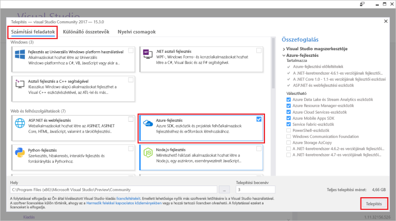

# <a name="create-an-azure-functions-http-trigger-with-an-azure-cosmos-db-input-binding"></a>Azure Functions HTTP-trigger létrehozása Azure Cosmos DB bemeneti kötéssel

Az Azure Cosmos DB egy globálisan elosztott, többmodelles adatbázis, amely séma- és kiszolgálómentes. Az Azure Functions egy kiszolgáló nélküli számítási szolgáltatás, amellyel igény szerint futtathat kódokat. Ez a két Azure-szolgáltatás együtt egy olyan kiszolgáló nélküli architektúra alapját képezi, amellyel a nagyszerű alkalmazások létrehozására összpontosíthat, és nem kell foglalkoznia a számítási és adatbázisigényeinek megfelelő kiszolgálók üzembe helyezésével és karbantartásával.

Ez az oktatóanyag a [Graph API .NET-es gyors útmutatójában](create-graph-dotnet.md) létrehozott kódot használja fel. Ez az oktatóanyag hozzáad egy Azure-függvényt, amely egy [HTTP-triggert](../azure-functions/functions-bindings-http-webhook.md) tartalmaz. A HTTP-trigger egy Azure Cosmos DB [bemeneti kötést](../azure-functions/functions-triggers-bindings.md) használ a gyors útmutatóban létrehozott Graph-adatbázis adatainak lekérésére. Ez az adott HTTP-trigger csak lekérdezi az Azure Cosmos DB adatait, de az Azure Cosmos DB bemeneti kötéseivel bármilyen adatbemeneti értékeket lekérhet a függvényeihez.

Ez az oktatóanyag a következő feladatokat mutatja be:

> [!div class="checklist"]
> * Azure Functions-projekt létrehozása 
> * HTTP-trigger létrehozása
> * Az Azure-függvény közzététele
> * Az Azure-függvény csatlakoztatása az Azure Cosmos DB-adatbázishoz

## <a name="prerequisites"></a>Előfeltételek

- A [Visual Studio 2017 15.3-as verziója](https://www.visualstudio.com/vs/preview/), amely tartalmazza az **Azure-fejlesztési** számítási feladatot is.

    
    
- Miután telepítette a Visual Studio 2017 15.3-as verzióját vagy frissített rá, manuálisan frissítenie kell az Azure Functions Visual Studio 2017-es eszközeit. Az eszközöket az **Eszközök** menü **Bővítmények és frissítések...** > **Frissítések** > **Visual Studio-piactér** > **Azure Functions- és WebJobs-eszközök** > **Frissítés** menüpontjában frissítheti.

- Végezze el a [.NET-alkalmazás létrehozása a Graph API-val](tutorial-develop-graph-dotnet.md) című oktatóanyagot, vagy töltse le a mintakódot az [azure-cosmos-db-graph-dotnet-getting-started](https://github.com/Azure-Samples/azure-cosmos-db-graph-dotnet-getting-started) GitHub-adattárból, és hozza létre a projektet.
 
## <a name="build-a-function-in-visual-studio"></a>Függvény létrehozása a Visual Studióban

1. Adjon hozzá egy **Azure Functions**-projektet a megoldáshoz. Ehhez kattintson a jobb gombbal a megoldás csomópontjára a **Megoldáskezelőben**, majd válassza a **Hozzáadás** > **Új projekt lehetőséget**. Válassza az **Azure Functions** lehetőséget a párbeszédpanelen, és adja meg a **PeopleDataFunctions** nevet.

   

2. Miután létrehozta az Azure Functions-projektet, végre kell hajtania néhány, a NuGethez kapcsolódó frissítést és telepítést. 

    a. A NuGet Managerrel frissítse a **Microsoft.NET.Sdk.Functions** csomagot, hogy biztosan a legfrissebb Functions SDK legyen telepítve. A **Megoldáskezelőben** kattintson a jobb gombbal a projektre, és válassza a **NuGet-csomagok kezelése** lehetőséget. A **Telepítve** lapon válassza ki a Microsoft.NET.Sdk.Functions nevű csomagot, majd kattintson a **Frissítés** elemre.

   

    b. A **Tallózás** lapon írja be az **azure.graphs** kifejezést a **Microsoft.Azure.Graphs** csomag megkereséséhez, majd kattintson a **Telepítés** elemre. Ez a csomag tartalmazza a Graph API .NET Client SDK-t.

   

    c. A **Tallózás** lapon írja be a **mono.csharp** kifejezést a **Mono.CSharp** csomag megkereséséhez, majd kattintson a **Telepítés** elemre.

   

3. A Megoldáskezelőnek most már tartalmazza a telepített csomagokat, amint az itt látható. 
   
   Ezután írnunk kell némi kódot, ezért hozzáadunk egy új **Azure Function**-elemet a projekthez. 

    a. A **Megoldáskezelő** felületén kattintson jobb egérgombbal a projekt csomópontra, majd válassza a **Hozzáadás** > **Új elem** lehetőséget.   
    b. Az **Új elem hozzáadása** párbeszédpanelen válassza a **Visual C#-elemek**, majd az **Azure-függvény** lehetőséget, írja be a **Keresés** nevet a projekt neveként, majd kattintson a **Hozzáadás** gombra.  
 
   

4. Az Azure-függvény HTTP-kérelmekre reagál majd, így a HTTP-triggersablon használata itt megfelelő.
   
   Az **Új Azure-függvény** mezőben válassza a **HTTP-trigger** lehetőséget. Azt is szeretnénk, ha ez az Azure-függvény mindenki számára elérhető lenne, ezért a **Hozzáférési jogosultságokat** **Névtelen** értékre állítjuk. Kattintson az **OK** gombra.

   

5. Miután hozzáadta a Search.cs függvényt az Azure Functions-projekthez, másolja ezeket a **using** utasításokat a meglévő using utasítások helyére:

   ```csharp
   using Microsoft.Azure.Documents;
   using Microsoft.Azure.Documents.Client;
   using Microsoft.Azure.Documents.Linq;
   using Microsoft.Azure.Graphs;
   using Microsoft.Azure.WebJobs;
   using Microsoft.Azure.WebJobs.Extensions.Http;
   using Microsoft.Azure.WebJobs.Host;
   using System;
   using System.Collections.Generic;
   using System.Configuration;
   using System.Linq;
   using System.Net;
   using System.Net.Http;
   using System.Threading.Tasks;
   ```

6. Ezután cserélje le az Azure-függvény osztálykódját az alábbi kódra. A kód a Graph API használatával megkeresi az összes személyt vagy a `name` lekérdezési sztring paraméter által azonosított adott személyt az Azure Cosmos DB-adatbázisban.

   ```csharp
   public static class Search
   {
       static string endpoint = ConfigurationManager.AppSettings["Endpoint"];
       static string authKey = ConfigurationManager.AppSettings["AuthKey"];

       [FunctionName("Search")]
       public static async Task<HttpResponseMessage> Run(
           [HttpTrigger(AuthorizationLevel.Anonymous, "get", "post", Route = null)]HttpRequestMessage req,
           TraceWriter log)
       {
           log.Info("C# HTTP trigger function processed a request.");

           // the person objects are free-form in structure
           List<dynamic> results = new List<dynamic>();

           // open the client's connection
           using (DocumentClient client = new DocumentClient(
               new Uri(endpoint),
               authKey,
               new ConnectionPolicy
               {
                   ConnectionMode = ConnectionMode.Direct,
                   ConnectionProtocol = Protocol.Tcp
               }))
           {
               // get a reference to the database the console app created
               Database database = await client.CreateDatabaseIfNotExistsAsync(
                   new Database
                   {
                       Id = "graphdb"
                   });

               // get an instance of the database's graph
               DocumentCollection graph = await client.CreateDocumentCollectionIfNotExistsAsync(
                   UriFactory.CreateDatabaseUri("graphdb"),
                   new DocumentCollection { Id = "graphcollz" },
                   new RequestOptions { OfferThroughput = 1000 });

               // build a gremlin query based on the existence of a name parameter
               string name = req.GetQueryNameValuePairs()
                   .FirstOrDefault(q => string.Compare(q.Key, "name", true) == 0)
                   .Value;

               IDocumentQuery<dynamic> query = (!String.IsNullOrEmpty(name))
                   ? client.CreateGremlinQuery<dynamic>(graph, string.Format("g.V('{0}')", name))
                   : client.CreateGremlinQuery<dynamic>(graph, "g.V()");

               // iterate over all the results and add them to the list
               while (query.HasMoreResults)
                   foreach (dynamic result in await query.ExecuteNextAsync())
                       results.Add(result);
           }

           // return the list with an OK response
           return req.CreateResponse<List<dynamic>>(HttpStatusCode.OK, results);
       }
   }
   ```

   Ez a kód tulajdonképpen ugyanazt a csatlakozási logikát használja, mint az adatbázis áttöltésekor használt eredeti konzolalkalmazás, és egy egyszerű lekérdezéssel kéri le a megfelelő rekordokat.

## <a name="debug-the-azure-function-locally"></a>Az Azure-függvény helyi hibakeresése

Most, hogy elkészült a kód, az Azure Functions helyi hibakeresési eszközeivel és emulátorával helyben futtathatja a kódot tesztelés céljából.

1. Mielőtt a kód megfelelően futhatna, konfigurálnia kell a helyi végrehajtásra az Azure Cosmos DB kapcsolati adataival. A local.settings.json fájllal ugyanúgy konfigurálhatja az Azure-függvényt a helyi végrehajtásra, ahogy az App.config fájlt használná az eredeti konzolalkalmazás végrehajtásához.

    Ehhez adja hozzá a következő kódsorokat local.settings.json fájlhoz, majd másolja be az Endpoint és az AuthKey értékét a GraphGetStarted projekt App.Config fájljából, amint az alábbi ábrán látható.

   ```json
    "Endpoint": "",
    "AuthKey": ""
    ```

   

2. Cserélje le a StartUp projektet az új Functions-alkalmazásra. A **Megoldáskezelőben** kattintson a jobb gombbal a **PeopleDataFunctions** projektre, majd válassza a **Beállítás indítási projektként** lehetőséget.

3. A **Megoldáskezelőben** kattintson a jobb gombbal a **Függőségek** elemre a **PeopleDataFunctions** projektben, majd kattintson a **Hivatkozás hozzáadása** gombra. A listában válassza ki a System.Configuration elemet, majd kattintson az **OK** gombra.

3. Most pedig futtassuk az alkalmazást. Nyomja le az F5 billentyűt a func.exe helyi hibakareső eszközben, miközben az Azure-függvény kódja fut és használatra kész.

   A func.exe kezdeti kimenetének a végén látható, hogy az Azure-függvény a localhost:7071 helyen fut. Ez hasznos az ügyfélben való teszteléshez.

   

4. Az Azure-függvény teszteléséhez használja a [Visual Studio Code-ot](http://code.visualstudio.com/) a Huachao Mao által készített [REST Client](https://marketplace.visualstudio.com/items?itemName=humao.rest-client) bővítménnyel. A REST Client egyetlen jobb gombos kattintással elérhetővé a helyi vagy távoli HTTP-kérelmeket. 

    Ehhez hozzon létre egy új fájlt test-function-locally.http néven, és adja hozzá a következő kódot:

    ```http
    get http://localhost:7071/api/Search

    get http://localhost:7071/api/Search?name=ben
   ```

    Most kattintson a jobb gombbal a kód első sorára, majd válassza a **Kérelem küldése** lehetőséget, amint a következő ábrán látható.

   

   Megjelenik a nyers HTTP-válasz a helyben futó Azure-függvényből: a fejlécek, a JSON-törzs tartalma, minden.

   

5. Most jelölje ki a kód második sorát, majd válassza a **Kérelem küldése** lehetőséget. Ha hozzáadja a `name` lekérdezésisztring-paramétert egy olyan értékkel, amelyről tudja, hogy szerepel az adatbázisban, szűrheti az Azure-függvény által visszaadott eredményeket.

   

Miután ellenőrizte az Azure-függvényt, és látszólag megfelelően működik, az utolsó lépés az Azure App Service-ben való közzététele, valamint a konfigurálása a felhőben való futtatásra.

## <a name="publish-the-azure-function"></a>Az Azure-függvény közzététele

1. A **Megoldáskezelőben** kattintson a jobb gombbal a projektre, majd válassza a **Közzététel** lehetőséget.

   

2. Most közzéteheti a projektet a felhőben, ahol tesztelheti egy nyilvánosan elérhető forgatókönyv keretében. A **Közzététel** lapon válassza az **Azure-függvényalkalmazás**, majd az **Új létrehozása** elemet egy Azure-függvény létrehozásához az Azure-előfizetésében, majd kattintson a **Közzététel** elemre.

   

3. A **Közzététel** párbeszédpanelen tegye a következőket:
   
    a. Az **Alkalmazás neve** mezőben adjon egyedi nevet a függvénynek.

    b. Az **Előfizetés** mezőben válassza ki a használni kívánt Azure-előfizetést.
   
    c. Az **Erőforráscsoport** mezőben hozzon létre egy új erőforráscsoportot, és használja ugyanazt a nevet, mint az alkalmazás neve.
   
    d. Az **App Service-csomagnál** kattintson az **Új** elemre egy új fogyasztásalapú App Service-csomag létrehozásához, mivel használatalapú számlázási módszert szeretnénk használni a kiszolgáló nélküli Azure-függvényhez. Az **App Service-csomag konfigurálása** lapon használja az alapértelmezett értékeket, majd kattintson az **OK** gombra.
   
    e. A **Storage-fiók** területen az **Új** elemre kattintva hozzon létre egy új tárfiókot az Azure-függvény számára arra az esetre, ha később egyéb funkciók aktiválásához blob-, tábla- és üzenetsor-támogatásra lenne szükség. A **Tárfiók** lapon használja az alapértelmezett értékeket, majd kattintson az **OK** gombra.

    f. Ezután kattintson a **Létrehozás** gombra a párbeszédpanelen az összes erőforrás létrehozásához az Azure-előfizetésében. A Visual Studio letölt egy a közzétételi profilt (ez egy egyszerű XML-fájl), amelyet az Azure-függvény kódjának következő közzétételekor használ majd.

   

    A Visual Studio ezután megjelenít egy Közzététel lapot, amelyet akkor használhat, ha módosítja a függvényt, és újra közzé kell tennie. Most nem szükséges semmilyen műveletet végrehajtania ezen a lapon.

4. Az Azure-függvény közzététele után a függvény oldalára léphet az [Azure Portalon](https://portal.azure.com/). Itt található egy hivatkozás, amely az Azure-függvény **Alkalmazásbeállításaira** mutat. A hivatkozás megnyitásával konfigurálhatja az élő Azure-függvényt, hogy az Ön személyi adataival kapcsolódhasson az Azure Cosmos DB-adatbázishoz.

   

5. Ahogy korábban a konzolalkalmazás App.config fájljában és az Azure-függvényalkalmazás local.settings.json fájljában, most is hozzá kell adnia a közzétett függvényhez az Azure Cosmos DB-adatbázis Endpoint és AuthKey értékeit. Így sosem kell olyan konfigurációs kóddal bejelentkeznie, amely tartalmazza a kulcsait – ezeket a portálon konfigurálhatja, és biztos lehet benne, hogy a verziókövetés nem tárolja őket. Az egyes értékek hozzáadásához kattintson az **Új beállítás hozzáadása** elemre, és adja hozzá az **Endpoint** beállítást és az app.config fájlban lévő értéket, majd kattintson újra az **Új beállítás hozzáadása** elemre, és adja hozzá az **AuthKey** beállítást és a saját egyéni értékét. Miután hozzáadta és mentette az értékeket, a beállításoknak az alábbiakhoz hasonlóan néznek ki.

   

6. Miután az Azure-függvény megfelelően konfigurálva lett az Azure-előfizetésben, a Visual Studio Code REST-ügyfél bővítményével lekérdezheti az Azure-függvény nyilvánosan elérhető URL-címét. Adja hozzá ezt a két kódsort a test-function-locally.http fájlhoz, majd futtassa mindkét sort a függvény teszteléséhez. Az URL-címben cserélje le a függvény nevét a saját függvénye nevére.

    ```json
    get https://peoplesearchfunction.azurewebsites.net/api/Search

    get https://peoplesearchfunction.azurewebsites.net/api/Search?name=thomas
    ```

    Ez a függvény az Azure Cosmos DB-ből lekért adatokat adja válaszként.

    


## <a name="next-steps"></a>További lépések

Ebben az oktatóanyagban a következőket hajtotta végre:

> [!div class="checklist"]
> * Létrehozott egy Azure Functions-projektet 
> * Létrehozott egy HTTP-triggert
> * Közzétette az Azure-függvényt
> * Csatlakoztatta a függvényt az Azure Cosmos DB-fiókhoz

A Cosmos DB-vel kapcsolatos további információkért folytassa az Alapfogalmak szakasz áttekintésével.

> [!div class="nextstepaction"]
> [Globális terjesztés](distribute-data-globally.md) 

Ez a cikk [Brady Gaster Schemaless & Serverless](http://www.bradygaster.com/category/%20Serverless%20&%20Schemaless) blogsorozatának egyik blogján alapul. A sorozat egyéb cikkeinek megtekintéséhez látogasson el a blogra.
