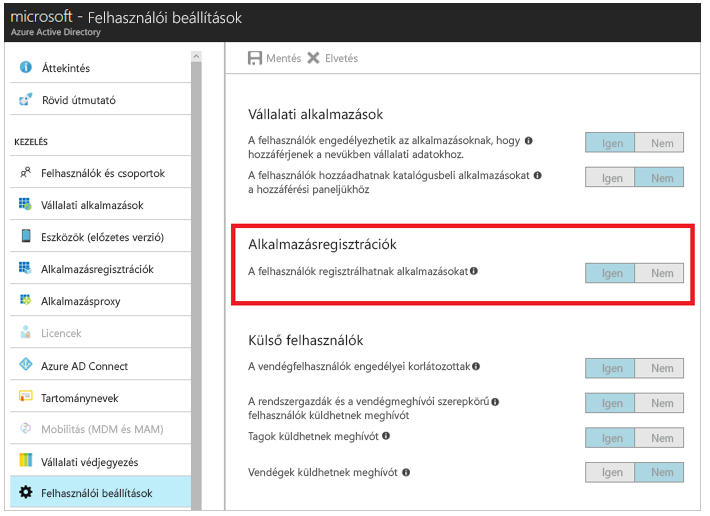
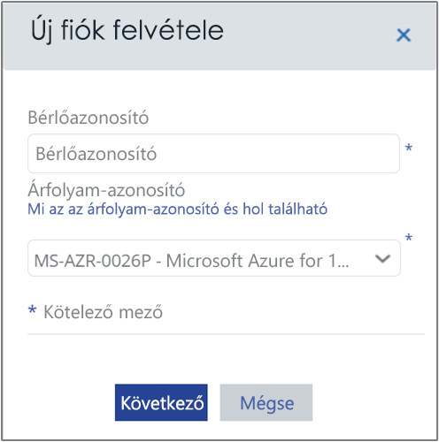
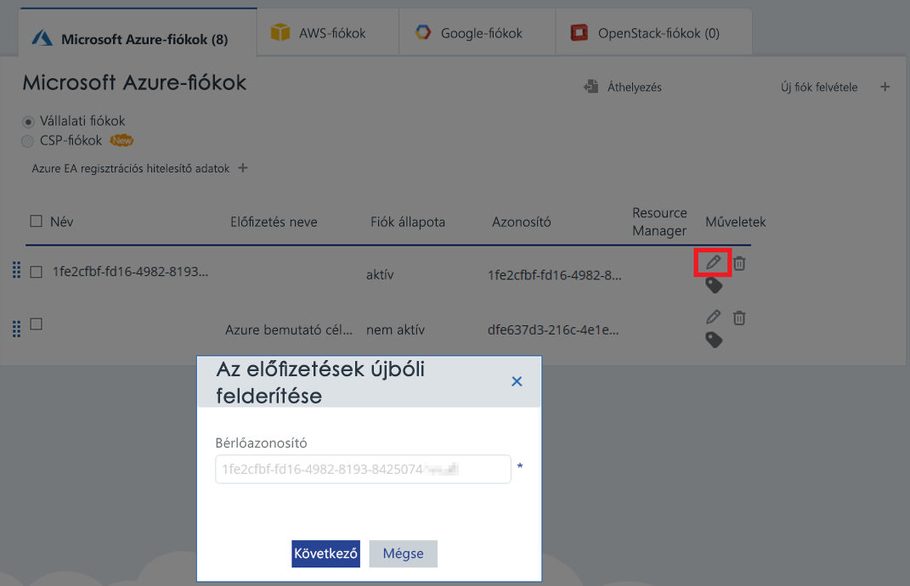

# <a name="activate-azure-subscriptions-and-accounts-with-azure-cost-management"></a>Azure-előfizetések és -fiókok aktiválása az Azure Cost Managementtel

Az Azure Resource Manager hitelesítő adatainak hozzáadásával vagy frissítésével az Azure Cost Management az Ön Azure-bérlőjén található összes fiókot és előfizetést megtekintheti. Ha engedélyezte az Azure Diagnostics bővítményt a virtuális gépein, az Azure Cost Management kiterjesztett metrikákat, például CPU- és memóriaadatokat gyűjthet. Ez a cikk azt ismerteti, hogy hogyan engedélyezheti az Azure Resource Manager API-kkal való hozzáférést az új és meglévő fiókok számára. Emellett a gyakori fiókproblémák megoldásához is útmutatást nyújt.

Az Azure Cost Management nem fér hozzá a legtöbb Azure-előfizetési adathoz, ha az előfizetés _inaktiválva van_. Ha azt szeretné, hogy az Azure Cost Management hozzáférjen a fiókokhoz, szerkesztenie kell az _inaktivált_ fiókokat.

## <a name="required-azure-permissions"></a>Szükséges Azure-engedélyek

A cikkben található műveletekhez konkrét engedélyekre van szükség. Önnek vagy a bérlői rendszergazdának mindkét alábbi engedéllyel rendelkeznie kell:

- Engedély a CloudynCollector alkalmazás az Azure AD-bérlővel történő regisztrációjához.
- Az alkalmazás egy Azure-előfizetésbeli szerepkörhöz való hozzárendelésének jogosultsága.

Az Azure-előfizetéseihez tartozó fiókjainak `Microsoft.Authorization/*/Write` hozzáféréssel kell rendelkezniük a CloudynCollector alkalmazás hozzárendeléséhez. Ezt a műveletet a [Tulajdonos](../role-based-access-control/built-in-roles.md#owner) szerepkör vagy a [Felhasználói hozzáférés rendszergazdája](../role-based-access-control/built-in-roles.md#user-access-administrator) szerepkör végezheti el.

Ha az Ön fiókja **Közreműködő** szerepkörrel rendelkezik, nem rendelheti hozzá az alkalmazást. Ilyen esetekben a CloudynCollector alkalmazás az Azure-előfizetéshez való hozzárendelésekor egy hibaüzenet jelenik meg.

### <a name="check-azure-active-directory-permissions"></a>Azure Active Directory-engedélyek ellenőrzése

1. Jelentkezzen be az [Azure Portalra](https://portal.azure.com).
2. Az Azure Portalon válassza az **Azure Active Directory** lehetőséget.
3. Az Azure Active Directory területen válassza a **Felhasználói beállítások** lehetőséget.
4. Ellenőrizze az **Alkalmazásregisztrációk** beállítást.
    - Ha **Igen** értékre van állítva, akkor nem rendszergazdai felhasználók is regisztrálhatnak AD-alkalmazásokat. Ez a beállítás azt jelenti, hogy az Azure AD-bérlő bármely felhasználója regisztrálhat alkalmazásokat. Lépjen tovább a Szükséges Azure-előfizetés-engedélyekhez.  
    
    - Ha az **Alkalmazásregisztrációk** beállítás értéke **Nem**, akkor csak a bérlői rendszergazdák regisztrálhatnak Azure Active Directory-alkalmazásokat. A bérlői rendszergazdának kell regisztrálnia a CloudynCollector alkalmazást.


## <a name="add-an-account-or-update-a-subscription"></a>Fiók hozzáadása vagy előfizetés frissítése

Fiókok hozzáadásakor vagy előfizetések frissítésekor hozzáférést nyújt az Azure Cost Managementnek az Ön Azure-adataihoz.

### <a name="add-a-new-account-subscription"></a>Új fiók hozzáadása (előfizetés)

1. Az Azure Cost Management portálon kattintson a fogaskerék ikonra a jobb felső sarokban, és válassza a **Felhőbeli fiókok** lehetőséget.
2. Kattintson az **Új fiók hozzáadása** lehetőségre. Ekkor megjelenik az **Új fiók hozzáadása** mező. Adja meg a szükséges adatokat.  
    

### <a name="update-a-subscription"></a>Előfizetés frissítése

1. Ha frissíteni szeretne egy _inaktivált_ előfizetést, amely már létezik az Azure Cost Management Fiókkezelés területén, kattintson a szerkesztés ikonra a szülői _bérlő GUID azonosítója_ jobb oldalán. Az előfizetések egy szülői bérlő alatt vannak csoportosítva, ezért célszerű elkerülni az előfizetések külön-külön történő aktiválását.
    
2. Ha szükséges, adja meg a bérlő azonosítóját. Ha nem ismeri a bérlő azonosítóját, az alábbi lépésekkel kiderítheti:
    1. Jelentkezzen be az [Azure Portalra](https://portal.azure.com).
    2. Az Azure Portalon válassza az **Azure Active Directory** lehetőséget.
    3. A bérlőazonosító lekéréséhez válassza ki az Azure AD-bérlőjéhez tartozó **Tulajdonságok** elemet.
    4. Másolja ki a Címtár GUID azonosítóját. Ez az érték a bérlőazonosítója.
    További információ: [A bérlőazonosító beszerzése](../azure-resource-manager/resource-group-create-service-principal-portal.md#get-tenant-id).
3. Ha szükséges, válassza ki a díj azonosítóját. Ha nem ismeri a díj azonosítóját, az alábbi lépésekkel kiderítheti.
    1. Az Azure Portal jobb felső sarkában kattintson a felhasználói adataira, majd a **Számla megtekintése** lehetőségre.
    2. A **Számlázási fiók** területen kattintson az **Előfizetések** lehetőségre.
    3. A **Saját előfizetések** területen válassza ki az előfizetését.
    4. A díj azonosítója az **Ajánlat azonosítója** alatt található. Másolja ki az előfizetéshez tartozó ajánlat azonosítóját.
4. Az Új fiók hozzáadása (vagy az Előfizetés szerkesztése) mezőben kattintson a **Mentés** (vagy a **Tovább**) lehetőségre. A program átirányítja az Azure Portalra.
5. Jelentkezzen be az Portalra. Kattintson az **Elfogadás** lehetőségre, így engedélyezi az Azure Cost Management Collector számára, hogy hozzáférjen az Ön Azure-fiókjához.

    Program ekkor átirányítja az Azure Cost Management fiókkezelő oldalára, az előfizetését pedig **aktív** fiókállapotra frissíti. Ekkor egy zöld pipának kell megjelennie a Resource Manager oszlop alatt.

    Ha nem lát zöld pipát egy vagy több előfizetés esetében, akkor nincs engedélye létrehozni az olvasó alkalmazást (a CloudynCollectort) az előfizetésben. Ehhez egy magasabb jogosultsággal rendelkező felhasználónak kell megismételni a folyamat lépéseit.

Tekintse meg [Az Azure Resource Manager összekapcsolása az Azure Cost Managementtel](https://youtu.be/oCIwvfBB6kk) című videót, amely ismerteti a folyamat lépéseit.

>[!VIDEO https://www.youtube.com/embed/oCIwvfBB6kk?ecver=1]

## <a name="resolve-common-indirect-enterprise-set-up-problems"></a>Gyakori közvetlen vállalati beállítási problémák megoldása

Amikor először használja az Azure Cost Management portálját, a következő üzenetek jelenhetnek meg, ha Ön Nagyvállalati szerződést kötött, vagy egy felhőszolgáltató felhasználója:

- *A megadott API-kulcs nem felső szintű regisztrációs kulcs* üzenet jelenik meg az **Azure Cost Management** beállítási varázslójában.
- *Közvetlen regisztráció – Nem* üzenet jelenik meg a Nagyvállalati szerződés portálján.
- *Nem találhatók az elmúlt 30 napra vonatkozó használati adatok. Lépjen kapcsolatba a terjesztőjével, és ellenőrizze, hogy engedélyezve van-e a korrektúra az Ön Azure-fiókjában*, amely az Azure Cost Management portálján jelenik meg.

Az előző üzenetek arra utalnak, hogy egy viszonteladón vagy felhőszolgáltatón keresztül vásárolt Azure Nagyvállalati szerződést. A viszonteladónak vagy a felhőszolgáltatónak kell engedélyeznie a _korrektúrát_ az Ön Azure-fiókjában, mielőtt Ön megtekinthetné az adatait az Azure Cost Management szolgáltatásban.

A problémák megoldása:

1. A viszonteladónak engedélyeznie kell a _korrektúrát_ a fiókjában. Útmutatás: [Közvetett ügyfeleknek szóló előkészítési útmutató](https://ea.azure.com/api/v3Help/v2IndirectCustomerOnboardingGuide).
2. Létre kell hoznia egy kulcsot Azure Nagyvállalati Szerződésben, amelyet az Azure Cost Managementtel használhat. Útmutatás: [Azure Nagyvállalati Szerződés regisztrálása és a költségadatok megtekintése](https://docs.microsoft.com/azure/cost-management/quick-register-ea).

Az Azure Nagyvállalati Szerződés API-kulcsának létrehozása előtt engedélyeznie kell az Azure számlázási API-t. Ehhez itt találhat útmutatást:

- [Jelentéskészítő API-k Enterprise-ügyfeleknek – áttekintés](../billing/billing-enterprise-api.md)
- [Microsoft Azure Enterprise Portal jelentéskészítő API](https://ea.azure.com/helpdocs/reportingAPI) **Az adatok az API-hoz való hozzáférésének engedélyezése** területen

Előfordulhat, hogy a részlegek rendszergazdáinak, a fióktulajdonosoknak és a nagyvállalati rendszergazdáknak is engedélyt kell adnia a _díjak megtekintéséhez_ a számlázási API segítségével.

A Cost Management szolgáltatást csak egy Azure-szolgáltatásadminisztrátor engedélyezheti. A társadminisztrátori jogosultság ehhez nem elegendő. Az adminisztrátori jogosultságra vonatkozó követelmény azonban megkerülhető. Kérheti, hogy az Azure Active Directory adminisztrátora adjon Önnek jogosultságot a **CloudynAzureCollector** engedélyezéséhez egy PowerShell-szkripttel. Az alábbi szkript jogosultságot ad a **CloudynAzureCollector** Azure Active Directory-szolgáltatásnév regisztrálásához. Amennyiben sikeresen futtatja, a művelet befejeztével a böngészőben megjelenik a következő URL: http://localhost:8080/CloudynJava.

```
#THE SOFTWARE IS PROVIDED "AS IS", WITHOUT WARRANTY OF ANY KIND, EXPRESS OR IMPLIED, INCLUDING BUT NOT LIMITED TO THE WARRANTIES OF MERCHANTABILITY, FITNESS FOR A PARTICULAR PURPOSE AND NONINFRINGEMENT. IN NO EVENT SHALL THE AUTHORS OR COPYRIGHT HOLDERS BE LIABLE FOR ANY CLAIM, DAMAGES OR OTHER LIABILITY, WHETHER IN AN ACTION OF CONTRACT, TORT OR OTHERWISE, ARISING FROM, OUT OF OR IN CONNECTION WITH THE SOFTWARE OR THE USE OR OTHER DEALINGS IN THE SOFTWARE.

#Tenant - enter your tenant ID or Name
$tenant = "<ReplaceWithYourTenantID>"

#Cloudyn Collector application ID
$appId = "83e638ef-7885-479f-bbe8-9150acccdb3d"

#URL to activate the consent screen
$url = "https://login.windows.net/"+$tenant+"/oauth2/authorize?api-version=1&response_type=code&client_id="+$appId+"&redirect_uri=http%3A%2F%2Flocalhost%3A8080%2FCloudynJava&prompt=consent"

#Choose your browser, the default is Internet Explorer

#Chrome
#[System.Diagnostics.Process]::Start("chrome.exe", "--incognito $url")

#Firefox
#[System.Diagnostics.Process]::Start("firefox.exe","-private-window $url" )

#IExplorer
[System.Diagnostics.Process]::Start("iexplore.exe","$url -private" )

```

## <a name="next-steps"></a>További lépések

- Ha még nem végezte el a Cost Management első oktatóanyagát, itt megtekintheti: [Használat és költségek áttekintése](tutorial-review-usage.md).
