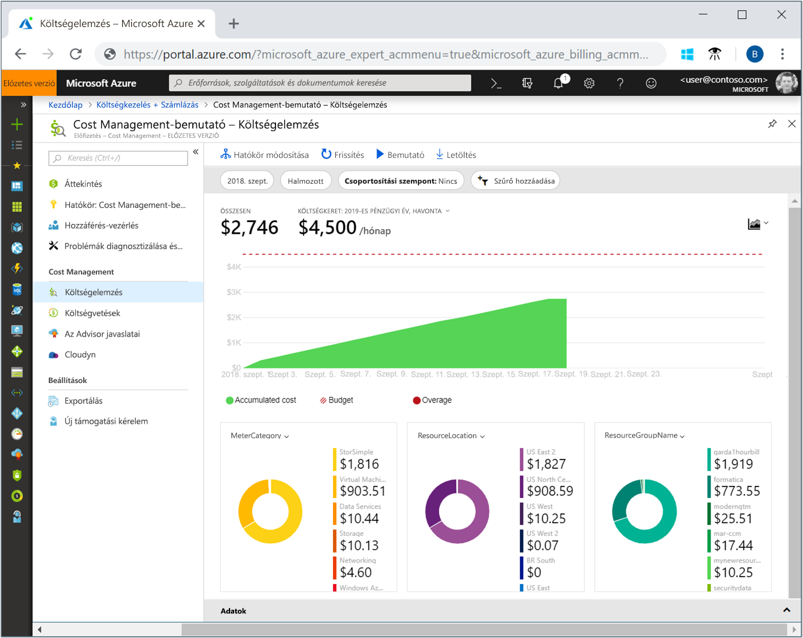
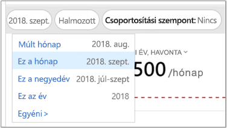
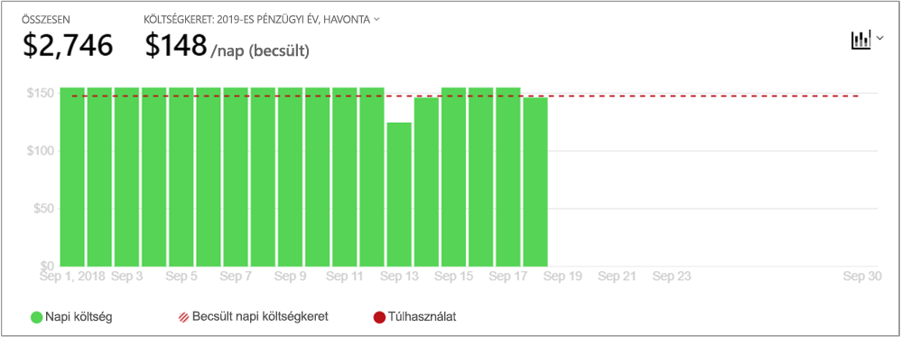
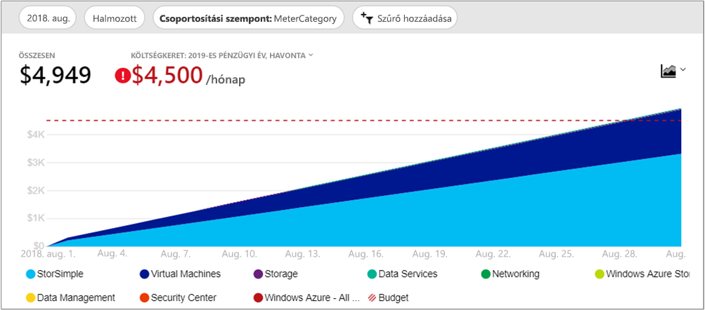
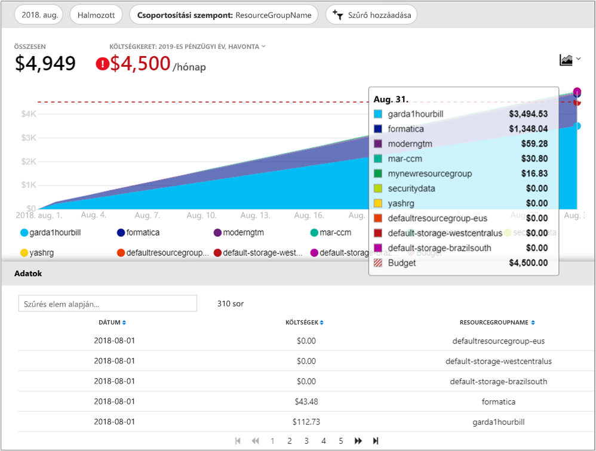

# Gyors útmutató: Vizsgálata és elemzése a költségeket a költségelemzés

Ahhoz, hogy érdemben szabályozhassa és optimalizálhassa Azure-költségeit, fontos, hogy tudja a vállalaton belül hol keletkeznek ezek a költségek. Emellett nem árt, ha tudja, mennyibe kerülnek az egyes szolgáltatások, és milyen környezeteket vagy rendszereket szolgálnak ki. A költségek teljes spektrumának ismerete elengedhetetlen a szervezet kiadásaiban fellépő mintázatok pontos megértéséhez. A kiadásoknál fellépő mintázatok segítségével költségszabályozó mechanizmusok, például költségkeretek léptethetők érvénybe.

Ebben a rövid útmutatóban költségelemzés használatával megvizsgálja és elemzi a szervezet költségeit. Az összesített költségeket szervezetekre lebontva jelenítheti meg, így jobban átláthatja, hogy az idő múlásával mely területeken keletkeznek költségei és felismerheti a kiadások trendjeit. Megtekintheti az egy adott időszak során felhalmozott költségeket is, így havi, negyedéves vagy akár éves költségtrendbecsléseket is készíthet a költségvetéshez viszonyítva. Költségvetés használatával könnyebb betartani a pénzügyi korlátozásokat. Ezen felül a költségvetés segít áttekinteni napi vagy havi szintű költségeit és elkülöníteni a rendhagyó kiadásokat. Az adatokat le is töltheti további elemzés vagy külső rendszerben való használat céljából.

Ezen rövid útmutató segítségével megtanulhatja a következőket:

- Költségek áttekintése a Költségelemzés használatával
- Költségnézetek testreszabása
- Költségelemzési adatok letöltése

## Előfeltételek

Költségelemzés többféle típusú Azure-fiók támogat. A támogatott típusok teljes listáját, tekintse meg [megismerheti a Cost Management adataihoz](understand-cost-mgt-data.md). Költségadatok megtekintése, szükség van legalább olvasási hozzáféréssel az Azure-fiókjával.

A [nagyvállalati szerződés (EA)](https://azure.microsoft.com/pricing/enterprise-agreement/) ügyfelek, rendelkeznie kell legalább olvasási hozzáférést egy vagy több, a költségadatok megtekintéséhez a következő hatókörök.

- Számlázási fiók
- Részleg
- Regisztrációs fiók
- Felügyeleti csoport
- Előfizetés
- Erőforráscsoport

További információ a Cost Management adataihoz való hozzáférés hozzárendelése: [adatokhoz való hozzáférés hozzárendelése](assign-access-acm-data.md).

## Bejelentkezés az Azure-ba

- Jelentkezzen be az Azure Portalra a https://portal.azure.com webhelyen.

## Költségek áttekintése a Költségelemzés használatával

Tekintse át a költségeket, a költségek elemzése az Azure Portalon lépjen **Költségkezelés + számlázás** &gt; **költségelemzés**. Válassza ki **hatókör: _ScopeName_** hatókört válassza, majd kattintson a **kiválasztása**.

A választott hatókör az adatkonszolidációt és a költségadatokhoz való hozzáférés szabályozását határozza meg a Költségkezelés során. A hatókörök használata során nem lehet egyszerre több hatókört is kiválasztani. Ehelyett válassza ki, amely akár mások állítja, és majd, szűrő válassza ki, hogy milyen nagyobb hatókör. Ez azért fontos tudni, mert vannak, akik annak egy szülőhatóköréhez gyermek hatókörök akár összegző nem rendelkezik hozzáféréssel.

Kattintson a **Költségelemzés megnyitása** lehetőségre.

A kezdő költségelemzési nézet a következő területeket foglalja magába:

**Összesen** – Az aktuális hónap összes költségét jeleníti meg.

**Költségkeret** – A kijelölt hatókör tervezett költségkeretét jeleníti meg, amennyiben az elérhető.

**Halmozott költség** – Megjeleníti az összes összegyűlt napi kiadást a hónap kezdetétől számítva. Miután számlázási fiókjához vagy előfizetéséhez [létrehozta költségvetését](tutorial-acm-create-budgets.md), itt gyorsan, költségkeretéhez viszonyítottan áttekintheti kiadási trendjeit. A kurzort egy adott dátum felé helyezve megtekintheti az adott nap halmozott költségeit.

**Kimutatásdiagramok (fánkdiagramok)** – Dinamikus kimutatásokat tesznek lehetővé a teljes költséget alapvető jellemzők alapján lebontva. Az adott hónap költségeit jelenítik meg a legmagasabb halmozott költségtől a legalacsonyabb felé. A kimutatásdiagramokat bármikor módosíthatja másik kimutatás kiválasztásával. A költségek alapértelmezetten a következő kategóriákba vannak sorolva: szolgáltatás (fogyasztásmérő kategória), hely (régió), valamint gyermekhatókör. Például a regisztrációs fiókok a számlázási fiókok alatt, az erőforráscsoportok az előfizetések alatt, az erőforrások, pedig az erőforráscsoportok alatt jelennek meg.

## Költségnézetek testreszabása

Az alapértelmezett nézet gyors választ adhat az olyan gyakori kérdésekre, mint:

- Mennyit költöttem összesen?
- Belül maradok-e a költségkeretemen?

Azonban sok esetben ennél mélyebb elemzésre is szükség lehet. A testreszabást az oldal tetején a dátum kiválasztásánál kezdhetjük.

Alapértelmezetten a költségelemzés az aktuális hónap adatait jeleníti meg. A választómező segítségével gyorsan átválthat az előző hónap, az aktuális hónap, az aktuális negyedév, az aktuális év, vagy egy egyénileg választott dátumtartomány adatainak megjelenítésére. A előző hónap lehetőség választásával könnyedén kielemezheti legfrissebb Azure-számláját és egyeztetheti kiadásait. Az aktuális negyedév és aktuális év lehetőségek segítenek költségeit nyomon követni a hosszabb távú költségvetések viszonyában is. Egyedi dátumtartományt is megadhat. Kiválaszthat például egyetlen napot, az elmúlt hét napot, vagy bármilyen időtartamot az aktuális hónaptól számítva egy évre visszamenőleg.

A költségelemzés alapértelmezetten a **Halmozott** költségeket jeleníti meg. A halmozott költségek az egyes napok költségét, valamint a megelőző napok költségeit foglalják magukba, tehát a napi költségek folyamatos halmozódásának nyomon követésére szolgálnak. A nézetet arra optimalizáltuk, hogy megvizsgálhassa, hogyan alakulnak költségei az adott időszakban a tervezett költségvetéshez képest.

Emellett a **napi** nézet használatával az egyes napok költségeit is megtekintheti. A napi nézet nem jeleníti meg a növekedési trendeket. A nézet célja a szabálytalanságok, vagyis a kiugróan magas vagy alacsony értékek megjelenítése a napról napra jelentkező költségekben. Ha költségvetést is kiválasztott, a napi nézet egy becslést is megjelenít az egy napra vonatkozó költségkeretet illetően. Ha a napi költségei következetesen meghaladják a becsült napi költségkeretet, várhatóan havi költségkeretét is túl fogja lépni. A becsült napi költségkeret egy olyan eszköz, amellyel könnyebben megjelenítheti költségvetése alacsonyabb szintjeit. Ha napi költségei ingadozóak, a becsült napi költségkeret viszonya a havi költségkeretével kevésbé lesz pontos.

Általában a is látja a keresett adatok vagy a felhasznált erőforrások értesítések nyolc órán belül.

A **Csoportosítás** használatával csoportkategóriák közül választhat, és módosítja, mely adatok jelenjenek meg a felső összes költség terület diagramjában. A csoportosítás megfigyelhessük, hogyan költségeit kategorizálta gyakori erőforrás- és használati tulajdonságai, például az erőforráscsoport vagy erőforrás-címkék teszi lehetővé. Címkék szerint kell csoportosítani, válassza ki a címke kulcs szerint kell csoportosítani szeretné. Láthatja, hogy minden értékét az erőforrások, amelyek nem rendelkeznek a alkalmazni a címkét egy extra szegmens, amely a címke szerinti bontásban költségeket.

A legtöbb [Azure-erőforrások támogatja a címkézést](../azure-resource-manager/tag-support.md), azonban az egyes címkék nem Költségkezelés szerepel a számlázási. Ezenkívül a csoport az erőforráscímkék nem támogatottak. A Cost Management csak a dátum, a címkék közvetlenül az erőforrás érvényesek az erőforráscímkék támogatja.

Íme egy példa az elmúlt havi Azure-szolgáltatási költségeket bemutató nézetről.

Kimutatásdiagramok a fő diagram megjelenítése különböző csoportosítások, amelyek egy szélesebb körű képet az általános költségek a kijelölt időszak és a szűrők alapján. Válasszon egy tulajdonságot vagy címke minden dimenzió összesített költségeit megtekintésére.

Az előző képen az erőforráscsoportok nevei olvashatóak. Címke megtekintéséhez a teljes költség / címke szerint csoportosíthatja, amíg nem érhető el cost analysis nézetek megtekintése az erőforrás vagy erőforráscsoport összes címkéjét.

Ha a költségeket egy adott attribútum szerint csoportosítja, csökkenő sorrendben megjelenik a tíz legfontosabb költségelem. Ha több mint tíz csoportok, a felső kilenc közreműködőkkel jelennek meg. Van is látható, mint egy **mások** csoport, amely magában foglalja az összes többi csoport együtt. Csoportosítás címkék szerint, amikor is megjelenhetnek egy **Untagged** csoport tagjai, amelyek nem rendelkeznek a alkalmazni címkekulcs költségeket. **Címkézetlen** mindig utolsó, akkor is, ha nincsenek további címkézetlen költségek, mint a címkézett költségek. Ha tíz vagy több címke értékek, a címkézetlen költségek része lesz **mások**.

*Klasszikus* (az Azure Service Management vagy ASM) virtuális gép, hálózati és tárolási erőforrások nem adjuk ki a részletes számlázási adatok. Ezek van egyesítve **klasszikus szolgáltatások** Ha csoportosítási költségeket.

A teljes adatkészlet minden nézet megtekintéséhez. Bármelyik beállításokat vagy a alkalmazni szűrők hatással a megjelenített adatokhoz. A teljes adatkészlet megtekintéséhez kattintson a **diagramtípus** listából, majd kattintson **tábla** megtekintése.

## Költségelemzési adatok letöltése

A költségelemzés adatait **letöltheti** és az Azure Portalon jelenleg látható összes adatból egy CSV-fájlt generálhat. Az alkalmazott csoportosítások és szűrők a fájlban is szerepelni fognak. A fájlban az összes költség diagram olyan mögöttes adatai is szerepelni fognak, amelyek az aktív nézetben nem láthatóak.

## További lépések

Lépjen tovább az első oktatóanyaghoz, amely a költségvetés létrehozását és kezelését mutatja be.

> [!div class="nextstepaction"]
> [Költségvetések létrehozása és kezelése](tutorial-acm-create-budgets.md)
