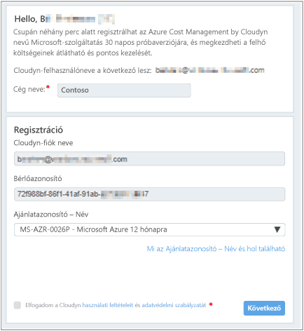
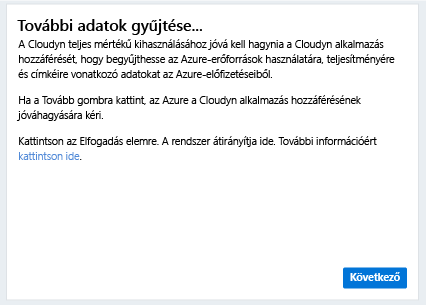
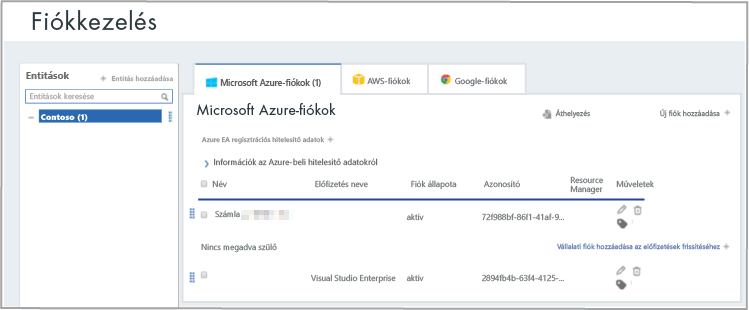

# Egyéni Azure-előfizetés regisztrálása és a költségadatok megtekintése

Az Azure-előfizetésével regisztrálhat az Azure Cost Managementbe. A regisztráció hozzáférést biztosít a Cloudyn portálhoz. Ez a rövid útmutató részletesen ismerteti a Cloudyn próbaverziójára szóló előfizetés létrehozásához és a Cloudyn-portálra való bejelentkezéshez szükséges folyamatot. Azt is bemutatja, hogyan tekintheti meg azonnal a költségadatokat.

## Jelentkezzen be az Azure-ba

- Jelentkezzen be az Azure Portalra a http://portal.azure.com címen.

## Regisztrálás az Azure Cost Managementbe

1. Az Azure Portalon kattintson a **Költségkezelés + Számlázás** elemre a szolgáltatások listáján.
2. Az **Overview** (Áttekintés) területen kattintson a **Költségkezelés** elemre.  
    
3. A **Költségkezelés** oldalon kattintson a **Go to Cost Management** (Ugrás a költségkezeléshez) elemre a Cloudyn regisztrációs oldalának új ablakban való megnyitásához.
4. A Cloudyn portálon a próbaverzióra való regisztrációhoz írja be a vállalata nevét, majd válassza az **Azure Individual Subscription Owner** (Egyéni Azure-előfizetés tulajdonosa) lehetőségre, és kattintson a **Next** (Tovább) gombra. A fiókneve és a bérlőazonosító automatikusan rákerül az űrlapra.  
    
5. Válassza ki az előfizetéséhez kapcsolódó **Offer ID - Name** (Ajánlatazonosító – Név) elemet. Ha nem biztos abban, milyen díjazonosító tartozik az előfizetéséhez, nézzen meg egy Azure-számlát, és keresse meg rajta az **ajánlatazonosítót**.
6. Fogadja el a használati feltételeket, majd ellenőrizze az adatokat, és kattintson a **Next** (Tovább) gombra.
7. A **Gather additional data** (További adatok gyűjtése) oldalon kattintson a **Next** (Tovább) gombra. Ezzel felhatalmazza fel a Cloudynt az Azure-erőforrásadatok gyűjtésére. A gyűjtött adatok az előfizetéseire vonatkozó használati, teljesítmény-, elszámolási és címkeadatokból állnak.  
    
8. A böngészőjében megnyílik a Cloudyn bejelentkezési oldala. Jelentkezzen be az Azure-előfizetése hitelesítő adataival.
9. A **Go to Cloudyn** (Ugrás a Cloudynre) elemre kattintva nyissa meg a Cloudyn portált, ahol az **Accounts Management** (Fiókok kezelése) oldalon látnia kell az Azure-előfizetés fiókjának adatait.  
    

Oktatóvideó az Azure-előfizetés regisztrációjáról: [A címtárbeli GUID és a díjazonosító megkeresése az Azure Cost Managementben való használathoz](https://youtu.be/PaRjnyaNGMI).

[!INCLUDE [cost-management-create-account-view-data](../../includes/cost-management-create-account-view-data.md)]

## További lépések

Ebben a rövid útmutatóban az Azure-előfizetése adatait használta arra, hogy regisztráljon a Cost Management szolgáltatásra. A Cloudyn portálra is bejelentkezett, és elkezdte a költségadatok áttekintését. Ha bővebb információra van szüksége az Azure Cost Managementről, lépjen tovább a Cost Management oktatóanyagára.

> [!div class="nextstepaction"]
> [A használat és a költségek áttekintése](./tutorial-review-usage.md)
