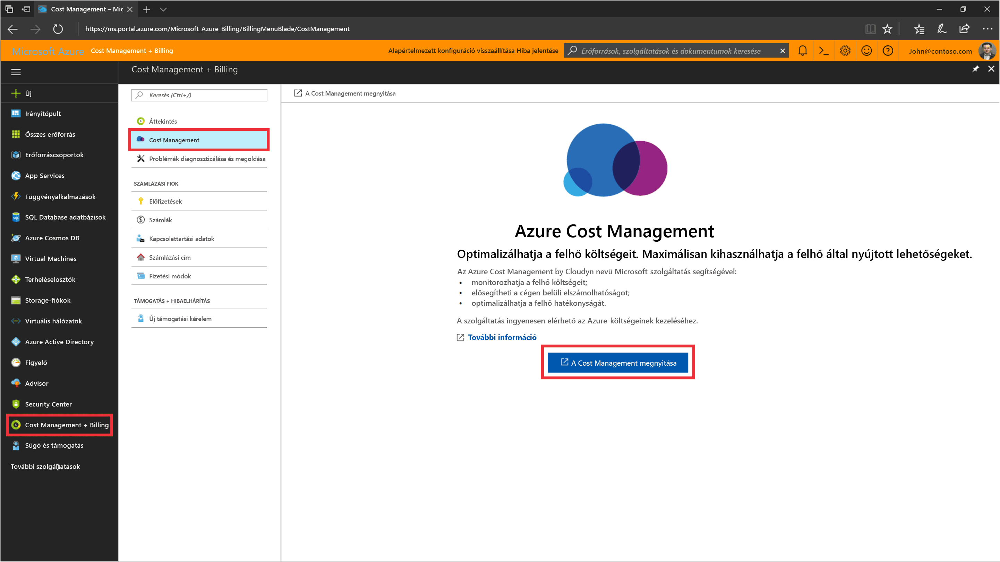
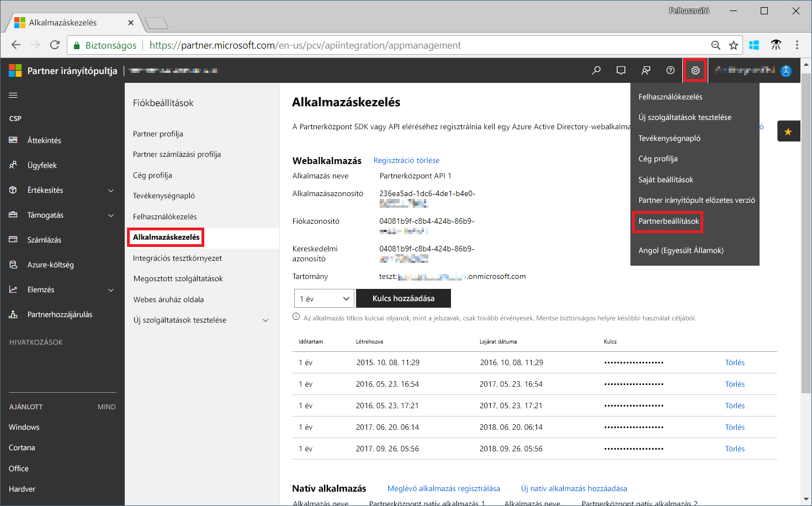
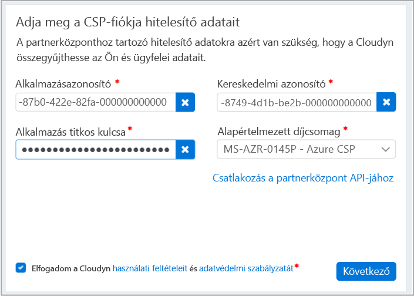

# Regisztrálás a CSP partnerprogrammal és a költségadatok megtekintése

CSP-partnerként regisztrálhat az Azure Cost Managementbe. A regisztráció hozzáférést biztosít a Cloudyn portálhoz. Ez a rövid útmutató részletesen ismerteti a Cloudyn próbaverziójára szóló előfizetés létrehozásához és a Cloudyn-portálra való bejelentkezéshez szükséges folyamatot. Azt is bemutatja, hogyan tekintheti meg azonnal a költségadatokat.

>[!NOTE]

>A Cloudyn-regisztráció csak közvetlen CSP-partnerek vagy közvetett CSP-szolgáltatók számára érhető el.
>
>Konfigurálni kell a Partner Center API-t a hitelesítéshez és az adatok eléréséhez. Az API-hozzáférés létrehozásához szükség van egy globális rendszergazdai fiókra a partnerközpontban.
További információkért lásd [a Partner Center API-hoz való csatlakozással](https://msdn.microsoft.com/library/partnercenter/mt709136.aspx) foglalkozó témakört.
>
>A Cloudynhez a közvetett CSP-viszonteladók is hozzáférhetnek, ha közvetett CSP-szolgáltatójuk regisztrál a Cloudynre. Ezután a közvetett CSP-viszonteladók és biztosíthatnak Cloudyn-hozzáférést Azure-ügyfeleknek és -előfizetésekhez.

## Bejelentkezés az Azure-ba

- Jelentkezzen be az Azure Portalra a http://portal.azure.com webhelyen.

## Regisztrálás az Azure Cost Managementbe

1. Az Azure Portalon kattintson a **Költségkezelés + Számlázás** elemre a szolgáltatások listáján.
2. Az **Overview** (Áttekintés) területen kattintson a **Költségkezelés** elemre.  
    
3. A **Költségkezelés** oldalon kattintson a **Go to Cost Management** (Ugrás a költségkezeléshez) elemre a Cloudyn regisztrációs oldalának új ablakban való megnyitásához.
4. A Cloudyn portálon a próbaverzióra való regisztrációhoz írja be a vállalata nevét, válassza a **Microsoft CSP Partner Program Administrator** (Microsoft CSP partnerprogram rendszergazdája) lehetőséget, majd kattintson a **Next** (Tovább) gombra.  
5. Adja meg az **alkalmazásazonosítót**, a **kereskedelmi azonosítót** és az **alkalmazás titkos kulcsát**, majd válassza a **Default Pricing Plan** (Alapértelmezett díjszabás) lehetőséget. Ha nincsenek kéznél ezek az információk, jelentkezzen be a Partnerközpontba a [https://partnercenter.microsoft.com](https://partnercenter.microsoft.com) webhelyen az elsődleges rendszergazdai fiókjával, és kövesse az alábbi lépéseket:
  1. Lépjen az **Irányítópult** > **Fiókbeállítások** > **Alkalmazáskezelés** elemhez.
  2. Ha rendelkezik egy korábban létrehozott webalkalmazással, hagyja ki ezt a lépést. Ha nem, kattintson a **Webalkalmazás** szakasz **Új webalkalmazás hozzáadása** elemére.
  3. Másolja ki az **Alkalmazásazonosító** GUID azonosítót a webalkalmazásból.
  4. Másolja ki a **Kereskedelmi azonosító** GUID azonosítót a webalkalmazásból.
  5. Jelölje meg, hogy egy vagy két év legyen-e a kulcs érvényességi időtartama. Válassza a **Kulcs hozzáadása** elemet, majd másolja ki és mentse el a titkos kulcs értékét.  
    
  6. Térjen vissza a regisztrációs oldalhoz, és illessze be az adatokat.  
      
6. Fogadja el a használati feltételeket, majd ellenőrizze az adatokat. A **Next** (Tovább) gombra kattintva adjon engedélyt a Cloudynnek az Azure-erőforrásadatok gyűjtésére. A gyűjtött adatok az előfizetéseire vonatkozó használati, teljesítmény-, elszámolási és címkeadatokból állnak.  
7. Az **Invite other stakeholders** (További érdekelt felek meghívása) területen hozzáadhat felhasználókat az e-mail-címük megadásával. Ha kész van, kattintson a **Next** (Tovább) gombra. Körülbelül két órát vesz igénybe, míg a rendszer az összes elszámolási adatot hozzáadja a Cloudynhez.
8. A **Go to Cloudyn** (Ugrás a Cloudynre) elemre kattintva nyissa meg a Cloudyn portált, ahol a **Cloud Accounts Management** (Felhőalapú fiókok felügyelete) oldalon látnia kell a regisztrált CSP-fiók adatait.

## Közvetett CSP-hozzáférés konfigurálása a Cloudynben

Alapértelmezés szerint a Partner Center API csak közvetlen CSP-k számára érhető el. Egy közvetlen CSP-szolgáltató azonban konfigurálhat hozzáférést közvetett CSP-ügyfeleinek vagy -partnereinek a Cloudyn entitáscsoportjainak segítségével.

Ha hozzáférést szeretne biztosítani a közvetett CSP-ügyfeleknek vagy -partnereknek, a [Regisztrálás a próbaverzióra](#create-a-trial-registration) szakasz lépéseit követve hozzon létre egy regisztrációt a próbaverzióra. Ezután a következő lépéseket végrehajtva szegmentálja a közvetett CSP-adatokat a Cloudyn entitáscsoportjaival. Végül rendelje hozzá az entitáscsoportokhoz a megfelelő felhasználói engedélyeket.

1. Hozzon létre egy entitáscsoportot az [entitások létrehozásával](tutorial-user-access.md#create-and-manage-entities) foglalkozó szakaszban található információk alapján.
2. Kövesse az [előfizetések költségentitásokhoz való hozzárendelésével](https://support.cloudyn.com/hc/en-us/articles/115005139425-Video-Assigning-subscriptions-to-Cost-Entities) foglalkozó videóban ismertetett lépéseket. Társítsa a közvetett CSP-ügyfél fiókját és Azure-előfizetéseit az előzőleg létrehozott entitáshoz.
3. A [rendszergazdai hozzáféréssel rendelkező felhasználó létrehozását](tutorial-user-access.md#create-a-user-with-admin-access) ismertető szakasz lépéseit követve hozzon létre egy felhasználói fiókot rendszergazdai hozzáféréssel. Ezután győződjön meg arról, hogy a felhasználói fiók valóban rendelkezik rendszergazdai hozzáféréssel a közvetett fiókhoz korábban létrehozott entitásokhoz.

A közvetett CSP-partnerek bejelentkezhetnek a Cloudyn portálra a számukra létrehozott fiókok segítségével.

[!INCLUDE [cost-management-create-account-view-data](../../includes/cost-management-create-account-view-data.md)]

## További lépések

Ebben a rövid útmutatóban a CSP-adatokat használta arra, hogy regisztráljon a Cost Management szolgáltatásra. A Cloudyn portálra is bejelentkezett, és elkezdte a költségadatok áttekintését. Ha bővebb információra van szüksége az Azure Cost Managementről, lépjen tovább a Cost Management oktatóanyagára.

> [!div class="nextstepaction"]
> [A használat és a költségek áttekintése](./tutorial-review-usage.md)
