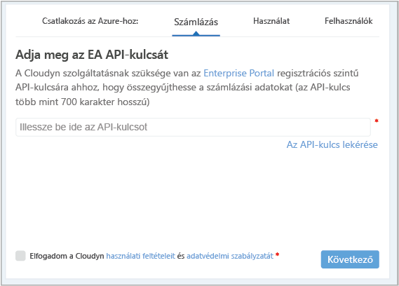
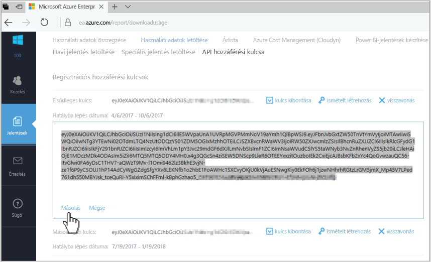
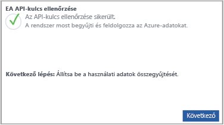

# Egy Azure nagyvállalati szerződéssel és adatok megtekintése

Az Azure nagyvállalati szerződéssel segítségével regisztrálja az Azure költség Management Cloudyn a. A regisztrációt a Cloudyn portal hozzáférést biztosít. A gyors üzembe helyezés részletek a regisztrációs folyamat szükséges a Cloudyn próba-előfizetés létrehozása, és jelentkezzen be a Cloudyn portálra. Azt is bemutatja, hogyan költség adatok azonnal megtekintéséhez.

## Jelentkezzen be az Azure-ba

- Jelentkezzen be az Azure Portalra a http://portal.azure.com webhelyen.

## Hozzon létre egy próbaregisztráció.

1. Az Azure portálon kattintson **költség felügyeleti + számlázási** a szolgáltatások listájában.
2. A **áttekintése**, kattintson a **költség kezelése**  
    
3. Az a **költség felügyeleti** lapon **költség felügyeleti Ugrás** Cloudyn regisztrációs lapjának megnyitásához egy új ablakban.
4. A Cloudyn portál próbaregisztráció oldalon adja meg a vállalat nevét, és válassza ki **Azure vállalati beléptetési rendszergazdai**.  
    
5. Adja meg a vállalati portál tanúsítványigénylési API-kulcsot. Ha nincs kéznél a kulcsot, kattintson a [vállalati portál](https://ea.azure.com) hivatkozásra, és hajtsa végre a következő lépéseket:
  1. Jelentkezzen be az Azure vállalati webhelyre, és kattintson a **jelentések**, kattintson a **API-kulcs hozzáférési** , és másolja az elsődleges kulcsra.  
    
  3. Lépjen vissza a regisztrációs oldalra, és illessze be az API-kulcs.
6. Fogadja el a használati feltételeket, majd ellenőrizze a kulcs. Kattintson a **következő** engedélyezésére Cloudyn Azure-erőforrás adatainak gyűjtéséről. Összegyűjtött adatok használati, teljesítmény, számlázási és az előfizetések címke adatait tartalmazza.  
    
7. A **hívhat meg egyéb érintett felek**, írja be az e-mail-címét is hozzáadhat felhasználókat. Amikor végzett, kattintson **következő**. Az elszámolási adatok Cloudyn hozzáadják körülbelül két órát vesz igénybe.
8. Kattintson a **Cloudyn Ugrás** a Cloudyn portál megnyitása és a a **felhő fiókok kezelése** lapon regisztrált EA fiókadatait kell megjelennie.

Útmutató videót regisztrálása a nagyvállalati szerződés, lásd: [található a EA regisztrációs azonosítója és API-kulcsot az Azure költség Management Cloudyn használható](https://youtu.be/u_phLs_udig).

[!INCLUDE [cost-management-create-account-view-data](../../includes/cost-management-create-account-view-data.md)]

## Következő lépések

A gyors üzembe helyezés, az Azure nagyvállalati szerződéssel adatainak való költség felügyeleti regisztrálásához használt. Ha is a Cloudyn portal be van jelentkezve és már elindította költség adatokat. További információt az Azure költség Management Cloudyn, továbbra is az oktatóanyag költség-kezelésre.

> [!div class="nextstepaction"]
> [Felülvizsgálati használati és költségek](./tutorial-review-usage.md)
