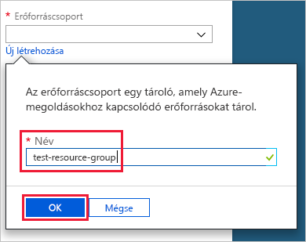
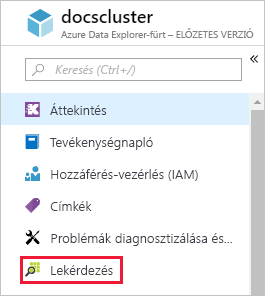

# Rövid útmutató: Azure Data Explorer-fürt és -adatbázis létrehozása

Az Azure Adatkezelő egy gyors és hatékonyan skálázható adatáttekintési szolgáltatás napló- és telemetriaadatokhoz. Az Azure Data Explorer használatához először egy *fürtöt* hozunk létre, majd egy vagy több *adatbázist* a fürtben. Ezután adatokat *töltünk be* az adatbázisba, hogy lekérdezéseket futtathassunk rajta. Ebben a rövid útmutatóban egy fürtöt és egy adatbázist hozunk létre. A következő cikkekben mutatjuk majd be az adatok betöltését.

Ha nem rendelkezik Azure-előfizetéssel, mindössze néhány perc alatt létrehozhat egy [ingyenes Azure-fiókot](https://azure.microsoft.com/free/) a virtuális gép létrehozásának megkezdése előtt.

## Jelentkezzen be az Azure Portalra

Jelentkezzen be az [Azure Portalra](https://portal.azure.com/).

## Fürt létrehozása

Egy Azure Data Explorer-fürtöt hozunk létre egy Azure-erőforráscsoportban, számítási és tárolási erőforrások egy meghatározott készletével egyetemben.

1. A portál bal felső sarkában válassza az **Erőforrás létrehozása** (+) gombot.

1. Keressen az *Azure Data Explorer* kifejezésre.

   

1. Az **Azure Data Explorer** területen, a képernyő alján válassza a **Létrehozás** elemet.

1. Adja meg a fürt egyedi nevét, válassza ki az előfizetést, és hozzon létre egy erőforráscsoportot *test-resource-group* néven.

    

1. Adja meg az alábbi adatokat az űrlapon.

   

    **Beállítás** | **Ajánlott érték** | **Mező leírása**
    |---|---|---|
    | Fürt neve | A fürt egyedi neve | Válasszon egy egyedi nevet a fürt azonosításához. Például: *mytestcluster*. A rendszer hozzáfűzi a *[régiónév].kusto.windows.net* tartománynevet a megadott fürtnévhez. A név csak kisbetűket és számokat tartalmazhat, és 3–22 karakter hosszúságú lehet.
    | Előfizetés | Az Ön előfizetése | Válassza ki a fürthöz használni kívánt Azure-előfizetést.|
    | Erőforráscsoport | *test-resource-group* | Hozzon létre egy új erőforráscsoportot. |
    | Hely | *USA nyugati régiója* | Ebben a rövid útmutatóban válassza az *USA nyugati régióját*. Éles üzemben az igényeinek leginkább megfelelő régiót válassza.
    | Számítási specifikációk | *D13_v2* | Ehhez az útmutatóhoz válassza a legalacsonyabb díjszabást. Éles üzemben az igényeinek leginkább megfelelő díjszabást válassza.
    | | |

1. A fürt üzembe helyezéséhez válassza a **Létrehozás** lehetőséget. Az üzembe helyezés általában nagyjából tíz percet vesz igénybe. Az eszköztáron válassza az **Értesítések** elemet az üzembehelyezési folyamat nyomon követéséhez.

    

1. Amikor a folyamat befejeződött, válassza az **Értesítések**, majd az **Erőforrás megnyitása** lehetőséget.

    

## Adatbázis létrehozása

Most már készen áll a folyamat második lépésének, az adatbázis létrehozásának végrehajtására.

1. Az **Áttekintés** lapon válassza az **Adatbázis létrehozása** lehetőséget.

    

1. Adja meg az alábbi adatokat az űrlapon.

    

    **Beállítás** | **Ajánlott érték** | **Mező leírása**
    |---|---|---|
    | Adatbázis neve | *TestDatabase* | Az adatbázis nevének egyedinek kell lennie a fürtön belül.
    | Megőrzési időszak | *3650* | Az az időtartam, ameddig az adatok garantáltan lekérdezhetők maradnak. Az időtartam az adatok betöltésének időpontjával kezdődik.
    | Gyorsítótárazási időszak | *31* | Az az időtartam, ameddig a gyakran lekérdezett adatok az SSD-tárolón vagy a RAM-ban maradnak elérhetők a hosszú távú tároló helyett.
    | | | |

1. Az adatbázis létrehozásához válassza a **Mentés** lehetőséget. Az adatbázis létrehozása általában kevesebb mint egy percet vesz igénybe. Amikor a folyamat befejeződött, a rendszer visszalép a fürt **Áttekintés** lapjára.

## Alapvető parancsok futtatása az adatbázison

Most, hogy rendelkezik egy fürttel és egy adatbázissal, lekérdezéseket és parancsokat futtathat. Az adatbázisban még nincsenek adatok, mindazonáltal már áttekinthető az eszközök működése.

1. A fürt alatt válassza a **Lekérdezés** lehetőséget.

    

1. Illessze be a következő parancsot a lekérdezési ablakba (`.show databases`), majd válassza a **Futtatás** lehetőséget.

    

    Az eredményhalmaz a **TestDatabase** találatot tartalmazza, amely az egyetlen adatbázis a fürtben.

1. Illessze be a következő parancsot a lekérdezési ablakba (`.show tables`), majd válassza ki ezt a parancsot az ablakban. Válassza a **Futtatás** lehetőséget.

    Ez a parancs egy üres eredményhalmazt ad vissza, mivel még nem rendelkezik táblákkal. A sorozat következő cikkében felveszünk egy táblát.

## A fürt leállítása és újraindítása

A fürtöt az üzleti igényektől függően bármikor leállíthatja és újraindíthatja.

1. A fürt leállításához válassza az **Áttekintés** oldalon a **Leállítás** lehetőséget.

    Ha a fürt leállt, az adatok nem kérdezhetők le, és új adatok sem tölthetők be.

1. A fürt újraindításához válassza az **Áttekintés** oldalon az **Indítás** lehetőséget.

    A fürt az újraindítást követően nagyjából tíz perc múlva lesz elérhető (a kezdeti üzembe helyezéshez hasonlóan). További időt vesz igénybe, mire az adatok a gyakori elérésű gyorsítótárba is betöltődnek.  

## Az erőforrások eltávolítása

Ha el szeretné végezni a többi rövid útmutatót és oktatóanyagot, őrizze meg a létrehozott erőforrásokat. Amennyiben a továbbiakban nincs rá szüksége, a költségek elkerülése érdekében törölje a **test-resource-group** erőforráscsoportot.

1. Az Azure Portalon válassza az **Erőforráscsoportok** lehetőséget a bal szélen, majd a létrehozott erőforráscsoport.  

    Ha a bal oldali menü össze van csukva, kattintson a  a kinyitásához.

   

1. A **test-resource-group** alatt válassza az **Erőforráscsoport törlése** elemet.

1. Az új ablakban írja be a törölni kívánt erőforráscsoport nevét (*test-resource-group*), majd válassza a **Törlés** lehetőséget.

## További lépések

> [!div class="nextstepaction"]
> [Rövid útmutató: Adatok betöltése az Event Hubsból az Azure Data Explorerbe](ingest-data-event-hub.md)

