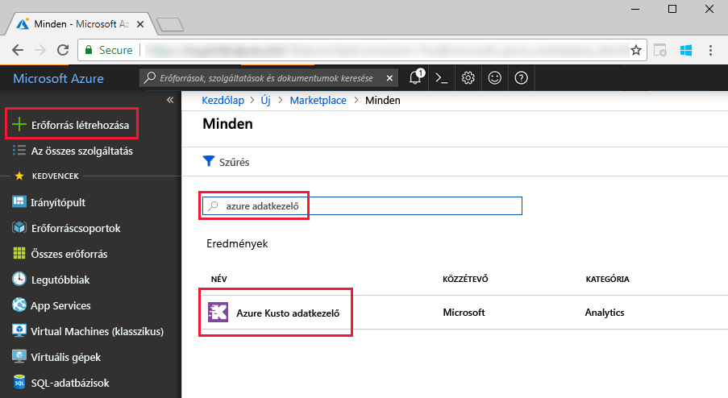
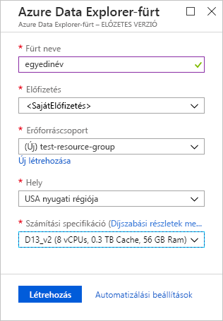
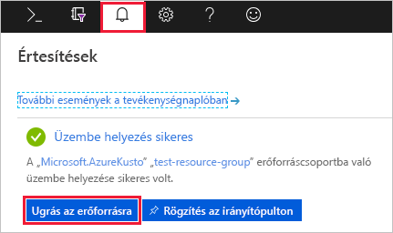
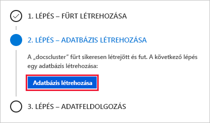
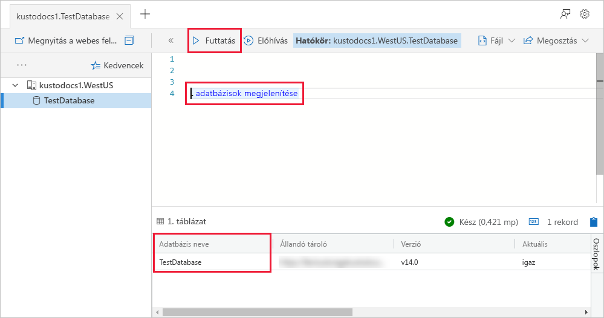

# Gyors útmutató: Az Azure Data Explorer fürt és adatbázis létrehozása

> [!div class="op_single_selector"]
> * [Portál](create-cluster-database-portal.md)
> * [Parancssori felület](create-cluster-database-cli.md)
> * [PowerShell](create-cluster-database-powershell.md)
> * [C#](create-cluster-database-csharp.md)
> * [Python](create-cluster-database-python.md)
>  

Az Azure Adatkezelő egy gyors és hatékonyan skálázható adatáttekintési szolgáltatás napló- és telemetriaadatokhoz. Az Azure Data Explorer használatához, először hozzon létre egy fürtöt, és az adott fürt egy vagy több adatbázis létrehozása. Ezután (betöltés) adatokat az adatbázisba fogadására, így vonatkozóan, lekérdezéseket futtathat. Ebben a rövid útmutatóban egy fürtöt és egy adatbázist hozunk létre.

Ha nem rendelkezik Azure-előfizetéssel, mindössze néhány perc alatt létrehozhat egy [ingyenes Azure-fiókot](https://azure.microsoft.com/free/) a virtuális gép létrehozásának megkezdése előtt.

## Jelentkezzen be az Azure Portalra

Jelentkezzen be az [Azure Portalra](https://portal.azure.com/).

## Fürt létrehozása

Egy Azure Data Explorer-fürt létrehozása az Azure-erőforráscsoport számítási és tárolási erőforrások egy meghatározott készletével együtt.

1. A portál bal felső sarkában válassza az **Erőforrás létrehozása** (+) gombot.

1. Keressen az *Azure Data Explorer* kifejezésre.

   

1. Az **Azure Data Explorer** területen, a képernyő alján válassza a **Létrehozás** elemet.

1. Töltse ki az alapszintű fürt részletes adatai a következő információkat.

   

    **Beállítás** | **Ajánlott érték** | **Mező leírása**
    |---|---|---|
    | Előfizetés | Az Ön előfizetése | Válassza ki a fürthöz használni kívánt Azure-előfizetést.|
    | Erőforráscsoport | *test-resource-group* | Használjon egy meglévő erőforráscsoportot, vagy hozzon létre egy új erőforráscsoportot. |
    | Fürt neve | A fürt egyedi neve | Válasszon egy egyedi nevet a fürt azonosításához. Ha például *mydataexplorercluster*. A rendszer hozzáfűzi a *[régiónév].kusto.windows.net* tartománynevet a megadott fürtnévhez. A név csak kisbetűket és számokat tartalmazhat, és 3–22 karakter hosszúságú lehet.
    | Hely | *USA nyugati régiója* | Ebben a rövid útmutatóban válassza az *USA nyugati régióját*. Éles üzemben az igényeinek leginkább megfelelő régiót válassza.
    | Számítási specifikációk | *D13_v2* | Ehhez az útmutatóhoz válassza a legalacsonyabb díjszabást. Éles üzemben az igényeinek leginkább megfelelő díjszabást válassza.
    | | |

1. Válassza ki **tekintse át + létrehozása** , tekintse át a fürt részletes adatai, és **létrehozás** a fürt kiépítéséhez. Kiosztása általában körülbelül 10 percet vesz igénybe.

1. Az üzembe helyezés befejeződése után válassza ki a **erőforrás megnyitása**.

    

## Adatbázis létrehozása

Most már készen áll a folyamat második lépésének, az adatbázis létrehozásának végrehajtására.

1. Az **Áttekintés** lapon válassza az **Adatbázis létrehozása** lehetőséget.

    

1. Adja meg az alábbi adatokat az űrlapon.

    

    **Beállítás** | **Ajánlott érték** | **Mező leírása**
    |---|---|---|
    | Adatbázis neve | *TestDatabase* | Az adatbázis nevének egyedinek kell lennie a fürtön belül.
    | Megőrzési időszak | *3650* | Az időtartam (napban), amelynek azt garantálja, hogy az adatok lekérdezhetők tárolódik. Az időtartam az adatok betöltésének időpontjával kezdődik.
    | Gyorsítótárazási időszak | *31* | Az idő span (napokban), amelynek meg szeretné tartani elérhető gyakran lekérdezett adatok SSD-tárolóval és a RAM, mint a hosszabb távú tárolására.
    | | | |

1. Válassza ki **létrehozás** az adatbázis létrehozásához. Az adatbázis létrehozása általában kevesebb mint egy percet vesz igénybe. Amikor a folyamat befejeződött, a rendszer visszalép a fürt **Áttekintés** lapjára.

## Alapvető parancsok futtatása az adatbázison

Most, hogy rendelkezik egy fürttel és egy adatbázissal, lekérdezéseket és parancsokat futtathat. Az adatbázisban még nincsenek adatok, mindazonáltal már áttekinthető az eszközök működése.

1. A fürt alatt válassza a **Lekérdezés** lehetőséget. Illessze be a parancsot `.show databases` a lekérdezési ablakba, majd válassza ki **futtatása**.

    

    Az eredményhalmaz a **TestDatabase** találatot tartalmazza, amely az egyetlen adatbázis a fürtben.

1. Illessze be a parancsot `.show tables` a lekérdezési ablakot, és válassza ki **futtatása**.

    Ez a parancs egy üres eredményhalmazt ad vissza, mivel még nem rendelkezik táblákkal. A sorozat következő cikkében felveszünk egy táblát.

## A fürt leállítása és újraindítása

A fürtöt az üzleti igényektől függően bármikor leállíthatja és újraindíthatja.

1. A fürt leállításához válassza az **Áttekintés** oldalon a **Leállítás** lehetőséget.

    Ha a fürt leállt, az adatok nem kérdezhetők le, és új adatok sem tölthetők be.

1. A fürt újraindításához válassza az **Áttekintés** oldalon az **Indítás** lehetőséget.

    A fürt újraindításakor, hogy válnak elérhetővé (például, ha eredetileg kiosztott) körülbelül 10 percet vesz igénybe. További időt vesz igénybe, mire az adatok a gyakori elérésű gyorsítótárba is betöltődnek.  

## Az erőforrások eltávolítása

Ha azt tervezi, kövesse a további rövid útmutatókkal és oktatóanyagokkal, megtarthatja a létrehozott erőforrásokat. Ellenkező esetben törölni az erőforráscsoportot, költségek elkerülése érdekében.

1. Az Azure Portalon válassza ki a **erőforráscsoportok** a bal oldali, és adja meg az erőforráscsoport, amely tartalmazza az adatkezelő fürt.  

1. Válassza ki **erőforráscsoport törlése** a teljes erőforráscsoportot törölni szeretné. Ha egy meglévő erőforráscsoportot használ, válassza ki az adatkezelő fürt csak törlése.

## További lépések

> [!div class="nextstepaction"]
> [Rövid útmutató: Betölteni az adatokat az Event Hubs az Azure Data Explorer](ingest-data-event-hub.md)

