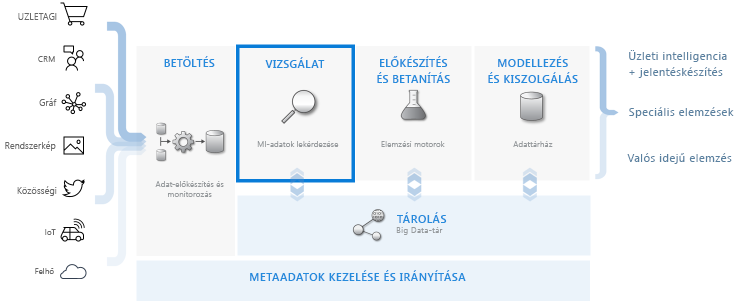
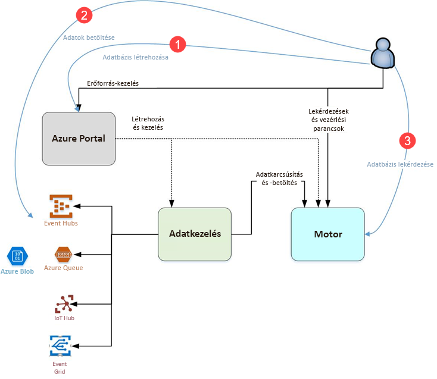

# Mi az az Azure Data Explorer?

Az Azure Adatkezelő egy gyors és hatékonyan skálázható adatáttekintési szolgáltatás napló- és telemetriaadatokhoz. Segít kezelni a modern szoftverek által kibocsátott számos adatfolyamot, hogy begyűjthesse, tárolhassa és elemezhesse az adatokat. Az Azure Adatkezelő ideális választás nagy mennyiségű, különböző forrásokból (például webhelyekről, alkalmazásokból, IoT-eszközökről stb.) származó adatok elemzéséhez. Ezek az adatok a diagnosztikához, a monitorozáshoz, a jelentéskészítéshez, a gépi tanuláshoz és a további elemzési funkciókhoz szükségesek. Az Azure Data Explorer lehetővé teszi, hogy ezek az adatok egyszerű, és lehetővé teszi, hogy komplex ad hoc lekérdezéseket az adatok másodpercek alatt.

## Mitől egyedi az Azure Data Explorer?

- Percek alatt több terabájtnyi adatra skálázható, ami lehetővé teszi az adatfeltárás gyors iterációit releváns megállapítások kinyeréséhez.

- Innovatív lekérdezési nyelvet kínál, amely nagy teljesítményű adatelemzésekre van optimalizálva.

- Támogatja nagy mennyiségű heterogén (strukturált és strukturálatlan) adat elemzését.

- Lehetővé teszi teljes mértékben a felhasználó igényeire szabott, más szolgáltatásokkal kombinált megoldások készítését és üzembe helyezését, így átfogó, hatékony és interaktív adatelemzési megoldást nyújt.

## Az adatraktározási munkafolyamat

Az Azure Data Explorer integrálható a főbb szolgáltatásokkal, így olyan teljes körű megoldást nyújt, amely magában foglalja az adatok gyűjtését, betöltését, tárolását, lekérdezését és megjelenítését. Kulcsszerepe van az adatraktározási folyamatban, mivel végrehajtja a **FELTÁRÁSI** lépést több terabájtnyi nyers adaton.

Az Azure Data Explorer számos betöltési módszert támogat, például az összekötőket, amelyek az Event Hubshoz hasonló gyakori szolgáltatásokra mutatnak, az SDK-kal, például a .NET-tel és a Pythonnal történő programozott betöltést, valamint a motorhoz való közvetlen hozzáférést feltárás céljából. Az Azure Data Explorer integrálható az elemzési és modellezési szolgáltatásokkal az adatok további elemzése és megjelenítése céljából.

## Azure Data Explorer-folyamat

Az alábbi diagram az Azure Data Explorerrel történő munkavégzés különböző területeit mutatja be.

Az Azure Data Explorerben történő munkavégzés általában a következő folyamatot követi:

1. **Hozzon létre adatbázist:** Hozzon létre egy *fürt* majd hozzon létre egy vagy több *adatbázisok* az adott fürtben található. [Rövid útmutató: Az Azure Data Explorer fürt és adatbázis létrehozása](create-cluster-database-portal.md)

1. **Gyűjthet adatokat:** Adatok betöltése az adatbázistáblák, hogy a védelemhez lekérdezéseket is futtathat. [Rövid útmutató: Betölteni az adatokat az Event Hubs az Azure Data Explorer](ingest-data-event-hub.md)

1. **Adatbázis lekérdezése:** Használja a webalkalmazás futtatásához, tekintse át, és megoszthatja a lekérdezések és az eredmények. A webalkalmazás elérhető az Azure Portalon és különálló alkalmazásként is. Ráadásul küldhet lekérdezéseket programozott módon (SDK használatával) vagy REST API-végpontra. [Rövid útmutató: Az Azure Data Explorer adatok lekérdezése](web-query-data.md)

## A lekérdezések használata

A lekérdezések az Azure Data Explorerben csak olvasható kérések az adatok feldolgozására és a feldolgozás eredményeinek visszaadására az adatok vagy metaadatok módosítása nélkül. Addig pontosíthatók a lekérdezések, amíg be nem fejeződik az elemzés. Az adatkezelő az Azure megkönnyíti a folyamat nagyon gyorsan alkalmi lekérdezést szerzett tapasztalat miatt.

Az Azure Data Explorer egyaránt jól kezel nagy mennyiségű strukturált, félig strukturált (JSON-szerű beágyazott típusú) és strukturálatlan (szabad szöveges) adatot. Lehetővé teszi adott szöveges kifejezések és adott események keresését, valamint metrikus számítások végrehajtását a strukturált adatokon. Az Azure Data Explorer a szabad formátumú szövegmezők futásidejű értékeinek kinyerésével áthidalja a strukturálatlan szövegnaplók és a strukturált számok és dimenziók világát. A gyors szövegindexelés, az oszloptár és az idősorozat-műveletek kombinálásával egyszerűbbé válik az adatfeltárás.

Az Azure Data Explorer a képességek kiterjeszthetők a hatékony lekérdezési nyelvet épülő más szolgáltatások többek között [naplózza az Azure Monitor](/azure/log-analytics/), [Application Insights](/azure/application-insights/), [Time Series Insights ](/azure/time-series-insights/), és [a Windows Defender komplex veszélyforrások elleni védelem](/windows/security/threat-protection/windows-defender-atp/windows-defender-advanced-threat-protection/).

## Visszajelzés

Örömmel várjuk visszajelzését az Azure Data Explorerről és lekérdezési nyelvéről a következő helyeken:

- Itt teheti fel kérdéseit
  - [Stack Overflow](https://stackoverflow.com/questions/tagged/azure-data-explorer)
  - [Microsoft Tech Community](https://techcommunity.microsoft.com/t5/Azure-Data-Explorer/bd-p/Kusto)
  - [MSDN](https://social.msdn.microsoft.com/Forums/en-US/home?forum=AzureKusto)
- [Tegyen javaslatokat a User Voice-on](https://aka.ms/AzureDataExplorer.UserVoice)

## További lépések

[Rövid útmutató: Az Azure Data Explorer fürt és adatbázis létrehozása](create-cluster-database-portal.md)

[Rövid útmutató: Betölteni az adatokat az Event Hubs az Azure Data Explorer](ingest-data-event-hub.md)

[Rövid útmutató: Az Azure Data Explorer adatok lekérdezése](web-query-data.md)
