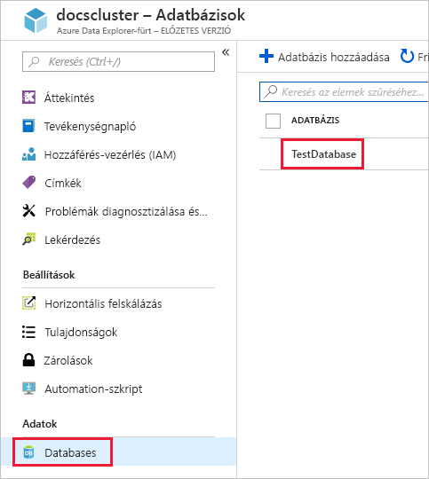
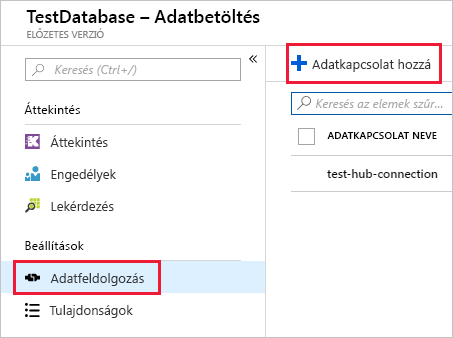
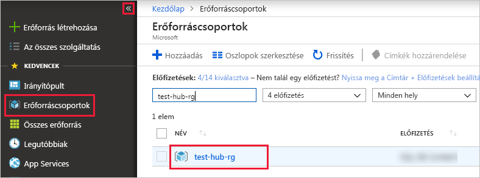

# <a name="quickstart-ingest-azure-blobs-into-azure-data-explorer-by-subscribing-to-event-grid-notifications"></a>Gyors útmutató: Azure-Blobok tölti be az adatkezelőt az Azure Event Grid értesítések való feliratkozással

Az Azure Adatkezelő egy gyors és hatékonyan skálázható adatáttekintési szolgáltatás napló- és telemetriaadatokhoz. Az Azure Data Explorer folyamatos Adatbetöltési (az adatok betöltése) a blobok, blob-tárolók írt kínál. Ez úgy érhető el egy [Azure Event Grid](/azure/event-grid/overview) blob-létrehozási események és az Útválasztás ezeket az eseményeket egy Eseményközpontba keresztül Kusto-előfizetés. Az ebben a rövid útmutatóban egy tárfiókot, az Event Grid-előfizetés, amely az értesítéseket küld az Eseményközpont kell rendelkeznie. Ezután hozzon létre egy Event Grid adatkapcsolatot, és tekintse meg az adatokat a folyamat során a rendszer.

## <a name="prerequisites"></a>Előfeltételek

1. Ha nem rendelkezik Azure-előfizetéssel, hozzon létre egy [ingyenes Azure-fiók](https://azure.microsoft.com/free/)
1. [A fürt és adatbázis](create-cluster-database-portal.md)
1. [Storage-fiók](https://docs.microsoft.com/azure/storage/common/storage-quickstart-create-account?tabs=azure-portal)
1. [An Event Hub](https://docs.microsoft.com/azure/event-hubs/event-hubs-create)

## <a name="create-an-event-grid-subscription-in-your-storage-account"></a>Hozzon létre egy Event Grid-előfizetést a tárfiókban

1. Az Azure Portalon lépjen a tárfiókhoz
1. Kattintson a **események** fülre, majd a **esemény-előfizetés**

    

1. Az a **esemény-előfizetés létrehozása** ablakot a **alapszintű** lapra, adja meg a következő értékeket:

    **Beállítás** | **Ajánlott érték** | **Mező leírása**
    |---|---|---|
    | Name (Név) | *test-grid-connection* | A létrehozandó event griddel neve.|
    | Eseményséma | *Event Grid-séma* | A séma, amely az Event Grid kell használni. |
    | Témakörtípus | *Storage-fiók* | Az event grid-témakör típusa. |
    | Témakörerőforrás | *gridteststorage* | A tárfiók neve. |
    | Előfizetés az összes eseménytípusra | *Törölje a jelet* | Nem minden eseményt a értesítést kaphat. |
    | Definiált eseménytípusok | *Blob Created* | Értesítés küldése a meghatározott események. |
    | Végpont típusa | *Event Hubs* | A végpont, amelyhez az események küldése típusa. |
    | Végpont | *test-hub* | A létrehozott eseményközpont. |
    | | |

1. Válassza ki a **további funkciók** lapon, ha szeretné nyomon követni a fájlokat az adott tárolóban. Állítsa be a szűrőket, az értesítéseket a következőképpen:
    * **Megkezdi a tulajdonos** mező a *szövegkonstans* a blob-tároló előtagja (a alkalmazni minta szerint *startswith*, több tárolót is kiterjedhetnek). A helyettesítő karakterek nem engedélyezettek.
     Ez *kell* értéke a következő lehet: *`/blobServices/default/containers/`*[tároló előtag]
    * **Ér véget a tulajdonos** mező a *szövegkonstans* a blob-utótagját. A helyettesítő karakterek nem engedélyezettek.

## <a name="create-a-target-table-in-azure-data-explorer"></a>Céltábla létrehozása az Azure Data Explorerben

Az Adatkezelőben az Azure tábla létrehozása, amely az Event Hubs elküldi az adatokat. A tábla hoz létre a fürt és adatbázis előkészített **Előfeltételek**.

1. Az Azure Portalon, a fürt alatt válassza a **Lekérdezés** lehetőséget.

    

1. A következő parancs másolja be az ablakot, és válassza ki **futtatása** fogadják a feldolgozott adatokat (TestTable) tábla létrehozásához.

    ```Kusto
    .create table TestTable (TimeStamp: datetime, Value: string, Source:string)
    ```

    

1. A következő parancs másolja be az ablakot, és válassza ki **futtatása** való leképezéséhez a tábla (TestTable) oszlop nevükkel és adattípusukkal bejövő JSON-adatokat.

    ```Kusto
    .create table TestTable ingestion json mapping 'TestMapping' '[{"column":"TimeStamp","path":"$.TimeStamp"},{"column":"Value","path":"$.Value"},{"column":"Source","path":"$.Source"}]'
    ```

## <a name="create-an-event-grid-data-connection-in-azure-data-explorer"></a>Hozzon létre egy Event Grid adatkapcsolat Azure adatkezelőjében

Most már az Event Grid-ból kapcsolódik az Azure az adatkezelőt, úgy, hogy a tárfiókba kerülnek a blob-tároló adatok streamelése a teszt táblába.

1. Az eszközsáv **Értesítések** elemének kiválasztásával győződjön meg arról, hogy az eseményközpont üzembe helyezése sikeresen megtörtént.

1. A létrehozott fürt alatt válassza az **Adatbázisok**, majd a **TestDatabase** lehetőséget.

    

1. Válassza az **Adatbevitel**, majd az **Adatkapcsolat hozzáadása** lehetőséget.

    

1. Válassza ki a kapcsolat típusa: **A BLOB Storage-**.

1. Töltse ki az űrlapot a következő információkat, majd kattintson a **létrehozás**.

    

     Adatforrás:

    **Beállítás** | **Ajánlott érték** | **Mező leírása**
    |---|---|---|
    | Adatkapcsolat neve | *test-hub-connection* | Az Azure Data Explorerben létrehozni kívánt kapcsolat neve.|
    | Tárfiók-előfizetés | Az előfizetés-azonosító | A storage-fiókot tartalmazó előfizetés azonosítója.|
    | Tárfiók | *gridteststorage* | A korábban létrehozott tárfiók neve.|
    | Event Grid | *test-grid-connection* | Az Event Grid létrehozott neve. |
    | Eseményközpont neve | *test-hub* | A létrehozott eseményközpont. Ez automatikusan ki van töltve, amikor egy Event Grid válasszon ki. |
    | Fogyasztói csoport | *test-group* | A létrehozott eseményközponton definiált fogyasztói csoport. |
    | | |

    Céloldali tábla:

     **Beállítás** | **Ajánlott érték** | **Mező leírása**
    |---|---|---|
    | Tábla | *TestTable* | A **TestDatabase** adatbázisban létrehozott tábla. |
    | Adatformátum | *JSON* | A JSON és a CSV formátum támogatott. |
    | Oszlopleképezés | *TestMapping* | A **TestDatabase** adatbázisban létrehozott leképezés, amely a bejövő JSON-adatokat leképezi a **TestTable** tábla esetében használt oszlopnevekre és adattípusokra.|
    | | |

## <a name="generate-sample-data"></a>Mintaadatok létrehozása

Most, hogy az Azure Data Explorer és a storage-fiók csatlakoztatva, mintaadatok létrehozása, és töltse fel a blob Storage.

Egy kis héjparancsfájlt, amely néhány alapvető Azure CLI-parancsokat használhatja az Azure Storage-erőforrások is együttműködünk. A szkript először létrehoz egy új tárolót a storage-fiókban, majd feltölti a már meglévő fájl (blob) az adott tárolóhoz. Ezután kilistázza a tárolóban lévő összes BLOB. Használhat [Cloud Shell](https://docs.microsoft.com/azure/cloud-shell/overview) közvetlenül a portálon a szkript végrehajtásához.

A következő adatok mentése fájlba, és használja az alábbi parancsfájlt:

```Json
{"TimeStamp": "1987-11-16 12:00","Value": "Hello World","Source": "TestSource"}
```

```bash
#!/bin/bash
### A simple Azure Storage example script

    export AZURE_STORAGE_ACCOUNT=<storage_account_name>
    export AZURE_STORAGE_KEY=<storage_account_key>

    export container_name=<container_name>
    export blob_name=<blob_name>
    export file_to_upload=<file_to_upload>
    export destination_file=<destination_file>

    echo "Creating the container..."
    az storage container create --name $container_name

    echo "Uploading the file..."
    az storage blob upload --container-name $container_name --file $file_to_upload --name $blob_name

    echo "Listing the blobs..."
    az storage blob list --container-name $container_name --output table

    echo "Done"
```

## <a name="review-the-data-flow"></a>Az adatfolyam áttekintése

> [!NOTE]
> ADX rendelkezik optimalizálja a betöltési folyamat adatbetöltés-összesítési (kötegelés) szabályzat.
A házirend alapértelmezés szerint 5 perc van konfigurálva.
Láthatja, hogy a szabályzat módosításához később igény szerint. Ebben a rövid útmutatóban egy néhány perces késés várható.

1. Az Azure Portalon az event grid alatt jelenik meg a megnövekedett tevékenység az alkalmazás futása közben.

    

1. A következő lekérdezés a tesztadatbázison való futtatásával ellenőrizze, hogy hány üzenet került át eddig a pillanatig az adatbázisba.

    ```Kusto
    TestTable
    | count
    ```

1. Az üzenetek a tartalom megtekintéséhez futtassa a következő lekérdezést a test-adatbázisban.

    ```Kusto
    TestTable
    ```

    Az eredményhalmaznak a következőhöz hasonlóan kell kinéznie.

    

## <a name="clean-up-resources"></a>Az erőforrások eltávolítása

Ha nem szeretné újra használni az event griddel, tisztítása **test-hub-rg**költségek elkerülése érdekében.

1. Az Azure Portalon válassza az **Erőforráscsoportok** lehetőséget a bal szélen, majd a létrehozott erőforráscsoport.  

    Ha a bal oldali menü össze van csukva, kattintson a  a kinyitásához.

   

1. A **test-resource-group** alatt válassza az **Erőforráscsoport törlése** elemet.

1. Az új ablakban írja be a törölni kívánt erőforráscsoport nevét (*test-hub-rg*), majd válassza a **Törlés** lehetőséget.

## <a name="next-steps"></a>További lépések

> [!div class="nextstepaction"]
> [Rövid útmutató: Az Azure Data Explorer adatok lekérdezése](web-query-data.md)