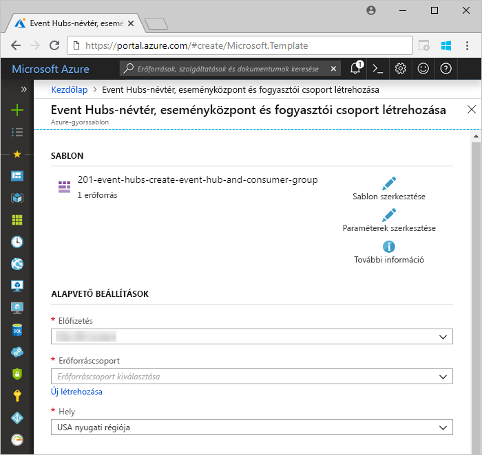
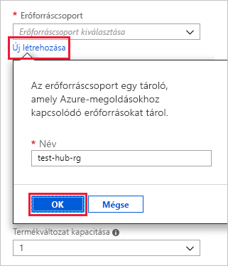
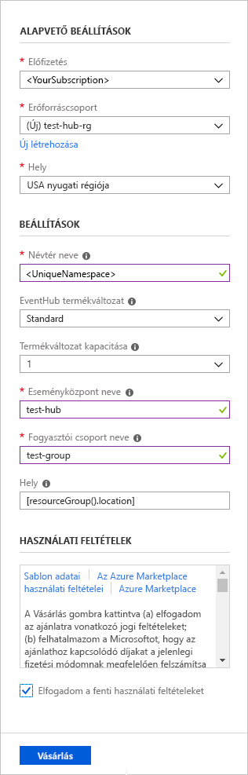
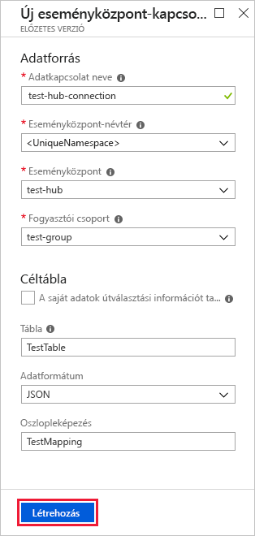
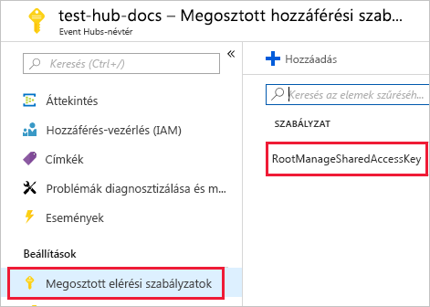
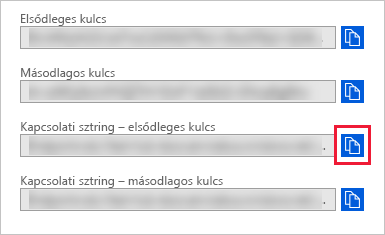
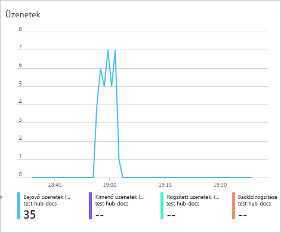

# <a name="quickstart-ingest-data-from-event-hub-into-azure-data-explorer"></a>Gyors útmutató: Betölteni az adatokat az Event Hubs az Azure Data Explorer

Az Azure Adatkezelő egy gyors és hatékonyan skálázható adatáttekintési szolgáltatás napló- és telemetriaadatokhoz. Az Azure Data Explorer adatbetöltési lehetőséget tesz elérhetővé az Event Hubsból, amely egy big data-streamelési platform és eseményfeldolgozó szolgáltatás. [Az Event Hubs](/azure/event-hubs/event-hubs-about) millió másodpercenként a közel valós idejű események feldolgozására is. Ebben a rövid útmutatóban létrehozunk egy eseményközpontot, csatlakozunk hozzá az Azure Data Explorerből, és megfigyeljük az adatok a rendszeren keresztüli áramlását.

## <a name="prerequisites"></a>Előfeltételek

* Ha nem rendelkezik Azure-előfizetéssel, mindössze néhány perc alatt létrehozhat egy [ingyenes Azure-fiókot](https://azure.microsoft.com/free/) a virtuális gép létrehozásának megkezdése előtt.

* [Egy tesztfürt és -adatbázis](create-cluster-database-portal.md)

* [Egy mintaalkalmazás](https://github.com/Azure-Samples/event-hubs-dotnet-ingest) , amely adatokat állít elő, és elküldi azt az eseményközpontba. Töltse le a mintaalkalmazást a rendszer.

* A [Visual Studio 2017 szoftver 15.3.2-es vagy újabb verziója](https://www.visualstudio.com/vs/) a mintaalkalmazás futtatásához

## <a name="sign-in-to-the-azure-portal"></a>Jelentkezzen be az Azure Portalra

Jelentkezzen be az [Azure Portalra](https://portal.azure.com/).

## <a name="create-an-event-hub"></a>Eseményközpont létrehozása

A rövid útmutatóban mintaadatokat állítunk elő, és elküldjük azokat egy eseményközpontnak. Első lépésként létre kell hoznia egy eseményközpontot. Ezt egy Azure Resource Manager-sablon használatával teheti meg az Azure Portalon.

1. Létrehoz egy eseményközpontot, használja az alábbi gombra a telepítés elindításához. Kattintson a jobb gombbal, és válassza ki **Megnyitás új ablakban**, ezért kövesse a cikkben ismertetett lépések a többi.

    [](https://portal.azure.com/#create/Microsoft.Template/uri/https%3A%2F%2Fraw.githubusercontent.com%2FAzure%2Fazure-quickstart-templates%2Fmaster%2F201-event-hubs-create-event-hub-and-consumer-group%2Fazuredeploy.json)

    Az **Üzembe helyezés az Azure-ban** gombra kattintva megnyílik az Azure Portal, ahol egy üzembehelyezési űrlapot kell kitöltenie.

    

1. Válassza ki azt az előfizetést, amelyben az eseményközpontot létre kívánja hozni, és hozzon létre egy *test-hub-rg* nevű erőforráscsoportot.

    

1. Adja meg az alábbi adatokat az űrlapon.

    

    Az alábbi táblázatban fel nem sorolt beállítások esetében használja az alapértelmezett értéket.

    **Beállítás** | **Ajánlott érték** | **Mező leírása**
    |---|---|---|
    | Előfizetés | Az Ön előfizetése | Válassza ki az eseményközponthoz használni kívánt Azure-előfizetést.|
    | Erőforráscsoport | *test-hub-rg* | Hozzon létre egy új erőforráscsoportot. |
    | Hely | *USA nyugati régiója* | Ebben a rövid útmutatóban válassza az *USA nyugati régióját*. Éles üzemben az igényeinek leginkább megfelelő régiót válassza. Az eseményközpont-névtér létrehozása a legjobb teljesítmény érdekében a Kusto-fürt ugyanazon a helyen (leginkább fontos a nagy átviteli sebességgel eseményközpont-névtér).
    | Névtér neve | A névtér egyedi neve | Válasszon egy egyedi nevet a névtér azonosításához. Például: *mytestnamespace*. A rendszer hozzáfűzi a *servicebus.windows.net* tartománynevet a megadott névhez. A név csak betűket, számokat és kötőjelet tartalmazhat. A névnek betűvel kell kezdődnie, és betűvel vagy számmal kell végződnie. Az érték 6 és 50 karakter közötti hosszúságú lehet.
    | Event Hubs neve | *test-hub* | Az eseményközpont a névtéren belül helyezkedik el, ami egy egyedi hatókörkezelési tárolóként szolgál. Az eseményközpont nevének egyedinek kell lennie a névtéren belül. |
    | Fogyasztói csoport neve | *test-group* | A fogyasztói csoportokkal több fogyasztói alkalmazás is rendelkezhet az eseménystream külön nézetével. |
    | | |

1. Válassza a **Vásárlás** lehetőséget, amivel megerősíti, hogy erőforrásokat kíván létrehozni az előfizetésben.

1. Az eszköztáron válassza az **Értesítések** elemet az üzembehelyezési folyamat nyomon követéséhez. A sikeres üzembe helyezés igénybe vehet néhány percet, azonban addig is folytathatja a következő lépéssel.

    

## <a name="create-a-target-table-in-azure-data-explorer"></a>Céltábla létrehozása az Azure Data Explorerben

Most létrehozunk egy táblát az Azure Data Explorerben, amelyre az Event Hubs az adatokat továbbítja majd. A táblát az **Előfeltételek** szakaszban lefoglalt fürtön és adatbázisban hozzuk létre.

1. Az Azure Portalon keresse meg a fürtöt, majd válassza a **Lekérdezés** elemet.

    

1. A következő parancs másolja be az ablakot, és válassza ki **futtatása** fogadják a feldolgozott adatokat (TestTable) tábla létrehozásához.

    ```Kusto
    .create table TestTable (TimeStamp: datetime, Name: string, Metric: int, Source:string)
    ```

    

1. A következő parancs másolja be az ablakot, és válassza ki **futtatása** való leképezéséhez a tábla (TestTable) oszlop nevükkel és adattípusukkal bejövő JSON-adatokat.

    ```Kusto
    .create table TestTable ingestion json mapping 'TestMapping' '[{"column":"TimeStamp","path":"$.timeStamp","datatype":"datetime"},{"column":"Name","path":"$.name","datatype":"string"},{"column":"Metric","path":"$.metric","datatype":"int"},{"column":"Source","path":"$.source","datatype":"string"}]'
    ```

## <a name="connect-to-the-event-hub"></a>Csatlakozás az eseményközponthoz

Most csatlakozzon az eseményközponthoz az Azure Data Explorerből. Ha ez a kapcsolat létrejött, az eseményközpontba érkező adatok a cikk korábbi részében létrehozott teszttáblába kerülnek.

1. Az eszközsáv **Értesítések** elemének kiválasztásával győződjön meg arról, hogy az eseményközpont üzembe helyezése sikeresen megtörtént.

1. A létrehozott fürt alatt válassza az **Adatbázisok**, majd a **TestDatabase** lehetőséget.

    

1. Válassza ki **adatbetöltés** és **adatkapcsolat hozzáadása**. Ezután töltse ki az űrlapot a következő információkat. Válassza ki **létrehozás** befejezése után.

    

    Adatforrás:

    **Beállítás** | **Ajánlott érték** | **Mező leírása**
    |---|---|---|
    | Adatkapcsolat neve | *test-hub-connection* | Az Azure Data Explorerben létrehozni kívánt kapcsolat neve.|
    | Eseményközpont-névtér | A névtér egyedi neve | A korábban a névtér azonosításához választott név. |
    | Eseményközpont | *test-hub* | A létrehozott eseményközpont. |
    | Fogyasztói csoport | *test-group* | A létrehozott eseményközponton definiált fogyasztói csoport. |
    | | |

    Céloldali tábla:

    Az útvonalválasztás esetében két lehetőség érhető el: a *statikus* és a *dinamikus*. Ebben a rövid útmutatóban statikus útválasztást alkalmazunk (ez az alapértelmezett), amelyben megadjuk a táblanevet, a fájlformátumot és a leképezést. Ezért hagyja **adataimat magában foglalja az útválasztási információ** nincs bejelölve.
    Dinamikus útválasztás is alkalmazható, ha a saját adatok tartalmazzák a szükséges útválasztási információkat.

     **Beállítás** | **Ajánlott érték** | **Mező leírása**
    |---|---|---|
    | Tábla | *TestTable* | A **TestDatabase** adatbázisban létrehozott tábla. |
    | Adatformátum | *JSON* | Támogatott formátumok a következők: Avro, CSV, JSON, TÖBBSOROS JSON, PSV, Rendszerállapot, SCSV, TSV és TXT. |
    | Oszlopleképezés | *TestMapping* | A **TestDatabase** adatbázisban létrehozott leképezés, amely a bejövő JSON-adatokat leképezi a **TestTable** tábla esetében használt oszlopnevekre és adattípusokra.|
    | | |

## <a name="copy-the-connection-string"></a>A kapcsolati sztring másolása

Amikor elindítja az Előfeltételek között szereplő [mintaalkalmazást](https://github.com/Azure-Samples/event-hubs-dotnet-ingest), szüksége lesz az eseményközpont névterének kapcsolati sztringjére.

1. A létrehozott eseményközpont-névtér alatt válassza a **Megosztott elérési szabályzatok**, majd a **RootManageSharedAccessKey** lehetőséget.

    

1. Másolja ki a **kapcsolati sztring elsődleges kulcsát**. A következő szakaszban kell beillesztenie.

    

## <a name="generate-sample-data"></a>Mintaadatok létrehozása

Használja a [mintaalkalmazás](https://github.com/Azure-Samples/event-hubs-dotnet-ingest) letöltött adatok létrehozására.

1. Nyissa meg a mintaalkalmazást a Visual Studióban.

1. A *program.cs* fájlban cserélje le a `connectionString` konstanst az eseményközpont-névtérből kimásolt kapcsolati sztringre.

    ```csharp
    const string eventHubName = "test-hub";
    // Copy the connection string ("Connection string-primary key") from your Event Hub namespace.
    const string connectionString = @"<YourConnectionString>";
    ```

1. Hozza létre és futtassa az alkalmazást. Az alkalmazás üzeneteket küld az eseményközpontba, és 10 másodpercenként megjeleníti az állapotot.

1. Miután az alkalmazás már küldött néhány üzenetet, lépjen tovább a következő lépésre: tekintse át az adatok az eseményközpontba, majd a teszttáblába való áramlását.

## <a name="review-the-data-flow"></a>Az adatfolyam áttekintése

Most, hogy az alkalmazás adatokat állít elő, láthatja, ahogy ezek az adatok az eseményközpontból a fürtön található táblába áramlanak.

1. Az Azure Portalon az eseményközpont alatt megfigyelheti a tevékenységcsúcsot, amíg az alkalmazás fut.

    

1. A következő lekérdezés a tesztadatbázison való futtatásával ellenőrizze, hogy hány üzenet került át eddig a pillanatig az adatbázisba.

    ```Kusto
    TestTable
    | count
    ```

1. Az üzenetek a tartalom megtekintéséhez futtassa a következő lekérdezést:

    ```Kusto
    TestTable
    ```

    Az eredményhalmaz a következőhöz hasonlóan kell kinéznie:

    

    > [!NOTE]
    > Az adatkezelő az Azure-összesítési (kötegelés) szabályzat adatbetöltés, optimalizálja a betöltési folyamat rendelkezik. A házirendet 5 perc van konfigurálva, a késés tapasztalható.

## <a name="clean-up-resources"></a>Az erőforrások eltávolítása

Ha nem tervezi, hogy továbbra is használja, a költségek elkerülése érdekében törölje a **test-hub-rg** erőforráscsoportot.

1. Az Azure Portalon válassza az **Erőforráscsoportok** lehetőséget a bal szélen, majd a létrehozott erőforráscsoport.  

    Ha a bal oldali menü össze van csukva, kattintson a  a kinyitásához.

   

1. A **test-resource-group** alatt válassza az **Erőforráscsoport törlése** elemet.

1. Az új ablakban írja be a törölni kívánt erőforráscsoport nevét (*test-hub-rg*), majd válassza a **Törlés** lehetőséget.

## <a name="next-steps"></a>További lépések

> [!div class="nextstepaction"]
> [Rövid útmutató: Az Azure Data Explorer adatok lekérdezése](web-query-data.md)
