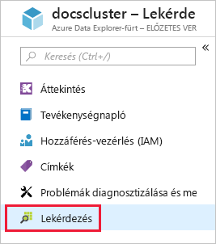
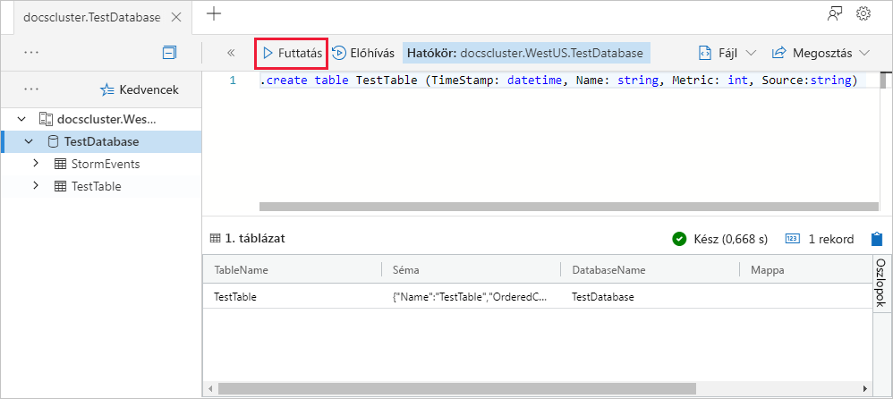
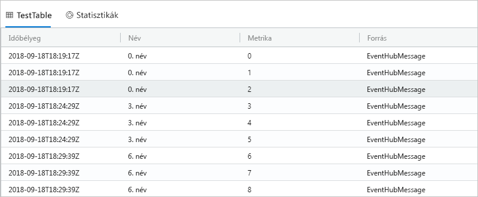

# <a name="quickstart-ingest-data-from-kafka-into-azure-data-explorer"></a>Gyors útmutató: Betölteni az adatokat a Kafkából az Azure Data Explorer
 
Az Azure Adatkezelő egy gyors és hatékonyan skálázható adatáttekintési szolgáltatás napló- és telemetriaadatokhoz. Az Azure Data Explorer Kafka Adatbetöltési (az adatok betöltése) kínál. A Kafka egy elosztott streamelési platform streamadatfolyamatok, amely megbízhatóan adatáthelyezést közötti rendszerek vagy alkalmazások kiépítését lehetővé teszi, hogy. 
 
## <a name="prerequisites"></a>Előfeltételek
 
* Ha nem rendelkezik Azure-előfizetéssel, mindössze néhány perc alatt létrehozhat egy [ingyenes Azure-fiókot](https://azure.microsoft.com/free/) a virtuális gép létrehozásának megkezdése előtt. 
 
* [Egy tesztfürt és -adatbázis](create-cluster-database-portal.md)
 
* [Egy mintaalkalmazás](https://github.com/Azure/azure-kusto-samples-dotnet/tree/master/kafka) , amely adatokat állít elő, és elküldi azokat a Kafka

* A [Visual Studio 2017 szoftver 15.3.2-es vagy újabb verziója](https://www.visualstudio.com/vs/) a mintaalkalmazás futtatásához
 
## <a name="kafka-connector-setup"></a>A Kafka-összekötő telepítése
Kafka csatlakozzon egy olyan eszköz scalably és megbízhatóan streamelési adatok az Apache Kafka és más rendszerek közötti. Lehetővé teszi, hogy gyorsan meghatározásához, hogy az adatok nagy gyűjteményeknek Kafka-összekötők egyszerű. A Kafka fogadó ADX Kafka a összekötőként szolgál.
 
### <a name="bundle"></a>Csomag 
A Kafka betöltheti egy `.jar` , egy beépülő modult, amely egy egyéni összekötőt fog működni. Előállításához, például egy `.jar`, klónozza a kód a helyi rendszer és hozhat létre a Maven használatával. 

#### <a name="clone"></a>Klónozás

```bash
git clone git://github.com:Azure/kafka-sink-azure-kusto.git
cd ./kafka-sink-azure-kusto/kafka/
```
 
#### <a name="build"></a>Felépítés

Helyileg készítése a Mavennel előállításához egy `.jar` függőségekkel befejeződött.

* JDK > = 1.8-as [letöltése](https://www.oracle.com/technetwork/java/javase/downloads/index.html)
* Maven [letöltése](https://maven.apache.org/install.html)
 

A legfelső szintű könyvtárán belül található *kafka-fogadó-azure-kusto*futtassa:

```bash
mvn clean compile assembly:single
```
 
### <a name="deploy"></a>Üzembe helyezés 
 
Töltse be a Kafka beépülő modult. Docker üzembe helyezési példában található [kafka-fogadó-azure-kusto](https://github.com/Azure/kafka-sink-azure-kusto#deploy)
 

Részletes dokumentációt a Kafka-összekötők, és hogyan kell őket telepíteni található [Kafka csatlakoztatása](https://kafka.apache.org/documentation/#connect) 

### <a name="example-configuration"></a>Konfigurációs példa 
 
```config
name=KustoSinkConnector 
connector.class=com.microsoft.azure.kusto.kafka.connect.sink.KustoSinkConnector 
kusto.sink.flush_interval_ms=300000 
key.converter=org.apache.kafka.connect.storage.StringConverter 
value.converter=org.apache.kafka.connect.storage.StringConverter 
tasks.max=1 
topics=testing1 
kusto.tables.topics_mapping=[{'topic': 'testing1','db': 'daniel', 'table': 'TestTable','format': 'json', 'mapping':'TestMapping'}] 
kusto.auth.authority=XXX 
kusto.url=https://ingest-{mycluster}.kusto.windows.net/ 
kusto.auth.appid=XXX 
kusto.auth.appkey=XXX 
kusto.sink.tempdir=/var/tmp/ 
kusto.sink.flush_size=1000
```
 
## <a name="create-a-target-table-in-adx"></a>ADX a céloldali tábla létrehozása
 
Hozzon létre egy táblát ADX, amelyhez a Kafka adatokat küldhet. A tábla létrehozása a fürt és az adatbázis kiépítése a **Előfeltételek**.
 
1. Az Azure Portalon keresse meg a fürt és a select **lekérdezés**.
 
    
 
1. Másolja be a következő parancsot az ablakba, és válassza a **Futtatás** lehetőséget.
 
    ```Kusto
    .create table TestTable (TimeStamp: datetime, Name: string, Metric: int, Source:string)
    ```
 
    
 
1. Másolja be a következő parancsot az ablakba, és válassza a **Futtatás** lehetőséget.
 
    ```Kusto
    .create table TestTable ingestion json mapping 'TestMapping' '[{"column":"TimeStamp","path":"$.timeStamp","datatype":"datetime"},{"column":"Name","path":"$.name","datatype":"string"},{"column":"Metric","path":"$.metric","datatype":"int"},{"column":"Source","path":"$.source","datatype":"string"}]'
    ```

    A parancs a bejövő JSON-adatokat leképezi a táblában (TestTable) szereplő oszlopnevekre és adattípusokra.


## <a name="generate-sample-data"></a>Mintaadatok létrehozása

Most, hogy a Kafka-fürt ADX csatlakoztatva van, használja a [mintaalkalmazás](https://github.com/Azure-Samples/event-hubs-dotnet-ingest) letöltött adatok létrehozására.

### <a name="clone"></a>Klónozás
Klónozza a mintaalkalmazást helyileg:

```cmd
git clone git://github.com:Azure/azure-kusto-samples-dotnet.git
cd ./azure-kusto-samples-dotnet/kafka/
```
### <a name="run-the-app"></a>Az alkalmazás futtatása
1. Nyissa meg a mintaalkalmazást a Visual Studióban.

1. Az a `Program.cs` fájlt, frissítse a `connectionString` konstans, a Kafka-kapcsolati karakterláncot.

    ```csharp    
    const string connectionString = @"<YourConnectionString>";
    ```

1. Hozza létre és futtassa az alkalmazást. Az alkalmazás üzeneteket küld a Kafka-fürt, és jelenít meg, az állapota minden 10 másodperc.

1. Miután az alkalmazás néhány üzenetet küldött, folytassa a következő lépéssel.
 
## <a name="query-and-review-the-data"></a>Lekérdezés, és tekintse át az adatokat 

1. Győződjön meg arról, hogy nem történt hiba Adatbetöltési során:

    ```Kusto
    .show ingestion failures
    ```

1. Az újonnan betöltött adatok megjelenítése:

    ```Kusto
    TestTable 
    | count
    ```

1. Láthatja az üzenetek:
 
    ```Kusto
    TestTable
    ```
 
    Az eredményhalmaz a következőhöz hasonlóan kell kinéznie:
 
    
 
## <a name="next-steps"></a>További lépések
 
> [!div class="nextstepaction"]
> [Gyors útmutató: Az Azure Data Explorer adatok lekérdezése](web-query-data.md)
