# <a name="quickstart-query-data-in-azure-data-explorer"></a>Gyors útmutató: Az Azure Data Explorer adatok lekérdezése

Az Azure Adatkezelő egy gyors és hatékonyan skálázható adatáttekintési szolgáltatás napló- és telemetriaadatokhoz. Az Azure Data Explorer biztosít egy webalkalmazást, amely lehetővé teszi lekérdezések futtatását és megosztását. Az alkalmazás elérhető az Azure Portalon és különálló webalkalmazásként is. Ebben az oktatóanyagban a különálló verziót használjuk, ami lehetővé teszi a csatlakozást egyszerre több fürthöz, illetve a lekérdezésekre mutató mélyhivatkozások megosztását.

Ha nem rendelkezik Azure-előfizetéssel, mindössze néhány perc alatt létrehozhat egy [ingyenes Azure-fiókot](https://azure.microsoft.com/free/) a virtuális gép létrehozásának megkezdése előtt.

## <a name="prerequisites"></a>Előfeltételek

A rövid útmutató elvégzéséhez az Azure-előfizetés mellett szüksége lesz egy [tesztfürtre és tesztadatbázisra](create-cluster-database-portal.md) is.

## <a name="sign-in-to-the-application"></a>Bejelentkezés az alkalmazásba

Jelentkezzen be az [alkalmazásba](https://dataexplorer.azure.com/).

## <a name="add-clusters"></a>Fürtök hozzáadása

Amikor először megnyitja az alkalmazást, nincsenek kapcsolatok.


Hozzá kell adnia egy kapcsolatot legalább egy fürthöz, mielőtt elkezdhetne lekérdezéseket futtatni. Ebben a szakaszban kapcsolatokat fog hozzáadni az Azure Data Explorer *súgófürtjéhez*, amelyet a tanulás elősegítéséhez állítottunk be, valamint az előző rövid útmutatóban létrehozott tesztfürthöz.

1. A bal felső sarokban válassza a **Fürt hozzáadása** lehetőséget.

1. Az a **hozzáadása fürthöz** párbeszédpanelen adja meg az URI-t, majd válassza ki **Hozzáadás**.

   A súgófürtben URI-t, előfordulhat, hogy használja `https://help.kusto.windows.net`. Ha saját fürtöt, adja meg a fürt URI azonosítója. Ha például `https://mydataexplorercluster.westus.kusto.windows.net` az alábbi képen látható módon:

    

1. A bal oldali panelen meg kell jelennie a **help** fürtnek. Bontsa ki a **Samples** adatbázist, hogy lássa azokat a mintatáblákat, amelyekhez hozzáférése van.

    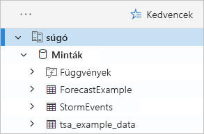

    A **StormEvents** táblát az útmutató későbbi részében és további Azure Data Explorer-oktatóanyagokban fogjuk használni.

Most adja hozzá a tesztfürtöt, amelyet létrehozott.

1. Válassza a **Fürt hozzáadása** lehetőséget.

1. A **Fürt hozzáadása** párbeszédpanelen adja meg a tesztfürt URL-címét (`https://<ClusterName>.<Region>.kusto.windows.net/` formátumban), majd kattintson a **Hozzáadás** gombra.

    Az alábbi példában látható a **help** fürt és egy új fürt, a **docscluster.westus** (a teljes URL-cím: `https://docscluster.westus.kusto.windows.net/`).

    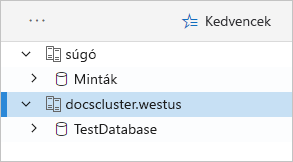

## <a name="run-queries"></a>Lekérdezések futtatása

Most már futtathat lekérdezéseket bármelyik fürthöz, amelyhez csatlakozott (feltéve, hogy a tesztfürt tartalmaz adatokat). Most a **help** fürttel fogunk dolgozni.

1. A bal oldali panelen a **help** fürt alatt válassza ki a **Samples** adatbázist.

1. Másolja és illessze be a következő lekérdezést a lekérdezési ablakba. Az ablak tetején kattintson a **Futtatás** elemre.

    ```Kusto
    StormEvents
    | sort by StartTime desc
    | take 10
    ```
    Ez a lekérdezés visszaadja a **StormEvents** táblában található tíz legújabb rekordot. Az eredmény bal oldalának a következő táblához hasonlóan kell kinéznie.

    

    Az alábbi képen látható, hogy az alkalmazásnak most milyen állapotban kell lennie, a hozzáadott fürtökkel, illetve egy lekérdezéssel és annak eredményeivel együtt.

    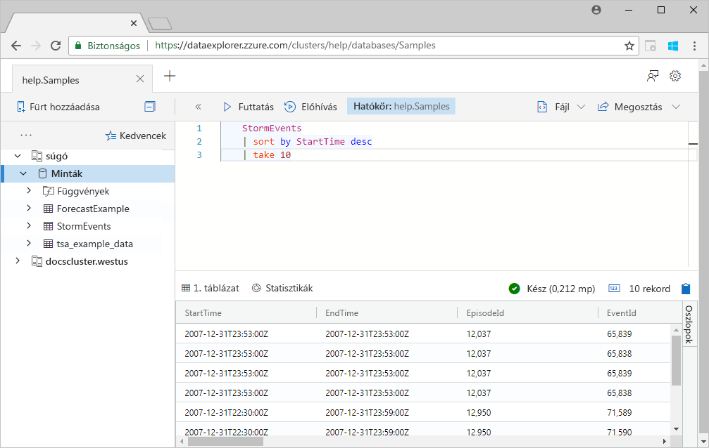

1. Másolja és illessze be a következő lekérdezést a lekérdezési ablakba, az első lekérdezés alá. Figyelje meg, hogy az első lekérdezéshez hasonlóan ez sincs külön sorokba formázva.

    ```Kusto
    StormEvents | sort by StartTime desc | project StartTime, EndTime, State, EventType, DamageProperty, EpisodeNarrative | take 10
    ```

1. Kattintással jelölje ki az új lekérdezést az ablakban. Nyomja le a Shift+Alt+F billentyűkombinációt a lekérdezés formázásához, hogy az alábbi példához hasonlóan nézzen ki.

    

1. Nyomja le a Shift + Enter billentyűkombinációt, amely futtatja a lekérdezést.

   Ez a lekérdezés ugyanazokat a rekordokat adja vissza, mint az első, de csak a(z) `project` utasításban megadott oszlopokat tartalmazza. Az eredménynek a következő táblához hasonlóan kell kinéznie.

    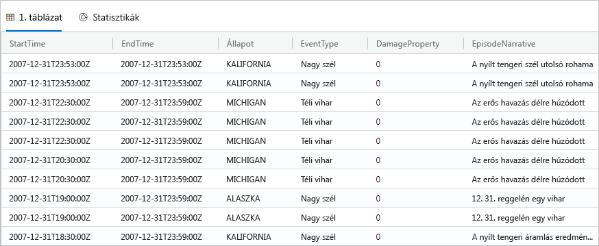

1. A lekérdezési ablak tetején kattintson a **Recall** (Felidézés) elemre.

    A lekérdezési ablakban ekkor megjelenik az első lekérdezés eredménykészlete, anélkül, hogy a lekérdezést újra kellene futtatni. Az elemzések során gyakran több lekérdezést is kell futtatnunk, a **Felidézés** pedig lehetővé teszi az előző lekérdezések eredményeinek újbóli megtekintését.

1. Futtassunk még egy lekérdezést, és nézzünk meg egy másfajta kimenetet.

    ```Kusto
    StormEvents
    | summarize event_count=count(), mid = avg(BeginLat) by State
    | sort by mid
    | where event_count > 1800
    | project State, event_count
    | render columnchart
    ```
    Az eredménynek a következő diagramhoz hasonlóan kell kinéznie.

    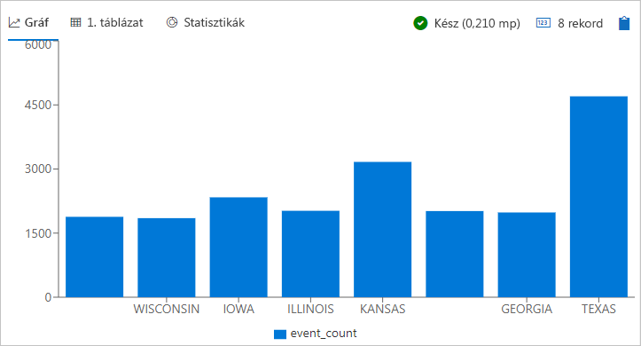

## <a name="work-with-the-table-grid"></a>A táblarács használata

Most, hogy áttekintettük az alapszintű lekérdezések működését, nézzük meg, hogyan használható a táblarács eredmények testreszabásához és további elemzések végrehajtásához.

1. Futtassa újra az első lekérdezést. Vigye az egérmutatót a **State** (Állam) oszlop fölé, és válassza ki a menüt, majd a **Group by State** (Csoportosítási szempont: Állam) lehetőséget.

    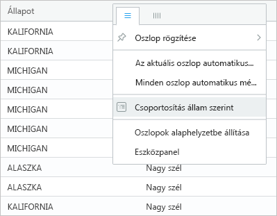

1. Bontsa ki a rács **California** elemét az államhoz tartozó rekordok megtekintéséhez.

    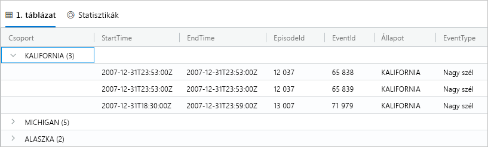

    Ez a fajta csoportosítás hasznos lehet felderítési jellegű elemzések elvégzésekor.

1. Vigye az egérmutatót a **Group** (Csoport) oszlop fölé, és válassza ki a **Reset columns** (Oszlopok alaphelyzetbe állítása) lehetőséget.

    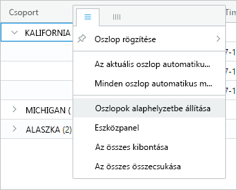

    Ez a művelet visszaállítja a rácsot az eredeti állapotába.

1. Futtassa az alábbi lekérdezést.

    ```Kusto
    StormEvents
    | sort by StartTime desc
    | where DamageProperty > 5000
    | project StartTime, State, EventType, DamageProperty, Source
    | take 10
    ```

1. A rács jobb oldalán válassza ki a **Columns** (Oszlopok) elemet az eszközpanel megtekintéséhez.

    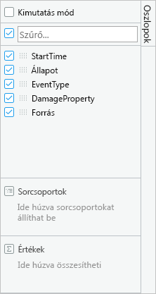

    A panel hasonlóan működik, mint az Excelben a kimutatástábla mezőlistája: lehetővé teszi további elemzések elvégzését magán a rácson.

1. Válassza ki **Pivot mód**, majd húzza az oszlopokat a következő: **Állapot** való **csoportok sor**; **DamageProperty** való **értékek**; és **EventType** való **oszlopfeliratok**.  

    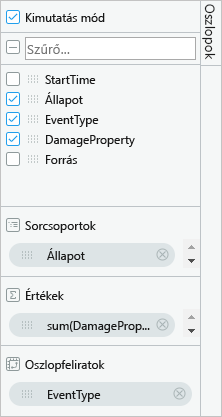

    Az eredménynek a következő kimutatástáblához hasonlóan kell kinéznie.

    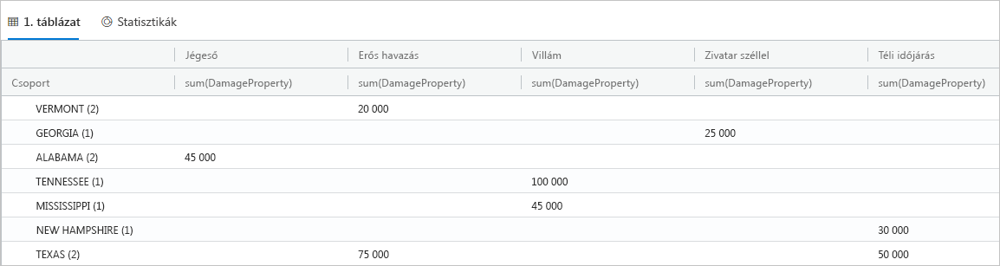

    Figyelje meg, hogy Vermont és Alabama esetében egyaránt két esemény van ugyanabban a kategóriában, miközben Texasnál két különböző kategóriájú esemény látható. A kimutatástáblák nagyszerűen használhatók a gyors elemzésekhez, mivel gyorsan észrevehetők bennük az ehhez hasonló dolgok.

## <a name="share-queries"></a>Lekérdezések megosztása

Gyakran fordul elő, hogy meg szeretnénk osztani a létrehozott lekérdezéseket. Ehhez megadhat egy mélyhivatkozást, amellyel a fürthöz hozzáféréssel rendelkező más felhasználók is futtathatják a lekérdezéseket.

1. A lekérdezési ablakban válassza ki az első bemásolt lekérdezést.

1. A lekérdezési ablak tetején kattintson a **Share** (Megosztás) elemre.

1. Válassza a **Link, query to clipboard** (Lekérdezés hivatkozásának másolása a vágólapra) lehetőséget.

1. Másolja ki a hivatkozást és a lekérdezést egy szövegfájlba.

1. Illessze be a hivatkozást egy új böngészőablakba. A lekérdezés futtatását követően az eredménynek az alábbihoz hasonlóan kell kinéznie.

    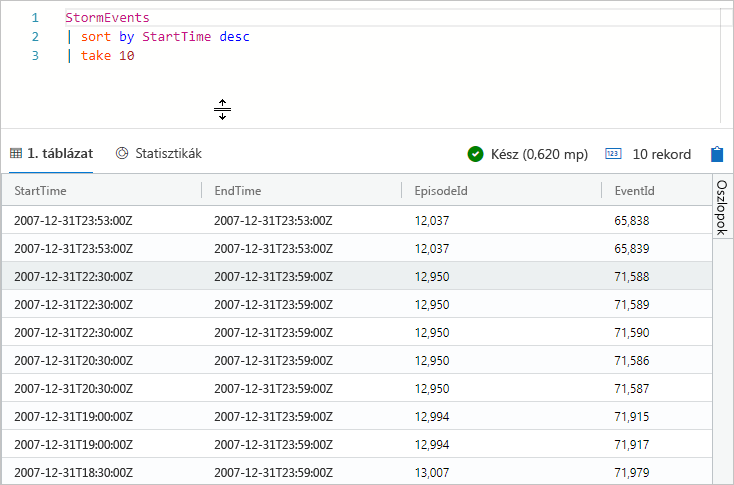

## <a name="provide-feedback"></a>Visszajelzés küldése

A Data Explorer jelenleg előzetes verzióban érhető el, és szívesen fogadjuk a használatával kapcsolatos tapasztalatokról szóló visszajelzéseket. Ezeket elküldheti most, vagy később is, amikor már többet használta a szolgáltatást.

1. Az alkalmazás jobb felső sarkában válassza a visszajelzés ikonját: .

1. Írja be visszajelzését, majd válassza a **Submit** (Küldés) lehetőséget.

## <a name="clean-up-resources"></a>Az erőforrások eltávolítása

Ebben a rövid útmutatóban nem hozott létre erőforrásokat, de ha el szeretné távolítani az egyik vagy mindkét fürtöt az alkalmazásból, kattintson a jobb gombbal a fürtre, és válassza a **Remove connection** (Kapcsolat eltávolítása) lehetőséget.

## <a name="next-steps"></a>További lépések

> [!div class="nextstepaction"]
> [Lekérdezések írása az Azure Data Explorerhez](write-queries.md)
