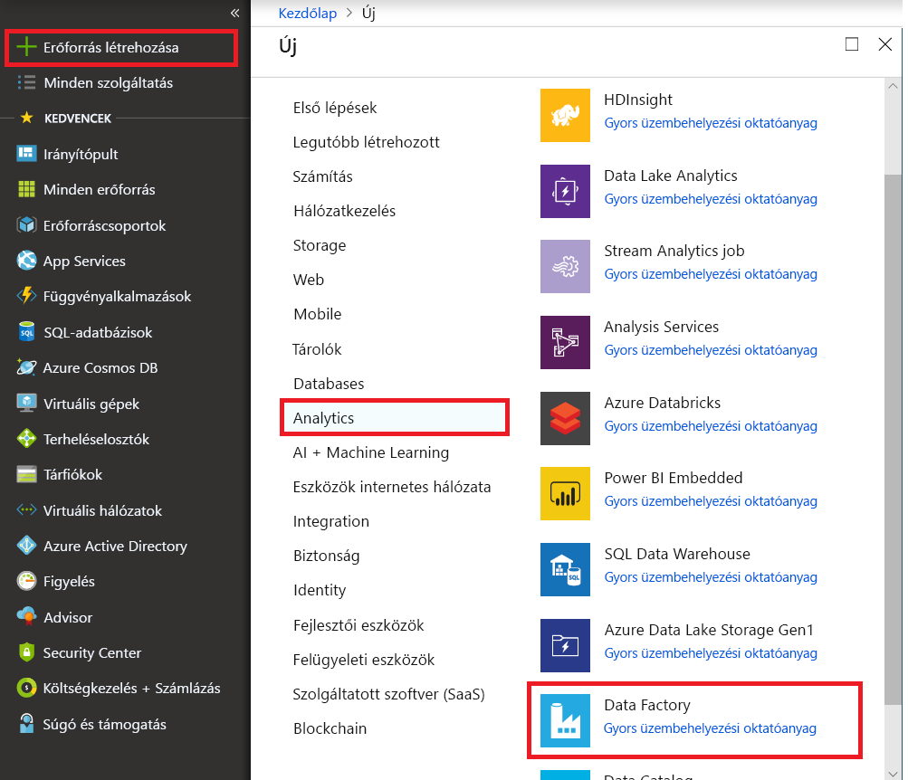
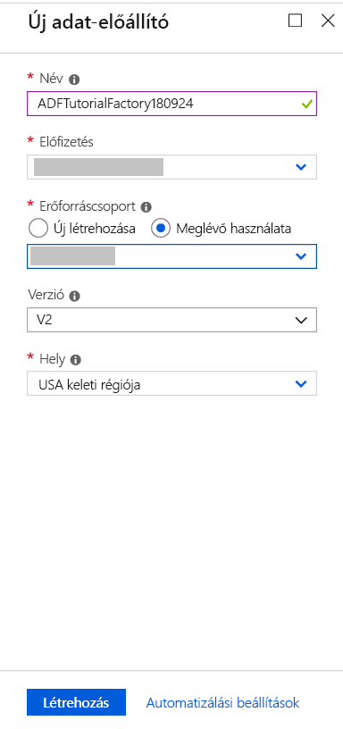
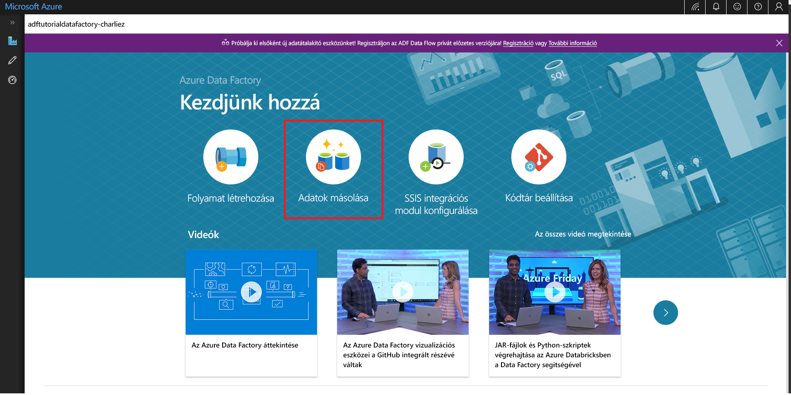

# Gyors útmutató: Adatok másolása az Adatok másolása eszközzel

> [!div class="op_single_selector" title1="Select the version of Data Factory service that you are using:"]
> * [1-es verzió](v1/data-factory-copy-data-from-azure-blob-storage-to-sql-database.md)
> * [Aktuális verzió](quickstart-create-data-factory-copy-data-tool.md)

Ebben a rövid útmutatóban egy adat-előállítót hoz létre az Azure Portal használatával. Ezután az Adatok másolása eszközzel létrehoz egy folyamatot, amely adatokat másol egy Azure Blob Storage-beli mappából egy másik mappába. 

> [!NOTE]
> Ha még csak ismerkedik az Azure Data Factory szolgáltatással, a gyors útmutató elvégzése előtt tekintse meg a következő cikket: [Bevezetés az Azure Data Factory használatába](data-factory-introduction.md). 

[!INCLUDE [data-factory-quickstart-prerequisites](../../includes/data-factory-quickstart-prerequisites.md)] 

## Data factory létrehozása

1. Kattintson az **Új** elemre a bal oldali menüben, majd az **Adatok + analitika**, végül a **Data Factory** elemre. 
   
   
1. Az **Új data factory** lap **Név** mezőjében adja meg az **ADFTutorialDataFactory** értéket. 
      
   
 
   Az Azure data factory nevének *globálisan egyedinek* kell lennie. Ha a következő hibaüzenetet kapja, módosítsa az adat-előállító nevét (például a **&lt;sajátneve&gt;ADFTutorialDataFactory** értékre), majd próbálkozzon újra a létrehozással. A Data Factory-összetevők elnevezési szabályait a [Data Factory elnevezési szabályait](naming-rules.md) ismertető cikkben találja.
  
   
1. **Előfizetés:** válassza ki azt az Azure-előfizetést, amelyben az adat-előállítót létre szeretné hozni. 
1. **Erőforráscsoport:** hajtsa végre a következő lépések egyikét:
     
   - Kattintson a **Meglévő használata** elemre, majd válasszon egy meglévő erőforráscsoportot a listából. 
   - Kattintson az **Új létrehozása** elemre, és adja meg az erőforráscsoport nevét.   
         
   Az erőforráscsoportokkal kapcsolatos információkért tekintse meg a [Using resource groups to manage your Azure resources](../azure-resource-manager/resource-group-overview.md) (Erőforráscsoportok használata az Azure-erőforrások kezeléséhez) című cikket.  
1. A **Verzió** résznél válassza a **V2** értéket.
1. **Hely:** válassza ki az adat-előállító helyét. 

   A listában csak a Data Factory által támogatott helyek és az Azure Data Factory-metaadatok tárolási helye jelenik meg. Vegye figyelembe, hogy a Data Factory által használt adattárak (Azure Storage, Azure SQL Database stb.) és számítási erőforrások (Azure HDInsight stb.) más régiókban is futhatnak.

1. Kattintson a **Létrehozás** gombra.
1. A létrehozás befejezése után megjelenik a **Data Factory** lap. Az Azure Data Factory felhasználói felületi (UI) alkalmazás külön lapon történő elindításához kattintson a **Létrehozás és monitorozás** csempére.
   
   

## Az Adatok másolása eszköz elindítása

1. Az Adatok másolása eszköz elindításához az **első lépéseket** ismertető oldalon kattintson az **Adatok másolása** csempére. 

   

1. Az Adatok másolása eszköz **Tulajdonságok** lapján megadhatja a folyamat nevét és leírását, majd kattintson a **Tovább** lehetőségre. 

   
1. A **Forrásadattár** oldalon hajtsa végre az alábbi lépéseket:

    a. Kapcsolat hozzáadásához kattintson a **+ Új kapcsolat létrehozása** lehetőségre.

    

    b. Válassza a katalógusból az **Azure Blob Storage** elemet, majd válassza a **Tovább** lehetőséget.

    

    c. Az **Azure Blob Storage-fiók megadása** lapon válassza ki tárfiókját a **Tárfiók neve** listából, és kattintson a **Befejezés** gombra. 

   

   d. Forrásnak válassza ki az újonnan létrehozott társított szolgáltatást, majd kattintson a **Tovább** gombra.

   

1. **A bemeneti fájl vagy mappa kiválasztása** lapon kövesse az alábbi lépéseket:

   a. A **Tallózás** elemre kattintva lépjen az **adftutorial/input** mappához, válassza az **emp.txt** fájlt, majd kattintson a **Kiválasztás** lehetőségre. 

   

   d. A fájl változtatás nélküli másolásához jelölje be a **Bináris másolat** lehetőséget, majd válassza a **Tovább** lehetőséget. 

   

1. A **Céladattár** lapon válassza ki az imént létrehozott **Azure Blob Storage** társított szolgáltatást, majd válassza a **Tovább** gombot. 

   

1. **A kimeneti fájl vagy mappa kiválasztása** lapon írja be az **adftutorial/output** karakterláncot mappaútvonalnak, majd válassza a **Tovább** lehetőséget. 

    

1. A **Beállítások** lapon kattintson a **Tovább** gombra az alapértelmezett konfigurációk használatához. 

1. Tekintse át a beállításokat az **Összegzés** lapon, majd válassza a **Tovább** gombot. 

    

1. Az **Üzembe helyezés kész** lapon kattintson a **Monitorozás** elemre a létrehozott folyamat monitorozásához. 

    

1. Az alkalmazás ekkor átvált a **Monitorozás** lapra. Ezen a lapon látható a folyamat állapota. A lista frissítéséhez kattintson a **Frissítés** gombra. 
    
    

1. Kattintson a **Műveletek** oszlopban található **Tevékenységfuttatások megtekintése** hivatkozásra. A folyamathoz egyetlen **Másolás** típusú tevékenység tartozik. 

    
    
1. A másolási művelet részleteinek megtekintéséhez kattintson a **Műveletek** oszlop **Részletek** hivatkozására (szemüveg ikon). A tulajdonságokkal kapcsolatos részletekért tekintse meg a [másolási tevékenység áttekintését](copy-activity-overview.md).

    

1. Ellenőrizze, hogy az **emp.txt** fájl az **adftutorial** tároló **output** mappájában jött-e létre. Ha a kimeneti mappa nem létezik, a Data Factory szolgáltatás automatikusan létrehozza. 

1. A kapcsolódó szolgáltatások, adatkészletek és folyamatok szerkesztéséhez lépjen a bal oldali panelen a **Monitorozás** lap fölötti **Szerző** lapra. Annak megismeréséhez, hogy ezek hogyan szerkeszthetőek a Data Factory felhasználói felületén, olvassa el az [adat-előállító az Azure Portal használatával történő létrehozását](quickstart-create-data-factory-portal.md) ismertető cikket.

## További lépések
A példában szereplő folyamat adatokat másol az egyik helyről egy másikra az Azure Blob Storage-ban. A Data Factory más forgatókönyvekben való használatát ismertető további információért tekintse meg az [oktatóanyagokat](tutorial-copy-data-portal.md). 