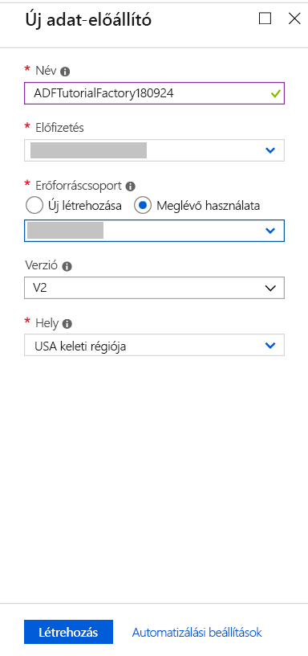

# Adat-előállító létrehozása az Azure Portal használatával
> [!div class="op_single_selector" title1="Select the version of Data Factory service you are using:"]
> * [1. verzió – Általánosan elérhető](v1/data-factory-copy-data-from-azure-blob-storage-to-sql-database.md)
> * [2. verzió – Előzetes verzió](quickstart-create-data-factory-portal.md)

Az Azure Data Factory egy felhőalapú adatintegrációs szolgáltatás. Lehetővé teszi olyan, a felhőben futó, adatvezérelt munkafolyamatok létrehozását, amelyek alkalmasak az adatok átvitelének és átalakításának irányítására és automatizálására. Az Azure Data Factory segítségével létrehozhatók és ütemezhetők a különböző adattárolókból adatokat beolvasó adatvezérelt munkafolyamatok, feldolgozhatók és átalakíthatók az adatok különböző számítási szolgáltatások használatával (pl. Azure HDInsight Hadoop, Spark, Azure Data Lake Analytics és Azure Machine Learning), és a kimeneti adatok közzétehetők olyan adattárakban, mint például az Azure SQL Data Warehouse, ahonnan az üzleti intelligenciára épülő (BI-) alkalmazások felhasználhatják őket. 

Ebben a rövid útmutatóban egy adat-előállítót hoz létre az Azure Portal használatával. Miután létrehozta az adat-előállítót, a többi rövid útmutatóhoz hasonlóan a PowerShellt, a .NET SDK-t, a Python SDK-t vagy a REST API-t kell használnia adatfolyamatként, hogy adatokat másoljon a forrásadattárból a céladattárba. Jelenleg nem hozhatók létre folyamatok az adat-előállítóban az Azure Portal használatával.

> [!NOTE]
> Ez a cikk a Data Factory 2. verziójára vonatkozik, amely jelenleg előzetes verzióban érhető el. Ha a Data Factory szolgáltatás általánosan elérhető 1. verzióját használja, lásd a [Data Factory 1. verzió használatának első lépéseit](v1/data-factory-copy-data-from-azure-blob-storage-to-sql-database.md).

Ha nem rendelkezik Azure-előfizetéssel, első lépésként mindössze néhány perc alatt létrehozhat egy [ingyenes](https://azure.microsoft.com/free/) fiókot.

## Jelentkezzen be az Azure portálra.
Jelentkezzen be az [Azure portálra](https://portal.azure.com/).

## Data factory létrehozása
A rövid útmutató során a következő lépéseket fogja elvégezni:
1. Kattintson az **Új** elemre, majd az **Adatok + analitika**, végül a **Data Factory** elemre. 
   
   
2. Az **Új data factory** panelen írja be az **ADFTutorialDataFactory** kifejezést a **név** mezőbe. 
      
     
 
   Az Azure data factory nevének **globálisan egyedinek** kell lennie. Ha a következő hibaüzenetet kapja, módosítsa a data factory nevét (például sajátnévADFTutorialDataFactory-ra), majd próbálkozzon újra a létrehozással. A Data Factory-összetevők elnevezési szabályait a [Data Factory - Naming Rules](naming-rules.md) (Data Factory – Elnevezési szabályok) című témakörben találhatja.
  
       `Data factory name “ADFTutorialDataFactory” is not available`
3. Válassza ki azt az **Azure-előfizetést**, amelyben az adat-előállítót létre szeretné hozni. 
4. Az **erőforráscsoportban** hajtsa végre a következő lépések egyikét:
     
      - Kattintson a **Meglévő használata** elemre, majd a legördülő listából válasszon egy meglévő erőforráscsoportot. 
      - Kattintson az **Új létrehozása** elemre, és adja meg az erőforráscsoport nevét.   
         
      A rövid útmutató egyes lépései azt feltételezik, hogy az **ADFTutorialResourceGroup** nevet adta az erőforráscsoportnak. Az erőforráscsoportokkal kapcsolatos információkért tekintse meg a [Using resource groups to manage your Azure resources](../azure-resource-manager/resource-group-overview.md) (Erőforráscsoportok használata az Azure-erőforrások kezeléséhez) című cikket.  
4. Válassza a **V2 (előzetes verzió)** értéket a **verzió** esetén.
5. Válassza ki a Data Factory **helyét**. A Data Factory 2-es verziója jelenleg csak az USA keleti régiójában, az USA 2. keleti régiójában és a nyugat-európai régióban teszi lehetővé adat-előállítók létrehozását. Az adat-előállítók által használt adattárak (Azure Storage, Azure SQL Database stb.) és számítási erőforrások (HDInsight stb.) más régiókban is lehetnek.
6. Válassza a **Rögzítés az irányítópulton** lehetőséget.     
7. Kattintson a **Létrehozás** gombra.
      
      > [!IMPORTANT]
      > Data Factory-példány létrehozásához a [Data Factory közreműködője](../active-directory/role-based-access-built-in-roles.md#data-factory-contributor) szerepkör tagjának kell lennie az előfizetés/erőforráscsoport szintjén.
      > 
      > A data factory neve később DNS-névként regisztrálható, így nyilvánosan láthatóvá válhat.             
3. Az irányítópulton megjelenő csempén a következő állapotleírás látható: **Adat-előállító üzembe helyezése**. 

    
1. A létrehozás befejezése után a **Data Factory** panel a képen látható módon jelenik meg.
   
   

## Következő lépések
A példában szereplő folyamat adatokat másol az egyik helyről egy másikra egy Azure Blob Storage-ban. A Data Factory más forgatókönyvekben való használatát ismertető további információkért tekintse meg az [oktatóanyagokat](tutorial-copy-data-dot-net.md). 