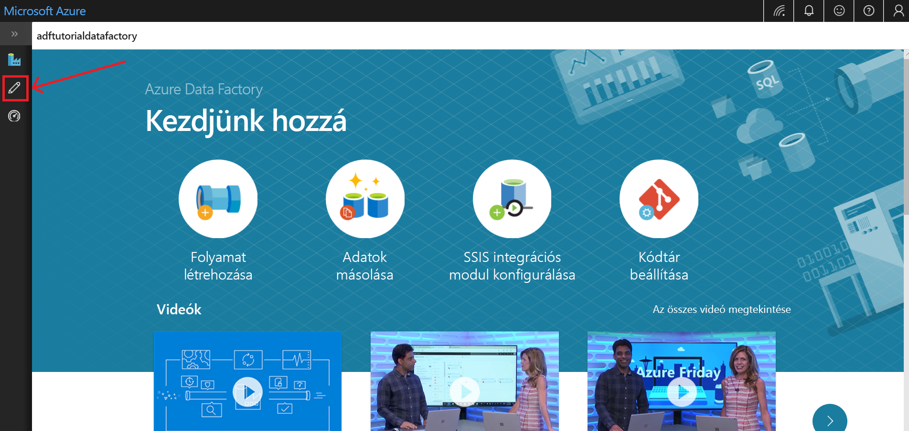
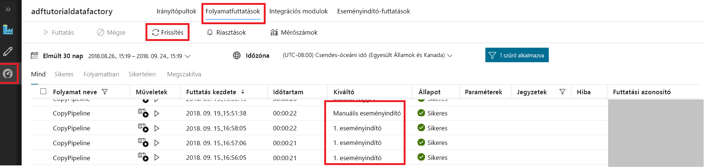
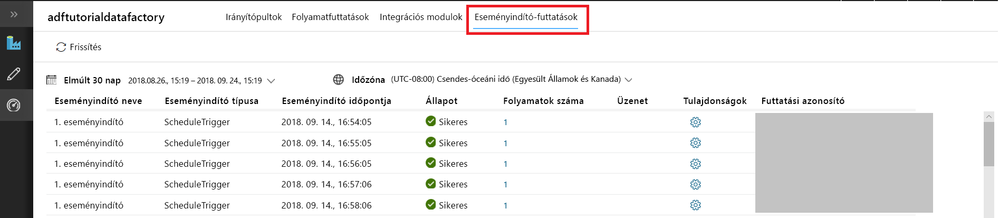

# Adat-előállító létrehozása az Azure Data Factory felhasználói felületén
> [!div class="op_single_selector" title1="Select the version of Data Factory service that you are using:"]
> * [1. verzió – Általánosan elérhető](v1/data-factory-copy-data-from-azure-blob-storage-to-sql-database.md)
> * [2. verzió – Előzetes verzió](quickstart-create-data-factory-portal.md)

Ez a rövid útmutató ismerteti, hogyan használható az Azure Data Factory felhasználói felülete egy adat-előállító létrehozásához és monitorozásához. Az adat-előállítóban létrehozott folyamat adatokat *másol* az Azure-blobtároló egyik mappájából egy másikba. Az adatok Azure Data Factoryval történő *átalakításának* útmutatásáért olvassa el az [az adatok Spark segítségével történő átalakítását ismertető oktatóanyagot](tutorial-transform-data-spark-portal.md). 

> [!NOTE]
> Ha még csak ismerkedik az Azure Data Factory szolgáltatással, a gyors útmutató elvégzése előtt tekintse meg a következő cikket: [Bevezetés az Azure Data Factory használatába](data-factory-introduction.md). 
>
> Ez a cikk a Data Factory 2. verziójára vonatkozik, amely jelenleg előzetes verzióban érhető el. Ha a szolgáltatás általánosan elérhető 1. verzióját használja, olvassa el a [Data Factory 1. verzió használatának útmutatóját](v1/data-factory-copy-data-from-azure-blob-storage-to-sql-database.md).

[!INCLUDE [data-factory-quickstart-prerequisites](../../includes/data-factory-quickstart-prerequisites.md)] 

### Videó 
A következő videó megtekintése segíthet az Azure Data Factory felhasználói felületének megismerésében: 
>[!VIDEO https://channel9.msdn.com/Shows/Azure-Friday/Visually-build-pipelines-for-Azure-Data-Factory-v2/Player]

## Data factory létrehozása

1. Indítsa el a **Microsoft Edge** vagy a **Google Chrome** böngészőt. A Data Factory felhasználói felületének használata jelenleg csak a Microsoft Edge-ben és a Google Chrome-ban támogatott.
2. Nyissa meg az [Azure Portal](https://portal.azure.com). 
3. Kattintson az **Új** elemre a bal oldali menüben, majd az **Adatok + analitika**, végül a **Data Factory** elemre. 
   
   
2. Az **Új data factory** lap **Név** mezőjében adja meg az **ADFTutorialDataFactory** értéket. 
      
   
 
   Az Azure data factory nevének *globálisan egyedinek* kell lennie. Ha a következő hibaüzenetet kapja, módosítsa az adat-előállító nevét (például a **&lt;sajátneve&gt;ADFTutorialDataFactory** értékre), majd próbálkozzon újra a létrehozással. A Data Factory-összetevők elnevezési szabályait a [Data Factory elnevezési szabályait](naming-rules.md) ismertető cikkben találja.
  
   
3. **Előfizetés:** válassza ki azt az Azure-előfizetést, amelyben az adat-előállítót létre szeretné hozni. 
4. **Erőforráscsoport:** hajtsa végre a következő lépések egyikét:
     
   - Kattintson a **Meglévő használata** elemre, majd válasszon egy meglévő erőforráscsoportot a listából. 
   - Kattintson az **Új létrehozása** elemre, és adja meg az erőforráscsoport nevét.   
         
   Az erőforráscsoportokkal kapcsolatos információkért tekintse meg a [Using resource groups to manage your Azure resources](../azure-resource-manager/resource-group-overview.md) (Erőforráscsoportok használata az Azure-erőforrások kezeléséhez) című cikket.  
4. **Verzió:** válassza a **V2 (előzetes verzió)** értéket.
5. **Hely:** válassza ki az adat-előállító helyét.

   Csak a Data Factory által támogatott helyek jelennek meg a listában. A Data Factory által használt adattárak (Azure Storage, Azure SQL Database stb.) és számítási erőforrások (Azure HDInsight stb.) más helyeken is lehetnek.
6. Válassza a **Rögzítés az irányítópulton** lehetőséget.     
7. Kattintson a **Létrehozás** gombra.
8. Az irányítópulton megjelenő csempén a **Adat-előállító üzembe helyezése** állapotleírás látható: 

   
9. A létrehozás befejezése után megjelenik a **Data Factory** lap. Az Azure Data Factory felhasználói felületi (UI) alkalmazás külön lapon történő elindításához kattintson a **Tartalomkészítés és monitorozás** csempére.
   
   
10. Az **Első lépések** lapon váltson a **Szerkesztés** lapra a bal oldali ablaktáblán. 

    

## Társított szolgáltatás létrehozása
A feladat részeként létrehoz egy társított szolgáltatást, hogy az adat-előállítóhoz kapcsolja az Azure Storage-fiókot. A társított szolgáltatás azon kapcsolatadatokkal rendelkezik, amelyeket a Data Factory szolgáltatás használ futtatáskor a hozzá való kapcsolódáshoz.

1. Kattintson a **Kapcsolatok** elemre, majd az eszköztáron kattintson az **Új** gombra. 

       
2. Az **Új társított szolgáltatás** lapon válassza az **Azure Blob Storage** lehetőséget, majd kattintson a **Folytatás** gombra. 

   
3. Hajtsa végre a következő lépéseket: 

   a. A **Név** mezőbe írja be az **AzureStorageLinkedService** nevet.

   b. A **Storage-fiók neve** mezőben válassza ki saját Azure Storage-fiókja nevét.

   c. Kattintson a **Kapcsolat tesztelése** elemre annak ellenőrzéséhez, hogy a Data Factory szolgáltatás kapcsolódik-e a tárfiókhoz. 

   d. A társított szolgáltatás mentéséhez kattintson a **Mentés** gombra. 

    
4. Győződjön meg róla, hogy az **AzureStorageLinkedService** szerepel-e a társított szolgáltatások listájában. 

   

## Adatkészletek létrehozása
A feladat részeként két adatkészletet hoz létre, az **InputDataset** és az **OutputDataset** adatkészletet. Ezek az adatkészletek **AzureBlob** típusúak. Az előző szakaszban létrehozott Azure Storage-beli társított szolgáltatásra hivatkoznak. 

A bemeneti adatkészlet a bemeneti mappában lévő forrásadatokat jelenti. A bemeneti adatkészlet definíciójában adhatja meg a forrásadatokat tartalmazó blobtároló (**adftutorial**), mappa (**input**) és fájl (**emp.txt**) nevét. 

A kimeneti adatkészlet a célhelyre másolt adatokat jelenti. A kimeneti adatkészlet definíciójában adhatja meg annak a blobtárolónak (**adftutorial**), mappának (**output**) és fájlnak a nevét, amelybe az adatok át lesznek másolva. Egy folyamat minden egyes futtatásához egyedi azonosító tartozik. Ehhez az azonosítóhoz a **RunId** rendszerváltozó használatával férhet hozzá. A rendszer a folyamatfuttatási azonosító alapján dinamikusan kiértékeli a kimeneti fájl nevét.   

A társított szolgáltatás beállításainál megadta a forrásadatokat tartalmazó Azure Storage-fiókot. A forrásadatkészlet beállításainál megadja a forrásadatok pontos helyét (blobtároló, mappa és fájl). A fogadó adatkészlet beállításainál megadja az adatok másolásának célhelyét (blobtároló, mappa és fájl). 
 
1. Válassza a **+** (plusz) gombot, majd az **Adatkészlet** lehetőséget.

   
2. Az **Új adatkészlet** lapon válassza az **Azure Blob Storage** lehetőséget, majd kattintson a **Befejezés** gombra. 

   
3. Az adatkészlet **Tulajdonságok** ablakában adja meg az **InputDataset** értéket a **Név** mezőben. 

   
4. Váltson a **Kapcsolat** lapra, és végezze el az alábbi lépéseket: 

   a. **Társított szolgáltatás**: válassza az **AzureStorageLinkedService** értéket.

   b. **Fájl elérési útja**: kattintson a **Tallózás** gombra.

       c. A **Fájl vagy mappa kiválasztása** ablakban keresse meg az **input** mappát az **adftutorial** tárolóban, válassza ki az **emp.txt** fájlt, és kattintson a **Befejezés** elemre.

      
    
   d. (nem kötelező) Az emp.txt fájlban lévő adatok előnézetének megtekintéséhez kattintson az **Adatok villámnézete** elemre.     
5. A kimeneti adatkészlet létrehozásához ismételje meg ezeket a lépéseket:  

   a. Válassza a **+** (plusz) gombot, majd az **Adatkészlet** lehetőséget.

   b. Az **Új adatkészlet** lapon válassza az **Azure Blob Storage** lehetőséget, majd kattintson a **Befejezés** gombra.

   c. Adja meg az **OutputDataset** nevet.

   d. Adja meg az **adftutorial/output** mappát. Ha a **kimeneti** mappa nem létezik, a másolási tevékenység létrehozza futásidőben.

   e. Adja meg a következő fájlnevet: `@CONCAT(pipeline().RunId, '.txt')`. 
   
      Minden folyamatfuttatáshoz egyedi azonosító tartozik. Ez a kifejezés összefűzi a folyamat azonosítóját a **.txt** kiterjesztéssel a kimeneti fájl nevének kiértékeléséhez. A támogatott rendszerváltozók és kifejezések listáját lásd a [rendszerváltozókat](control-flow-system-variables.md) és a [kifejezésnyelveket](control-flow-expression-language-functions.md) ismertető cikkekben.

   

## Folyamat létrehozása 
A feladat részeként létrehozza és megerősíti azt a másolási tevékenységgel rendelkező folyamatot, amely a bemeneti és a kimeneti adatkészletet használja. A másolási tevékenység adatokat másol a bemeneti adatkészlet beállításaiban megadott fájlból a kimeneti adatkészlet beállításaiban megadott fájlba. Ha a bemeneti adatkészlet csak egy mappát ad meg (de fájlnevet nem), a másolási tevékenység a forrásmappában található összes fájlt átmásolja a célhelyre. 

1. Válassza a **+** (plusz) gombot, majd a **Folyamat** elemet. 

   
2. A **Tulajdonságok** ablakban a **CopyPipeline** értéket adja meg a **Név** mezőben. 

   
3. A **Tevékenységek** eszközkészletben bontsa ki az **Adatfolyam** elemet. Húzza a **Másolás** tevékenységet a **Tevékenységek** eszközkészletből a folyamat tervezőfelületére. A **Tevékenységek** eszközkészletben kereshet is az egyes tevékenységek között. Adja meg a **CopyFromBlobToBlob** értéket a **Név** mezőben.

   
4. Váltson a **Forrás** lapra a másolási tevékenység beállításainál, és válassza az **InputDataset** lehetőséget a **Forrásadatkészlet** mezőben.

       
5. Váltson a **Fogadó** lapra a másolási tevékenység beállításainál, és válassza az **OutputDataset** lehetőséget a **Fogadó adatkészlet** mezőben.

       
7. A folyamatbeállítások érvényesítéséhez kattintson az **Érvényesítés** elemre. Győződjön meg róla, hogy a folyamat érvényesítése sikerült. Az érvényesítés kimenetének bezárásához kattintson a **>>** (jobbra mutató nyíl) gombra. 

   

## A folyamat próbafuttatása
Ebben a lépésben elvégzi a folyamat tesztfuttatását a Data Factoryban történő üzembe helyezés előtt. 

1. A folyamat eszköztárán kattintson a **Tesztfuttatás** elemre. 
    
   
2. Győződjön meg róla, hogy látja a folyamatfuttatás állapotát a folyamat beállításainak **Kimenet** lapján. 

       
3. Győződjön meg róla, hogy a kimeneti fájl látható az **adftutorial** tároló **output** mappájában. Ha a kimeneti mappa nem létezik, a Data Factory szolgáltatás automatikusan létrehozza. 
    
   

## A folyamat manuális aktiválása
A feladat részeként entitásokat (társított szolgáltatásokat, adatkészleteket és folyamatokat) helyez üzembe az Azure Data Factoryban. Ezután manuálisan fogja aktiválni a folyamat futtatását. Egy [másik oktatóanyagban](tutorial-copy-data-portal.md?#configure-code-repository) leírt módon közzé is teheti ezeket az entitásokat saját Visual Studio Team Services Git-adattárában.

1. A folyamat aktiválása előtt közzé kell tennie az entitásokat a Data Factory számára. A közzétételhez a bal oldali ablaktáblán kattintson az **Összes közzététele** elemre. 

   
2. A folyamat manuális aktiválásához kattintson az **Aktiválás** elemre az eszköztáron, majd válassza az **Aktiválás most** lehetőséget. 
    
   

## A folyamat figyelése

1. Váltson a bal oldali **Monitorozás** lapra. A lista frissítéséhez kattintson a **Frissítés** elemre.

   
2. Kattintson a **Műveletek** alatt található **Tevékenységfuttatások megtekintése** hivatkozásra. Ezen a lapon látható a másolási tevékenység futtatási állapota. 

   
3. A másolási művelet részleteinek megtekintéséhez kattintson a **Műveletek** oszlop **Részletek** hivatkozására (szemüveg ikon). A tulajdonságokkal kapcsolatos részletekért tekintse meg a [másolási tevékenység áttekintését](copy-activity-overview.md). 

   
4. Győződjön meg arról, hogy megjelenik egy új fájl az **output** mappában. 
5. A **Folyamatok** hivatkozásra kattintva visszaválthat a **Tevékenységfuttatások** nézetről a **Folyamatfuttatások** nézetre. 

## A folyamat aktiválása ütemezés szerint
Az oktatóanyagnak ez a feladata nem kötelező. A folyamat rendszeres időközönként (például óránként, naponta) történő futtatásához létrehozhat egy *ütemező eseményindítót*. A feladat részeként egy olyan eseményindítót fog létrehozni, amely a megadott záró dátumig és időpontig percenként fut. 

1. Váltson a **Szerkesztés** lapra. 

   
1. Kattintson a menü **Aktiválás** elemére, majd az **Új/Szerkesztés** elemre. 

   
2. Az **Eseményindítók hozzáadása** lapon kattintson az **Eseményindító kiválasztása**, majd pedig az **Új** elemre. 

   
3. Az **Új eseményindító** lapon a **Befejezés** alatt válassza a **Dátumon** lehetőséget, állítsa be a befejezés időpontját néhány perccel az aktuális időpont utánra, majd kattintson az **Alkalmaz** elemre. 

   Minden egyes folyamatfuttatásnak van bizonyos költségvonzata, ezért a befejezés időpontját csak néhány perccel a kezdés időpontja utánra állítsa be. Győződjön meg arról, hogy a két időponthoz tartozó dátum megegyezik. Arról is győződjön meg, hogy elegendő idő áll rendelkezésre a folyamat futtatásához a közzététel időpontja és a befejezés időpontja között. Az eseményindító csak a Data Factoryban való közzététel után lesz aktív, a felhasználói felületen történő mentéskor még nem. 

   
4. Az **Új eseményindító** lapon kattintson az **Aktiválva** jelölőnégyzetbe, majd kattintson a **Tovább** elemre. 

   
5. Tekintse át a figyelmeztető üzenetet, és kattintson a **Befejezés** gombra.

   
6. Kattintson az **Összes közzététele** gombra a Data Factory módosításainak közzétételéhez. 

   
8. Váltson a bal oldali **Monitorozás** lapra. A lista frissítéséhez kattintson a **Frissítés** gombra. Láthatja, hogy a folyamat percenként fut a közzététel időpontja és a befejezés időpontja között. 

   Figyelje meg az **Aktiválva a következő alapján** oszlop értékeit. A manuális eseményindító-futtatás egy korábban elvégzett lépésből (**Aktiválás most**) származik. 

   
9. Kattintson a **Folyamatfuttatások** melletti lefelé mutató nyílra az **Eseményindító-futtatások** nézetre való átváltáshoz. 

       
10. Győződjön meg arról, hogy a megadott befejezési dátumig és időpontig futtatott minden folyamatfuttatáshoz létrejött egy kimeneti fájl az **output** mappában. 

## További lépések
A példában szereplő folyamat adatokat másol az egyik helyről egy másikra az Azure Blob Storage-ban. A Data Factory más forgatókönyvekben való használatát ismertető további információért tekintse meg az [oktatóanyagokat](tutorial-copy-data-portal.md). 