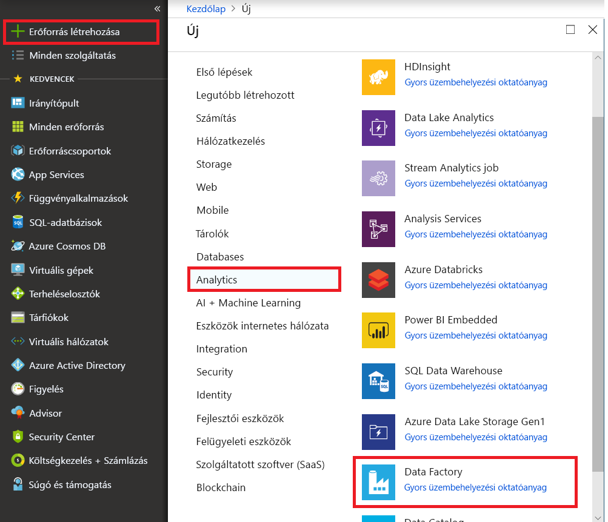

# Növekményes másolása az adatok másolása eszköz használatával LastModifiedDate alapján új és módosított fájlok

Ebben az oktatóanyagban egy adat-előállítót hoz létre az Azure Portal használatával. Ezt követően használhatja az adatok másolása eszközzel létrehoz egy folyamatot, amely a növekményes átmásolja az új és módosított fájlok csak az Azure Blob storage Azure Blob storage-ból a "LastModifiedDate" alapján. 

> [!NOTE]
> Ha még csak ismerkedik az Azure Data Factory használatával, olvassa el [az Azure Data Factory használatának első lépéseit](introduction.md) ismertető cikket.

Az oktatóanyagban az alábbi lépéseket fogja végrehajtani:

> [!div class="checklist"]
> * Adat-előállító létrehozása
> * Folyamat létrehozása az Adatok másolása eszközzel.
> * A folyamat és a tevékenységek futásának monitorozása

## Előfeltételek

* **Azure-előfizetés**: Ha nem rendelkezik Azure-előfizetéssel, mindössze néhány perc alatt létrehozhat egy [ingyenes fiókot](https://azure.microsoft.com/free/) a virtuális gép létrehozásának megkezdése előtt.
* **Az Azure storage-fiók**: Blob storage-ot használja a _forrás_ és _fogadó_ adattár. Ha még nem rendelkezik Azure Storage-fiókkal, a szükséges utasításokat a [Storage-fiók létrehozását](../storage/common/storage-quickstart-create-account.md) ismertető cikkben találja.

### Hozzon létre két tárolót a Blob storage-ban

A Blob storage előkészítése az oktatóanyaghoz elvégezhesse ezeket a lépéseket.

1. Hozzon létre egy tárolót **forrás**. Ennek elvégzéséhez különböző eszközök állnak rendelkezésére, például az [Azure Storage Explorer](https://storageexplorer.com/).

2. Hozzon létre egy tárolót **cél**. Ennek elvégzéséhez különböző eszközök állnak rendelkezésére, például az [Azure Storage Explorer](https://storageexplorer.com/).

## Data factory létrehozása

1. A bal oldali menüben válassza ki a **erőforrás létrehozása** > **adatok + analitika** > **adat-előállító**: 
   
   

2. Az **Új adat-előállító** lap **Név** mezőjében adja meg az **ADFTutorialDataFactory** értéket. 
      
     
 
   Az adat-előállító nevének _globálisan egyedinek_ kell lennie. A következő hibaüzenet jelenhet meg:
   
   

   Ha a név értékével kapcsolatos hibaüzenet kap, adjon meg másik nevet az adat-előállítóhoz. Például: _**sajátneve**_**ADFTutorialDataFactory**. A Data Factory-összetevők elnevezési szabályait a [Data Factory elnevezési szabályait](naming-rules.md) ismertető cikkben találja.
3. Válassza ki az Azure-**előfizetést** az új adat-előállító létrehozásához. 
4. **Erőforráscsoport:** hajtsa végre a következő lépések egyikét:
     
    a. Kattintson a **Meglévő használata** elemre, majd a legördülő listából válasszon egy meglévő erőforráscsoportot.

    b. Kattintson az **Új létrehozása** elemre, és adja meg az erőforráscsoport nevét. 
         
    Az erőforráscsoportokkal kapcsolatos információkért tekintse meg az [Erőforráscsoportok használata az Azure-erőforrások kezeléséhez](../azure-resource-manager/resource-group-overview.md) ismertető cikket.

5. A **Verzió** résznél válassza a **V2** értéket.
6. A **Hely** alatt válassza ki az adat-előállító helyét. A legördülő listán csak a támogatott helyek jelennek meg. Az adat-előállítók által használt adattárak (például Azure Storage és SQL Database) és számítási erőforrások (például Azure HDInsight) más helyeken/régiókban is lehetnek.
7. Válassza a **Rögzítés az irányítópulton** lehetőséget. 
8. Kattintson a **Létrehozás** gombra.
9. Az irányítópulton a folyamat állapotát az **Adat-előállító üzembe helyezése** csempe jelzi.

    
10. A létrehozás befejezése után a **Data Factory** kezdőlapja jelenik meg.
   
    
11. Az Azure Data Factory felhasználói felületének (UI) külön lapon történő megnyitásához kattintson a **Tartalomkészítés és monitorozás** csempére. 

## Folyamat létrehozása az Adatok másolása eszközzel

1. Az a **első lépések** lapon válassza ki a **adatok másolása** címére, ha az adatok másolása eszköz elindításához. 

   
   
2. Az a **tulajdonságok** lapon, tegye a következőket:

    a. A **feladatnév**, adja meg **DeltaCopyFromBlobPipeline**.

    b. A **feladat kiadása ütemben történik, vagy a feladat ütemezés**válassza **rendszeres ütemezés szerint fut**.

    c. A **típusú Trigger**válassza **Átfedésmentes ablak**.
    
    d. A **ismétlődési**, adja meg **15 percen belül**. 
    
    e. Kattintson a **Tovább** gombra. 
    
    A Data Factory felhasználói felülete létrehoz egy folyamatot a megadott feladatnéven. 

    
    
3. A **Forrásadattár** oldalon hajtsa végre az alábbi lépéseket:

    a. Kattintson a **+ új kapcsolat létrehozása**, kapcsolatot szeretne hozzáadni.
    
    

    b. Válassza ki **Azure Blob Storage** a katalógusban, és kattintson a **Folytatás**.
    
    

    c. Az a **új társított szolgáltatás** lapon, válassza ki a storage-fiókjában az **Tárfiók neve** listában, és kattintson a **Befejezés**.
    
    
    
    d. Válassza ki az újonnan létrehozott társított szolgáltatást, majd kattintson a **tovább**. 
    
   

4. **A bemeneti fájl vagy mappa kiválasztása** oldalon kövesse az alábbi lépéseket:
    
    a. Keresse meg és válassza a **forrás** mappát, majd kattintson a **válasszon**.
    
    
    
    b. A **viselkedését fájl**válassza **növekményes betöltés: LastModifiedDate**.
    
    
    
    c. Ellenőrizze **bináris másolat** kattintson **tovább**.
    
     
     
5. Az a **célként megadott adattárba** lapon válassza ki a **Azure BLOB Storage szolgáltatásról** Ez az ugyanazon a tárterületen forrás adattárként fiókra, és kattintson **tovább**.

    
    
6. Az a **a kimeneti fájl vagy mappa kiválasztása** lapon, tegye a következőket:
    
    a. Keresse meg és válassza a **cél** mappát, majd kattintson a **válasszon**.
    
    
    
    b. Kattintson a **tovább**.
    
     
    
7. A **Beállítások** lapon kattintson a **Tovább** gombra. 

    
    
8. Az **Összefoglalás** lapon tekintse át a beállításokat, majd kattintson a **Tovább** gombra.

    
    
9. A folyamat (feladat) figyeléséhez az **Üzembe helyezés** lapon kattintson a **Monitorozás** elemre.

    
    
10. Figyelje meg, hogy a bal oldalon található **Figyelés** lap automatikusan ki lesz választva. A tevékenységfuttatási részletek megtekintéséhez és a folyamat ismételt futtatásához használható hivatkozások a **Műveletek** oszlopban találhatók. Válassza ki **frissítése** frissítse a listát, és válassza ki a **Tevékenységfuttatások megtekintése** hivatkozásra a **műveletek** oszlop. 

    

11. Csak egy (másolási) tevékenység található a folyamatban, ezért csak egy bejegyzést lát. A másolási művelet részleteinek megtekintéséhez válassza a **Műveletek** oszlop **Részletek** hivatkozását (szemüveg ikon). 

    
    
    Tekintettel arra, hogy nem áll fájl a **forrás** a blob storage-fiókjában, ezért nem jelenik meg minden olyan fájlt, amely a rendszer átmásolt tárolót **cél** tárolót a blob storage-fiókban.
    
    
    
12. Hozzon létre egy üres szövegfájlba, és nevezze el másként file1.txt. Töltse fel a file1.txt fájlt a **forrás** a storage-fiókban lévő tárolóba. Ennek elvégzéséhez különböző eszközök állnak rendelkezésére, például az [Azure Storage Explorer](https://storageexplorer.com/).   

    
    
13. Vissza a **Folyamatfuttatások** nézetben válassza **minden folyamatok Futtatás**, és várjon, amíg a azonos folyamat aktiválása automatikusan újra.  

    

14. Válassza ki **nézet Tevékenységfuttatás** a második Futtatás folyamatot, ha a látható származnak, és tegye meg ugyanezt részleteihez.  

    

    Látni fogja (file1.txt) egy fájlt átmásolja a **forrás** tárolót, hogy a **cél** tárolót a storage-fiók.
    
    
    
15. Hozzon létre egy másik üres szövegfájlt, és nevezze el másként fájl2.ref fájllal. Töltse fel a Fájl2.ref fájllal fájlt a **forrás** a storage-fiókban lévő tárolóba. Ennek elvégzéséhez különböző eszközök állnak rendelkezésére, például az [Azure Storage Explorer](https://storageexplorer.com/).  
    
16. Tegye meg ugyanezt 13 és 14. lépés, és láthatja, hogy csak az új fájl (fájl2.ref fájllal) másolta a **forrás** tárolót, hogy a **cél** tárolót a storage-fiók található a következő folyamatfuttatáshoz.  
    
    

    Is ellenőrizheti az azonos Azure Storage Explorer használatával (https://storageexplorer.com/) megvizsgálja a fájlokat.
    
    

    
## További lépések
Folytassa a következő oktatóanyaggal, amelyben az adatok Azure Spark-fürtök használatával való átalakítását ismerheti meg:

> [!div class="nextstepaction"]
>[Adatok átalakítása a felhőben a Spark használatával](tutorial-transform-data-spark-portal.md)