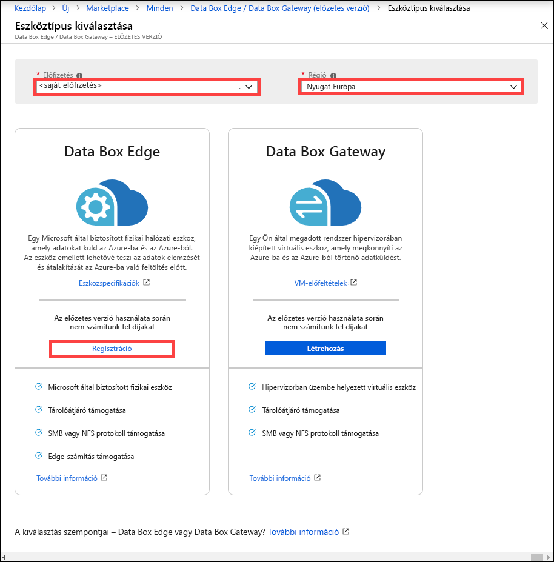
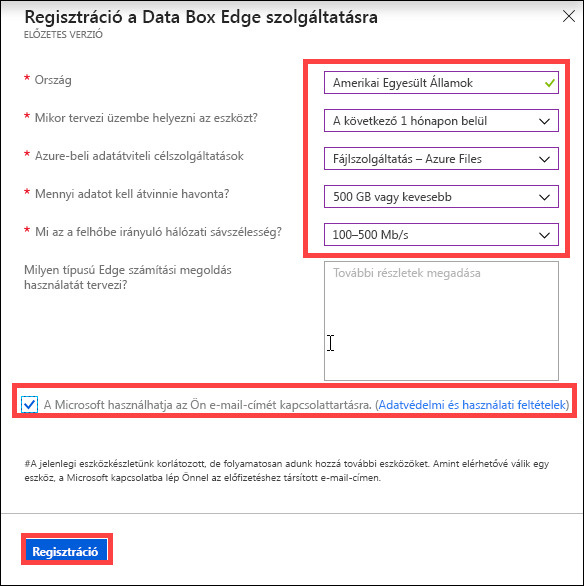

# Mi az Azure Data Box Edge? 

Az Azure Data Box Edge egy olyan tárolási megoldás, amelynek használatával adatokat dolgozhat fel, majd egy hálózaton keresztül elküldheti azokat az Azure-ba. Ez a cikk áttekintést nyújt a Data Box Edge megoldásról, annak előnyeiről, főbb képességeiről és azokról a forgatókönyvekről, amelyekben üzembe helyezheti ezt az eszközt. 

A Data Box Edge egy Microsoft által biztosított fizikai eszközt használ a biztonságos adatátvitel felgyorsításához. A fizikai eszköz a helyszínen üzemel, és Ön írja rá az adatokat az NFS és az SMB protokoll használatával. 

A Data Box Edge a Data Box Gateway összes átjáró-képességével rendelkezik. A Data Box ezen kívül mesterséges intelligenciára épülő peremhálózati számítási képességekkel is rendelkezik, amelyek segítenek az adatok elemzésében, feldolgozásában és szűrésében az Azure blokkblobba, lapblobba vagy az Azure Filesba való átvitelük során.  

## Használati esetek

Az Azure Data Box Edge egy mesterséges intelligenciára épülő peremhálózati számításokat végző eszköz, amely hálózati adatátviteli képességekkel rendelkezik. Íme a különböző forgatókönyvek, amelyekben a Data Box Edge adatátvitelhez használható.

- **Adatok előfeldolgozása** – Adatokat elemezhet helyszíni vagy IoT-eszközökről, így gyorsan megkaphatja az eredményeket, miközben az adatok keletkezési helyének közelében maradhat. A Data Box Edge a teljes adatkészletet átviszi a felhőbe, így összetettebb feldolgozási műveleteket és mélyebb elemzést tud végrehajtani.  Az előfeldolgozás az alábbiakra használható: 

    - Adatok összesítése.
    - Adatok módosítása, például a személyes azonosításra alkalmas adatok (PII) eltávolítása.
    - A szükséges adatok csoportosítása és átvitele a felhőbe mélyebb elemzésre.
    - Az IoT-események elemzése és reagálás rájuk 

- **Azure Machine Learning-következtetés** – A Data Box Edge használatával Machine Learning- (ML-) modelleket futtathat a gyors eredmények elérése érdekében, amelyeket még azelőtt használhat fel, hogy az adatok a felhőbe kerülnének. A rendszer a teljes adatkészlet átvitelét elvégzi ML-modellek folyamatos újratanítása és fejlesztése érdekében.

- **Adatátvitel az Azure-ba hálózaton keresztül** – A Data Box Edge használatával könnyedén és gyorsan vihet át adatot az Azure-ba további számítási feladatok vagy elemzések elvégzéséhez, illetve archiválás céljából. 

## Előnyök

A Data Box Edge az alábbi előnyökkel jár:

- **Egyszerű adatátvitel** – Használatával olyan könnyedén helyezhet át adatokat az Azure Storage-ból vagy az Azure Storage-ba, mintha csak egy helyi hálózati megosztással dolgozna.  
- **Nagy teljesítmény** – Lehetővé teszi az adatok nagy teljesítményű átvitelét az Azure-ba, vagy onnan máshová. 
- **Gyors hozzáférés** – A legutóbbi fájlokat a gyorsítótárba menti a helyszíni fájlok gyorsabb elérése érdekében.  
- **Korlátozott sávszélesség-használat** – Az Azure-ba akkor is lehet adatot írni, amikor a hálózat használata a csúcsidő során korlátozva van.  
- **Adatok átalakítása** – Lehetővé teszi az adatok elemzését, feldolgozását és szűrését azok Azure-ba való átvitelekor.

## Főbb képességek

A Data Box Edge az alábbi képességekkel rendelkezik:

|Képesség |Leírás  |
|---------|---------|
|Nagy teljesítmény     | Teljesen automatizált és nagymértékben optimalizált adatátvitel és sávszélesség.|
|Támogatott protokollok     | A standard SMB és NFS protokollok támogatása az adatbetöltéshez.   A támogatott verziókkal kapcsolatos további információért tekintse meg [a Data Box Edge rendszerkövetelményeit](https://aka.ms/dbe-docs).|
|Számítás       |Lehetővé teszi az adatok elemzését, feldolgozását és szűrését.|
|Az adatok elérése     | Az adatok közvetlen elérése az Azure Storage-blobokból és az Azure Filesból felhőalapú API-k használatával az adatok további feldolgozásához a felhőben.|
|Gyors hozzáférés     | Az eszközön helyi gyorsítótár található, amellyel gyorsabban elérhetők a legutóbb használt fájlok.|
|Offline feltöltés     | A kapcsolat nélküli mód támogatja az offline feltöltési forgatókönyveket.|
|Adatfrissítés     | Lehetőség van a helyi fájlok legújabb változatra való frissítésére a felhőből.|
|Titkosítás    | A BitLocker támogatja az adatok helyi titkosítását és biztonságos átvitelét a felhőbe *https*-en keresztül.       |
|Rugalmasság     | Beépített hálózati rugalmasság.        |

## Funkciók és specifikációk

A Data Box Edge fizikai eszköz az alábbi funkciókkal rendelkezik:

| Funkciók/specifikációk                                          | Leírás              |
|---------------------------------------------------------|--------------------------|
| Dimenziók   | Szélesség: 17.25" mélysége: 27.25" height: 1.75” (nem tartalmazza a füleket és a PSU-fogantyúkat)  |            
| Kiszolgálószekrény-terület|1U a kiszolgálószekrénybe helyezve|
| Kábelek| 2 db tápkábel 2 db 1 Gbps sávszélességű RJ45 kábel 2 db 10 Gbps sávszélességű SFP+ rézkábel|
| Összetevők|2 db beépített tápegység (PSU)|
| CPU|2 db, egyenként 10 magos Intel Xeon processzor  |
| Memory (Memória)| 64 GB RAM|
| Lemezek| 8 NVMe SSD meghajtó, a lemezek mindegyike 1,6 TB-os   A rendszer működése leáll, ha az NVMe SSD meghajtók valamelyike meghibásodik. |
| Helyi tárolási kapacitás| 12,8 TB teljes kapacitás|
| Hálózati illesztők| 2 db 1 GbE sávszélességű illesztő – 1 a kezeléshez, a felhasználó által nem konfigurálható, a kezdeti beállításhoz való. A többi felület felhasználó által konfigurálható, az adatátvitelhez használható, és a DHCP alapértelmezés szerint.  2 db 25 GbE sávszélességű illesztő – 10 GbE sávszélességű illesztőként is üzemelnek. Az adatillesztők a felhasználó által megadott konfigurációja DHCP (alapértelmezett) vagy statikus lehet.   2 db 25 GbE sávszélességű illesztő – Az adatillesztők a felhasználó által megadott konfigurációja DHCP (alapértelmezett) vagy statikus lehet.|

## Összetevők

A Data Box Edge megoldás a Data Box Edge-erőforrásból, a Data Box Edge fizikai eszközből és egy helyi webes felhasználói felületből áll.

* **Data Box Edge fizikai eszköz** – 1U állványra szerelt, Microsoft által biztosított kiszolgáló, amely az Azure-ba való adatküldésre konfigurálható. 
    
* **Data Box Edge-erőforrás** – Az Azure Portal erőforrása, amely segítségével a Data Box Edge eszköz különböző földrajzi helyekről elérhető webes felületről kezelhető. A Data Box Edge-erőforrás használatával erőforrásokat készíthet és kezelhet, eszközöket és riasztásokat tekinthet meg és kezelhet, illetve megosztásokat kezelhet.  

    <!---->

    További információ: [A Data Box Edge szolgáltatás használata a Data Box Edge eszköz felügyeletére](https://aka.ms/dbe-docs).

* **Data Box helyi webes felhasználói felület** – A helyi webes felhasználói felülettel diagnosztikát futtathat, leállíthatja és újraindíthatja a Data Box Edge eszközt, megtekintheti a másolási naplókat, valamint szolgáltatáskérések elküldése érdekében kapcsolatba léphet a Microsoft ügyfélszolgálatával.

    <!---->

    A webalapú felhasználói felület használatáról a [Data Box a webalapú felhasználói felülettel végzett felügyeletéről](https://aka.ms/dbe-docs) szóló cikkből tájékozódhat.

## Régiónkénti elérhetőség

A Data Box Edge fizikai eszköznek, az Azure-erőforrásnak és a céloldali tárfióknak, amelybe átviszi az adatokat, nem kell egyazon régióban lenniük.

- **Az erőforrás elérhetősége** – Ebben a kiadásban a Data Box Edge-erőforrás a következő régiókban érhető el:
    - **Egyesült Államok** – Az USA 2. nyugati régiója és az USA keleti régiója
    - **Európai Unió** – Nyugat-Európa
    - **Ázsia és a Csendes-óceáni térség** – Délkelet-Ázsia

- **Céloldali tárfiókok** – Az adatokat tároló tárfiókok minden Azure-régióban elérhetők. 

    A Data Box adatait tároló tárfiókok régióinaknak az eszköz közelében kell lennie az optimális teljesítmény elérése érdekében. Az eszköztől távol található tárfiók esetében hosszú késések és lassabb teljesítmény várható. 

## Regisztráció

A Data Box Edge előzetes verzióban érhető el, és a használatához regisztráció szükséges. A Data Box Gateway szolgáltatáshoz való regisztrációhoz hajtsa végre a következő lépéseket:

1. Jelentkezzen be az Azure Portalra itt: [https://aka.ms/databox-edge](https://aka.ms/databox-edge).

2. Válassza ki a Data Box Edge előzetes verziójához használni kívánt előfizetést. Válassza ki a régiót, ahol üzembe szeretné helyezni a Data Box Edge-erőforrást. A Data Box Edge lehetőségnél kattintson a **Regisztráció** elemre.

    

3.  Válaszoljon a kérdésekre az adatok tárolási helye szerinti országról, az időkeretről, az adatátviteli cél Azure-szolgáltatásról, a hálózati sávszélességről, valamint az adatátviteli gyakoriságról. Tekintse át az **adatvédelmi és felhasználási feltételeket**, és a négyzet bejelölésével járuljon hozzá, hogy **a Microsoft használhassa az e-mail-címét az Önnel való kapcsolatfelvételhez**.

    

4. Miután regisztrált, és igénybe veheti az előzetes verziót, megrendelheti a Data Box Edge eszközt.

## További lépések

- A [Data Box Edge rendszerkövetelményeinek](https://aka.ms/dbe-docs) áttekintése.
- A [Data Box Edge korlátainak](https://aka.ms/dbe-docs) értelmezése.
- Az [Azure Data Box Edge](https://aka.ms/dbe-docs) üzembe helyezése az Azure Portalon.

