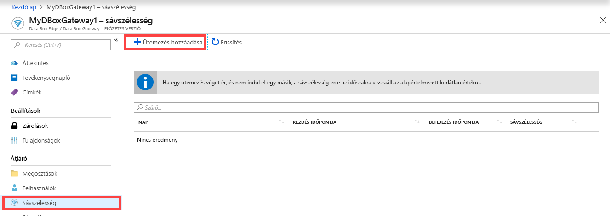
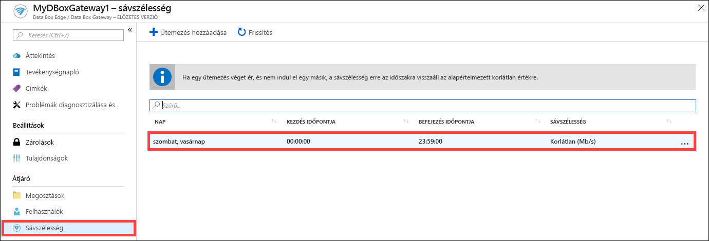
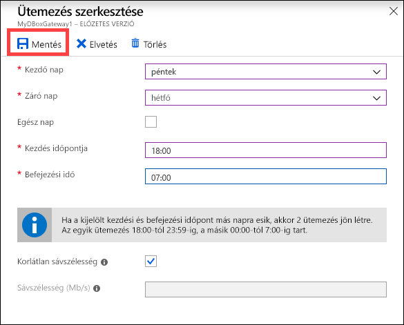
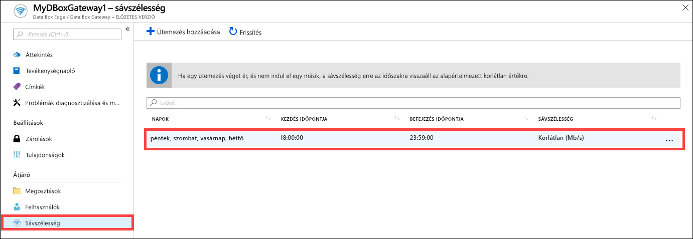
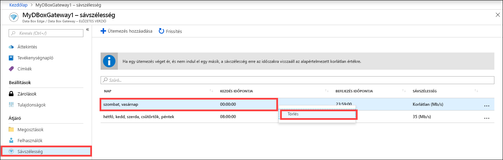

# Az Azure Data Box Gateway sávszélesség-ütemezési beállításait az Azure Portalon keresztül kezelheti  

Ez a cikk bemutatja, hogyan történik a felhasználók kezelése az Azure Data Box Gatewayben. A sávszélesség-ütemezéssel napi szinten szabályozható a hálózati sávszélesség felhasználása. Ezek az ütemezések az eszköz és a felhő közötti összes fel- és letöltési műveletre alkalmazhatók. 

A Data Box Gatewayre vonatkozó sávszélesség-ütemezéseket az Azure Portalon lehet hozzáadni, módosítani és törölni.

> [!IMPORTANT]
> - A Data Box Gateway előzetes verzióban érhető el. A megoldás megrendelése és üzembe helyezése előtt tekintse át az [Azure előzetes verziókra vonatkozó szolgáltatási feltételeit](https://azure.microsoft.com/support/legal/preview-supplemental-terms/).

Ebben a cikkben az alábbiakkal ismerkedhet meg:

> [!div class="checklist"]
> * Ütemezés hozzáadása
> * Ütemezés módosítása
> * Ütemezés törlése 

## Ütemezés hozzáadása

Felhasználó hozzáadásához hajtsa végre az alábbi lépéseket az Azure Portalon.

1. A Data Box Gateway-erőforráshoz tartozó Azure Portalon lépjen a **Sávszélesség** területre.
2. A jobb oldali panelen kattintson az **+ Ütemezés megadása** elemre.

    

3. Az **Ütemezés hozzáadása** területen: 

    1. Adja meg az ütemezés **Kezdő nap**, **Záró nap**, **Kezdés** és **Befejezés** paramétereinek értékeit. 
    2. Ha az adott ütemezés az egész napra vonatkozik, jelölje be az **Egész nap** jelölőnégyzetet. 
    3. A **Sávszélesség** az eszköz által felhasznált sávszélesség Mb/s-ban kifejezett értéke a felhőműveletek (fel- és letöltés egyaránt) esetében. Ebben a mezőben 1–1000 közötti értéket adjon meg. 
    4. Ha nem kívánja korlátozni a fel- és letöltéseket, válassza a **Korlátlan** sávszélesség-beállítást. 
    5. Kattintson a **Hozzáadás** parancsra.

    

3. Ekkor létrejön egy ütemezés a megadott paraméterekkel. Az ütemezés ezután megjelenik a portálon is, a sávszélesség-ütemezések listájában.

## Ütemezés szerkesztése

A sávszélesség-ütemezéseket az alábbi lépesek végrehajtásával szerkesztheti. 

1. Az Azure Portalon keresse meg a Data Box Gateway-erőforrást, majd lépjen a Sávszélesség területre. 
2. A sávszélesség-ütemezések listájában jelölje ki a módosítani kívánt ütemezést, majd kattintson rá.
    

3. Hajtsa végre és mentse a kívánt módosításokat.

    

4. Az ütemezés módosítása után annak megfelelően frissül az ütemezések listája.

    

## Ütemezés törlése

A Data Box Gateway-eszközhöz társított sávszélesség-ütemezéseket az alábbi lépesek végrehajtásával törölheti.

1. Az Azure Portalon keresse meg a Data Box Gateway-erőforrást, majd lépjen a **Sávszélesség** területre.  

2. A sávszélesség-ütemezések listájában válassza ki a törölni kívánt ütemezést. Jobb gombbal nyissa meg a helyi menüt, majd kattintson a **Törlés** elemre. 

   

3.  Az ütemezés törlése után frissül az ütemezések listája.

## További lépések

- További tudnivalókat a [sávszélesség-kezeléssel foglalkozó részben](data-box-gateway-manage-bandwidth-schedules.md) talál.
