# Az Azure Data Box Gateway megosztási beállításait az Azure Portalon keresztül kezelheti 

Ez a cikk bemutatja, hogyan történik a megosztások kezelése az Azure Data Box Gatewayben. Az Azure Data Box Gateway az Azure Portal használatával vagy a helyi webes felhasználói felületről felügyelhető. Az Azure Portalon megosztásokat adhat hozzá, törölhet vagy frissíthet, valamint szinkronizálhatja a megosztásokhoz rendelt tárfiók tárkulcsát.

## Információk a megosztásokról

Ha adatokat kíván átvinni az Azure-ba, megosztásokat kell létrehoznia az Azure Data Box Gatewayben. A Data Box Gateway-eszközben hozzáadott megosztások felhőmegosztások. Az ilyen megosztásokból származó adatokat a rendszer automatikusan feltölti a felhőbe. A felhőfunkciók mindegyike (például a Frissítés és a Tárkulcsok szinkronizálása) ezekre a megosztásokra is alkalmazva lesz. Akkor használjon felhőmegosztásokat, ha az eszköz adatait automatikusan le kívánja küldeni a felhőben található tárfiókba.

Ebben a cikkben az alábbiakkal ismerkedhet meg:

> [!div class="checklist"]
> * Megosztás hozzáadása
> * Megosztás törlése
> * Megosztások frissítése
> * Tárkulcs szinkronizálása

## Megosztás hozzáadása

Megosztás létrehozásához hajtsa végre a következő lépéseket az Azure Portalon.

1. Az Azure Portalon keresse meg a Data Box Gateway-erőforrást, majd lépjen az **Áttekintés** területre. A parancssávon kattintson a **+ Megosztás hozzáadása** gombra.
2. A **Megosztás hozzáadása** területen adja meg a megosztás beállításait. Adjon egy egyedi nevet a megosztásnak.

    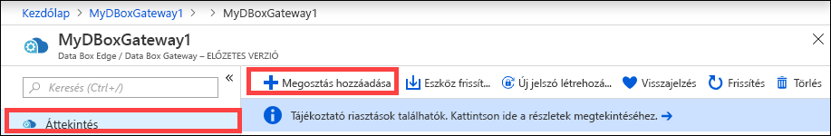

    A megosztások nevei csak számokat, kisbetűket és kötőjelet tartalmazhatnak. A megosztás neve 3–63 karakter hosszú lehet, és betűvel vagy számmal kell kezdődnie. A kötőjelek előtt és után csak nem kötőjel karakter állhat.

3. Válassza ki a megosztás **típusát**. A típus **SMB** vagy **NFS** lehet. Az alapértelmezett érték az SMB. Ez a szokásos típus Windows-ügyfelekhez, míg az NFS a Linux rendszerű ügyfelekhez használatos. Attól függően, hogy az SMB vagy az NFS típust választja, a megjelenő beállítások kis mértékben eltérőek.

4. Adja meg azt a **tárfiókot**, ahol a megosztás található. A rendszer a tárfiókban létrehoz egy tárolót a megosztás nevével, ha még nem létezik ilyen. Ha létezik, akkor a rendszer a meglévő tárolót használja.

5. Válassza ki a **tárolási szolgáltatást** a blokkblobok, lapblobok vagy fájlok közül. A kiválasztott szolgáltatástípustól függ, hogy az Azure milyen formátumban tárolja az adatokat. Ebben az esetben például azt szeretnénk, hogy az adatok blokkblobokban legyenek tárolva az Azure-ban, ezért a **Blokkblob** lehetőséget választjuk. Ha a **Lapblob** lehetőséget választja, biztosítania kell az adatok 512 bájtos igazítását. A VHDX például mindig 512 bájtos igazítású.

6. A következő lépés attól függ, hogy SMB- vagy NFS-megosztást hozunk-e létre.
    - **SMB-megosztás létrehozásakor** – A **Teljes körű jogosultsággal rendelkező helyi felhasználó** mezőben válasszon az **Új létrehozása** és a **Meglévő használata** lehetőségek közül. Ha új helyi felhasználót hoz létre, adja meg a **felhasználónevet** és a **jelszót**, majd erősítse meg a jelszót. Ezzel hozzárendeli az engedélyeket a helyi felhasználóhoz. A hozzárendelt engedélyeket később a Fájlkezelővel módosíthatja.

        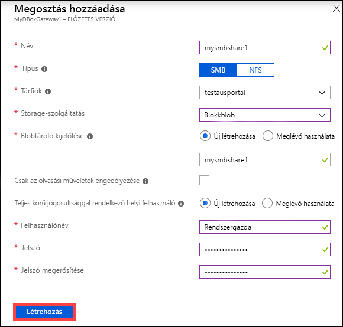

        Ha a megosztott adatokhoz bejelöli a Csak az olvasási műveletek engedélyezése lehetőséget, megadhat csak olvasási jogosultsággal rendelkező felhasználókat.
    - **NFS-megosztás létrehozásakor** – Meg kell adnia azon **engedélyezett ügyfelek IP-címeit**, akik hozzáférhetnek a megosztáshoz.

        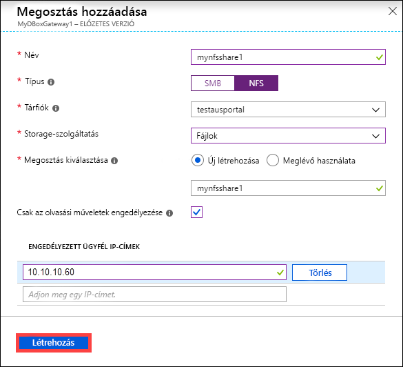

7. A megosztás létrehozásához kattintson a **Létrehozás** parancsra. A rendszer megjelenít egy értesítést arról, hogy a megosztás létrehozása folyamatban van. Miután a megosztás létrejött a megadott beállításokkal, a **Megosztások** panel frissül, és megjeleníti az új megosztást.
 
## Megosztás törlése

Megosztás törléséhez hajtsa végre a következő lépéseket az Azure Portalon.

1. A megosztások listájában jelölje ki a törölni kívánt megosztást, majd kattintson rá.

    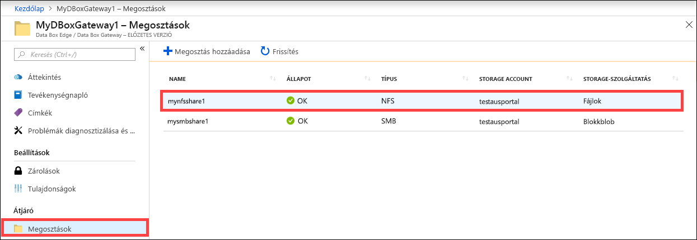

2. Kattintson a **Törlés** gombra. 

    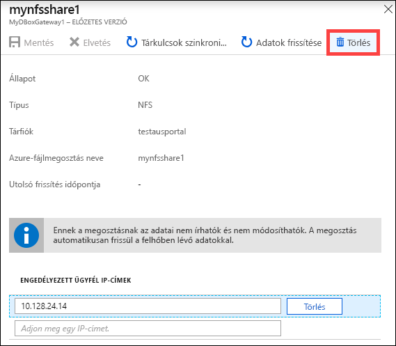

3. Ha a rendszer megerősítést kér, kattintson az **Igen** gombra.

    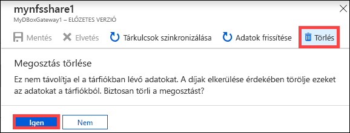

A törlés végrehajtása után annak megfelelően frissül a megosztások listája.

## Megosztások frissítése

A frissítési funkció lehetővé teszi a helyszíni megosztások tartalmának frissítését. A megosztások frissítésekor a rendszer keresést indít a legutóbbi frissítés óta a felhőbe feltöltött Azure-objektumok (például blobok és fájlok) azonosítására. Az eszközön található helyszíni megosztás tartalma ezt követően frissül ezekkel a fájlokkal. 

Megosztás frissítéséhez hajtsa végre a következő lépéseket az Azure Portalon.

1.  Az Azure Portalon lépjen a **Megosztások** területre. Jelölje ki a frissíteni kívánt megosztást, majd kattintson rá.

    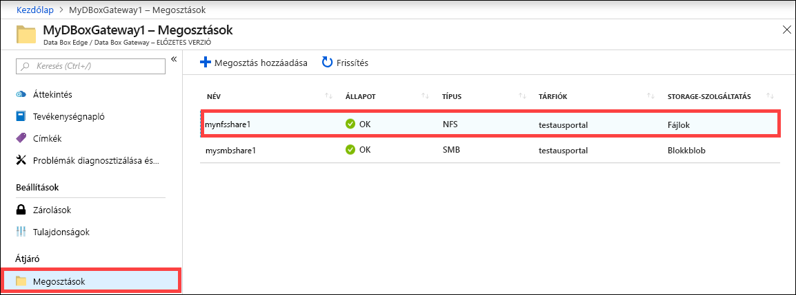

2.  Kattintson a **Frissítés** gombra. 

    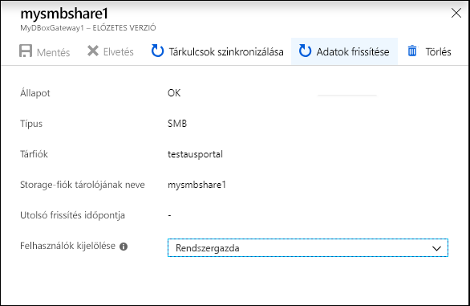
 
3.  Ha a rendszer megerősítést kér, kattintson az **Igen** gombra. A rendszer ekkor egy feladatot indít a helyszíni megosztás tartalmának frissítésére. 

    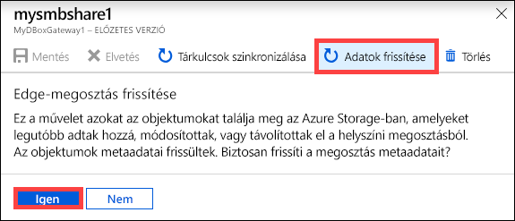
 
4.  Amíg folyamatban van a frissítés, a Frissítés lehetőség kiszürkítve jelenik meg a helyi menüben. A frissítési feladat állapotát a feladatértesítésre kattintva tekintheti meg.

5.  A frissítés végrehajtásához szükséges idő az Azure-tárolón és az eszközön található fájlok számától függ. A frissítés sikeres befejezése után frissül a megosztás időbélyege. Ha a frissítés csak részben sikeres, maga a művelet akkor is sikeresnek tekintendő, és az időbélyeg frissülni fog. 

    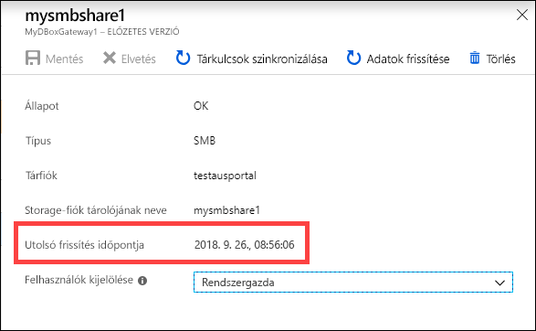
 
Hiba esetén a rendszer riasztást ad ki. A riasztás részletei között szerepel a hiba oka és a hibaelhárítási javaslat. A riasztás továbbá tartalmaz egy fájlra mutató hivatkozást is, amelyre rákattintva megtekintheti a teljes hibajegyzéket, azon fájlok listájával együtt, amelyek esetében a frissítési vagy törlési művelet meghiúsult.

>[!IMPORTANT]
> Az előzetes verzióban egyszerre csak egy megosztást frissítsen.

## Tárkulcsok szinkronizálása

Ha a tárfiók kulcsai le lettek cserélve, akkor szinkronizálni kell a tárelérési kulcsokat. A szinkronizálással biztosítható, hogy az eszköz tárfiókkulcsai naprakészek legyenek.

A tárelérési kulcsok szinkronizálásához hajtsa végre a következő lépéseket az Azure Portalon.

1. Lépjen az erőforrás **Áttekintés** területére. 
2. A megosztások listájában válassza ki a szinkronizálni kívánt tárfiókhoz tartozó megosztást, majd kattintson rá. Kattintson a **Tárkulcsok szinkronizálása** elemre. 

     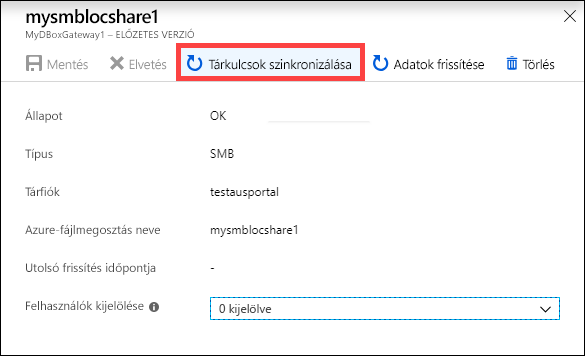

3. Ha a rendszer megerősítést kér, kattintson az **Igen** gombra. A szinkronizálást követően zárja be a párbeszédpanelt.

     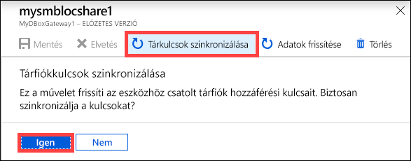

>[!NOTE]
> Ezt a műveletet csak egyszer kell elvégezni az egyes tárfiókok esetében, nem kell megismételni minden egyes, ugyanazon tárfiókhoz tartozó megosztásnál.

## További lépések

- Ismerje meg, hogyan [kezelheti a felhasználókat az Azure Portalon keresztül](data-box-gateway-manage-users.md).
