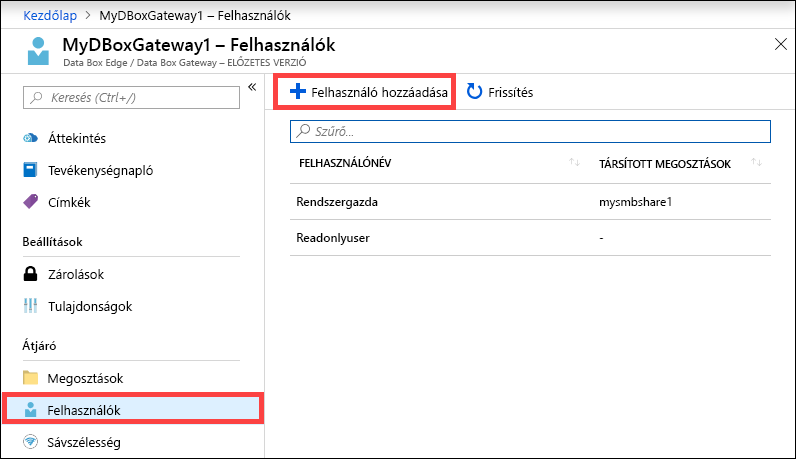
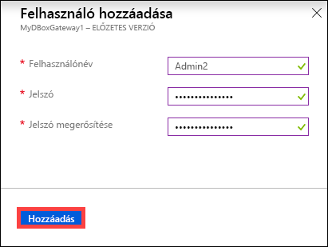
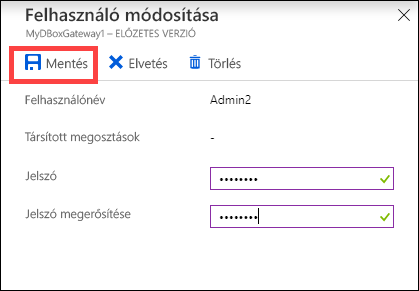
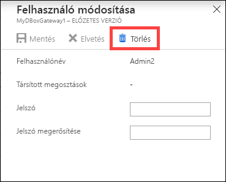
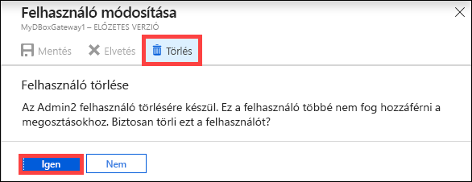

# Azure Data Box Gateway-felhasználók kezelése az Azure Portalon 

Ez a cikk bemutatja, hogyan történik a felhasználók kezelése az Azure Data Box Gatewayben. Az Azure Data Box Gateway az Azure Portal használatával vagy a helyi webes felhasználói felületről felügyelhető. Az Azure Portalon felhasználókat vehet fel, módosíthat vagy törölhet.

> [!IMPORTANT]
> - A Data Box Gateway előzetes verzióban érhető el. A megoldás megrendelése és üzembe helyezése előtt tekintse át az [Azure előzetes verziókra vonatkozó szolgáltatási feltételeit](https://azure.microsoft.com/support/legal/preview-supplemental-terms/).

Ebben a cikkben az alábbiakkal ismerkedhet meg:

> [!div class="checklist"]
> * Felhasználó hozzáadása
> * Felhasználó módosítása
> * Felhasználó törlése 

## Információk a felhasználókról

A felhasználók csak olvasási vagy teljes körű jogosultsággal rendelkezhetnek. Ahogy a név is mutatja, a csak olvasási jogosultsággal rendelkező felhasználók kizárólag megtekinteni tudják a megosztott adatokat. A teljes körű jogosultsággal rendelkező felhasználók olvasni és írni is tudják a megosztott adatokat, valamint módosíthatják és törölhetik is azokat. 

 - **Teljes körű jogosultsággal rendelkező felhasználó** – Teljes körű hozzáféréssel rendelkező helyi felhasználó. 
 - **Csak olvasási jogosultsággal rendelkező felhasználó** – Csak olvasási hozzáféréssel rendelkező helyi felhasználó. Ezek a felhasználók csak olvasási műveleteket megengedő megosztásokhoz vannak társítva.

A felhasználói engedélyek első alkalommal a megosztás létrehozása során, a felhasználó létrehozásakor lesznek meghatározva. A felhasználóhoz társított engedélyek ezt követően a Fájlkezelőben módosíthatók. 

## Felhasználó hozzáadása

Felhasználó hozzáadásához hajtsa végre az alábbi lépéseket az Azure Portalon.

1. Az Azure Portalon keresse meg a Data Box Gateway-erőforrást, majd lépjen az **Áttekintés** területre. A parancssávon kattintson a **+ Felhasználó hozzáadása** gombra.

    

2. Adja meg a hozzáadni kívánt felhasználó felhasználónevét és jelszavát. Erősítse meg a jelszót, majd kattintson a **Hozzáadás** gombra.

    

    > [!IMPORTANT] 
    > A következő rendszer által lefoglalt felhasználók nem használhatóak: Rendszergazda, EdgeUser, EdgeSupport, HcsSetupUser, WDAGUtilityAccount, CLIUSR, DefaultAccount, Vendég.  

3. A rendszer a felhasználó létrehozásának megkezdéséről és befejezéséről is értesítést küld. A felhasználó létrehozása után kattintson a parancssáv **Frissítés** elemére a felhasználók listájának frissítéséhez.

## Felhasználó módosítása

A felhasználó létrehozását követően lehetőség van a hozzá tartozó jelszó módosítására. Jelölje ki a felhasználót a listában, majd kattintson rá. Adja meg és erősítse meg az új jelszót. Mentse a módosításokat.
 

## Felhasználó törlése

Felhasználó törléséhez hajtsa végre a következő lépéseket az Azure Portalon.

1. Jelölje ki a felhasználót a listában, kattintson rá, majd kattintson a **Törlés** gombra.  

   

2. A rendszer kérésére erősítse meg a törlést. 

   

A törlés végrehajtása után annak megfelelően frissül a felhasználók listája.

## További lépések

- További tudnivalókat a [sávszélesség-kezeléssel foglalkozó részben](data-box-gateway-manage-bandwidth-schedules.md) talál.
