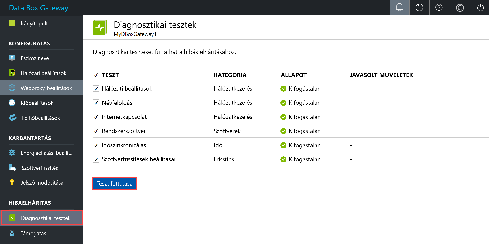
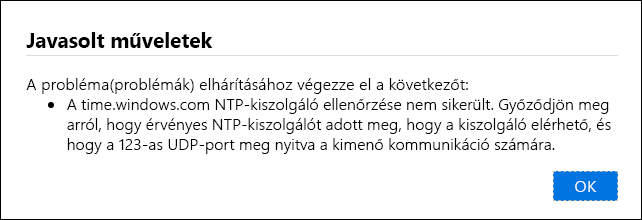
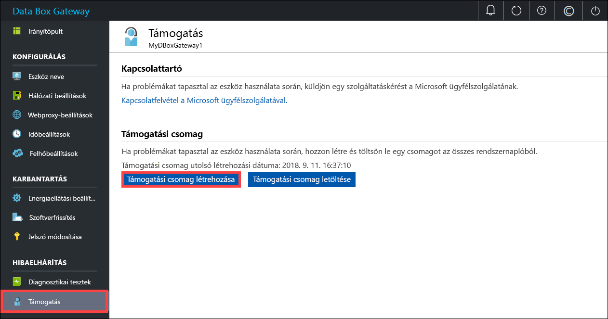
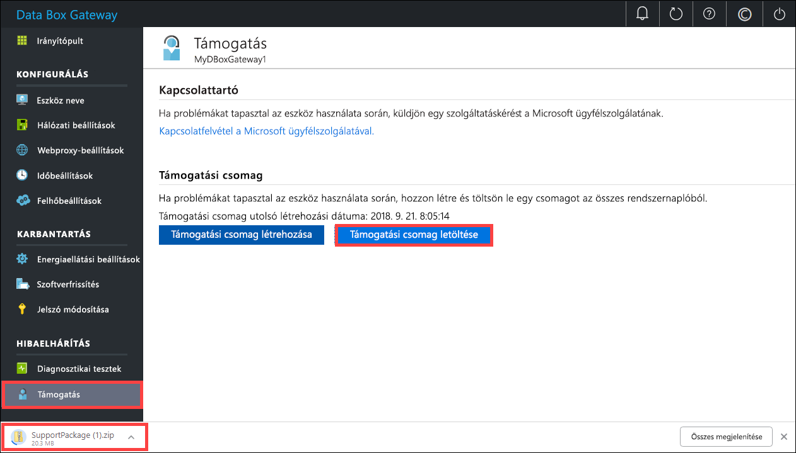
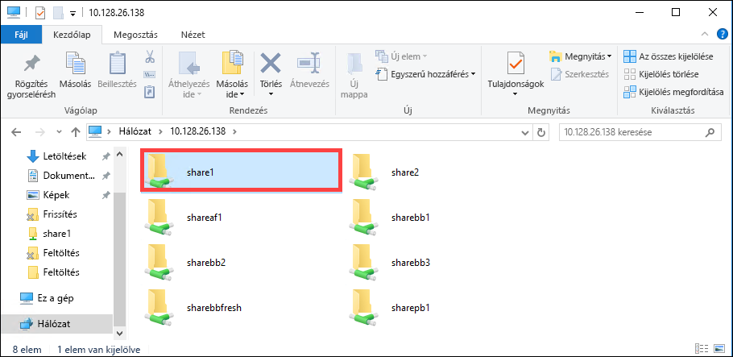

# <a name="troubleshoot-your-azure-data-box-gateway-issues"></a>Az Azure Data Box Gateway hibáinak elhárítása 

Ez a cikk ismerteti az Azure Data Box Gateway átjáróval kapcsolatos problémák elhárítása. Ebben a cikkben az alábbiakkal ismerkedhet meg:

> [!div class="checklist"]
> * Diagnosztika futtatása
> * Támogatási csomag összeállítása
> * Hibaelhárítás naplók használatával


## <a name="run-diagnostics"></a>Diagnosztika futtatása

Az eszközök diagnosztizálásához és a hibák elhárításához futtassa le a diagnosztikai teszteket. Eszközének helyi webes felhasználói felületen kövesse az alábbi lépéseket a diagnosztikai tesztek futtatásához.

1. A helyi webes felhasználói felületen válassza a **Hibaelhárítás > Diagnosztikai tesztek** lehetőséget. Válassza ki a tesztet a futtatáshoz, és kattintson a **Teszt futtatása** gombra. Megtörténik a hálózat, az eszköz, a webalkalmazás-proxy, az idő és a felhő beállításaival kapcsolatos lehetséges problémák diagnosztizálása. Értesítést kap, hogy az eszköz teszteket futtat.

    
 
2. A tesztek lefutása után megjelennek az eredmények. Ha egy teszt sikertelen, megjelenik a javasolt művelet URL-címe. Az URL-címre kattintva tekintse meg a javasolt műveletet. 
 
    


## <a name="collect-support-package"></a>Támogatási csomag összeállítása

A naplócsomag tartalmazza az összes naplót, amely segít a Microsoft ügyfélszolgálatának az eszközproblémák elhárításában. A naplócsomagot a helyi webes felhasználói felületen hozhatja létre.

Kövesse az alábbi lépéseket a támogatási csomag összeállításához. 

1. A helyi webes felhasználói felületen válassza a **Hibaelhárítás > Támogatás** lehetőséget. Kattintson a **Támogatási csomag létrehozása** elemre. A rendszer megkezdi a támogatási csomag összeállítását. A csomagok gyűjteményének létrehozása eltarthat néhány percig.

    
 
2. A támogatási csomag létrehozásának befejezését követően kattintson a **Támogatási csomag letöltése** elemre. A rendszer a tömörített csomagot letölti a megadott helyre. A csomag is kibontásához.

    

## <a name="use-logs-to-troubleshoot"></a>Hibaelhárítás naplók használatával

A feltöltési és frissítési folyamat során észlelt hibákat a megfelelő hibafájlok tartalmazzák.

1. A hibafájlok megtekintéséhez nyissa meg saját megosztását, majd megosztásra kattintva tekintse meg tartalmát. 

      

2. Kattintson a _Microsoft Data Box Gateway mappára_. Ebben a mappában két almappát talál:

   - A feltöltési mappa, amely a feltöltési hibákat tartalmazó naplófájlokat tárolja.
   - A frissítési mappa a frissítés során bekövetkezett hibák számára.

     Íme egy minta naplófájl, amely a frissítési hibákat tartalmazza.

     ```
     <root container="brownbag1" machine="VM15BS020663" timestamp="07/18/2018 00:11:10" />
     <file item="test.txt" local="False" remote="True" error="16001" />
     <summary runtime="00:00:00.0945320" errors="1" creates="2" deletes="0" insync="3" replaces="0" pending="9" />
     ``` 

3. Ha ebben a fájlban hibát talál (a mintában kiemelve látható), jegyezze fel a hibakódot, amely ebben az esetben 16001. Keresse meg a hibakód leírását a következő hibaadatok alapján.

    |     Hibakód     |     Kivétel neve                                         |     Hibaleírás                                                                                                                                                                                                                     |
    |--------------------|------------------------------------------------------------|-------------------------------------------------------------------------------------------------------------------------------------------------------------------------------------------------------------------------------------------|
    |    100             |    ERROR_CONTAINER_OR_SHARE_NAME_LENGTH                    |    A tároló vagy a megosztás neve csak 3 és 63 karakter közötti hosszúságú lehet.                                                                                                                                                                     |
    |    101             |    ERROR_CONTAINER_OR_SHARE_NAME_ALPHA_NUMERIC_DASH        |    A tároló vagy a megosztás neve csak betűket, számokat és kötőjeleket tartalmazhat.                                                                                                                                                       |
    |    102             |    ERROR_CONTAINER_OR_SHARE_NAME_IMPROPER_DASH             |    A tároló vagy a megosztás neve csak betűket, számokat és kötőjeleket tartalmazhat.                                                                                                                                                       |
    |    103             |    ERROR_BLOB_OR_FILE_NAME_CHARACTER_CONTROL               |    A blob vagy a fájl neve nem támogatott vezérlőkaraktereket tartalmaz.                                                                                                                                                                       |
    |    104             |    ERROR_BLOB_OR_FILE_NAME_CHARACTER_ILLEGAL               |    A blob vagy a fájl neve nem támogatott karaktereket tartalmaz.                                                                                                                                                                                   |
    |    105             |    ERROR_BLOB_OR_FILE_NAME_SEGMENT_COUNT                   |    A blob- vagy fájlnév túl sok szegmenst tartalmaz (a szegmenseket perjel -/ választja el egymástól).                                                                                                                                              |
    |    106             |    ERROR_BLOB_OR_FILE_NAME_AGGREGATE_LENGTH                |    A blob- vagy fájlnév túl hosszú.                                                                                                                                                                                                     |
    |    107             |    ERROR_BLOB_OR_FILE_NAME_COMPONENT_LENGTH                |    A blob- vagy fájlnevében szereplő egyik szegmens túl hosszú.                                                                                                                                                                            |
    |    108             |    ERROR_BLOB_OR_FILE_SIZE_LIMIT                           |    A fájl mérete meghaladja a maximális méretet a feltöltéshez.                                                                                                                                                                              |
    |    109             |    ERROR_BLOB_OR_FILE_SIZE_ALIGNMENT                       |    A blob vagy a fájl nincs megfelelően igazítva.                                                                                                                                                                                               |
    |    110             |    ERROR_NAME_NOT_VALID_UNICODE                            |    A Unicode kódolású fájlnév vagy blob nem érvényes.                                                                                                                                                                                  |
    |    111             |    ERROR_RESERVED_NAME_NOT_ALLOWED                         |    A fájl vagy a blob neve vagy előtagja nem támogatott fenntartott név (például COM1).                                                                                                                             |
    |    2000            |    ERROR_ETAG_MISMATCH                                     |    Az etag eltérése azt jelzi, hogy a felhőben és az eszközön lévő blokkblob ütközik. Az ütközés elhárításához törölje az egyik fájlt – vagy a felhőben vagy az eszközön lévő változatot.    |
    |    2001            |    ERROR_UNEXPECTED_FINALIZE_FAILURE                       |    Váratlan probléma történt a fájl feltöltését követően a fájl feldolgozása során.    Ha ezt a hibaüzenetet látja, és a hiba több mint 24 órán keresztül továbbra is fennáll, forduljon az ügyfélszolgálathoz.                                                      |
    |    2002            |    ERROR_ALREADY_OPEN                                      |    A fájl már meg nyitva egy másik folyamatban, és a leíró bezárásáig nem lehet feltölteni.                                                                                                                                       |
    |    2003            |    ERROR_UNABLE_TO_OPEN                                    |    Nem sikerült megnyitni a fájlt a feltöltéshez. Ha ezt a hibát látja, forduljon a Microsoft ügyfélszolgálatához.                                                                                                                                                |
    |    2004            |    ERROR_UNABLE_TO_CONNECT                                 |    Nem sikerült csatlakozni a tárolóhoz az adatok tárolóba való feltöltéséhez.                                                                                                                                                                             |
    |    2005            |    ERROR_INVALID_CLOUD_CREDENTIALS                         |    Nem sikerült csatlakozni a tárolóhoz, mert a fiók engedélyei helytelenek vagy elavultak. Ellenőrizze a hozzáférési engedélyeit.                                                                                                               |
    |    2006            |    ERROR_CLOUD_ACCOUNT_DISABLED                            |    Nem sikerült feltölteni az adatokat a fiókba, mert a fiók vagy a megosztás le van tiltva.                                                                                                                                                            |
    |    2007            |    ERROR_CLOUD_ACCOUNT_PERMISSIONS                         |    Nem sikerült csatlakozni a tárolóhoz, mert a fiók engedélyei helytelenek vagy elavultak. Ellenőrizze a hozzáférési engedélyeit.                                                                                                               |
    |    2008            |    ERROR_CLOUD_CONTAINER_SIZE_LIMIT_REACHED                |    Nem sikerült hozzáadni az új adatokat, mert a tároló megtelt. Az Azure-specifikációkban tekintse meg, hogy típusonként mely tárolóméretek támogatottak. Az Azure File például csak az 5 TB-os maximális fájlméret támogatja.                                     |
    |    2009            |    ERROR_CLOUD_CONTAINER_MISSING                |     Nem sikerült feltölteni az adatokat, mert a tároló társítva a megosztás nem létezik.                                     |    
    |    2997            |    ERROR_ITEM_CANCELED                                     |    Váratlan hiba történt. Ez az egy átmeneti hiba, magától megoldódik.                                                                           |
    |    2998            |    ERROR_UNMAPPED_FAILURE                                  |    Váratlan hiba történt. Lehet, hogy a hiba magától megoldódik, de ha több mint 24 órán keresztül nem szűnik meg, forduljon a Microsoft ügyfélszolgálatához.                                                                                                     |
    |    16000           |    RefreshException                                        |    A fájlt nem sikerült leállítani.                                                                                                                                                                                                        |
    |    16001           |    RefreshAlreadyExistsException                           |    Nem sikerült leállítani a fájlt, mert már létezik a helyi számítógépen.                                                                                                                                                         |
    |    16002           |    RefreshWorkNeededException                              |    Nem sikerült frissíteni a fájlt, mert nincs teljesen feltöltve.                                                                                                                                                                          | 


## <a name="next-steps"></a>További lépések

- További információk a [jelen kiadás ismert problémáiról](data-box-gateway-release-notes.md).
