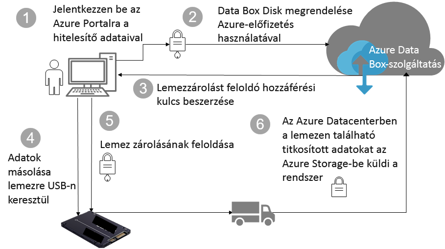

# Az Azure Data Box-lemezek biztonsági és adatvédelmi

A cikk az Azure Data Box Disk biztonsági szolgáltatásait ismerteti, amelyekkel biztosítható a Data Box megoldás összetevőinek és bennük tárolt adatoknak a védelme. 

## Az adatok áramlása az összetevők között

A Microsoft Azure Data Box megoldást négy, egymással együttműködő fő összetevő alkotja:

- **Az Azure-ban üzemeltetett Azure Data Box szolgáltatás** – a felügyeleti szolgáltatás, amellyel lemezmegrendeléseket hozhat létre, konfigurálhatja a lemezeket, majd nyomon követheti a rendelést a teljesítésig.
- **Data Box-lemezek** – a fizikai lemezek, amelyeket helyszíni adatai az Azure-ba való importálásához kiküldünk Önnek. 
- **A lemezekhez csatlakoztatott ügyfelek/gazdagépek** – az infrastruktúra védeni kívánt adatokat tartalmazó, a Data Box-lemezekre USB-kapcsolaton keresztül csatlakozó ügyfelei.
- **Felhőalapú tároló** – a hely az Azure-felhőben, ahol az adatok tárolása történik. Ez általában a létrehozott Azure Data Box-erőforráshoz csatolt tárfiók.

A következő ábra mutatja az adatok áramlását az Azure Data Box Disk megoldásban a helyszíni rendszerekről az Azure-ba.

## Biztonsági funkciók

A Data Box Disk biztonságos megoldást kínál az adatok védelmére, mivel garantálja, hogy az adatokat csak a jogosult entitások tekinthetik meg, módosíthatják vagy törölhetik. A megoldás biztonsági szolgáltatásai a lemezekre és a rajtuk tárolt adatokat védő szolgáltatásra is vonatkoznak. 

### A Data Box Disk védelme

A Data Box Disk biztonságát az alábbi szolgáltatások biztosítják:

- Folyamatos AES-128 bites BitLocker-titkosítás a lemezeken.
- A lemezek biztonságos frissítése.
- A lemezek szállítása zárolt állapotban történik, és kizárólag a Data Box Disk feloldóeszközével oldhatók fel. A feloldóeszköz a Data Box Disk szolgáltatás portálján érhető el.

### A Data Box Disk-adatok védelme

A Data Box Disk szolgáltatás bejövő és kimenő adatainak biztonságát az alábbi szolgáltatások biztosítják:

- Az adatok folyamatos BitLocker-titkosítása. 
- Az adatok biztonságos törlése a lemezről, miután az Azure-ba való adatfeltöltés befejeződött. Az adatok törlése a NIST 800-88r1 szabványoknak megfelelően történik.

### A Data Box szolgáltatás védelme

A Data Box szolgáltatás biztonságát az alábbi funkciók biztosítják.

- A Data Box Disk szolgáltatáshoz való hozzáféréshez a szervezetnek olyan Azure-előfizetéssel kell rendelkeznie, amely tartalmazza a Data Box Disket. Az előfizetés szabályozza, hogy az Azure Portal mely szolgáltatásai érhetők el.
- A Data Box szolgáltatás az Azure-ban üzemel, így az Azure biztonsági funkciói védik. A Microsoft Azure által biztosított biztonsági funkciókról a [Microsoft Azure biztonsági és adatkezelési központban](https://www.microsoft.com/TrustCenter/Security/default.aspx) talál további információt. 
- A Data Box Disk tárolja a lemezek hozzáférési kulcsát, amellyel a lemezek zárolása a szolgáltatásban feloldható. 
- A Data Box Disk szolgáltatás tárolja a megrendelések adatait és állapotát a szolgáltatásban. A megrendelés törlésekor ezek az információk is törlődnek. 

## Személyes adatok kezelése

[!INCLUDE [GDPR-related guidance](../../includes/gdpr-intro-sentence.md)]

Az Azure Data Box Disk a szolgáltatás alábbi főbb példányaiban gyűjt és jelenít meg személyes adatokat:

- **Értesítési beállítások** – Amikor létrehoz egy megrendelést, a felhasználók e-mail-címeit az értesítési beállítások alatt konfigurálhatja. Ezeket az adatokat az adminisztrátor megtekintheti. A szolgáltatás törli az adatokat, amikor a feladat eléri a végállapotot, illetve ha Ön törli a megrendelést.

- **Megrendelés részletei** – miután létrejött a megrendelés, a felhasználók szállítási címét, e-mail-címét és kapcsolattartási adatait az Azure Portal tárolja. A mentett információk a következők:

  - Kapcsolattartó neve
  - Telefonszám
  - E-mail
  - Utca, házszám
  - Város
  - Irányítószám
  - Állapot
  - Ország/tartomány/régió
  - Meghajtóazonosító
  - Szállítmányozó fiókszáma
  - Szállítmány nyomkövetési száma

    A Data Box a feladat befejezésekor vagy törlésekor törli a rendelés részleteit.

- **Szállítási cím** – A rendelés feladása után a Data Box szolgáltatás kiadja a szállítási címet külső szállítmányozóknak, például a UPS-nek vagy a DHL-nek. 

További információkért lásd a Microsoft szabályzatát a [biztonsági és adatkezelési központban](https://www.microsoft.com/trustcenter).

## További lépések

- A [Data Box Disk követelményeinek](data-box-disk-system-requirements.md) áttekintése.
- A [Data Box Disk korlátainak](data-box-disk-limits.md) megismerése.
- Az [Azure Data Box Disk](data-box-disk-quickstart-portal.md) gyors üzembe helyezése az Azure Portalon.
