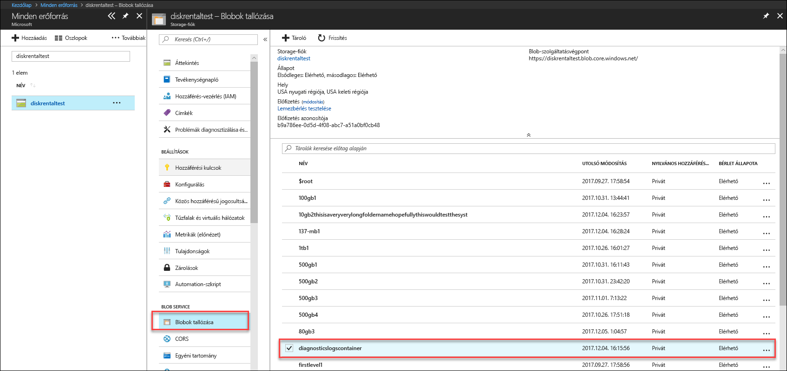
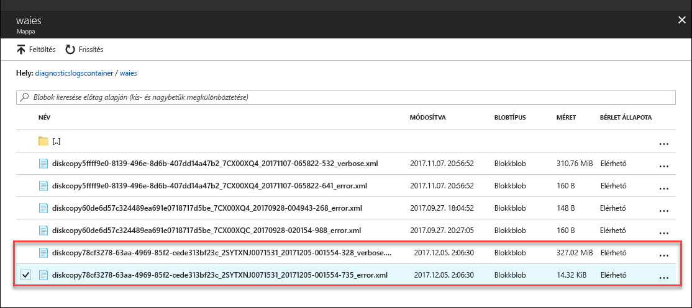

# Az Azure Data Box Disk (előzetes verzió) hibáinak elhárítása

Ez a cikk a Microsoft Azure Data Box előzetes kiadására vonatkozik. A cikk a Data Boxon és a Data Box Disken végrehajtható komplex munkafolyamatokat és felügyeleti feladatokat ismerteti. 

A Data Box Disk az Azure Portalon keresztül felügyelhető. A cikk az Azure Portalon végrehajtható feladatokra összpontosít. Az Azure Portalon kezelheti a megrendeléseket, felügyelheti az eszközöket, és nyomon követheti a befejezéshez közeledő rendelések állapotát.

A cikk az alábbi oktatóanyagokat tartalmazza:

- Diagnosztikai naplók letöltése
- Tevékenységnaplók lekérdezése

> [!IMPORTANT]
> A Data Box előzetes verzióban érhető el. A megoldás üzembe helyezése előtt tekintse át [az Azure az előzetes verziókra vonatkozó szolgáltatási feltételeit](https://azure.microsoft.com/support/legal/preview-supplemental-terms/).

## Diagnosztikai naplók letöltése

Ha az adatmásolási folyamat során hibák lépnek fel, a portálon megjelenik a mappa útvonala, amely a diagnosztikai naplókat tárolja. 

A diagnosztikai naplók lehetnek:
- Hibanaplók
- Részletes naplók  

A naplómásolási útvonal megkereséséhez lépjen a Data Box-rendeléshez társított tárfiókra. 

1.  Lépjen a **General > Order details** (Általános > Rendelés részletei) felületre, és jegyezze fel a rendeléshez társított tárfiókot.
 

2.  Lépjen az **All resources** (Összes erőforrás) felületre, és keresse meg az előző lépésben azonosított tárfiókot. Válassza ki a tárfiókot, majd kattintson rá.

    

3.  Lépjen a **Blob service > Browse blobs** (Blob szolgáltatás > Blobok tallózása) felületre, és keresse meg a tárfióknak megfelelő blobot. Lépjen a **diagnosticslogcontainer > waies** menüpontra. 

    

    Az adatmásolás hibanaplóinak és részletes naplóinak egyaránt meg kell jelennie. Válassza ki az egyes fájlokat, kattintson rájuk, és töltsön le egy-egy helyi példányt.

## Tevékenységnaplók lekérdezése

A tevékenységnaplókból hibaelhárításkor megkeresheti a hibákat, vagy nyomon követheti, hogy a szervezete felhasználói hogyan módosították az erőforrásokat. A tevékenységnaplókból a következők állapíthatók meg:

- Az előfizetésben lévő erőforrásokon végrehajtott műveletek.
- A művelet kezdeményezője. 
- A művelet végrehajtásának időpontja.
- A művelet állapota.
- A művelet felderítése során hasznosítható egyéb tulajdonságok értékei.

A tevékenységnapló tartalmazza az erőforrásokon végrehajtott összes írási műveletet (például PUT, POST, DELETE), az olvasási műveleteket (például GET) azonban nem. 

A tevékenységnaplók 90 napon keresztül érhetők el. Bármilyen dátumtartományt lekérdezhet, amíg a kezdő dátum legfeljebb 90 nappal korábbra esik. Emellett az Insights beépített lekérdezéseivel is szűrheti az eredményeket. Például ha a hibára kattint, ezután kiválaszthatja a különféle meghibásodásokat, és rájuk kattinthat a kiváltó okok elemzéséhez.

## A Data Box Disk zárolásának feloldására szolgáló eszköz hibái

| Hibaüzenet/az eszköz viselkedése      | Javaslatok                                                                                               |
|-------------------------------------------------------------------------------------------------------------------------------------|------------------------------------------------------------------------------------------------------|
| None  A Data Box Disk zárolásának feloldására szolgáló eszköz összeomlik.                                                                            | A BitLocker nincs telepítve. Gondoskodjon róla, hogy a Data Box Disk zárolásának feloldására szolgáló eszközt futtató számítógépen a BitLocker telepítve legyen.                                                                            |
| A jelenlegi .NET-keretrendszer nem támogatott. A 4.5-ös és újabb verziók támogatottak.  Az eszköz hibaüzenettel bezárul.  | A .NET 4.5-ös verziója nincs telepítve. Telepítse a .NET 4.5-ös verzióját a Data Box Disk zárolásának feloldására szolgáló eszközt futtató számítógépre.                                                                            |
| Nem sikerült egyetlen kötetet sem feloldani vagy ellenőrizni. Vegye fel a kapcsolatot a Microsoft támogatási szolgálatával.    Az eszköz nem tudott egyetlen zárolt meghajtót sem feloldani vagy ellenőrizni. | Az eszköz egyik zárolt fájlt sem tudta feloldani a megadott hozzáférési kulccsal. A további lépésekhez kérjen segítséget a Microsoft ügyfélszolgálatától.                                                |
| Az alábbi kötetek lettek feloldva és ellenőrizve.  Kötetek meghajtóbetűjele: E: A következő hozzáférési kulcsokkal egyetlen kötetet sem sikerült feloldani: werwerqomnf, qwerwerqwdfda   Az eszköz felold egyes meghajtókat, és listázza a sikeres és sikertelen meghajtók betűjelét.| Részleges siker. Egyes meghajtókat nem sikerült feloldani a megadott hozzáférési kulccsal. A további lépésekhez kérjen segítséget a Microsoft ügyfélszolgálatától. |
| Az eszköz nem talált zárolt köteteket. Ellenőrizze, hogy a Microsofttól kapott lemez megfelelően csatlakoztatva és zárolt állapotban van-e.          | Az eszköz nem talált egyetlen zárolt meghajtót sem. A meghajtók már fel lettek oldva, vagy a rendszer nem észleli őket. Győződjön meg arról, hogy a meghajtók csatlakoztatva vannak és zároltak.                                                           |
| Végzetes hiba: Érvénytelen paraméter Paraméter neve: invalid_arg HASZNÁLAT: DataBoxDiskUnlock /PassKeys:<passkey_list_separated_by_semicolon>  Példa: DataBoxDiskUnlock /PassKeys:passkey1;passkey2;passkey3 Példa: DataBoxDiskUnlock /SystemCheck Példa: DataBoxDiskUnlock /Help  /PassKeys:       A hozzáférési kulcsot az Azure Data Box Disk-rendelésből töltheti le. A hozzáférési kulccsal oldhatók fel a lemezek. /Help:           Ez a beállítás a parancsmagok használatával kapcsolatos súgóinformációkat és példákat kínál. /SystemCheck:    Ez a beállítás ellenőrzi, hogy a rendszer megfelel-e az eszköz futtatásához szükséges követelményeknek.  A kilépéshez nyomja le bármelyik billentyűt. | Érvénytelen paraméter lett megadva. Kizárólag a következő paraméterek engedélyezettek: /SystemCheck, /PassKey és /Help.                                                                            |
## További lépések

- Ismerje meg, hogyan [felügyelheti a Data Box Disket az Azure Portalon keresztül](data-box-portal-ui-admin.md).
