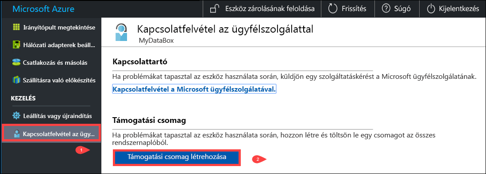
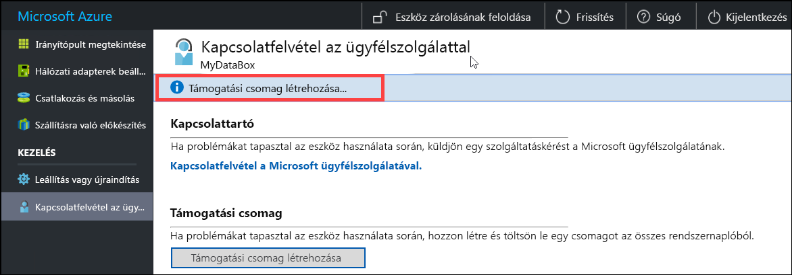
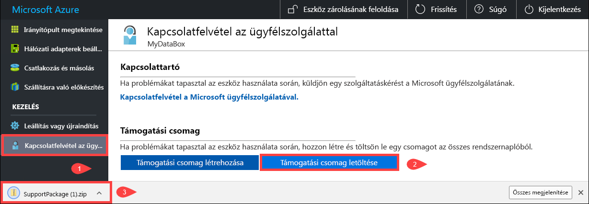
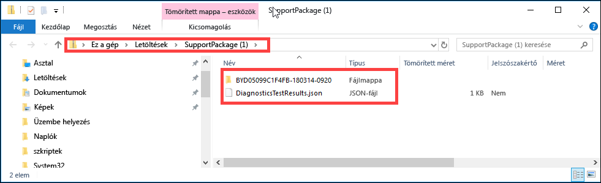
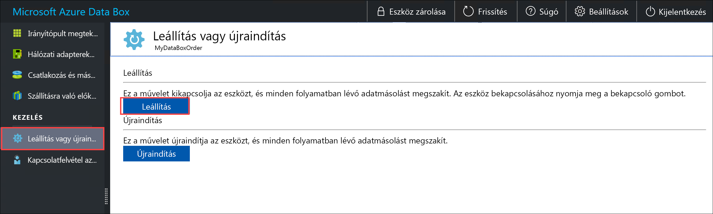
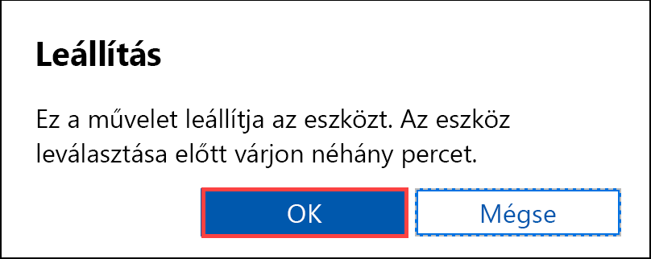
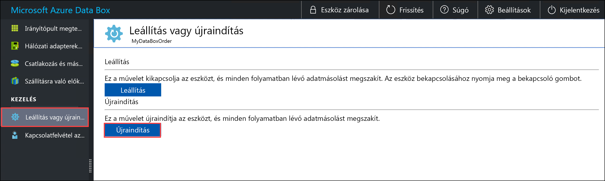
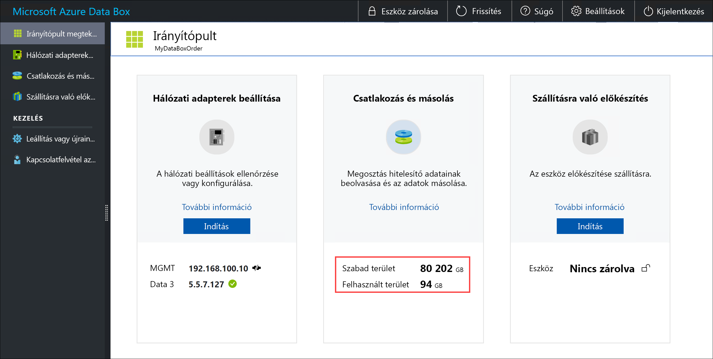
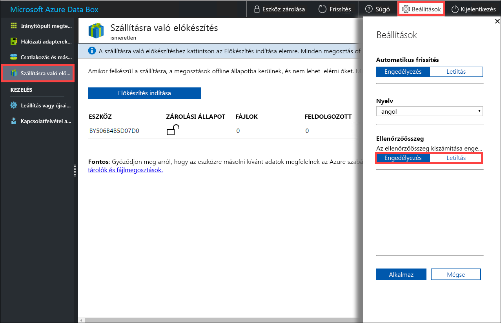

# A Data Box felügyelete a helyi webes felhasználói felülettel

A cikk a Data Boxon végrehajtható konfigurációs és felügyeleti feladatokat ismerteti. A Data Box az Azure Portal felhasználói felületével és az eszköz helyi webes felhasználói felületével felügyelhető. A cikk a helyi webes felhasználói felülettel végrehajtható feladatokra összpontosít.

A Data Box helyi webes felhasználói felülete az eszköz kezdeti konfigurálására használható. A helyi webes felhasználói felülettel emellett leállíthatja és újraindíthatja a Data Boxot, diagnosztikai teszteket futtathat, szoftvereket frissíthet, másolási naplókat tekinthet meg, valamint naplócsomagot hozhat létre a Microsoft támogatási szolgálata számára.

A cikk az alábbi oktatóanyagokat tartalmazza:

- Támogatási csomag létrehozása
- Az eszköz leállítása és újraindítása
- Adatok biztonságos törlése az eszközön
- Az eszköz rendelkezésre álló kapacitásának monitorozása
- Ellenőrzőösszeg-érvényesítés kihagyása 

## Támogatási csomag létrehozása

Ha eszközproblémákat tapasztal, létrehozhat egy támogatási csomagot a rendszernaplókból. A Microsoft támogatási szolgálata a csomag segítségével hárítja el a problémát. Támogatási csomag létrehozásához hajtsa végre az alábbi lépéseket:

1. A helyi webes felhasználói felületen nyissa meg a **Contact Support** (Kapcsolatfelvétel a támogatási szolgálattal) lapot, és kattintson a **Create Support package** (Támogatási csomag létrehozása) elemre.

    

2. A rendszer összeállítja a támogatási csomagot. A művelet pár percet vesz igénybe.

    

3. A támogatási csomag létrehozásának befejezését követően kattintson a **Download Support package** (Támogatási csomag letöltése) elemre. 

    

4. Tallózással válassza ki a letöltés helyét. Nyissa meg a mappát a tartalmak megtekintéséhez.

    

## Az eszköz leállítása és újraindítása

A Data Box a helyi webes felhasználói felülettel állítható le vagy indítható újra. Az újraindítás előtt ajánlott offline állapotba állítani a gazdagépen található megosztásokat, majd magát az eszközt is. Ezzel a lehető legkisebbre csökkenti az adatsérülés esélyét. Az eszköz leállításakor ellenőrizze, hogy nincs-e folyamatban adatmásolás.

A Data Box leállításához hajtsa végre az alábbi lépéseket.

1. A helyi webes felhasználói felületen lépjen a **Shut down or restart** (Leállítás vagy újraindítás) lapra.
2. Kattintson a **Shut down** (Leállítás) elemre.

    

3. Ha a rendszer megerősítést kér, kattintson az **OK** gombra a folytatáshoz.

    

Az eszköz leállítását követően az előlapon található bekapcsoló gombbal kapcsolhatja be az eszközt.

A Data Box újraindításához hajtsa végre az alábbi lépéseket.

1. A helyi webes felhasználói felületen lépjen a **Shut down or restart** (Leállítás vagy újraindítás) lapra.
2. Kattintson a **Restart** (Újraindítás) elemre.

    

3. Ha a rendszer megerősítést kér, kattintson az **OK** gombra a folytatáshoz.

   Az eszköz leáll, majd újraindul.

## Az eszköz rendelkezésre álló kapacitásának megtekintése

Az eszköz irányítópultján tekintheti meg az eszköz rendelkezésre álló és felhasznált kapacitását. 

1. A helyi webes felhasználói felületen lépjen a **View dashboard** (Irányítópult megtekintése) lapra.
2. A **Connect and copy** (Kapcsolódás és másolás) részen az eszköz szabad és felhasznált területe látható.

    

## Ellenőrzőösszeg-érvényesítés kihagyása

A rendszer alapértelmezés szerint létrehoz egy ellenőrzőösszeget az adatokra vonatkozóan, amikor Ön felkészül az adatok átvitelére. Bizonyos ritka esetekben, az adattípustól függően (kis méretű fájlok) a teljesítmény nagyon lassú lehet. Ilyen esetben kihagyhatja az ellenőrzőösszeg létrehozását. 

Határozottan javasoljuk, hogy csak akkor tiltsa le az ellenőrző létrehozását, ha komoly hatással lenne a teljesítményre.

1. A helyi webes felhasználói felület jobb felső sarkában nyissa meg a Settings (Beállítások) lapot.

    

2. Tiltsa le az ellenőrzőösszeg-érvényesítést a **Disable** (Letiltás) paranccsal.
3. Kattintson az **Alkalmaz** gombra.

## További lépések

- Megismerheti, hogyan [kezelheti a Data Boxot az Azure Portalon keresztül](data-box-portal-admin.md).

