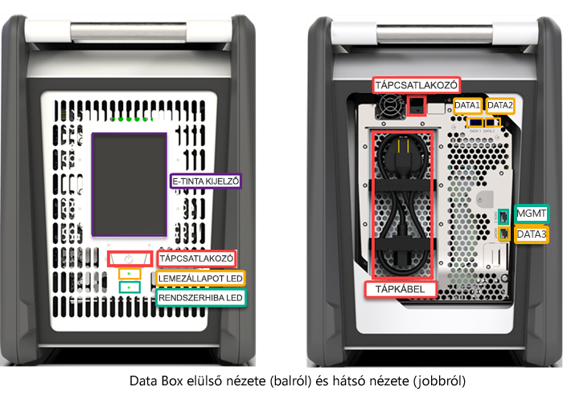
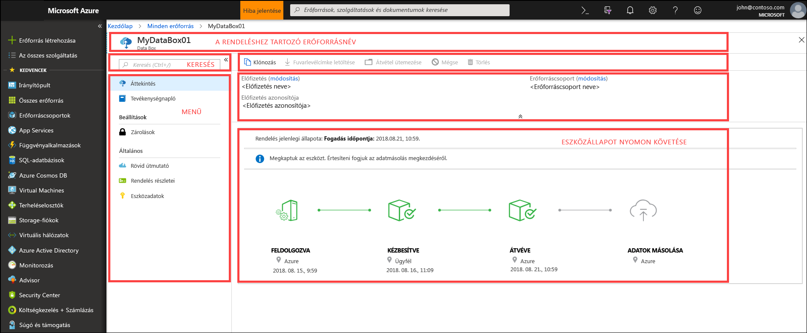
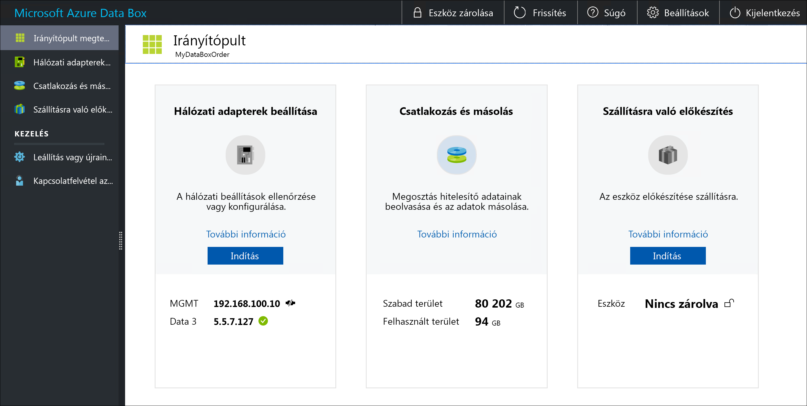

# Mi az az Azure Data Box?

A Microsoft Azure Data Box felhőalapú megoldással gyorsan, olcsón és megbízható módon küldhet több terabájtnyi adatot az Azure-ba. A biztonságos adatátvitelt egy saját fejlesztésű Data Box tárolóeszköz küldésével gyorsítjuk fel. Minden tárolóeszköz legfeljebb 80 TB használható tárolókapacitással rendelkezik, és egy regionális futár szállítja az Ön adatközpontjába. Az eszköz ütésálló tokkal rendelkezik, hogy az adatok az átvitel során védve legyenek.

A Data Box eszköz az Azure Portalon keresztül rendelhető meg. Miután az eszköz megérkezett, gyorsan beállíthatja a helyi webes felhasználói felülettel. Másolja át a kiszolgálóin található adatokat az eszközre, és küldje vissza az eszközt az Azure-nak. Az Azure-adatközpontban az adatok automatikusan feltöltődnek az eszközről az Azure-ba. A teljes folyamatot végigkövetheti a Data Box szolgáltatásban, az Azure Portalon.

## Használati esetek

A Data Box ideális megoldás 40 TB-nál nagyobb mennyiségű adat átviteléhez olyan forgatókönyvek esetében, amelyekben korlátozott a hálózati kapcsolat. Az adatáthelyezés lehet egyszeri, rendszeres, vagy egy kezdeti tömeges adatátvitelt követően rendszeres adatátvitel is. Itt találhatók azok a különböző forgatókönyvek, amelyekben a Data Box használata javasolt az adatátvitelhez.

 - **Egyszeri migrálás** – nagy mennyiségű helyszíni adat áthelyezése az Azure-ba. 
     - Médiatár áthelyezése offline szalagokról az Azure-ba és egy online médiatár létrehozása.
     - A VM-farm, az SQL Server és az alkalmazások migrálása az Azure-ba
     - Előzményadatok áthelyezése az Azure-ba a HDInsight használatával történő átfogó elemzéshez és jelentéskészítéshez

 - **Kezdeti tömeges átvitel** – Amikor a kezdeti tömeges átvitel a Data Box használatával történik (kiindulás), majd növekményes átvitelek történnek a hálózaton. 
     - Például a biztonsági mentési partnerek, mint a Commvault vagy a Data Box segítségével történik a nagy méretű biztonsági mentési előzményadatok kezdeti átvitele az Azure-ba. Miután ez befejeződött, a növekményes adatok a hálózaton keresztül lesznek továbbítva az Azure Storage-ba.

- **Rendszeres feltöltések** – ha rendszeresen keletkezik nagy mennyiségű adat, és azt az Azure-ba szükséges áthelyezni. Ez előfordulhat például az energiafeltárási munkálatoknál, ahol az olajfúrótornyok és a szélenergia-farmok kapcsán nagy mennyiségű videóanyag készül.      

## Előnyök

A Data Box nagy mennyiségű adat az Azure-ba való átvitelére szolgál, és minimális hatással van a hálózat működésére. A megoldás a következő előnyökkel jár:

- **Sebesség** – A Data Box 1 Gb/s vagy 10 Gb/s sebességű hálózati adaptert használ az akár 80 TB méretű adatok az Azure-ba való feltöltéséhez.

- **Biztonság** – A Data Box beépített védelmet biztosít az eszköz, az adatok és a szolgáltatás számára.
    - Az eszköz biztonsági tokkal rendelkezik illetéktelen hozzáférést gátló csavarokkal és az illetéktelen hozzáférést jelző matricákkal. 
    - Az eszközön lévő adatokat minden pillanatban 256 bites AES-titkosítás védi.
    - Az eszköz zárolása csak az Azure Portalon megadott jelszóval oldható fel.
    - A szolgáltatást az Azure biztonsági funkciói védik.
    - Az adatok az Azure-ba való feltöltését követően az eszköz lemezeinek tartalmát az NIST 800-88r1 szabványoknak megfelelően töröljük.
    
    További információt [az Azure Data Box biztonsági és adatvédelmi szolgáltatásait](data-box-security.md) ismertető cikkben talál.

## Funkciók és specifikációk

A Data Box eszköz jelen kiadása az alábbi funkciókkal rendelkezik.

| Specifikációk                                          | Leírás              |
|---------------------------------------------------------|--------------------------|
| Tömeg                                                  | < 22,7 kg                |
| Dimenziók                                              | Eszköz – szélesség: 309 mm; magasság: 430,4 mm; mélység: 502 mm |            
| Kiszolgálószekrény-terület                                              | 7 U a kiszolgálószekrénybe helyezve, az oldalára állítva (nem szerelhető rá az állványra)|
| Szükséges kábelek                                         | 1 db tápkábel (a csomag tartalmazza)   2 db RJ45-kábel   2 db SFP+ Twinax-rézkábel|
| Tárkapacitás                                        | A 100 TB-os eszköz 80 TB felhasználható kapacitással rendelkezik a RAID 5-védelem alkalmazása után|
| Hálózati illesztők                                      | 2 db 1 GbE sávszélességű illesztő – MGMT, Data 3.   MGMT – a kezeléshez, felhasználó által nem konfigurálható, a kezdeti beállításhoz szükséges   DATA3 – az adatokhoz, felhasználó által konfigurálható, alapértelmezetten dinamikus   Az MGMT és a DATA 3 is működhet 10 GbE-ként   2 db 10 GbE sávszélességű illesztő – DATA 1, DATA 2   Mindkettő az adatokhoz, konfigurálhatók dinamikusra (alapértelmezés) vagy statikusra |
| Adatátviteli felület                                     | RJ45, SFP + 10 GbE réz Ethernet  |
| Biztonság                                                | Ütésálló eszköztok, az illetéktelen hozzáférést gátló, egyedi csavarokkal   Az illetéktelen hozzáférést jelző matricák az eszköz alján|
| Adatátviteli sebesség                                      | Legfeljebb 80 TB naponta, 10 GbE sávszélességű hálózati adapter használata esetén        |
| Kezelés                                              | Helyi webes felhasználói felület – egyszeri kezdeti beállítás és konfigurálás   Azure Portal – mindennapos eszközkezelés        |

## Data Box-összetevők

A Data Box a következő összetevőket tartalmazza:

* **Data Box eszköz** – Egy fizikai eszköz, amely elsődleges tárolást biztosít, kezeli a felhőalapú tárolóval történő kommunikációt, és segít biztosítani az eszközön tárolt adatok biztonságát és titkosságát. A Data Box eszköz 80 TB hasznos tárolókapacitással rendelkezik. 

    

    
* **Data Box szolgáltatás** – Az Azure Portal bővítménye, amely lehetővé teszi a Data Box eszközök kezelését egy webes felületről, amelyet eltérő földrajzi helyekről is elérhet. A Data Box szolgáltatással elvégezheti a Data Box eszköz napi adminisztrálását. A szolgáltatásban végrehajtható feladatok a rendelések létrehozását és kezelését, a riasztások megtekintését és kezelését, valamint a megosztások kezelését foglalják magukban.  

    

    További információt [a Data Box szolgáltatás a Data Box eszköz felügyeletére történő használatát](data-box-portal-ui-admin.md) ismertető cikkben talál.

* **Helyi webes felhasználói felület** – Egy webes felhasználói felület, amelynek használatával az eszköz a helyi hálózathoz való csatlakozásra konfigurálható, majd regisztrálható a Data Box szolgáltatásban. A helyi webes felhasználói felülettel emellett leállíthatja és újraindíthatja a Data Box eszközt, megtekintheti a másolási naplókat, valamint szolgáltatáskérések elküldése érdekében kapcsolatba léphet a Microsoft ügyfélszolgálatával.

    

    A webalapú felhasználói felület használatáról a [Data Box a webalapú felhasználói felülettel végzett felügyeletéről](data-box-portal-ui-admin.md) szóló cikkből tájékozódhat.

## A munkafolyamat

A munkafolyamat általában az alábbi lépésekből áll:

1. **Megrendelés** – Hozzon létre egy megrendelést az Azure Portalon, adja meg a szállítási adatokat és az adatokhoz célként használandó Azure-tárfiókot. Ha az eszköz elérhető, az Azure előkészíti és postázza az eszközt egy nyomkövetési azonosítóval együtt.

2. **Átvétel** – Miután az eszköz megérkezett, csatlakoztassa a hálózatra és a tápellátáshoz a mellékelt kábelekkel. Kapcsolja be az eszközt, és csatlakozzon hozzá. Konfigurálja a hálózatot az eszközön, majd csatlakoztasson megosztásokat a gazdagépre, amelyről az adatokat másolni szeretné.

3. **Adatok másolása** – Másolja az adatokat a Data Box-megosztásokra.

4. **Visszaküldés** – Készítse elő, kapcsolja ki, majd küldje vissza az eszközt az Azure-adatközpontba.

5. **Feltöltés** – Az eszközről az adatok automatikusan át lesznek másolva az Azure-ba. Az eszköz lemezeit a National Institute of Standards and Technology (NIST) útmutatásait követve biztonságosan töröljük.

A folyamat alatt minden lépéséről e-mailben kap értesítést. További információt a részletes folyamatról a [Data Box az Azure Portalon történő üzembe helyezését](data-box-deploy-ordered.md) ismertető cikkben találhat.

## Régiónkénti elérhetőség

A Data Box az adatok átvitelét a szolgáltatás üzembehelyezési régiója, az eszköz szállítási célországa és az adatátvitel célját képező Azure-tárfiók alapján végzi. 

- **A szolgáltatás rendelkezésre állása** – Ebben a kiadásban a Data Box szolgáltatás a következő régiókban érhető el:
    - Az Egyesült Államok minden régiója: az USA nyugati középső régiója, az USA 2. nyugati régiója, az USA nyugati régiója, az USA déli középső régiója, az USA középső régiója, az USA északi középső régiója, az USA keleti régiója és az USA 2. keleti régiója.
    - Európai Unió: Nyugat-Európa és Észak-Európa.
    - Egyesült Királyság: az Egyesült Királyság déli régiója és az Egyesült Királyság nyugati régiója.
    - Franciaország: Közép-Franciaország és Dél-Franciaország.

- **Cél tárfiókok** – Az adatokat tároló tárfiókok az összes olyan Azure-régióban elérhetők, amelyben a szolgáltatás is.  

## További lépések

- A [Data Box rendszerkövetelményeinek](data-box-system-requirements.md) áttekintése.
- A [Data Box korlátjainak](data-box-limits.md) értelmezése.
- Az [Azure Data Box](data-box-quickstart-portal.md) gyors üzembe helyezése az Azure Portalon.

