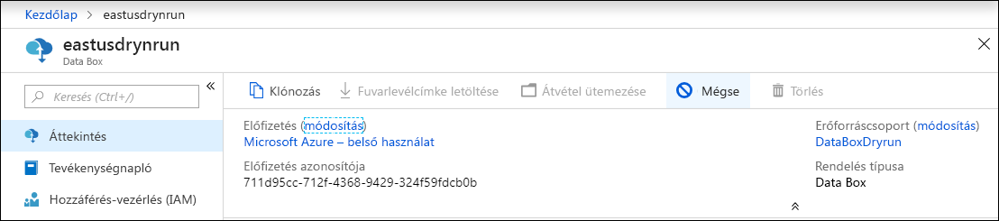
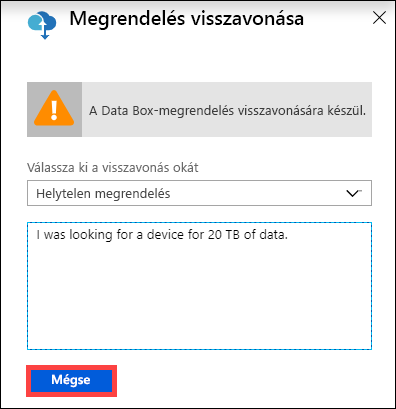
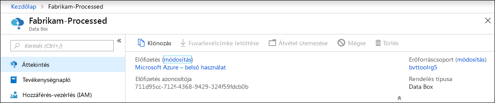
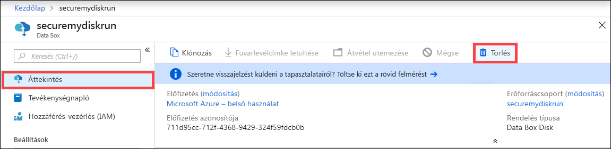
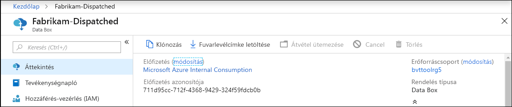
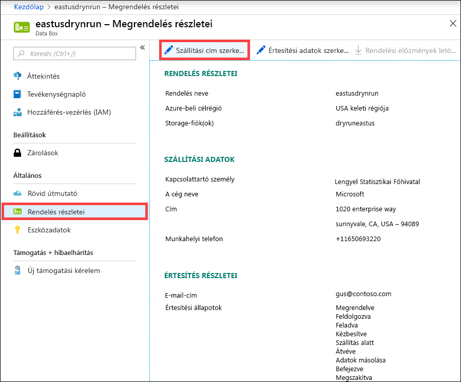
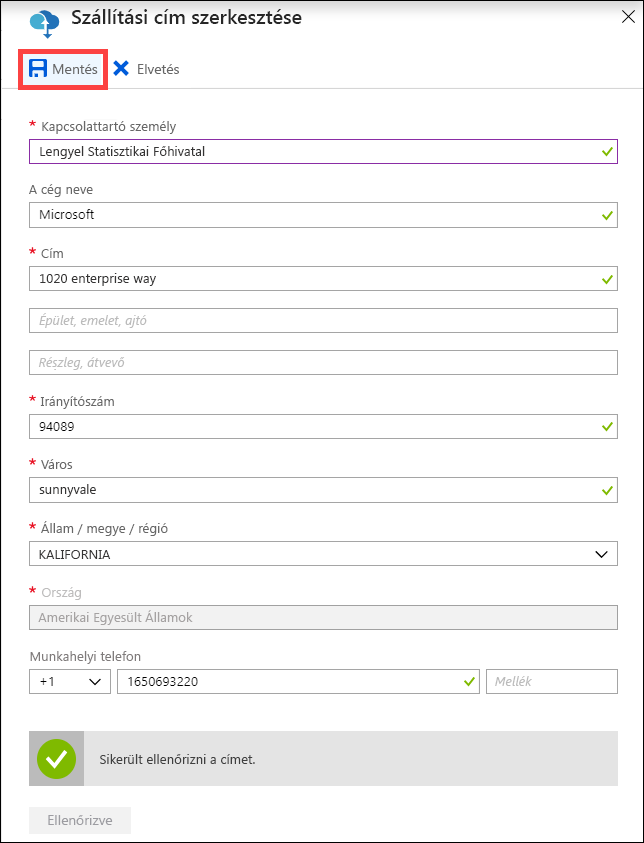
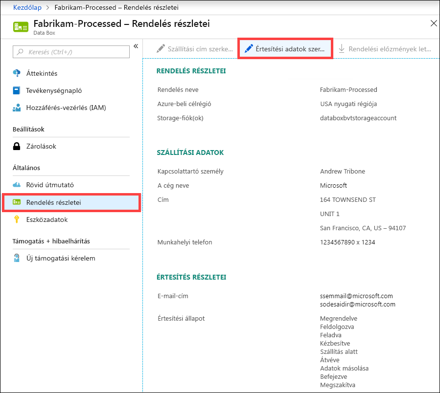
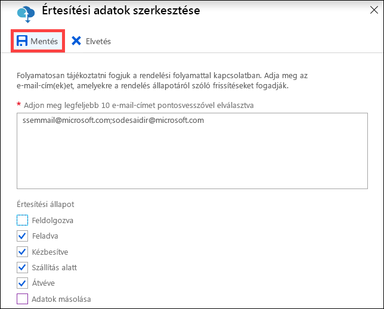

# A Data Box kezelése az Azure Portal használatával

A cikk a Data Boxon végrehajtható komplex munkafolyamatokat és felügyeleti feladatokat ismerteti. A Data Box az Azure Portal használatával vagy a helyi webes felhasználói felületről felügyelhető. 

A cikk az Azure Portalon végrehajtható feladatokra összpontosít. Az Azure Portalon kezelheti a megrendeléseket, felügyelheti a Data Boxot, és nyomon követheti a befejezéshez közeledő rendelések állapotát.

## Rendelés visszavonása

A rendelések azok feladása utáni visszavonása mellett számos különféle okból döntet. A rendelést csak annak feldolgozását megelőzően vonhatja vissza. A rendelés feldolgozását és a Data Box előkészítését követően már nincs lehetőség a visszavonására. 

A rendelés visszavonásához kövesse az alábbi lépéseket.

1.  Lépjen az **Áttekintés > Megszakítás** menüpontra. 

    

2.  Adja meg a rendelés visszavonásának okát.  

    

3.  Miután visszavonta a rendelést, a portálon a rendelés állapota frissül a **Megszakítva** állapotra. 

## Rendelés klónozása

A klónozás bizonyos helyzetekben hasznosnak bizonyulhat. Például a felhasználó egyes adatokat már átvitt a Data Box használatával. Ahogy egyre újabb adatok keletkeznek, újabb Data Boxra van szükség ezek az Azure-ba való átviteléhez. Ebben az esetben egyszerűen klónozhatja az előző rendelést.

A rendelések klónozásához kövesse az alábbi lépéseket.

1.  Lépjen az **Áttekintés > Klónozás** menüpontra. 

    

2.  A rendelés részletei változatlanok maradnak. A rendelés neve az eredeti rendelés neve lesz a *-Klón* utótaggal kiegészítve. Jelölje be a jelölőnégyzetet annak megerősítéséhez, hogy átolvasta az adatvédelmi információkat. Kattintson a **Create** (Létrehozás) gombra.    

A klón létrehozása néhány percet vesz igénybe, és a portálon megjelenik az új rendelés.

## Rendelés törlése

A rendeléseket azok teljesítését követően esetleg törölni szeretné. A rendelés tartalmazza az Ön személyes adatait, úgymint a nevét, a címét és a kapcsolattartási adatait. A rendelés törlésekor a személyes adatok törölve lesznek.

Csak a teljesített vagy visszavont rendeléseket törölheti. A rendelések törléséhez kövesse az alábbi lépéseket.

1. Lépjen a **Minden erőforrás** menüpontra. Keresse meg a rendelést.

2. Kattintson a törölni kívánt rendelésre, és lépjen az **Áttekintés** felületre. A parancssoron kattintson a **Törlés** elemre.

    

3. Ha a rendszer kéri, írja be a rendelés nevét a rendelés törlésének megerősítéséhez. Kattintson a **Törlés** gombra.

## Fuvarlevélcímke letöltése

Ha a Data Box E-ink kijelzője nem működik és nem jeleníti meg a visszaküldési fuvarlevélcímkét, akkor azt le kell töltenie a portálról. 

A fuvarlevélcímkék letöltéséhez kövesse az alábbi lépéseket.
1.  Lépjen az **Áttekintés > Levélcímke letöltése** menüpontra. Ez a lehetőség csak az eszköz kézbesítését követően érhető el. 

    

2.  Ezzel letölti a következő fuvarlevélcímkét a visszaküldéshez. Mentse a címkét, majd nyomtassa ki. Hajtsa össze, majd helyezze a címkét az eszközön található átlátszó zsebbe. Győződjön meg arról, hogy a címke jól látható. Távolítsa el a matricákat, amelyek az előző szállítás során kerültek az eszközre.

    

## Szállítási cím szerkesztése

Előfordulhat, hogy a rendelés feladását követően módosítania kell a szállítási címet. Ezt csak az eszköz feladásáig teheti meg. Az eszköz feladását követően ez a lehetőség már nem érhető el.

A rendelés szerkesztéséhez kövesse az alábbi lépéseket.

1. Lépjen a **Rendelés részletei > Szállítási cím szerkesztése** menüpontra.

    

2. Szerkesztheti és érvényesítheti a szállítási címet, majd mentheti a változásokat.

    

## Értesítési adatok szerkesztése

Lehet, hogy módosítani szeretné, hogy mely felhasználók kapjanak értesítő e-maileket a rendelés állapotáról. Például előfordulhat, hogy valamelyik felhasználót értesíteni kell, ha az eszközt kiszállítják vagy már átvették. Egy másikat pedig esetleg akkor kell értesíteni, ha az adatok másolása befejeződött, hogy a forrás törlése előtt ellenőrizhesse, hogy az adatok valóban átkerültek-e az Azure-tárfiókba. Ilyen esetekben szerkesztheti az értesítési adatokat.

Az értesítési adatok szerkesztéséhez kövesse az alábbi lépéseket.

1. Lépjen a **Rendelés részletei > Értesítési adatok szerkesztése** menüpontra.

    

2. Itt szerkesztheti az értesítési adatokat, majd mentheti a változásokat.
 
    

## Rendelés állapotának megtekintése

Az eszköz állapotának a portálon való változásáról a rendszer értesítést küld e-mailben.

|Rendelés állapota |Leírás |
|---------|---------|
|Megrendelve     | A rendelés sikeresen fel lett adva.  Ha az eszköz elérhető, a Microsoft kiválaszt egy eszközt a szállításhoz, és előkészíti.   Ha az eszköz nem érhető el azonnal, a rendelés akkor lesz feldolgozva, amikor az eszköz elérhetővé válik. A rendelés feldolgozása néhány napot, de akár hónapokat is igénybe vehet. Ha a rendelés nem hajtható végre 90 napon belül, akkor a rendszer visszavonja azt, és e-mailben értesíti Önt.         |
|Feldolgozva     | A rendelés feldolgozása befejeződött. Az eszköz szállításra való előkészítése a rendelésnek megfelelően megtörténik az adatközpontban.         |
|Feladva     | A rendelés fel lett adva. A portálon a rendelésnél feltüntetett követési azonosítóval követheti nyomon a szállítást.        |
|Kézbesítve     | A rendelés ki lett kézbesítve a rendelésben megadott címre.        |
|Szállítás alatt     |A visszaküldött csomagot a szállítmányozó átvette és ellenőrizte.         |
|Megérkezett     | Az eszközt átvették és ellenőrizték az Azure-adatközpontban.   Miután a szállítmányt megvizsgálták, elkezdődik az eszköz feltöltése.      |
|Adatok másolása     | Az adatok másolása folyamatban van. Kövesse nyomon a rendelés másolásának folyamatát az Azure Portalon.   Várjon, amíg az adatok másolása befejeződik. |
|Befejezve       |A rendelés sikeresen teljesítve lett.  Ellenőrizze, hogy az adatok elérhetők-e az Azure-ban, mielőtt törölné a helyszíni adatokat a kiszolgálókról.         |
|Befejeződött, hibákkal| Az adatok másolása befejeződött, azonban hibák jelentkeztek a másolás során.   Tekintse át a másolási naplókat az Azure Portalon megadott útvonalon.   |
|Megszakítva            |A rendelés vissza lett vonva.   Vagy visszavonta a rendelést, vagy hiba történt, és a szolgáltatás vonta vissza. Ha a rendelés nem hajtható végre 90 napon belül, akkor a rendszer visszavonja azt, és e-mailben értesíti Önt.     |
|A fölöslegessé vált elemek eltávolítása | Az eszközlemezeken található összes adat törölve lesz. Az eszköz törlése akkor fejeződik be, amikor a megrendelés naplójelentése elérhetővé válik az Azure Portalon.|

## További lépések

- Ismerje meg [a Data Box-hibák elhárításának](data-box-faq.md) módját.
