# A Data Box Disk (előzetes verzió) kezelése az Azure Portal segítségével

A cikk oktatóanyagai a Microsoft Azure Data Box Disk előzetes verziójára vonatkoznak. A cikk a Data Box Disken végrehajtható komplex munkafolyamatokat és felügyeleti feladatokat ismerteti. 

A Data Box Disk az Azure Portalon keresztül felügyelhető. A cikk az Azure Portalon végrehajtható feladatokra összpontosít. Az Azure Portalon kezelheti a rendeléseket, felügyelheti a meghajtókat, és nyomon követheti a rendelések a befejezési állapotukhoz közeli állapotát.

> [!IMPORTANT]
> A Data Box Disk előzetes verzióban érhető el. A megoldás üzembe helyezése előtt tekintse át [az Azure az előzetes verziókra vonatkozó szolgáltatási feltételeit](https://azure.microsoft.com/support/legal/preview-supplemental-terms/).

## Rendelés visszavonása

A rendelések azok feladása utáni visszavonása mellett számos különféle okból döntet. A rendelést a meghajtók előkészítését megelőzően vonhatja vissza. A meghajtók előkészítését és a rendelés feldolgozását követően már nincs lehetőség a visszavonására. 

A rendelések visszavonásához kövesse az alábbi lépéseket.

1.  Lépjen az **Áttekintés > Megszakítás** menüpontra. 

    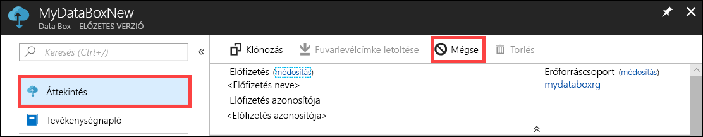

2.  Adja meg a rendelés visszavonásának okát.  

    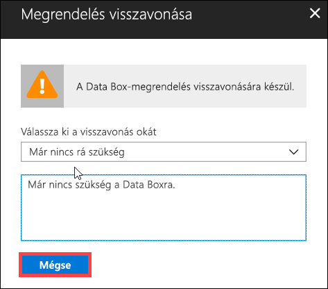

3.  Miután visszavonta a rendelést, a portálon a rendelés állapota frissül a **Megszakítva** állapotra.

    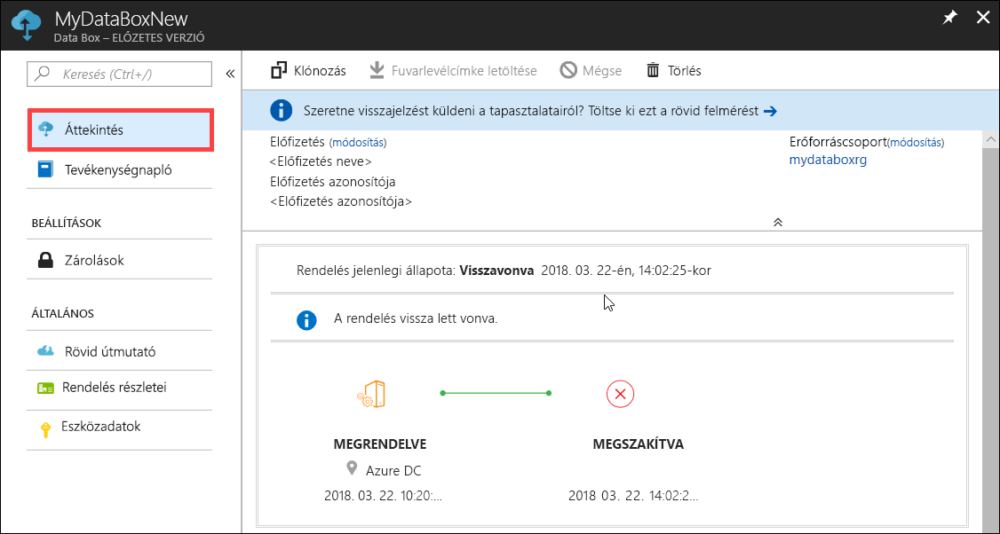

A rendelések visszavonásakor nem kap értesítő e-mailt.

## Rendelés klónozása

A klónozás bizonyos helyzetekben hasznosnak bizonyulhat. Például a felhasználó egyes adatokat már átvitt a Data Box Disk használatával. Ahogy egyre újabb adatok keletkeznek, újabb meghajtókra van szükség ezek az Azure-ba való átviteléhez. Ebben az esetben egyszerűen klónozhatja az előző rendelést.

A rendelések klónozásához kövesse az alábbi lépéseket.

1.  Lépjen az **Áttekintés > Klónozás** menüpontra. 

    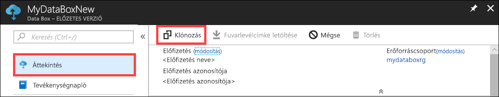

2.  A rendelés részletei változatlanok maradnak. A rendelés neve az eredeti rendelés neve lesz a *-Klón* utótaggal kiegészítve. Jelölje be a jelölőnégyzetet annak megerősítéséhez, hogy átolvasta az adatvédelmi információkat. Kattintson a **Create** (Létrehozás) gombra.    

A klón létrehozása néhány percet vesz igénybe, és a portálon megjelenik az új rendelés.

[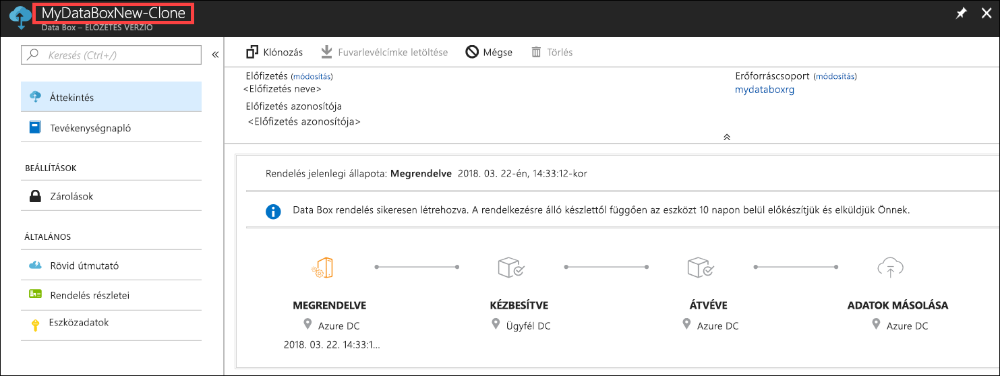](media/data-box-portal-ui-admin/clone-order3.png#lightbox) 

## Rendelés törlése

A rendeléseket azok teljesítését követően esetleg törölni szeretné. A rendelés tartalmazza az Ön személyes adatait, úgymint a nevét, a címét és a kapcsolattartási adatait. A rendelés törlésekor a személyes adatok törölve lesznek.

Csak a teljesített vagy visszavont rendeléseket törölheti. A rendelések törléséhez kövesse az alábbi lépéseket.

1. Lépjen a **Minden erőforrás** menüpontra. Keresse meg a rendelést.

    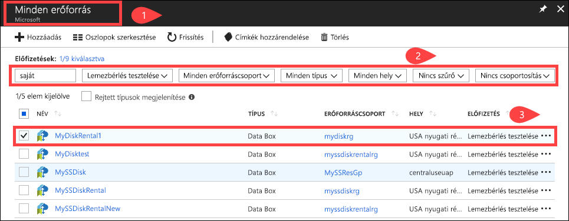

2. Kattintson a törölni kívánt rendelésre, és lépjen az **Áttekintés** felületre. A parancssoron kattintson a **Törlés** elemre.

    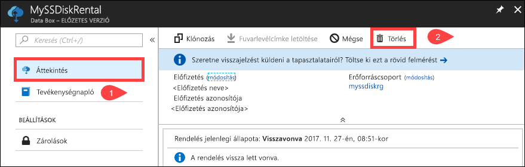

3. Ha a rendszer kéri, írja be a rendelés nevét a rendelés törlésének megerősítéséhez. Kattintson a **Törlés** gombra.

     

## Fuvarlevélcímke letöltése

Ha a meghajtókkal szállított fuvarlevélcímke elveszett vagy nem találja, le kell töltenie a portálról. 

A fuvarlevélcímkék letöltéséhez kövesse az alábbi lépéseket.
1.  Lépjen az **Áttekintés > Levélcímke letöltése** menüpontra. Ez a lehetőség csak a meghajtó kézbesítését követően érhető el. 

    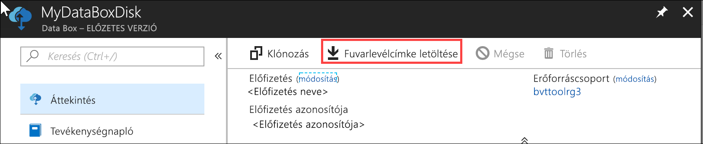

2.  Ezzel letölti a következő fuvarlevélcímkét a visszaküldéshez. Mentse a címkét, majd nyomtassa ki, és tüntesse fel a visszaküldött csomagon.

    

## Szállítási cím szerkesztése

Előfordulhat, hogy a rendelés feladását követően módosítania kell a szállítási címet. Ezt csak a meghajtók feladásáig teheti meg. A meghajtó feladását követően ez a lehetőség már nem érhető el.

A rendelés szerkesztéséhez kövesse az alábbi lépéseket.

1. Lépjen a **Rendelés részletei > Szállítási cím szerkesztése** menüpontra.

    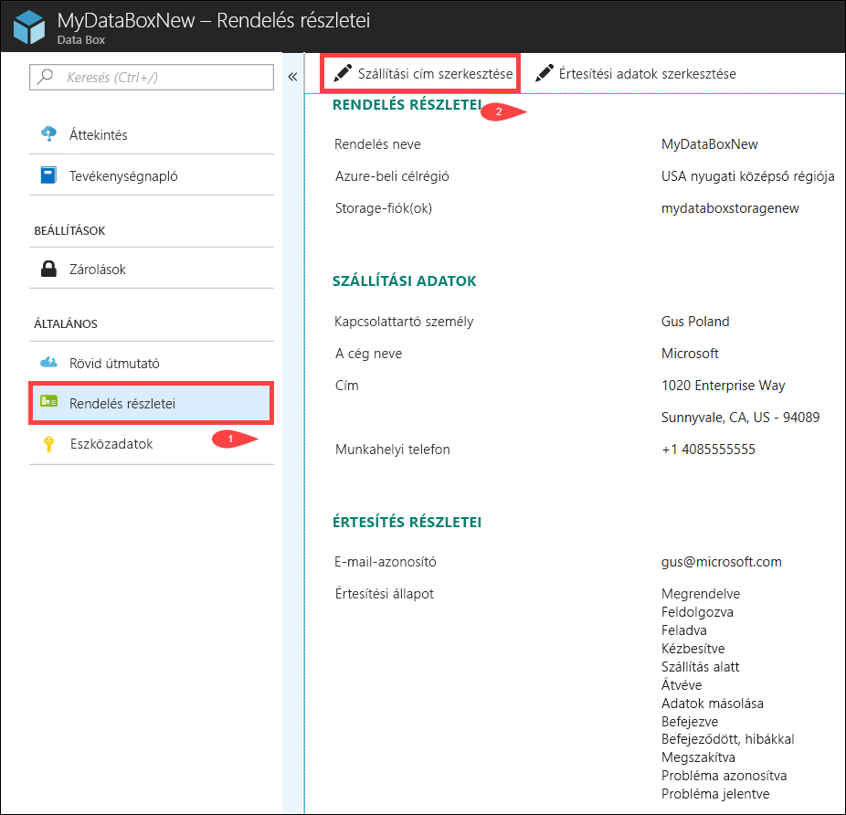

2. Itt szerkesztheti a szállítási címet, majd mentheti a változásokat.

    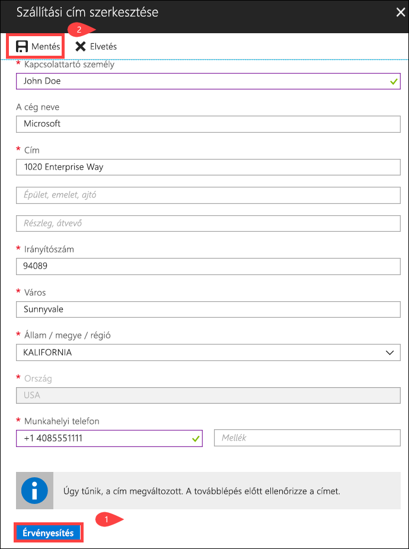

## Értesítési adatok szerkesztése

Lehet, hogy módosítani szeretné, hogy mely felhasználók kapjanak értesítő e-maileket a rendelés állapotáról. Például előfordulhat, hogy valamelyik felhasználót értesíteni kell, ha a meghajtót kiszállítják vagy már átvették. Egy másikat pedig esetleg akkor kell értesíteni, ha az adatok másolása befejeződött, hogy a forrás törlése előtt ellenőrizhesse, hogy az adatok valóban átkerültek-e az Azure-tárfiókba. Ilyen esetekben szerkesztheti az értesítési adatokat.

Az értesítési adatok szerkesztéséhez kövesse az alábbi lépéseket.

1. Lépjen a **Rendelés részletei > Értesítési adatok szerkesztése** menüpontra.

    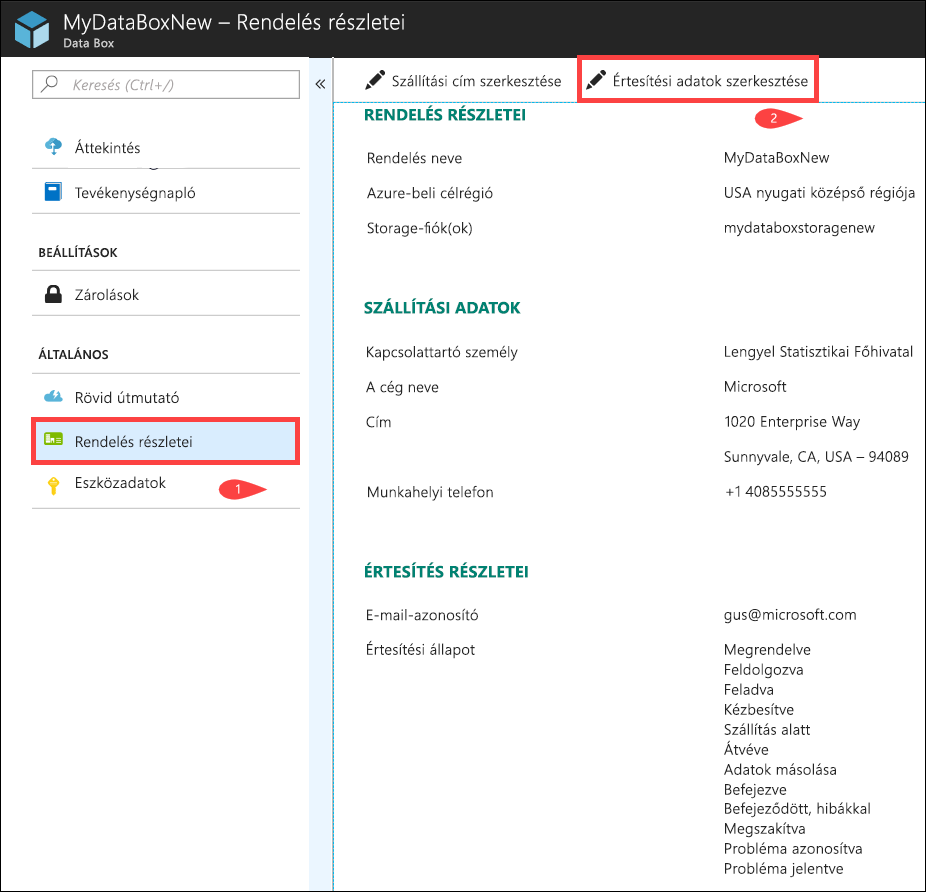

2. Itt szerkesztheti az értesítési adatokat, majd mentheti a változásokat.
 
    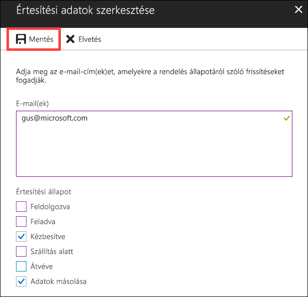

## Rendelés állapotának megtekintése

|Rendelés állapota |Leírás |
|---------|---------|
|Megrendelve     | A rendelés sikeresen fel lett adva.   Ha nem állnak rendelkezésre meghajtók, értesítést fog kapni.  Ha vannak elérhető meghajtók, a Microsoft kiválaszt egyet a szállításhoz, és előkészíti a meghajtócsomagot.        |
|Feldolgozva     | A rendelés feldolgozása befejeződött.   A rendelése feldolgozása során a következő műveletek történnek meg:<li>A meghajtók titkosítása AES-128 BitLocker-titkosítással. </li> <li>A Data Box Disk-meghajtók zárolása az illetéktelen hozzáférés megakadályozására.</li><li>A meghajtókat zároló hozzáférési kulcs ennek a folyamatnak a részeként jön létre.</li>        |
|Feladva     | A rendelés fel lett adva. A rendelést 1–2 napon belül kapja kézhez.        |
|Kézbesítve     | A rendelés ki lett kézbesítve a rendelésben megadott címre.        |
|Szállítás alatt     |A visszaküldött csomagot a futár átvette.   Miután a szállítmány érkezik az Azure-adatközpontban, adatokat automatikusan töltődnek fel az Azure-bA.         |
|Megérkezett     | A meghajtókat átvették az Azure-adatközpontban. Az adatok másolása hamarosan megkezdődik.        |
|Adatok átmásolva     |Az adatok másolása folyamatban van.  Várjon, amíg az adatok másolása befejeződik.         |
|Befejezve       |A rendelés sikeresen teljesítve lett.  Ellenőrizze, hogy az adatok elérhetők-e az Azure-ban, mielőtt törölné a helyszíni adatokat a kiszolgálókról.         |
|Befejeződött, hibákkal| Az adatok másolása befejeződött, azonban hibák jelentkeztek.   Tekintse át a másolási naplókat az **Áttekintés** lapon megadott útvonalon. További információért [töltse le a diagnosztikai naplókat](data-box-disk-troubleshoot.md#download-diagnostic-logs).   |
|Megszakítva            |A rendelés vissza lett vonva.   Vagy visszavonta a rendelést, vagy hiba történt, és a szolgáltatás vonta vissza.     |

## További lépések

- Ismerje meg [a Data Box Disk-hibák elhárításának](data-box-disk-troubleshoot.md) módját.
