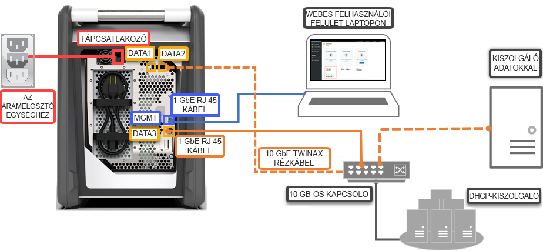

# Gyors útmutató: Üzembe helyezése az Azure Data Box az Azure portal használatával

A rövid útmutató az Azure Data Box az Azure Portal használatával való üzembe helyezését írja le. A lépések bemutatják, hogyan csatlakoztathatja a kábelekkel, és hogyan konfigurálhatja a Data Boxot, majd másolhatja rá az adatokat az Azure-ba való feltöltésükhöz. A rövid útmutató az Azure Portalon és az eszköz helyi webes felületén hajtható végre.

Részletes részletes üzembe helyezés és a nyomkövetési utasításokat, keresse fel [oktatóanyag: Az Azure Data Box sorrend](data-box-deploy-ordered.md)

## Előfeltételek

Előkészületek:

- Győződjön meg róla, hogy a Data Box szolgáltatáshoz használt előfizetés a következő típusok valamelyikébe tartozik:
    - Microsoft nagyvállalati szerződés (EA). További információk az [EA-előfizetésekről](https://azure.microsoft.com/pricing/enterprise-agreement/).
    - Felhőszolgáltató (CSP). További információk az [Azure CSP programjáról](https://docs.microsoft.com/azure/cloud-solution-provider/overview/azure-csp-overview).
    - Microsoft Azure szponzorálás. További információk az [Azure szponzorálási programjáról](https://azure.microsoft.com/offers/ms-azr-0036p/). 

- A Data Box-rendelések létrehozásához tulajdonosi vagy közreműködői jogosultsággal kell rendelkeznie az előfizetésen.
- Tekintse át [a Data Box biztonsági útmutatásait](data-box-safety.md).
- Rendelkezik egy gazdagéppel, amelyen a Data Boxra másolni kívánt adatok találhatók. A gazdaszámítógépen:
    - egy [támogatott operációs rendszernek](data-box-system-requirements.md) kell futnia;
    - egy nagy sebességű hálózathoz kell csatlakoznia. Határozottan javasoljuk, hogy legalább 10 GbE sebességű kapcsolattal rendelkezzen. Ha 10 GbE kapcsolat nem áll rendelkezésre, egy 1 GbE sebességű adatkapcsolat is használható, azonban ez rontja a másolási sebességet. 
- Szüksége lesz egy vízszintes felületre, ahová a Data Boxot helyezheti. Ha az eszközt egy standard kiszolgálószekrény-polcra szeretné helyezni, egy legalább 7U méretű helyre lesz szükség az adatközponti szekrényben. Az eszközt a talpán vagy az oldalán is elhelyezheti a szekrényben.
- A következő kábelekkel rendelkezik a Data Box a gazdagéphez való csatlakoztatásához.
    - Két 10 GbE SFP+ Twinax rézkábel (a DATA 1 és DATA 2 hálózati adapterekhez)
    - Egy RJ-45 CAT 6 hálózati kábel (az MGMT hálózati adapterhez)
    - Egy RJ-45 CAT 6A VAGY egy RJ-45 CAT 6 hálózati kábel (a DATA 3 hálózati adapterhez 10 Gb/s vagy 1 Gb/s sebességre konfigurálva)

## Bejelentkezés az Azure-ba

Jelentkezzen be az Azure Portalra a [http://portal.azure.com](http://portal.azure.com) webhelyen.

## Rendelés

Ez a lépés nagyjából 5 percet vesz igénybe.

1. Hozzon létre egy új Azure Data Box-erőforrást az Azure Portalon.
2. Válasszon ki egy meglévő előfizetést a szolgáltatáshoz, és az átvitel típusánál válassza az **Importálás** lehetőséget. Adja meg a **Forrásország** mezőben azt a helyet, ahol az adatok jelenleg találhatók, az **Azure-beli célrégió** mezőben pedig az adatátvitel célját.
3. Válassza a **Data Box** lehetőséget. A maximális hasznos kapacitás 80 TB, nagyobb mennyiségű adat esetén több rendelést is létrehozhat.
4. Adja meg a rendelés részleteit és a szállítási adatokat. Ha a szolgáltatás elérhető az Ön régiójában, adja meg az értesítési e-mail-címeket, tekintse át az összefoglalót, és hozza létre a rendelést.

A rendelés létrehozását követően megtörténik az eszköz a szállításra való előkészítése.

## Kábel 

Ez a lépés nagyjából 10 percet vesz igénybe.

A Data Box megérkeztét követően hajtsa végre az alábbi lépéseket az eszköz kábeles csatlakoztatásához és bekapcsolásához. Ez a lépés nagyjából 10 percet vesz igénybe.

1. Amennyiben az eszközön sérülés vagy illetéktelen hozzáférés nyomai észlelhetők, ne folytassa az üzembe helyezést. Vegye fel a kapcsolatot a Microsoft támogatási szolgálatával, és küldessen egy csereeszközt.
2. Az eszköz kábeles csatlakoztatása előtt ellenőrizze, hogy rendelkezik-e az alábbi kábelekkel:
    
    - (Mellékelve) egy földelt 10 A vagy nagyobb névleges kapacitású tápkábel az egyik végén IEC60320 C-13 csatlakozóval az eszközhöz való csatlakoztatáshoz.
    - Egy RJ-45 CAT 6 hálózati kábel (az MGMT hálózati adapterhez)
    - Két 10 GbE SFP+ Twinax rézkábel (a 10 Gb/s DATA 1 és DATA 2 hálózati adapterekhez)
    - Egy RJ-45 CAT 6A VAGY egy RJ-45 CAT 6 hálózati kábel (a DATA 3 hálózati adapterhez 10 Gb/s vagy 1 Gb/s sebességre konfigurálva)

3. Vegye ki az eszközt a dobozból, és helyezze egy vízszintes felületre. 
    
4. Csatlakoztassa a kábeleket az eszközhöz az ábra szerint.  

      

    1. Csatlakoztassa a tápkábelt az eszközhöz.
    2. Az RJ-45 CAT 6 hálózati kábellel csatlakoztassa a gazdagépet az eszköz felügyeleti portjához (MGMT). 
    3. Az SFP+ Twinax rézkábellel csatlakoztassa legalább az egyik 10 Gb/s (előnyben részesítve az 1 Gb/s-ossal szemben) hálózati adaptert, a DATA 1 vagy a DATA 2 adaptert az adatforgalom számára. 
    4. Kapcsolja be az eszközt. A bekapcsológomb az eszköz előlapján található.

## Kapcsolódás

Ez a lépés kb. 5–7 percet vesz igénybe.

1. Az eszköz jelszavát az [Azure Portal](http://portal.azure.com) **Általános > Eszköz adatai** lapján találja.
2. A Data Boxhoz csatlakoztatott számítógépen rendelje a 192.168.100.5 statikus IP-címet és a 255.255.255.0 alhálózatot az Ethernet-adapterhez. Nyissa meg az eszköz helyi webes felületét a következő helyen: `https://192.168.100.10`. A csatlakozás az eszköz bekapcsolását követően 5 percet is igénybe vehet. 
3. Jelentkezzen be az Azure Portalról beszerzett jelszóval. Egy hibaüzenet jelenik meg, miszerint a webhely biztonsági tanúsítványa hibás. A böngészőspecifikus utasításokat követve lépjen a weblapra.
4. Alapértelmezés szerint a 10 Gb/s (vagy az 1 Gb/s) sebességű adatillesztő DHCP-ként van konfigurálva. Szükség esetén statikusként is konfigurálhatja az illesztőt, és megadhat egy IP-címet. 

## Adatok másolása

A művelet végrehajtásának időtartama az adatok mennyiségétől és a hálózat sebességétől függ.
 
1. Windows rendszerű gazdagép használata esetén használjon SMB-kompatibilis fájlmásoló eszközt (pl.: Robocopy). NFS-gazdagép esetén a `cp` parancs vagy a `rsync` használatával másolhatja az adatokat. Csatlakoztassa a másolóeszközt a készülékre, és kezdje el másolni az adatokat a megosztásokra. Az adatok a Robocopyval való másolásával kapcsolatos további információkért lásd: [Robocopy](https://technet.microsoft.com/library/ee851678.aspx).
2. A megosztásokhoz a következő útvonalon csatlakozhat: `\\<IP address of your device>\ShareName`. A megosztás eléréséhez szükséges hitelesítő adatokat a Data Box helyi webes kezelőfelületének **Connect & copy** (Kapcsolódás és másolás) lapján tekintheti meg.
3. Gondoskodjon róla, hogy a megosztások és a mappák neve, valamint az adatok megfelelnek [az Azure Storage és a Data Box szolgáltatás korlátaival](data-box-limits.md) foglalkozó cikkben foglaltaknak.

## Elküldés az Azure-nak 

A művelet befejezése kb. 10–15 percet vesz igénybe.

1. Nyissa meg a helyi webes kezelőfelület **Prepare to ship** (Szállítás előkészítése) lapját, és kezdje meg az előkészületeket a szállításra. 
2. Kapcsolja ki az eszközt a helyi webes kezelőfelületen. Válassza le a kábeleket az eszközről. 
3. A visszaküldési fuvarlevélcímkének láthatónak kell lennie az E-ink kijelzőn. Ha a címke nem látszik az E-ink kijelzőn, töltse le a fuvarlevélcímkét az Azure Portalról, és helyezze az eszközre rögzített átlátszó tasakba.
4. Zárja le a dobozt, és küldje el a Microsoftnak. 

## Az adatok ellenőrzése

A művelet végrehajtásának időtartama az adatok mennyiségétől függ.

1. A Data Box eszköz az Azure-adatközpont hálózatához való csatlakoztatásakor az adatok az Azure-ba való feltöltése automatikusan megkezdődik. 
2. Az Azure Data Box szolgáltatás az Azure Portalon értesíti, ha az adatok másolása befejeződött. 

    1. Ellenőrizze a hibákat a hibanaplókban, és tegye meg a szükséges intézkedéseket.
    2. Ellenőrizze, hogy az adatok jelen vannak-e a tárfiók(ok)ban, mielőtt törölné azokat a forrásról.

## Az erőforrások eltávolítása

Ez a lépés 2–3 percet vehet igénybe.

- A Data Box-rendelést a feldolgozása előtt bármikor visszavonhatja az Azure Portalon. A rendelést a teljesítése után már nem lehet visszavonni. A rendelés halad a maga útján, amíg el nem éri a teljesített állapotot. A rendelés visszavonásához lépjen az **Áttekintés** oldalra, és kattintson a **Megszakítás** parancsra a parancssávon.

- A rendelés akkor törölhető, ha a **Teljesítve** vagy a **Megszakítva** állapot jelenik meg az Azure Portalon. A rendelés törléséhez lépjen az **Áttekintés** oldalra, és kattintson a **Törlés** parancsra a parancssávon.

## További lépések

Ebben a rövid útmutatóban egy Azure Data Boxot helyezett üzembe az adatok az Azure-ba való importálásához. Folytassa a következő cikkel, ha többet szeretne megtudni az Azure Data Box kezeléséről: 

> [!div class="nextstepaction"]
> [A Data Box az Azure Portal használatával történő kezelése](data-box-portal-admin.md)

