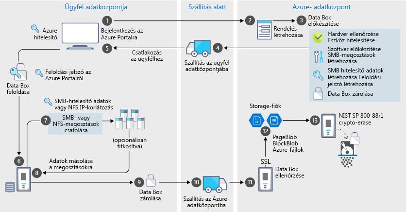

# Az Azure Data Box biztonsági és adatvédelmi szolgáltatásai

A Data Box biztonságos megoldást kínál az adatok védelmére, mivel garantálja, hogy az adatokat csak a jogosult entitások tekinthetik meg, módosíthatják vagy törölhetik. A cikk az Azure Data Box biztonsági szolgáltatásait ismerteti, amelyekkel biztosítható a Data Box megoldás összetevőinek és a bennük tárolt adatoknak a védelme. 

[!INCLUDE [GDPR-related guidance](../../includes/gdpr-intro-sentence.md)]

## Az adatok áramlása az összetevők között

A Microsoft Azure Data Box megoldást négy, egymással együttműködő fő összetevő alkotja:

- **Az Azure-ban üzemeltetett Azure Data Box szolgáltatás** – a felügyeleti szolgáltatás, amellyel eszközmegrendeléseket hozhat létre, konfigurálhatja az eszközöket, majd nyomon követheti a rendelést a teljesítésig.
- **Data Box-eszköz** – az átviteli eszköz, amelyet helyszíni adatai az Azure-ba való importálásához kiküldünk Önnek. 
- **Az eszközhöz csatlakoztatott ügyfelek/gazdagépek** – az infrastruktúra védeni kívánt adatokat tartalmazó, a Data Box-eszközhöz csatlakozó ügyfelei.
- **Felhőalapú tároló** – a hely az Azure-felhőben, ahol az adatok tárolása történik. Ez általában a létrehozott Azure Data Box-erőforráshoz csatolt tárfiók.

A következő ábra az adatok áramlását mutatja az Azure Data Box megoldásban a helyszíni rendszerekről az Azure-ba.

Az adatáramlás a megoldáson keresztül, mert eseményeket naplózza, és a naplók jönnek létre. További információért ugorjon [Tracking és az eseménynaplózás az Azure Data Box](data-box-logs.md).

## Biztonsági funkciók

A Data Box biztonságos megoldást kínál az adatok védelmére, mivel garantálja, hogy az adatokat csak a jogosult entitások tekinthetik meg, módosíthatják vagy törölhetik. A megoldás biztonsági szolgáltatásai a lemezekre és a rajtuk tárolt adatokat védő szolgáltatásra is vonatkoznak. 

### A Data Box-eszköz védelme

A Data Box-eszköz védelmét az alábbi funkciók biztosítják:

- Az eszköz strapabíró tokkal rendelkezik, amely ellenáll az ütéseknek, valamint a kedvezőtlen szállítási és időjárási körülményeknek. 
- Eredetiséget jelző pecsétek, amelyek jelzik, ha az eszközhöz a szállítás során illetéktelenek fértek hozzá.
- A hardverhez vagy a szoftverekhez való illetéktelen hozzáférés észlelése esetén az eszköz nem működtethető.
- Csak Data Box-kompatibilis szoftvert futtat.
- A rendszerindítás zárolt állapotban történik.
- Az eszközhöz való hozzáférés védelmét zárolásfeloldási jelszó biztosítja.
- Az adatok külső helyre és helyről történő másolásához hozzáférési hitelesítő adatokat kell megadni. Az összes hozzáférést a **hitelesítő adatai** oldal az Azure portal van bejelentkezve a [tevékenységeket tartalmazó naplók](data-box-logs.md#query-activity-logs-during-setup).

### A Data Box-adatok védelme

A Data Box szolgáltatás bejövő és kimenő adatainak biztonságát az alábbi szolgáltatások biztosítják:

- Az inaktív adatok 256 bites AES-titkosítással védettek.
- A titkosított protokollok átvitel közben is biztosítják az adatok védelmét.
- Az adatokat biztonságosan törölheti az eszközről, miután az Azure-ba való feltöltés befejeződött. Az adatok törlése a NIST 800-88r1 szabványoknak megfelelően történik. Az adatok törlését esemény rögzíti a [rendelési előzmények](data-box-logs.md#download-order-history).

### A Data Box szolgáltatás védelme

A Data Box szolgáltatás biztonságát az alábbi funkciók biztosítják.

- A Data Box szolgáltatáshoz való hozzáféréshez a cégnek olyan Azure-előfizetéssel kell rendelkeznie, amely tartalmazza a Data Boxot. Az előfizetés szabályozza, hogy az Azure Portal mely szolgáltatásai érhetők el.
- A Data Box szolgáltatás az Azure-ban üzemel, így az Azure biztonsági funkciói védik. A Microsoft Azure által biztosított biztonsági funkciókról a [Microsoft Azure biztonsági és adatkezelési központban](https://www.microsoft.com/TrustCenter/Security/default.aspx) talál további információt.
- A Data Box-rendelés hozzáférést keresztül szerepköreit, szerepköralapú hozzáférés-vezérlés (RBAC) szabályozható. További információkért lásd: [hozzáférés-vezérlés a Data Box-rendelését beállítása](data-box-logs.md#set-up-access-control-on-the-order)
- A Data Box szolgáltatás tárolja a zárolásfeloldási jelszót, amellyel az eszköz zárolása a szolgáltatásban feloldható.
- A Data Box szolgáltatás tárolja a megrendelések adatait és állapotát a szolgáltatásban. A megrendelés törlésekor ezek az információk is törlődnek.

## Személyes adatok kezelése

Az Azure Data Box a szolgáltatás alábbi főbb példányaiban gyűjt és jelenít meg személyes adatokat:

- **Értesítési beállítások** – Amikor létrehoz egy megrendelést, a felhasználók e-mail-címeit az értesítési beállítások alatt konfigurálhatja. Ezeket az adatokat az adminisztrátor megtekintheti. A szolgáltatás törli az adatokat, amikor a feladat eléri a végállapotot, illetve ha Ön törli a megrendelést.

- **Megrendelés részletei** – miután létrejött a megrendelés, a felhasználók szállítási címét, e-mail-címét és kapcsolattartási adatait az Azure Portal tárolja. A mentett információk a következők:

  - Kapcsolattartó neve
  - Telefonszám
  - E-mail-cím
  - Utca, házszám
  - Város
  - Irányítószám
  - Állapot
  - Ország/tartomány/régió
  - Szállítmányozó fiókszáma
  - Szállítmány nyomkövetési száma

    A Data Box a feladat befejezésekor vagy törlésekor törli a rendelés részleteit.

- **Szállítási cím** – A rendelés feladása után a Data Box szolgáltatás kiadja a szállítási címet külső szállítmányozóknak, például a UPS-nek vagy a DHL-nek. 

További információkért lásd a Microsoft szabályzatát a [biztonsági és adatkezelési központban](https://www.microsoft.com/trustcenter).

## Biztonsági irányelvek – referencia

A Data Box szolgáltatásra a következő biztonsági irányelvek vonatkoznak: 

|Irányelv   |Leírás   |
|---------|---------|
|[IEC 60529 IP52](https://www.iec.ch/)    | Víz és por elleni védelem         |
|[ISTA 2A](https://ista.org/docs/2Aoverview.pdf)     | Ellenállás a kedvezőtlen szállítási körülményeknek          |
|[NIST SP 800-147](https://nvlpubs.nist.gov/nistpubs/Legacy/SP/nistspecialpublication800-147.pdf)      | Biztonságos belsővezérlőprogram-frissítés         |
|[2. szintű FIPS 140-2](https://csrc.nist.gov/csrc/media/publications/fips/140/2/final/documents/fips1402.pdf)      | Adatvédelem         |
|[NIST SP 800-88r1](https://nvlpubs.nist.gov/nistpubs/SpecialPublications/NIST.SP.800-88r1.pdf)      | Adattisztítás         |

## További lépések

- A [Data Box használatára vonatkozó előfeltételek](data-box-system-requirements.md) áttekintése.
- A [Data Box korlátjainak](data-box-limits.md) értelmezése.
- Az [Azure Data Box](data-box-quickstart-portal.md) gyors üzembe helyezése az Azure Portalon.
