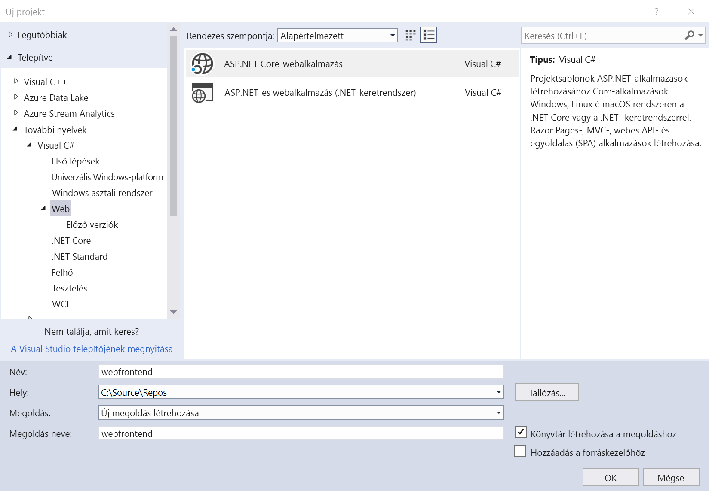
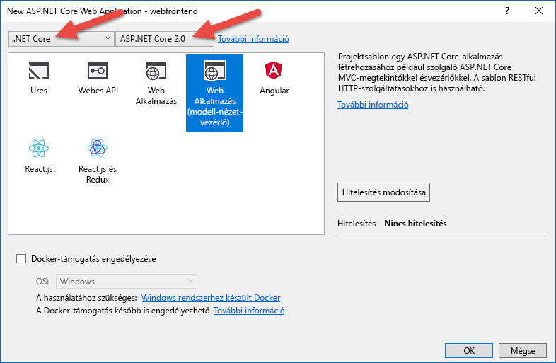

# <a name="get-started-on-azure-dev-spaces-with-net-core-and-visual-studio"></a>Bevezetés az Azure Dev Spaces .NET Core és Visual Studio segítségével történő használatába

Ebből az útmutatóból a következőket tudhatja meg:

- Fejlesztésre optimalizált Kubernetes-alapú környezet létrehozása az Azure-ban.
- Iteratív kódfejlesztés tárolókban a Visual Studio használatával.
- Két külön szolgáltatás egymástól függetlenül történő fejlesztése, és a használt Kubernetes DNS-szolgáltatás észlelésével hívásindítás egy másik szolgáltatásba.
- A kód hatékony fejlesztése és tesztelése, csapatkörnyezetben.

[!INCLUDE[](includes/see-troubleshooting.md)]

[!INCLUDE[](includes/portal-aks-cluster.md)]

## <a name="get-the-visual-studio-tools"></a>A Visual Studio eszközeinek beszerzése
1. A [Visual Studio 2017](https://www.visualstudio.com/vs/) legújabb verziójának telepítése
1. Győződjön meg róla, hogy a Visual Studio telepítőjében a következő számítási feladat van kiválasztva:
    * ASP.NET és webfejlesztés
1. Telepítse az [Azure Dev Spaceshez készült Visual Studio-bővítményt](https://aka.ms/get-azds-visualstudio)

Most már készen áll egy ASP.NET-webalkalmazás létrehozására a Visual Studio használatával.

## <a name="create-an-aspnet-web-app"></a>ASP.NET-webapp létrehozása

Hozzon létre egy új projektet a Visual Studio 2017-ben. Jelenleg a projektnek egy **ASP.NET Core-webalkalmazásnak** kell lennie. Adja a projektnek a „**webfrontend**” nevet.



Válassza ki a **Webalkalmazás (Model-View-Controller)** sablont, és ellenőrizze, hogy a párbeszédpanel tetején a két legördülő listában a **.NET Core** és az **ASP.NET Core 2.0** van-e kijelölve. A projekt létrehozásához kattintson az **OK** gombra.




## <a name="create-a-dev-environment-in-azure"></a>Fejlesztői környezet létrehozása az Azure-ban

Az Azure Dev Spaces segítségével fejlesztésre optimalizált, Kubernetes-alapú környezetet hozhat létre, amelyet teljes egészében az Azure kezel. Nyissa meg az imént létrehozott projektet, és válassza ki az **Azure Dev Spaces** lehetőséget az indítási beállítások legördülő menüjéből, ahogy az az alábbi képen látható.


Az ezt követően megjelenő párbeszédpanelen ellenőrizze, hogy a megfelelő fiókkal van-e bejelentkezve, majd válasszon ki egy meglévő Kubernetes-fürtöt.


A **Tér** legördülő menüt egyelőre hagyja a `default` alapértelmezett értéken. Erről a beállításról a későbbiekben kaphat további információt. Jelölje be a **Nyilvánosan hozzáférhető** jelölőnégyzetet, hogy a webalkalmazás nyilvános végpontról is elérhető legyen. Ez a beállítás nem szükséges, de hasznos lehet néhány fogalom bemutatásához az útmutató későbbi szakaszában. De ne aggódjon, mindkét esetben végezhet a webhelyen hibakeresést a Visual Studio segítségével.


A fürt kiválasztásához vagy létrehozásához kattintson az **OK** gombra.

Ha egy olyan fürtöt választ, amely nincs az Azure Dev Spaceshez konfigurálva, a rendszer egy üzenetben rákérdez, hogy szeretné-e konfigurálni.


Kattintson az **OK** gombra.

 Egy háttérművelet fogja végrehajtani a konfigurálást. Ez eltarthat néhány percig. Ha meg szeretné nézni, hogy tart-e még a folyamat, vigye az egérmutatót az állapotsor bal alsó sarkában lévő **Háttérfolyamatok** ikon fölé, az alábbi ábrán látható módon.


> [!Note]
> Amíg a fejlesztői környezet létrehozása sikeresen le nem zárul, nem tud hibakeresést végezni az alkalmazáson.

## <a name="look-at-the-files-added-to-project"></a>A projekthez adott fájlok ellenőrzése
Amíg a fejlesztői környezet létrehozására vár, tekintse meg, milyen fájlokat rendelt a projekthez a rendszer, amikor fejlesztői környezet használatát választotta.

Először is láthatja, hogy a rendszer hozzáadott egy `charts` nevű mappát, amelyben előállított egy [Helm-diagramot](https://docs.helm.sh) az alkalmazásához. Ezek a fájlok szükségesek az alkalmazás üzembe helyezéséhez a fejlesztői környezetben.

A rendszer hozzáadott egy `Dockerfile` nevű fájlt is. Ez a fájl olyan információt tartalmaz, amely az alkalmazás szabványos Docker-formátumba való csomagolásához szükséges. Egy `HeaderPropagation.cs` fájl is létre lett hozva. Erre az oktatóanyag későbbi részében térünk ki. 

Végül látni fog egy `azds.yaml` nevű fájlt, amely a fejlesztői környezethez szükséges konfigurációs adatokat tartalmaz (pl. elérhető legyen-e az alkalmazás nyilvános végpontról).


## <a name="debug-a-container-in-kubernetes"></a>Tároló hibakeresése a Kubernetesben
Amint a fejlesztői környezet létrehozása sikeresen lezárul, hibakeresést végezhet az alkalmazáson. Állítson be egy töréspontot a kódban, például a `HomeController.cs` fájl 20. sorában, ahol a `Message` változó van beállítva. Nyomja le az **F5** billentyűt a hibakeresés indításához. 

A Visual Studio kommunikál a fejlesztői környezettel, hogy az hozza létre és helyezze üzembe az alkalmazást, majd nyisson meg egy böngészőt a futó webalkalmazással. Úgy tűnhet, hogy a tároló futtatása helyileg történik, de valójában az Azure fejlesztői környezetében fut. A localhost cím oka az, hogy az Azure Dev Spaces egy ideiglenes SSH-alagutat hoz létre az Azure-ban futó tárolóhoz.

Kattintson az oldal tetején lévő **About** (Információ) hivatkozásra a töréspont aktiválásához. Ugyanúgy teljes körű hozzáférése van a hibakeresési információkhoz, mintha helyileg futna a kód (pl. hívási verem, helyi változók, kivételek adatai stb.).

## <a name="call-another-container"></a>Egy másik tároló hívása
Ebben a szakaszban egy második, `mywebapi` nevű szolgáltatást fog létrehozni, és a `webfrontend` használatával fogja hívni azt. Minden szolgáltatás különálló tárolókban fut. Ezt követően hibakeresést fog futtatni mindkét tárolóban.


## <a name="download-sample-code-for-mywebapi"></a>Mintakód letöltése a *mywebapi* szolgáltatáshoz
Az egyszerűség kedvéért töltsünk le egy mintakódot a GitHub-adattárból. Navigáljon a https://github.com/Azure/dev-spaces helyre, és válassza a **Klónozás vagy Letöltés** lehetőséget a GitHub-adattár letöltéséhez. Az ehhez a szakaszhoz tartozó kód a következő helyen található: `samples/dotnetcore/getting-started/mywebapi`.

## <a name="run-mywebapi"></a>A *mywebapi* szolgáltatás futtatása
1. Nyissa meg a `mywebapi` projektet egy *különálló Visual Studio-ablakban*.
1. Válassza ki az **Azure Dev Spaces** lehetőséget az indítási beállítások legördülő listájából, ahogy korábban a `webfrontend` projekt esetében is tette. Egy új fejlesztési környezet létrehozása helyett most válassza ki a már létrehozottat. A korábbiakhoz hasonlóan hagyja a Tér értékét az alapértelmezett `default` értéken, és kattintson az **OK** gombra. A kimeneti ablakban észreveheti, hogy a Visual Studio elkezdi „beüzemelni” az új szolgáltatást a fejlesztési környezetben, ezzel elősegítve a gyorsabb végrehajtást a hibakeresés során.
1. Nyomja le az F5 billentyűt, és várjon, amíg a rendszer felépíti és telepíti a szolgáltatást. A művelet akkor fejeződik be, ha a Visual Studio állapotsora narancssárga színűre vált
1. Jegyezze fel a végpont URL-címét, amelyet a **kimeneti** ablak **Azure Dev Spaces for AKS** panelén láthat. A következőhöz hasonlóan fog kinézni: http://localhost:\<portnumber\>. Úgy tűnhet, hogy a tároló futtatása helyileg történik, de valójában az Azure fejlesztői környezetében fut.
2. Ha a `mywebapi` elkészült, a `ValuesController` alapértelmezett GET API-jának meghívásához nyissa meg böngészőjét a localhost címen, és fűzze hozzá az `/api/values` elérési utat az URL-címhez. 
3. Ha minden lépés sikeres volt, választ kell kapnia a `mywebapi` szolgáltatástól, amely az alábbihoz hasonlóan néz ki.

    

## <a name="make-a-request-from-webfrontend-to-mywebapi"></a>Kérés indítása a *webfrontend*-ből a *mywebapi*-ba
Most írjunk olyan kódot a `webfrontend` szolgáltatásban, amely kérést indít a `mywebapi` felé. Váltson arra a Visual Studio-ablakra, amely a `webfrontend` projektet tartalmazza. A `HomeController.cs` fájlban *cserélje le* az About metódus kódját az alábbira:

   ```csharp
   public async Task<IActionResult> About()
   {
      ViewData["Message"] = "Hello from webfrontend";

      // Use HeaderPropagatingHttpClient instead of HttpClient so we can propagate
      // headers in the incoming request to any outgoing requests
      using (var client = new HeaderPropagatingHttpClient(this.Request))
      {
          // Call *mywebapi*, and display its response in the page
          var response = await client.GetAsync("http://mywebapi/api/values/1");
          ViewData["Message"] += " and " + await response.Content.ReadAsStringAsync();
      }

      return View();
   }
   ```

Figyelje meg, hogy a Kubernetes DNS-szolgáltatásészlelése a következőként hivatkozik a szolgáltatásra: `http://mywebapi`. **A kód ugyanúgy fut a fejlesztési környezetben, mint ahogy éles környezetben is fog**.

A fenti kódpélda a `HeaderPropagatingHttpClient` osztályt is használja. Ez a segítőosztály a `HeaderPropagation.cs` fájl, ami akkor lett hozzáadva a projekthez, amikor az Azure Dev Spaces használatára konfigurálta. A `HeaderPropagatingHttpClient` a jól ismert `HttpClient` osztályból származik, és olyan funkcionalitást ad hozzá, amely adott fejléceket propagál egy létező ASP .NET HttpRequest-objektumból egy kimenő HttpRequestMessage-objektumba. Később látni fogja, ez hogyan segíti elő a produktívabb fejlesztési élményt a csapatmunkákban.

## <a name="debug-across-multiple-services"></a>Hibakeresés több szolgáltatásban
1. Ezen a ponton a `mywebapi` elvileg még mindig fut a hozzácsatolt hibakeresővel. Ha nem fut, nyomja le az F5 billentyűt a `mywebapi` projektben.
1. Állítson be egy töréspontot a `ValuesController.cs` fájl `Get(int id)` metódusában, amely kezeli a `api/values/{id}` GET-kéréseket.
1. A `webfrontend` projektben, ahova a fenti kódot illesztette be, állítson be egy töréspontot, mielőtt az GET-kérést küldene a `mywebapi/api/values` számára.
1. Nyomja le az F5 billentyűt a `webfrontend` projektben. A Visual Studio ismét megnyit egy böngészőablakot a localhost megfelelő portjához, és megjelenik a webalkalmazás.
1. Kattintson az oldal tetején lévő **About** (Információ) hivatkozásra a `webfrontend` projekt töréspontjának aktiválásához. 
1. Nyomja le az F10 billentyűt a folytatáshoz. A `mywebapi` projekt töréspontja aktiválódik.
1. Nyomja le az F5 billentyűt a folytatáshoz, és visszakerül a `webfrontend` projekt kódjához.
1. Nyomja le ismételten az F5 billentyűt a kérés teljesítéséhez. Ekkor betöltődik egy oldal a böngészőben. A webalkalmazás About (Információ) oldalán a két szolgáltatás által összefűzött üzenet jelenik meg: „Hello from webfrontend and Hello from mywebapi.”

Remek! Most már rendelkezik egy többtárolós alkalmazással, ahol az egyes tárolók külön-külön fejleszthetők és helyezhetők üzembe.

## <a name="learn-about-team-development"></a>A csapatban végzett fejlesztés bemutatása

Eddig úgy futtatta alkalmazása kódját, mintha Ön dolgozna egyedül fejlesztőként az alkalmazáson. Ebben a szakaszban megismerheti, hogyan teszi zökkenőmentessé az Azure Dev Spaces a csapatban végzett fejlesztést:
* Lehetővé teszi, hogy egy fejlesztőcsapat ugyanabban a fejlesztői környezetben dolgozhasson.
* Támogatja, hogy minden fejlesztő elszigetelten iterálhassa a saját kódját, miközben nem kell tartani attól, hogy mindeközben mások kódja működésképtelenné válik.
* Végpontok között lehet tesztelni a kódot a kód véglegesítése előtt, és nem szükséges utánzatokat létrehozni vagy függőségeket szimulálni.

### <a name="challenges-with-developing-microservices"></a>A mikroszolgáltatások fejlesztésének kihívásai
A mintaalkalmazása jelenleg nem túl összetett. A valóságban a fejlesztés során folyamatosan merülnek fel kihívások, ahogy egyre több szolgáltatást vesz fel, illetve ahogy nő a fejlesztői csapat.

Képzelje el, hogy egy olyan szolgáltatáson dolgozik, amely több tucat más szolgáltatással van kapcsolatban.

- Hamar életszerűtlenné válhat, hogy mindent helyileg futtasson a fejlesztéshez. Elképzelhető, hogy a fejlesztői gépen nincs elég erőforrás a teljes alkalmazás futtatásához. Az is lehetséges, hogy az alkalmazása olyan végpontokkal rendelkezik, amelyeknek nyilvánosan elérhetőnek kell lenniük (pl. az alkalmazása egy SaaS-alkalmazás webhookjának ad választ).
- Megpróbálhatja csak azokat a szolgáltatásokat futtatni, amelyektől függ az alkalmazás, de ehhez ismernie kell a függőségek teljes körét (például a függőségek függőségeit). Az is problémát jelenthet, hogy nehéznek bizonyul a függőségek felépítése és futtatása, mert korábban nem dolgozott rajtuk.
- Néhány fejlesztő ilyenkor szimulációba kezd, vagy utánzatokat készít a szolgáltatás függőségeiről. Ez néha segíthet, de az utánzatok kezelése hamarosan önmagában is saját fejlesztői erőforrásokat köthet le. Továbbá ez ahhoz vezethet, hogy a fejlesztői környezet eltér az éles üzemtől, és apró hibák jelenhetnek meg.
- Ebből következik, hogy mindenféle végpontok közötti tesztelés nehézkessé válik. Az integráció tesztelése a valóságban csak a véglegesítés után történhet meg, ami azt jelenti, hogy a fejlesztési ciklus későbbi szakaszaiban problémákat tapasztalhat.

    

### <a name="work-in-a-shared-development-environment"></a>Munka egy megosztott fejlesztési környezetben
Az Azure Dev Spaces segítségével beállíthat egy *megosztott* fejlesztői környezetet az Azure-ban. Minden fejlesztőnek csak az alkalmazásból rá eső részre kell koncentrálnia, és iterációs módszerrel fejlesztheti a *véglegesítés előtti kódot* egy olyan környezetben, amely már tartalmaz minden olyan szolgáltatást és felhőerőforrást, amelyektől az egyes forgatókönyvek függhetnek. A függőségek mindig naprakészek, a fejlesztők pedig mindig az éles környezetet tükröző módon dolgozhatnak.

### <a name="work-in-your-own-space"></a>Munkavégzés a saját térben
A szolgáltatás kódjának fejlesztése során, de még leadás előtt a kód sokszor nincs optimális állapotban. Az iteratív módszerrel újra és újra kell formálni, tesztelni kell, megoldásokkal kísérletezni. Az Azure Dev Spaces biztosítja a **tér** fogalmát, amely lehetővé teszi, hogy elszigetelten dolgozhasson, anélkül, hogy a többi csapattag munkájára kihatással lennének a fejlesztési munkálatok.

Az alábbiak elvégzésével meggyőződhet arról, hogy a `webfrontend` és a `mywebapi` szolgáltatás egyaránt fut a fejlesztői környezetében **és a `default` térben** is.
1. Zárjon be minden F5/hibakeresési munkamenetet minden szolgáltatás esetében, de tartsa nyitva a projekteket saját Visual Studio-ablakukban.
2. Váltson arra a Visual Studio-ablakra, amely a `mywebapi` projektet tartalmazza, és nyomja le a Ctrl+F5 billentyűparancsot a szolgáltatás a hibakereső csatolása nélküli futtatásához.
3. Váltson arra a Visual Studio-ablakra, amely a `webfrontend` projektet tartalmazza, és nyomja le a Ctrl+F5 billentyűparancsot a futtatásához.

> [!Note]
> Néha frissíteni kell a böngészőlapot azt követően, hogy a weboldal először megjelenik a Ctrl+F5 lenyomása után.

Bárki, aki megnyitja a nyilvános URL-címet, és felkeresi a webalkalmazást, meghívja az Ön által megírt kódútvonalat, amely mindkét szolgáltatást az alapértelmezett `default` tér használatával futtatja. Tegyük fel, hogy szeretné folytatni a `mywebapi` fejlesztését. Hogyan teheti ezt meg úgy, hogy nem akadályozza a többi, a fejlesztői környezetet használó fejlesztőt? Ehhez be kell állítania a saját terét.

### <a name="create-a-new-space"></a>Új tér létrehozása
A Visual Studióból létrehozhat további tereket, amelyek akkor lesznek használatban, ha a szolgáltatásában lenyomja az F5, illetve a Ctrl+F5 billentyűt. Olyan nevet adhat a tereknek, amilyet csak szeretne, és rugalmasan kezelheti a jelentését (pl.: `sprint4` vagy `demo`).

Új teret a következő módon hozhat létre:
1. Váltson arra a Visual Studio-ablakra, amely a `mywebapi` projektet tartalmazza.
2. A **Megoldáskezelőben** kattintson a jobb gombbal a projektre, majd válassza a **Tulajdonságok** lehetőséget.
3. Válassza a **Hibakeresés** lehetőséget a bal oldalon az Azure Dev Spaces-beállítások megjelenítéséhez.
4. Itt módosíthatja vagy létrehozhatja azt a fürtöt és/vagy teret, amelyet a program akkor használ, ha lenyomja az F5, illetve a Ctrl+F5 billentyűt. *Győződjön meg róla, hogy a korábban létrehozott Azure Dev Spaces-tér van kiválasztva*.
5. A Tér legördülő listában válassza az **<Új tér létrehozása…>** lehetőséget.

    

6. A **Tér hozzáadása** párbeszédablakban adjon egy nevet a térnek, majd kattintson az **OK** gombra. Használhatja a saját nevét (pl.: „scott”) az új térhez, így munkatársai számára is könnyen beazonosítható a munkájához használt tér.

    

7. Most már láthatja a fejlesztői környezetet és az új, a projekttulajdonságok oldalán kiválasztott teret.

    

### <a name="update-code-for-mywebapi"></a>Kód frissítése a *mywebapi*-hoz

1. A `mywebapi` projektben az alábbiak szerint végezheti el a kódmódosítást a `ValuesController.cs` fájl `string Get(int id)` metódusában:
 
    ```csharp
    [HttpGet("{id}")]
    public string Get(int id)
    {
        return "mywebapi now says something new";
    }
    ```

2. Állítson be egy töréspontot a frissített kódrészletben (elképzelhető, hogy korábban már megadott egyet).
3. Nyomja le az F5 billentyűt a `mywebapi` szolgáltatás elindításához. Ez az alkalmazást a fejlesztői környezetben a kiválasztott teret használva indítja el. Ez a jelen esetben a `scott` névre hallgat.

Ez az ábra segít megérteni, hogyan működnek a különféle terek. A kék elérési útvonal egy, a `default` téren keresztül érkezett kérést mutat. Ez az alapértelmezett útvonal, ha nem előzi meg tér az URL-címet. A zöld elérési útvonal egy, a `scott` téren keresztül érkezett kérést mutat.


Az Azure Dev Spaces e beépített funkciója lehetővé teszi, hogy végpontok között tesztelhesse a kódot egy megosztott környezetben anélkül, hogy minden egyes fejlesztőnek ismételten létre kellene hoznia a saját terük teljes szolgáltatási vermét. Ez az útválasztás megköveteli, hogy a propagálási fejlécek továbbítva legyenek az alkalmazáskódban, ahogy az az útmutató előző lépésében is látható.

### <a name="test-code-running-in-the-scott-space"></a>A `scott` téren futó kód tesztelése
A `mywebapi` új verzióját a `webfrontend`-del együtt úgy tudja tesztelni, hogy megnyitja böngészőjét a `webfrontend` nyilvános URL-címén (pl.: http://webfrontend-teamenv.123456abcdef.eastus.aksapp.io)), és felkeresi az About (Információ) oldalt. Az eredeti, „Hello from webfrontend and Hello from mywebapi” üzenetnek kell megjelennie.

Most adja hozzá a „scott.s” kifejezést az URL-címhez. amelynek így kell kinéznie: http://scott.s.webfrontend-teamenv.123456abcdef.eastus.aksapp.io. Majd frissítse a böngészőoldalt. A `mywebapi` projektben beállított töréspontnak aktiválódnia kell. Nyomja le az F5-öt a folytatáshoz. A böngészőben megjelenik az új üzenet: „Hello from webfrontend and mywebapi now says something new.” Ennek az az oka, hogy a `mywebapi` frissített kódjának elérési útvonala a `scott` téren van futtatva.

[!INCLUDE[](includes/well-done.md)]

[!INCLUDE[](includes/clean-up.md)]
