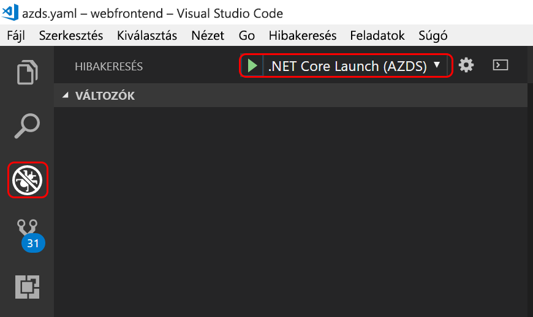

# <a name="get-started-on-azure-dev-spaces-with-net-core"></a>Bevezetés az Azure Dev Spaces .NET Core segítségével történő használatába

Ebből az útmutatóból a következőket tudhatja meg:

- Fejlesztésre optimalizált Kubernetes-alapú környezet, vagyis egy _Dev Spaces-tér_ létrehozása az Azure-ban.
- Iteratív kódfejlesztés tárolókban a VS Code és a parancssor használatával.
- A kód hatékony fejlesztése és tesztelése, csapatkörnyezetben.

> [!Note]
> **Ha bármikor elakad**, tekintse meg a [Hibaelhárítás](troubleshooting.md) szakaszt, vagy írjon egy hozzászólást erre a lapra.

Most már készen áll a Kubernetes-alapú Dev Spaces-terek Azure-ban történő létrehozására.

## <a name="install-the-azure-cli"></a>Telepítse az Azure CLI-t
Az Azure Dev Spaces használatához minimális helyi gépbeállítás szükséges. A Dev Spaces-tér konfigurációjának legnagyobb része a felhőben van tárolva, és megosztható más felhasználókkal. A helyi gép lehet Windows, Mac vagy Linux rendszerű. Linux esetén a következő disztribúciók támogatottak: Ubuntu (18.04, 16.04 és 14.04), Debian 8 és 9, RHEL 7, Fedora 26+, CentOS 7, openSUSE 42.2 és SLES 12.

Első lépésként töltse le és futtassa az [Azure CLI](/cli/azure/install-azure-cli?view=azure-cli-latest) parancssori felületet. 

> [!IMPORTANT]
> Ha az Azure CLI már telepítve van, győződjön meg arról, hogy a 2.0.43-as vagy újabb verziót használja.

### <a name="sign-in-to-azure-cli"></a>Bejelentkezés az Azure CLI-be
Jelentkezzen be az Azure-ba. Írja be a következő parancsot egy terminálablakba:

```cmd
az login
```

> [!Note]
> Ha nem rendelkezik Azure-előfizetéssel, létrehozhat egy [ingyenes fiókot](https://azure.microsoft.com/free).

#### <a name="if-you-have-multiple-azure-subscriptions"></a>Ha több Azure-előfizetéssel is rendelkezik...
Az előfizetéseit a következő futtatásával tekintheti meg: 

```cmd
az account list
```
Keresse meg azt az előfizetést, amelynek a JSON-kimenete a következőt tartalmazza: `isDefault: true`.
Ha nem ezt az előfizetést szeretné használni, módosíthatja az alapértelmezett előfizetést:

```cmd
az account set --subscription <subscription ID>
```

## <a name="create-a-kubernetes-cluster-enabled-for-azure-dev-spaces"></a>Azure Dev Spaceshez engedélyezett Kubernetes-fürt létrehozása

A parancssorban hozza létre az erőforráscsoportot. Válassza a jelenleg támogatott régiók valamelyikét (EastUS, EastUS2, CentralUS, WestUS2, WestEurope, SoutheastAsia, CanadaCentral vagy CanadaEast).

```cmd
az group create --name MyResourceGroup --location <region>
```

Hozzon létre egy Kubernetes-fürtöt az alábbi paranccsal:

```cmd
az aks create -g MyResourceGroup -n MyAKS --location <region> --kubernetes-version 1.11.2 --enable-addons http_application_routing --generate-ssh-keys
```

A fürt létrehozása néhány percet vesz igénybe.

### <a name="configure-your-aks-cluster-to-use-azure-dev-spaces"></a>AKS-fürt konfigurálása az Azure Dev Spaces használatára

Írja be az alábbi Azure CLI-parancsot, és használja az AKS-fürtöt tartalmazó erőforráscsoportot, valamint az AKS-fürt nevét. A parancs konfigurálni fogja a fürtöt az Azure Dev Spaces támogatására.

   ```cmd
   az aks use-dev-spaces -g MyResourceGroup -n MyAKS
   ```

## <a name="get-kubernetes-debugging-for-vs-code"></a>Kubernetes-hibakeresés VS Code-hoz
A VS Code-ot használó .NET Core- és Node.js-felhasználók számára számos funkció érhető el, mint például a Kubernetes-hibakeresés.

1. Ha nincs telepítve a [VS Code](https://code.visualstudio.com/Download), telepítse.
1. Töltse le és telepítse a [VS Azure Dev Spaces bővítményt](https://marketplace.visualstudio.com/items?itemName=azuredevspaces.azds). Kattintson egyszer a Telepítés lehetőségre a bővítmény Marketplace-oldalán, majd még egyszer a VS Code-ban. 

## <a name="create-a-web-app-running-in-a-container"></a>Egy tárolóban futó webalkalmazás létrehozása

Ebben a szakaszban egy ASP.NET Core-alapú webalkalmazást hozhat létre és futtathat egy Kubernetes-tárolóban.

### <a name="create-an-aspnet-core-web-app"></a>ASP.NET Core-webalkalmazás létrehozása
Ha a [.NET Core](https://www.microsoft.com/net) telepítve van, gyorsan létrehozhat egy ASP.NET Core-webalkalmazást a `webfrontend` nevű mappában.
    
```cmd
dotnet new mvc --name webfrontend
```

Vagy **a mintakód a GitHubról való letöltéséhez** lépjen a https://github.com/Azure/dev-spaces helyre, és válassza a **Klónozás vagy letöltés** lehetőséget a GitHub-adattár a helyi környezetbe való letöltéséhez. A jelen útmutatóban használt kód a következő helyen található: `samples/dotnetcore/getting-started/webfrontend`.

## <a name="preparing-code-for-docker-and-kubernetes-development"></a>Kód előkészítése Docker- vagy Kubernetes-fejlesztéshez
Már rendelkezik egy helyileg futó alapszintű webalkalmazással. Most olyan objektumok létrehozásával egy tárolóba fogja helyezni, amelyek meghatározzák az alkalmazás tárolóját, és a Kubernetesben történő üzembe helyezésének módját. Ez a feladat az Azure Dev Spaces segítségével egyszerűen elvégezhető: 

1. Indítsa el a VS Code-ot, majd nyissa meg a `webfrontend` mappát. (Figyelmen kívül hagyhat minden olyan alapértelmezett kérést, amely az objektumok hibakeresésére vagy a projekt visszaállítására vonatkozik.)
1. Nyissa meg a VS Code Integrált terminálját (a **View (Nézet) > Integrated Terminal (Integrált terminál)** menüvel).
1. Futtassa ezt a parancsot (győződjön meg róla, hogy a **webfrontend** a jelenlegi mappája):

    ```cmd
    azds prep --public
    ```

Az Azure CLI `azds prep` parancsa alapértelmezett beállításokkal hoz létre Docker- és Kubernetes-objektumokat:
* A `./Dockerfile` ismerteti az alkalmazás tárolólemezképét, illetve hogy a forráskód hogyan épül fel és hogyan fut a tárolón belül.
* A `./charts/webfrontend` alatt található [Helm-diagram](https://docs.helm.sh) ismerteti a konténer Kubernetesben történő üzembe helyezését.

Egyelőre még nem fontos a fájlok teljes tartalmát megérteni. Ugyanakkor azt megjegyeznénk, hogy **használhatja ugyanazokat a Docker és a Kubernetes kóddal való konfigurálási objektumokat a fejlesztéstől kezdve egészen az éles környezetig, így jobb konzisztenciát biztosíthat a különböző környezetekben.**
 
A `prep` parancs egy `./azds.yaml` nevű fájlt is létrehoz, amely az Azure Dev Spaces konfigurációs fájlja. Ez olyan további konfigurációval egészíti ki a Docker- és Kubernetes-munkadarabokat, amely engedélyez az Azure-ban egy iteratív fejlesztési környezetet.

## <a name="build-and-run-code-in-kubernetes"></a>Kód létrehozása és futtatása Kubernetesben
Most futtassuk a kódunkat! Futtassa ezt a parancsot a terminálablakban a webfrontend nevű kódolási **gyökérmappából**:

```cmd
azds up
```

Figyelje a parancs kimenetét, és számos dolgot megfigyelhet a folyamat közben:
- A program szinkronizálja a forráskódot az Azure-beli Dev Spaces-térrel.
- A kódmappában lévő Docker-adategységek alapján létrejön egy tároló-lemezkép az Azure-ban.
- Kubernetes-objektumok jönnek létre, amelyek a kódmappában található Helm-diagram szerint használják a tároló-lemezképet.
- Megjelennek a tároló végpontjára (vagy végpontjaira) vonatkozó információk. A mi esetünkben egy nyilvános HTTP URL-t várunk.
- Ha a fenti szakaszok sikeresen lezárultak, a tároló indulásakor megjelenik az `stdout` (és `stderr`) kimenet.

> [!Note]
> Ezek a lépések az `up` első futtatásakor hosszabb időt vesznek igénybe, de a további futtatások már gyorsabbak lesznek.

### <a name="test-the-web-app"></a>A webalkalmazás tesztelése
Keresse meg a konzolkimenetben az `up` parancs által létrehozott nyilvános URL-re vonatkozó adatokat. Ez az alábbi formátumban lesz: 

```
(pending registration) Service 'webfrontend' port 'http' will be available at <url>
Service 'webfrontend' port 80 (TCP) is available at http://localhost:<port>
```

Nyissa meg ezt az URL-t egy böngészőablakban, és betöltődik a webalkalmazás. Ahogy a tároló futni kezd, a rendszer `stdout` és `stderr` kimenetet streamel a terminálablakba.

> [!Note]
> Első alkalommal több percet is igénybe vehet, hogy rendelkezésre álljon a nyilvános DNS. Ha az URL-cím nem oldódik fel, használhatja a konzolkimeneten megjelenő alternatív http://localhost:<portnumber> URL-címet. Ha a localhost URL-t használja, úgy tűnhet, hogy a tároló helyileg fut, de valójában az AKS-ben fut. Az Ön kényelme, valamint a helyi gép és a szolgáltatás közötti interakció elősegítése érdekében az Azure Dev Spaces egy ideiglenes SSH-csatornát hoz létre az Azure-ban futó tárolóhoz. Visszatérhet és kipróbálhatja a nyilvános URL-címet később, amikor kész a DNS-rekord.

### <a name="update-a-content-file"></a>Tartalomfájlok frissítése
Az Azure Dev Spaces nem csupán a Kubernetesben futó kódok lekérésére szolgál – a segítségével gyorsan és iteratívan lehet megtekinteni a kódmódosítások életbe lépését a felhőben lévő Kubernetes-környezetben.

1. Keresse meg a `./Views/Home/Index.cshtml` fájlt, és szerkessze a HTML-kódot. Például módosíthatja a 70. sor korábbi szövegét (`<h2>Application uses</h2>`) egy új szövegre (`<h2>Hello k8s in Azure!</h2>`).
1. Mentse a fájlt. Néhány pillanat múlva egy, a terminálablakban megjelenő üzenet tájékoztatja, hogy a futó tárolóban lévő egyik fájl frissült.
1. Lépjen a böngészőre, és frissítse az oldalt. A weboldalnak meg kell jelenítenie a frissített HTML-tartalmat.

Mi történt? A tartalomfájlok (például HTML és CSS) módosításait nem szükséges egy .NET Core webalkalmazásban újrafordítani, így az aktív `azds up` parancs automatikusan szinkronizálja a módosított tartalomfájlokat az Azure-ban futó tárolóba, így azonnal megtekintheti a tartalmak módosításait.

### <a name="update-a-code-file"></a>Kódfájlok frissítése
A kódfájlok frissítése egy kicsit több munkát igényel, mert a .NET Core-alkalmazásnak újra létre kell hoznia és elő kell állítania az alkalmazás frissített bináris fájljait.

1. A terminálablakban nyomja le a `Ctrl+C` billentyűkombinációt (az `azds up` leállításához).
1. Nyissa meg a `Controllers/HomeController.cs` nevű kódfájlt, és szerkessze az Információ oldalon megjelenő üzenetet: `ViewData["Message"] = "Your application description page.";`
1. Mentse a fájlt.
1. Futtassa az `azds up` parancsot a terminálablakban. 

Ez a parancs újraépíti a tárolórendszerképet, és újra üzembe helyezi a Helm-diagramot. A módosított kód hatásainak a futó alkalmazásban való megtekintéséhez lépjen a webalkalmazás Információ menüjére.


Azonban a kódfejlesztésnek van egy még ennél is *gyorsabb módszere*, amelyet a következő szakaszban mutatunk be. 

## <a name="debug-a-container-in-kubernetes"></a>Tároló hibakeresése a Kubernetesben

Ebben a részben közvetlenül a VS Code-dal végezhet hibakeresést az Azure-ban futó tárolón. Azt is megtudhatja, hogyan végezheti el gyorsabban a szerkesztés-futtatás-tesztelés hurkot.


> [!Note]
> **Ha bármikor elakad**, tekintse meg a [Hibaelhárítás](troubleshooting.md) szakaszt, vagy írjon egy hozzászólást erre a lapra.

### <a name="initialize-debug-assets-with-the-vs-code-extension"></a>A hibakeresési objektum inicializálása a VS Code-bővítménnyel
Először konfigurálja a kódprojektet úgy, hogy a VS Code kommunikálni tudjon az Azure-beli Dev Spaces-terünkkel. A VS Code Azure Dev Spaceshez készült bővítménye biztosít egy segítőparancsot a hibakeresési konfiguráció beállításához. 

Nyissa meg a **parancskatalógust** (**Nézet | Parancskatalógus** menü), és az automatikus kitöltés használatával írja be és válassza ki a következő parancsot: `Azure Dev Spaces: Prepare configuration files for Azure Dev Spaces`. 

Ez hozzáadja az Azure Dev Spaceshez készült hibakeresési konfigurációt a `.vscode` mappához. Ez a parancs nem keverendő össze az `azds prep` paranccsal, amely az üzembe helyezéshez konfigurálja a projektet.


### <a name="select-the-azds-debug-configuration"></a>Az AZDS hibakeresési konfiguráció kiválasztása
1. A hibakeresési nézet megnyitásához kattintson a **tevékenységsáv** Hibakeresés ikonjára a VS Code oldalán.
1. Válassza a **.NET Core indítása (AZDS)** lehetőséget mint aktív hibakeresési konfigurációt.



> [!Note]
> Ha nem lát Azure Dev Spaces-parancsokat a parancspalettán, győződjön meg róla, hogy a VS Code Azure Dev Spaceshez készült bővítménye telepítve van. Győződjön meg arról, hogy a VS Code-ban megnyitott munkaterület az azds.yaml fájlt tartalmazó mappa.


### <a name="debug-the-container-in-kubernetes"></a>A tároló hibakeresése a Kubernetesben
A kód a Kubernetesben való hibakereséséhez nyomja le az **F5** billentyűt.

Az `up` parancshoz hasonlóan a kód szinkronizálva lesz a Dev Spaces-térbe, továbbá létrejön és települ egy tároló a Kubernetesben. Ezúttal persze a hibakereső a távoli tárolóhoz van csatlakoztatva.

> [!Tip]
> A VS Code-állapotsáv egy kattintható URL-címet jelenít meg.


Állítson be egy töréspontot egy kiszolgálóoldali kódfájlban, például a `Controllers/HomeController.cs` forrásfájl `Index()` függvényében. Az oldal a böngészőben való frissítésével a töréspont érintve lesz.

Ugyanúgy teljes körű hozzáférése van a hibakeresési információkhoz, mint ha helyileg futna a kód (pl. hívási verem, helyi változók, kivételek adatai stb.).

### <a name="edit-code-and-refresh"></a>Kód szerkesztése és frissítés
Miközben a hibakereső aktív, szerkessze a kódot. Például módosítsa az Információ lap üzenetét a `Controllers/HomeController.cs` fájlban. 

```csharp
public IActionResult About()
{
    ViewData["Message"] = "My custom message in the About page.";
    return View();
}
```

Mentse a fájlt, és a **Hibakeresési műveletek panelen** kattintson a **Frissítés** gombra. 


Ahelyett, hogy a kód minden szerkesztése alkalmával újra létrehozna és üzembe helyezne egy új tárolórendszerképet, ami általában sok időt vesz igénybe, az Azure Dev Spaces növekményesen újrafordítja a kódot a meglévő tárolón belül, hogy gyorsabb szerkesztési/hibakeresési ciklust biztosítson.

Frissítse a webalkalmazást a böngészőben, és lépjen az Információ oldalra. Az egyedi üzenetnek meg kell jelennie a felhasználói felületen.

**Most tehát rendelkezésére áll egy módszer, amellyel gyorsan iterálhatja a kódot, és közvetlenül a Kubernetesben végezheti a hibakeresést.** A következő részből megtudhatja, hogyan hozhat létre és hívhat meg egy második tárolót.

## <a name="next-steps"></a>További lépések

> [!div class="nextstepaction"]
> [A csapatban végzett fejlesztés bemutatása](team-development-netcore.md)
