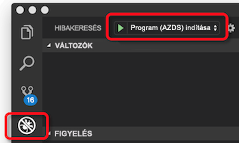

# <a name="how-azure-dev-spaces-works-and-is-configured"></a>Hogyan Azure fejlesztési tárolóhelyek működik, és van konfigurálva

A Kubernetes-alkalmazás fejlesztése kihívást jelenthet. Szüksége lesz a Docker és a Kubernetes konfigurációs fájlok. Döntse el, az alkalmazás helyi tesztelése, és más függő szolgáltatásokkal interakcióba kell. Szüksége lehet kezelni a fejlesztés és tesztelés egyszerre több szolgáltatást és a egy fejlesztői csapat.

Az Azure fejlesztési tárolóhelyek segítségével fejlesztése, üzembe helyezése és hibakeresése a Kubernetes-alkalmazások közvetlenül az Azure Kubernetes Service (aks) Szolgáltatásban. Azure fejlesztői tárolóhelyek lehetővé teszi egy adható meg a fejlesztői csapat. Fejlesztői szóközzel elosztását a csapat lehetővé teszi, hogy egyes csapattagok fejlesztéshez elkülönítési replikálása és függőségekkel vagy más alkalmazásokat a fürt utánzása nélkül.

Azure fejlesztői tárolóhelyek hoz létre, és üzembe helyezése, futtatása és az aks-ben a Kubernetes-alkalmazások hibakeresése egy konfigurációs fájlt használja. Ezt a konfigurációs fájlt a az alkalmazás kódjában található, és lehet hozzáadni a verziókezelő rendszer.

Ez a cikk ismerteti a folyamatok, a power Azure fejlesztési területek és a folyamatok konfigurációjától az Azure fejlesztési tárolóhelyek konfigurációs fájlban. Azure fejlesztői tárolóhelyek gyorsan, és a gyakorlatban látja, hajtsa végre a rövid útmutató:

* [Java és a CLI és Visual Studio Code-ot](quickstart-java.md)
* [.NET core és a CLI és Visual Studio Code-ot](quickstart-netcore.md)
* [.NET core és a Visual Studio 2017](quickstart-netcore-visualstudio.md)
* [NODE.js és a CLI és Visual Studio Code-ot](quickstart-nodejs.md)

## <a name="how-azure-dev-spaces-works"></a>Azure fejlesztői tárolóhelyek működése

Az Azure fejlesztési tárolóhelyek két összetevőből különböző, amely dolgozhat: a tartományvezérlő és az ügyféloldali eszközök.


A vezérlő a következő műveleteket hajtja végre:

* Kezeli a fejlesztési terület létrehozását és a kijelölés.
* Az alkalmazás által létrehozott Helm-diagramhoz telepíti, és a Kubernetes-objektumokat hoz létre.
* Az alkalmazás tárolórendszerképet hoz létre.
* Telepíti az alkalmazást, az aks-ben.
* Növekményes buildek nem, és újraindul, ha a forráskód-változásokat.
* A naplók és nyomkövetések HTTP kezeli.
* Az stdout és stderr, az ügyféloldali eszközök továbbítja.
* Lehetővé teszi, hogy a csapat tagjai hozhatnak létre gyermek fejlesztési tárolóhelyek szülő fejlesztési szóközzel származik.
* Konfigurálja az útválasztást alkalmazások belül egy szóközt, valamint a szülő és gyermek tárolóhelyek között.

A vezérlő AKS kívül helyezkedik el. Az ügyféloldali eszközök és az AKS-fürt között, meghajtók viselkedését és kommunikációt. A vezérlő engedélyezve van az Azure CLI használatával, amikor előkészíti a fürt Azure fejlesztési szóköz használatára. Ha engedélyezve van, használhatja az ügyféloldali eszközök használatával.

Az ügyféloldali eszközök lehetővé teszi, hogy a felhasználó számára:
* Hozzon létre egy docker-fájlban, Helm-diagramot, és az Azure fejlesztési tárolóhelyek konfigurációs fájlt az alkalmazás.
* Szülő és gyermek fejlesztési tárolóhelyek létrehozásához.
* Ossza meg a vezérlő felépítéséhez és az alkalmazás elindításához.

Az alkalmazás futása közben, az ügyféloldali eszközök is:
* Fogadja, és az stdout és stderr az alkalmazásból, az aks-ben futó jeleníti meg.
* Használja a [port-továbbító](https://kubernetes.io/docs/tasks/access-application-cluster/port-forward-access-application-cluster/) webes férhessenek hozzá az alkalmazás http-vel:\//localhost.
* Csatolja a hibakeresőt a futó alkalmazás az aks-ben.
* Szinkronizálások forráskódját a fejlesztési tárhelyre növekményes buildek, lehetővé téve a gyors ismétlését a változás észlelésekor.

Az ügyféloldali részeként parancssori eszközöket is használhat a `azds` parancsot. Az ügyféloldali rendelkező eszközök is használhatja:

* A Visual Studio Code használatával a [Azure fejlesztési tárolóhelyek bővítmény](https://marketplace.visualstudio.com/items?itemName=azuredevspaces.azds).
* Visual Studio 2017 [Visual Studio Tools for Kubernetes](https://aka.ms/get-vsk8stools).

A következő használt alapvető folyamat beállítása és használata az Azure fejlesztési tárolóhelyek:
1. Az AKS-fürt előkészítése az Azure fejlesztési tárolóhelyek
1. A kód az Azure fejlesztési tárolóhelyek futtatásának előkészítése
1. Futtathatja a kódot a fejlesztési szóközt
1. A kód a fejlesztési adhatja hibaelhárítása
1. Egy fejlesztői terület megosztása

Ismertetjük, hogy az egyes Azure-fejlesztési tárolóhelyek működéséről további részleteket az alábbi szakaszokban.

## <a name="prepare-your-aks-cluster"></a>Az AKS-fürt előkészítése

Az AKS-fürt előkészítése foglalja magában:
* Az AKS ellenőrzése fürt régióban van [támogatott Azure-fejlesztési szóközökkel](https://docs.microsoft.com/azure/dev-spaces/#a-rapid,-iterative-kubernetes-development-experience-for-teams).
* Kubernetes 1.10.3 futtatja ellenőrzése vagy újabb.
* Azure fejlesztői tárolóhelyek engedélyezésével a fürt használatával `az aks use-dev-spaces`

Hogyan hozhat létre, és a egy AKS-fürtöt az Azure fejlesztési tárolóhelyek konfigurálása a további információkért tekintse meg az első lépésekhez útmutatókat:
* [Az Azure Dev tárolóhelyek és a Java együttes használatának első lépései](get-started-java.md)
* [Az Azure fejlesztési szóközöket a .NET Core és a Visual Studio használatának első lépései](get-started-netcore-visualstudio.md)
* [Bevezetés az Azure fejlesztési tárolóhelyek .NET Core használatával](get-started-netcore.md)
* [Bevezetés az Azure fejlesztési szóközöket a node.js használatával](get-started-nodejs.md)

Az AKS-fürt Azure fejlesztési tárolóhelyek engedélyezve van, amikor telepíti a vezérlő a fürt számára. A vezérlő egy külön Azure-erőforrás a fürtön kívüli, és a fürtön, a következőket:

* Létrehozza vagy egy Kubernetes-névtér adatokként fejlesztési szóközzel jelöli meg.
* Eltávolítja az összes nevű Kubernetes-névtér *azds*, ha létezik, és létrehoz egy újat.
* Üzembe helyez egy Kubernetes-inicializáló objektumot.

! [Azure fejlesztési tárolóhelyek fürt előkészítése]] (media/how-dev-spaces-works/prepare-cluster.svg)

Azure fejlesztői tárolóhelyek használatához legalább egy fejlesztési területet kell lennie. Az Azure fejlesztési tárolóhelyek fejlesztési tárolóhelyek Kubernetes névtereihez az AKS-fürt használja. A tartományvezérlő telepítésekor felszólítja, hogy hozzon létre egy új Kubernetes-névteret, vagy válasszon egy meglévő névtér vagy az első fejlesztési terület adatokként. Ha egy névtér fejlesztési tárhelyként ki van jelölve, a vezérlő hozzáad a *azds.io/space=true* fejlesztési tárhelyként azonosításához névtéren címkét. A kezdeti fejlesztési helyet hoz létre, vagy kijelölése alapértelmezés szerint be van jelölve, a fürt előkészítése után. Amikor egy hely van kiválasztva, használatos Azure fejlesztési szóközökkel új számítási feladatok létrehozásához.

Alapértelmezés szerint a vezérlő hoz létre egy fejlesztési terület nevű *alapértelmezett* frissítse a meglévő *alapértelmezett* Kubernetes-névtér. Az ügyféloldali eszközök segítségével hozzon létre új fejlesztői szóközöket, és távolítsa el a meglévő fejlesztési szóközöket. A Kubernetes, a korlátozás miatt a *alapértelmezett* fejlesztési terület nem távolítható el. A vezérlő eltávolít minden meglévő Kubernetes-névterek nevű *azds* való ütközések elkerülése érdekében a `azds` az ügyféloldali eszközök által használt parancsot.

A Kubernetes inicializáló objektumot Instrumentation központi telepítése során el podok három tárolót használja: devspaces-proxy tároló, a proxy-inicializálás devspaces tároló és a egy devspaces-build tárolót. **Ezek a tárolók mindhárom az AKS-fürt legfelső szintű hozzáféréssel rendelkező futtassa.**


A devspaces proxy tároló egy oldalkocsi tároló, amely az összes TCP-forgalmat kezeli, és az alkalmazástárolók kimenő, és segít végre útválasztást. A devspaces proxy tároló reroutes HTTP-üzenetek, ha bizonyos szóközök vannak használatban. Például segíthet irányíthatja a HTTP-üzenetek a szülő és gyermek tárolóhelyek alkalmazások között. Az összes-HTTP adatforgalom áthalad devspaces proxy kívánja módosítani. A devspaces proxy tárolót is naplózza az összes bejövő és kimenő HTTP-üzenetek, és elküldi őket az ügyféloldali eszközök nyomkövetésként. A nyomkövetések megtekinthető a fejlesztő vizsgálhatja meg az alkalmazás viselkedését.

A proxy-inicializálás devspaces tároló egy [init tároló](https://kubernetes.io/docs/concepts/workloads/pods/init-containers/) , amely alapján a hely hierarchiában, az alkalmazás tárolóba további útválasztási szabályokat ad. Útválasztási szabályok hozzáadja az alkalmazástárolók frissítésével */etc/resolv.conf* fájlt, és engedélyezze az iptables konfigurációs megkezdése előtt. A frissítések */etc/resolv.conf* lehetővé teszik a szülő tárolóhelyek szolgáltatások DNS-feloldását. A engedélyezze az iptables konfigurációfrissítések győződjön meg, hogy az összes TCP-forgalom és az alkalmazástárolók kívül legyenek átirányítva, ha devspaces-proxy. A proxy-inicializálás devspaces minden frissítés fordulhat elő, Kubernetes hozzáadja szabályok mellett.

A devspaces-build-tárolót egy init tároló és a projekt forráskód és a Docker-szoftvercsatorna csatlakoztatása. A projekt forráskód és a Docker való hozzáférés lehetővé teszi, hogy az alkalmazás tárolót közvetlenül a pod hozott létre.

> [!NOTE]
> Az Azure fejlesztési tárolóhelyek az alkalmazás-tároló létrehozása és futtatása, ugyanazon a csomóponton használ. Ennek eredményeképpen az Azure fejlesztési tárolóhelyek nem kell kialakításához és futtatásához az alkalmazás egy külső container registry.

A Kubernetes-inicializáló objektum figyeli a bármely új pod, amely jön létre az AKS-fürtöt. Ha a pod telepítve van minden olyan névtér a *azds.io/space=true* címke, azt, hogy a pod kódtárba a további tárolókkal. Ha az alkalmazás tárolóban fut, az ügyféloldali eszközök használata csak szúrhatja be a devspaces-build-tárolót.

Miután előkészítette az AKS-fürt, az ügyféloldali eszközök segítségével készítheti elő, és futtathatja a kódot a fejlesztési tárhely.

## <a name="prepare-your-code"></a>A kód előkészítése

Annak érdekében, hogy futtassa az alkalmazást a fejlesztési szóközzel, konténeralapú lehet szükséges, és meg kell határoznia, hogy telepítési módját a Kubernetes. Igény szerint tárolóalapúvá alakíthatja az alkalmazást, szüksége van egy docker-fájlban. Határozza meg, hogy a Kubernetes, hogyan helyezi üzembe az alkalmazást, szüksége egy [Helm-diagram](https://docs.helm.sh/). Segítség a docker-fájl és a Helm-diagram az alkalmazás létrehozása, az ügyféloldali eszközök biztosítanak a `prep` parancsot:

```cmd
azds prep --public
```

A `prep` parancsot a fájlok a projekt ellenőriz, és próbálja meg létrehozni a docker-fájl és a Helm diagramot az alkalmazás futtatása a Kubernetesben. Jelenleg a `prep` parancs létrehoz egy docker-fájl és a Helm diagramot a következő nyelvek valamelyikével:

* Java
* Node.js
* .NET Core

Ön *kell* futtassa a `prep` parancsot a forráskódot tartalmazó könyvtár. Fut a `prep` parancsot a megfelelő címtár lehetővé teszi, hogy az ügyféloldali eszközök, azonosíthatja a nyelvet, és igény szerint tárolóalapúvá alakíthatja az alkalmazás egy megfelelő docker-fájl létrehozása. Is futtathatja a `prep` parancsot egy könyvtárat, amely tartalmazza a egy *pom.xml* Java-projektek fájlt.

Ha futtatja a `prep` parancsot, amely nem tartalmazza a forráskódot, az ügyféloldali eszközök könyvtárból nem hoz létre egy docker-fájlban. Megjeleníti egy hiba üzenettel is: *A docker-fájl nem hozható létre, nem támogatott nyelvet miatt*. A hiba is fellép, ha az ügyféloldali eszközök nem ismeri fel a projekt típusa.

Ha futtatja a `prep` parancsot, lehetősége van megadni a `--public` jelzőt. Ez a jelző arra utasítja a vezérlő ezt a szolgáltatást egy internetről elérhető végpont létrehozására. Ha ez a jelző nincs megadva, a szolgáltatás csak a fürtön belül elérhető, vagy az ügyféloldali eszközök által létrehozott a localhost-alagút használatával. Engedélyezheti vagy letilthatja ezt a viselkedést futtatása után a `prep` parancsot a létrehozott Helm-diagram frissítésével.

A `prep` parancs minden olyan meglévő docker-fájlok vagy a Helm diagramok rendelkezik a projekt nem helyettesíti. Ha meglévő docker-fájlban vagy a Helm-diagramot használja ugyanazt az elnevezési konvenciót által előállított fájlokat a `prep` parancs, a `prep` parancs kihagyja ezeket a fájlokat létrehozása. Ellenkező esetben a `prep` parancsot fog létrehozni a saját docker-fájlban vagy a Helm diagram jelentésvászon oldalán a meglévő fájlokat.

A `prep` parancsot is generál egy `azds.yaml` fájlt a projekt gyökerében. Az Azure fejlesztési tárolóhelyek létrehozása, telepítése, konfigurálása és futtassa az alkalmazást ezt a fájlt használja. A konfigurációs fájl a docker-fájl és a Helm-diagram helyét sorolja fel, és további konfigurációs felül ezek az összetevők is biztosít.

Íme egy példa azds.yaml fájl használatával létrehozott [.NET Core-mintaalkalmazás](https://github.com/Azure/dev-spaces/tree/master/samples/dotnetcore/getting-started/webfrontend):

```yaml
kind: helm-release
apiVersion: 1.1
build:
  context: .
  dockerfile: Dockerfile
install:
  chart: charts/webfrontend
  values:
  - values.dev.yaml?
  - secrets.dev.yaml?
  set:
    replicaCount: 1
    image:
      repository: webfrontend
      tag: $(tag)
      pullPolicy: Never
    ingress:
      annotations:
        kubernetes.io/ingress.class: traefik-azds
      hosts:
        # This expands to [space.s.][rootSpace.]webfrontend.<random suffix>.<region>.azds.io
        # Customize the public URL by changing the 'webfrontend' text between the $(rootSpacePrefix) and $(hostSuffix) tokens
        # For more information see https://aka.ms/devspaces/routing
        - $(spacePrefix)$(rootSpacePrefix)webfrontend$(hostSuffix)
configurations:
  develop:
    build:
      dockerfile: Dockerfile.develop
      useGitIgnore: true
      args:
        BUILD_CONFIGURATION: ${BUILD_CONFIGURATION:-Debug}
    container:
      sync:
      - "**/Pages/**"
      - "**/Views/**"
      - "**/wwwroot/**"
      - "!**/*.{sln,csproj}"
      command: [dotnet, run, --no-restore, --no-build, --no-launch-profile, -c, "${BUILD_CONFIGURATION:-Debug}"]
      iterate:
        processesToKill: [dotnet, vsdbg]
        buildCommands:
        - [dotnet, build, --no-restore, -c, "${BUILD_CONFIGURATION:-Debug}"]
```

A `azds.yaml` által létrehozott fájlt a `prep` parancs egy egyszerű, egyetlen projekt fejlesztési forgatókönyvre vonatkozó jól működik. Ha az adott projekt növekedett összetettségét, szükség lehet frissíteni a fájl futtatása után a `prep` parancsot. A projekt például igényelnek bizonyos mértékű finomhangolásra annak a build vagy a fejlesztési alapján vagy hibakeresés igények folyamat elindításához. Előfordulhat, hogy akkor is a projektben, több alkalmazás, amelyek több összeállítási folyamatairól vagy egy másik build tartalmat igényelnek.

## <a name="run-your-code"></a>A kód futtatása

Futtathatja a kódot a fejlesztési szóközzel, adja ki a `up` könyvtárába parancsot a `azds.yaml` fájlt:

```cmd
azds up
```

A `up` parancs feltölti az alkalmazás forrásfájljait és más összetevőket hozhat létre és futtassa a projektet a fejlesztési terület szükséges. Itt a vezérlő a fejlesztési területen:

1. Az alkalmazás üzembe helyezéséhez a Kubernetes-objektumokat hoz létre.
1. Az alkalmazás a tárolót hoz létre.
1. Telepíti az alkalmazást a fejlesztési területet.
1. Létrehoz egy nyilvánosan elérhető-e DNS-nevet az alkalmazás-végpont, ha konfigurálva.
1. Használja a *port-továbbító* biztosíthat hozzáférést az alkalmazás-végpontot a http://locahost.
1. Az stdout és stderr, az ügyféloldali eszközök továbbítja.


### <a name="starting-a-service"></a>A szolgáltatás indítása

Amikor egy szolgáltatást fejlesztési szóközzel, az ügyféloldali eszközök és a tartományvezérlő működjön a forrás-fájlok szinkronizálása, a tároló és a Kubernetes-objektumokat hozzon létre és futtassa az alkalmazást.

A részletes szintű, ez történik futtatásakor `azds up`:

1. Szinkronizálják a felhasználó gépről egy AKS-fürtöt a felhasználó egyedi az Azure file Storage. A forráskód, a Helm-diagramot és a konfigurációs fájlok lesznek feltöltve. További részleteket a szinkronizálási folyamat a következő szakaszban érhetők el.
1. A vezérlő új munkamenet indításához kérést hoz létre. A kérelem több tulajdonságát, beleértve az egyedi azonosító, a címtér neve, a forráskód elérési útja és a hibakeresési jelző tartalmazza.
1. A vezérlő lecseréli a *$(tag)* egyedi munkamenet-azonosító és a Helm-diagram a szolgáltatás telepíti a Helm-diagramot a helyőrző. Az egyedi munkamenet-azonosító, a Helm-diagramot a hivatkozás lehetővé teszi, hogy a tároló hozzáadása az AKS-fürtöt, illetve a munkamenet-kérelmet vissza a meghatározott munkamenet központi telepítése, és a kapcsolódó adatokat.
1. A Helm-diagramot a telepítés során a Kubernetes inicializátor objektu további tárolókat ad hozzá az alkalmazáspodot rendszerállapot és a projekt forráskód elérését. Adja meg a HTTP-nyomkövetés és a hely útválasztás a devspaces-proxy és a proxy-inicializálás devspaces tárolók kerülnek. A pod, amellyel az alkalmazás-tárolót a Docker-példány és a projekt forráskód hozzáférést biztosíthat a devspaces-build tároló kerül.
1. Az alkalmazáspodot indításakor a devspaces-build-tároló és a proxy-inicializálás devspaces tároló szolgálnak az alkalmazástárolók hozhat létre. Az alkalmazástárolók és devspaces-proxy tárolók majd el lesz indítva.
1. Miután elindult az alkalmazástárolók, az ügyféloldali funkciókat használja a Kubernetes *port-továbbító* keresztül biztosít a HTTP-hozzáférését az alkalmazásához, http://localhost. Ez porttovábbítást a fejlesztői gépén csatlakozik a szolgáltatás a fejlesztési tárhelyre.
1. Amikor megkezdte a pod az összes tárolót, a szolgáltatás fut-e. Az ügyféloldali funkció ezen a ponton a HTTP nyomkövetési stdout és stderr streamelésére kezdődik. Ez az információ az ügyféloldali funkciók szerint jelenik meg a fejlesztők számára.

### <a name="updating-a-running-service"></a>A futó szolgáltatás frissítése

A szolgáltatás futása Azure fejlesztési tárolóhelyek képes, hogy a szolgáltatás frissítéséhez, ha a projekt forrásfájlok módosítását. Fejlesztői tárolóhelyek kezelésére is alkalmas eltérően a fájl módosított típusától függően a szolgáltatás frissítése. Fejlesztői, szóközök frissítheti a futó szolgáltatás három módja van:

* Közvetlenül a fájl frissítése
* Újraépítését, és a futó alkalmazás tárolóban az alkalmazás újraindítása
* Újraépítése és újratelepítése az alkalmazástárolók


Bizonyos projekt-fájlok, amelyek statikus objektumokat, például a html, css és cshtml fájlt, bármi újraindítása nélkül frissíthetők közvetlenül az alkalmazás tárolóban. Ha módosul egy statikus eszközt, az új fájl a fejlesztési terület szinkronizálva és a futó tárolót használja majd.

Fájlok, például a forráskód vagy az alkalmazás konfigurációs fájljaiban módosításai az alkalmazás folyamata belül a futó tároló újraindításával alkalmazhatók. Szinkronizált ezeket a fájlokat, miután az alkalmazás folyamata újraindul belül a futó tárolót használ a *devhostagent* folyamat. Amikor először hoz létre az alkalmazást tároló, a vezérlő az alkalmazás az indítási parancs lecseréli egy másik folyamat nevű *devhostagent*. Egy alárendelt folyamat alatt, majd futtassa a az alkalmazás tényleges folyamata *devhostagent*, és a kimenetét használja ki az adatcsatornán *devhostagent*kimenetének. A *devhostagent* folyamat része is fejlesztői, szóközök és is végre lehet hajtani parancsokat a futó tároló nevében fejlesztési szóközöket. Újraindítás végrehajtásakor *devhostagent*:

* Leállítja az aktuális folyamat vagy az alkalmazáshoz társított folyamatokat
* Az alkalmazás újbóli létrehozása
* Újraindítja a folyamatot, vagy az alkalmazáshoz társított folyamatokat

Módja *devhostagent* végrehajtja az előző lépések konfigurálva van a `azds.yaml` konfigurációs fájlt. Ez a konfiguráció részleteit egy későbbi szakaszban olvashat.

A projekt fájlokban, például a docker-fájlok, átírja csproj fájlokká vagy a Helm-diagram bármely része az alkalmazástárolók újraépítése és újratelepítése szükséges. Amikor több ilyen fájllal szinkronizálja a fejlesztési felület, a vezérlő fut-e a [helm-frissítés](https://helm.sh/docs/helm/#helm-upgrade) parancs, és az alkalmazástárolók újraépítése és újratelepítése.

### <a name="file-synchronization"></a>Fájlszinkronizálás

Az első az alkalmazás indításakor fejlesztési szóközzel, az alkalmazás forrásfájljait lesznek feltöltve. Az alkalmazás futása közben és a későbbi újraindítást, csak a módosított fájlok feltöltése. Két fájlt működnie, ez a folyamat használ: egy ügyféloldali és a tartományvezérlő-oldali fájlt.

Az ügyféloldali fájlt egy ideiglenes könyvtárba tárolja, és a projekt könyvtárában fejlesztési tárolóhelyek fut kivonata alapján neve. Ha például a Windows, lenne egy fájl a szokott módon *Users\USERNAME\AppData\Local\Temp\1234567890abcdef1234567890abcdef1234567890abcdef1234567890abcdef.synclog* a projekthez. A Linux, az ügyféloldali fájl tárolva van a *ügynökszámítógépen* könyvtár. Annak a könyvtár macOS rendszeren futtassa a `echo $TMPDIR` parancsot.

Ez a fájl JSON formátumban vannak, és tartalmazza:

* Minden projektfájl, amely a fejlesztési területtel rendelkező szinkronizálva van egy bejegyzés
* A szinkronizálás ID
* Az utolsó szinkronizálási művelet történő küldés időbélyegzője

Minden egyes projektbejegyzés fájl elérési útját a fájl- és az időbélyegző tartalmazza.

A tartományvezérlő-oldali fájlt az AKS-fürtön tárolja. A szinkronizálás Azonosítóját és a legutóbbi szinkronizálás történő küldés időbélyegzője tartalmazza.

A szinkronizálás történik, ha a szinkronizálás időbélyegei nem egyeznek az ügyféloldali és a tartományvezérlő-oldali fájlok között. Szinkronizálás során az ügyféloldali eszközök a bejegyzéseket az ügyféloldali fájlban ismétel. Ha a fájl időbélyegzője történő küldés időbélyegzője legyen szinkronizálás után, ezt a fájlt a fejlesztési területre van szinkronizálva. A szinkronizálás befejeződése után a szinkronizálási időbélyegeket frissülnek az ügyféloldali és a tartományvezérlő-oldali fájlok.

Az összes projekt fájl szinkronizálva lesznek, ha az ügyféloldali fájl nem található. Ez a viselkedés lehetővé teszi, hogy az ügyféloldali fájlt törlésével a teljes szinkronizálás kényszerítése.

### <a name="how-routing-works"></a>Útválasztás működése

Egy fejlesztői terület AKS épül, és ugyanazokkal a [hálózatkezelési fogalmai](../aks/concepts-network.md). Az Azure fejlesztési szóközöket is rendelkezik egy központosított *ingressmanager* szolgáltatást, és az AKS-fürtöt helyezünk üzembe a saját Bejövőforgalom-vezérlőt. A *ingressmanager* szolgáltatás figyeli az AKS-fürt a fejlesztői, szóközök és úgy bővíti az Azure fejlesztési tárolóhelyek Bejövőforgalom-vezérlőt a bejövő forgalom objektumokat alkalmazás felskálázzuk az Útválasztás a fürtben. Az egyes pod devspaces-proxy tároló hozzáadja egy `azds-route-as` HTTP-fejlécet a HTTP-forgalom egy fejlesztési terület URL-címe alapján. Például egy URL-kérelmet *http://azureuser.s.default.serviceA.fedcba09...azds.io* kap a HTTP-fejlécben `azds-route-as: azureuser`. A devspaces proxy tároló nem fog hozzáadni egy `azds-route-as` fejléc, ha már ilyen.

Amikor egy szolgáltatást a fürtön kívülről HTTP-kérelemmel történik, a kérelem a Bejövőforgalom-vezérlőjéhez kerül. A Bejövőforgalom-vezérlőjéhez irányítja a kérést közvetlenül a bejövő forgalom objektumok és a szabályok alapján a megfelelő pod. A devspaces proxy a pod-tárolóba a kérelmet kap, hozzáadja a `azds-route-as` fejlécet az URL-cím alapján, valamint a kérelmet az alkalmazástárolók irányítja majd.

HTTP-kérést a szolgáltatás egy olyan másik szolgáltatás a fürtön belül történik, amikor a kérést először végighalad a hívó service devspaces-proxy-tárolóban. A devspaces proxy tároló megvizsgálja a HTTP-kérés és ellenőrzi a `azds-route-as` fejléc. A fejléc alapján, a devspaces proxy tárolót fog keresni a fejléc értéke társított szolgáltatás IP-címét. Ha IP-cím található, a devspaces proxy tároló reroutes a kérés IP-címre. Ha IP-cím nem található, a devspaces proxy tároló a kérelmet a szülőtároló irányítja.

Ha például az alkalmazások *serviceA* és *serviceB* nevű szülő fejlesztési szóközzel vannak telepítve *alapértelmezett*. *serviceA* támaszkodik *serviceB* és azt a HTTP-hívást hajt végre. Azure-felhasználó egy gyermek fejlesztési hely alapján hoz létre a *alapértelmezett* nevű terület *azureuser*. Azure-felhasználó is üzembe helyezi a saját verzióját *serviceA* a gyermek területre. Amikor egy kérés érkezik *http://azureuser.s.default.serviceA.fedcba09...azds.io*:


1. Az IP-címeként a pod az URL-címhez társított, amely kikeresi a Bejövőforgalom-vezérlőjéhez *serviceA.azureuser*.
1. A Bejövőforgalom-vezérlőt a IP-cím megkeresése az Azure felhasználói fejlesztői terület a pod, és átirányítja a kérést a *serviceA.azureuser* pod.
1. A devspaces proxy tárolóba a *serviceA.azureuser* pod a kérelmet kap, és hozzáad `azds-route-as: azureuser` , HTTP-fejléc.
1. A devspaces proxy tárolóba a *serviceA.azureuser* pod irányítja a kérést a *serviceA* az alkalmazástárolók a *serviceA.azureuser* pod.
1. A *serviceA* az alkalmazás a *serviceA.azureuser* pod hívást indít *serviceB*. A *serviceA* is tartalmazó kódot, hogy megőrizze a meglévő alkalmazás `azds-route-as` fejlécet, amely ebben az esetben `azds-route-as: azureuser`.
1. A devspaces proxy tárolóba a *serviceA.azureuser* pod fogadja a kéréseket, és megkeresi az IP-címe *serviceB* értéke alapján a `azds-route-as` fejléc.
1. A devspaces proxy tárolóba a *serviceA.azureuser* pod nem talál egy IP-címeként *serviceB.azureuser*.
1. A devspaces proxy tárolóba a *serviceA.azureuser* pod kikeresi az IP-címeként *serviceB* a szülő helyre, vagyis *serviceB.default*.
1. A devspaces proxy tárolóba a *serviceA.azureuser* pod megkeresi az IP-címeként *serviceB.default* , és továbbítja a kérést a *serviceB.default* pod.
1. A devspaces proxy tárolóba a *serviceB.default* pod fogadja a kéréseket, és átirányítja a kérést a *serviceB* az alkalmazástárolók a *serviceB.default*pod.
1. A *serviceB* az alkalmazás a *serviceB.default* pod választ küld a *serviceA.azureuser* pod.
1. A devspaces proxy tárolóba a *serviceA.azureuser* pod a válasz fogadása és válasz irányítja a *serviceA* az alkalmazástárolók a *serviceA.azureuser* pod.
1. A *serviceA* alkalmazás megkapja a választ, és majd a saját választ ad vissza.
1. A devspaces proxy tárolóba a *serviceA.azureuser* pod kapott választ kap a *serviceA* alkalmazástárolók, és továbbítja a választ az eredeti hívó a fürtön kívüli.

Minden más TCP-forgalmat, amely nem HTTP haladnak keresztül a Bejövőforgalom-vezérlőt és devspaces-proxy tárolók kívánja módosítani.

### <a name="how-running-your-code-is-configured"></a>Hogyan történik a kódja fut.

Az Azure fejlesztési szóközt használja a `azds.yaml` fájl telepítése és konfigurálása a szolgáltatáshoz. A tartományvezérlő által használt a `install` tulajdonságot a `azds.yaml` fájl telepítése a Helm-diagramot, és a Kubernetes-objektumokat létrehozni:

```yaml
...
install:
  chart: charts/webfrontend
  values:
  - values.dev.yaml?
  - secrets.dev.yaml?
  set:
    replicaCount: 1
    image:
      repository: webfrontend
      tag: $(tag)
      pullPolicy: Never
    ingress:
      annotations:
        kubernetes.io/ingress.class: traefik-azds
      hosts:
      # This expands to [space.s.][rootSpace.]webfrontend.<random suffix>.<region>.azds.io
      # Customize the public URL by changing the 'webfrontend' text between the $(rootSpacePrefix) and $(hostSuffix) tokens
      # For more information see https://aka.ms/devspaces/routing
      - $(spacePrefix)$(rootSpacePrefix)webfrontend$(hostSuffix)
...
```

Alapértelmezés szerint a `prep` parancs a Helm-diagramot hoz létre. Azt állítja be a *install.chart* tulajdonság a Helm-diagram könyvtárába. Ha szeretne egy Helm-diagramot használja egy másik helyen található, frissítheti ezt a tulajdonságot, hogy helyet.

A Helm-diagramok telepítésekor Azure fejlesztési tárolóhelyek szolgáltatásával felülbírálási értékeket a Helm-diagram. Az alapértelmezett értékek, a Helm-diagram `charts/APP_NAME/values.yaml`.

Használatával a *install.values* tulajdonság, egy vagy több olyan fájlok, amelyek meghatározzák a kívánt értékeket kicserélt a Helm-diagram listázhatja. Például ha egy állomásnév vagy az adatbázis konfigurációs kifejezetten futtatásakor az alkalmazás fejlesztői szóközzel, használhatja a felülbírálási funkció. Azt is megteheti egy *?* a fájlnevek való beállításához választható bármelyikének végén.

A *install.set* tulajdonság lehetővé teszi, hogy egy vagy több értéket szeretne kicserélt a Helm-diagram konfigurálása. A konfigurált értéket *install.set* konfigurált fájlokban szereplő értékek felülírják *install.values*. (Erőforráscsoport) részen *install.set* sem függ, a Helm-diagram értékeit, majd a létrehozott Helm-diagram függően eltérő lehet.

A fenti példában a *install.set.replicaCount* tulajdonság arra utasítja a vezérlő hány példányt az alkalmazás futtatása a fejlesztési tárhelyre. A forgatókönyvtől függően megnövelheti ezt az értéket, de azt a hibakeresést az alkalmazáspodot hatással lesz. További információkért lásd: a [hibaelhárításról szóló cikk](troubleshooting.md).

A létrehozott Helm-diagramot a tárolórendszerkép értéke *{{. Values.Image.Repository}} :{{. Values.Image.tag}}*. A `azds.yaml` fájl határozza meg *install.set.image.tag* tulajdonság *$(tag)* alapértelmezés szerint, amely használatos értékeként *{{. Values.Image.tag}}*. Beállításával a *install.set.image.tag* tulajdonság ezzel a módszerrel, lehetővé teszi, hogy az alkalmazás kell futtatásakor az Azure fejlesztési tárolóhelyek címkézett eltérő módon a tároló rendszerképét. Ebben az esetben, a lemezkép címkével  *<value from image.repository>: $(tag)*. Kell használnia a *$(tag)* változó értékeként *install.set.image.tag* ahhoz, hogy a fejlesztői, szóközök ismeri fel, és keresse meg a tároló az AKS-fürtöt.

A fenti példában `azds.yaml` meghatározása *install.set.ingress.hosts*. A *install.set.ingress.hosts* tulajdonság határozza meg a gazdagép nevének formátumát a nyilvános végpontokat. Ez a tulajdonság is használ *$(spacePrefix)*, *$(rootSpacePrefix)*, és *$(hostSuffix)*, melyek a vezérlő által megadott értékek. 

A *$(spacePrefix)* neve, a gyermek fejlesztési területet, amely formájában *SPACENAME.s*. A *$(rootSpacePrefix)* a szülő hely neve. Például ha *azureuser* olyan az alárendelt hely *alapértelmezett*, értéke *$(rootSpacePrefix)* van *alapértelmezett* és értékét *$(spacePrefix)* van *azureuser.s*. Ha a hely nem egy alárendelt hely *$(spacePrefix)* üres. Például ha a *alapértelmezett* terület nem rendelkezik szülő lemezterülettel, értéke *$(rootSpacePrefix)* van *alapértelmezett* és értékének *$(spacePrefix)* üres. A *$(hostSuffix)* mutat, az Azure fejlesztési tárolóhelyek Bejövőforgalom-vezérlőt az AKS-fürt futtató DNS-utótag van. Ez a DNS-utótag felel meg egy helyettesítő karaktert tartalmazó DNS-bejegyzést, például  *\*. RANDOM_VALUE.eus.azds.IO*, amely hozott létre az Azure fejlesztési tárolóhelyek vezérlő az AKS-fürt hozzá lett adva.

A fenti `azds.yaml` fájlt sikerült is frissítenie *install.set.ingress.hosts* az alkalmazás gazdagép nevének módosításához. Például, ha az alkalmazás állomásnevét leegyszerűsítése érdekében a *$(spacePrefix)$(rootSpacePrefix)webfrontend$(hostSuffix)* való *$(spacePrefix)$(rootSpacePrefix)web$(hostSuffix)*.

Az alkalmazás a tároló létrehozásához, a vezérlő használja az alábbi szakaszait a `azds.yaml` konfigurációs fájlban:

```yaml
build:
  context: .
  dockerfile: Dockerfile
...
configurations:
  develop:
    build:
      dockerfile: Dockerfile.develop
      useGitIgnore: true
      args:
        BUILD_CONFIGURATION: ${BUILD_CONFIGURATION:-Debug}
...
```

A vezérlő hozhat létre és futtassa az alkalmazást egy docker-fájl használatával.

A *build.context* tulajdonság tartalmazza a könyvtárban, ahol a docker-fájlok léteznek. A *build.dockerfile* tulajdonság határozza meg, amellyel az alkalmazás üzemi verziójához a docker-fájl nevét. A *configurations.develop.build.dockerfile* tulajdonság a docker-fájl nevét az alkalmazás fejlesztői verziójának konfigurálja.

Fejlesztési és termelési célra másik docker-fájlok lehetővé teszi, hogy bizonyos dolgokat engedélyezése a fejlesztés során, és azok az elemek éles környezetekben üzemelő példányok letiltása. Ha például engedélyezheti a hibakeresési vagy a részletesebb naplózás, fejlesztési és éles környezetben letiltása közben. Ezeket a tulajdonságokat is frissítheti, ha a docker-fájlok más néven, vagy egy másik helyen található.

Könnyebben gyors ismételt futtatásával a fejlesztés során, Azure fejlesztői szóközöket a helyi projektből minden olyan módosítás szinkronizálása, és fokozatosan frissítheti az alkalmazást. Az alábbi szakasz a `azds.yaml` konfigurációs fájl segítségével konfigurálja a szinkronizálási és frissítése:

```yaml
...
configurations:
  develop:
    ...
    container:
      sync:
      - "**/Pages/**"
      - "**/Views/**"
      - "**/wwwroot/**"
      - "!**/*.{sln,csproj}"
      command: [dotnet, run, --no-restore, --no-build, --no-launch-profile, -c, "${BUILD_CONFIGURATION:-Debug}"]
      iterate:
        processesToKill: [dotnet, vsdbg]
        buildCommands:
        - [dotnet, build, --no-restore, -c, "${BUILD_CONFIGURATION:-Debug}"]
...
```

A fájlok és könyvtárak, amelyek szinkronizálják a módosításokat szerepelnek a *configurations.develop.container.sync* tulajdonság. Ezek a könyvtárak futtatásakor kezdetben szinkronizálva lesznek az `up` parancsot, valamint ha észlel. Ha további vagy eltérő címtárak szeretné a fejlesztési tárhelyre szinkronizálva van, módosíthatja ezt a tulajdonságot.

A *configurations.develop.container.iterate.buildCommands* tulajdonság határozza meg, hogyan hozhat létre az alkalmazást a fejlesztési forgatókönyvek esetében. A *configurations.develop.container.command* tulajdonság biztosítja a parancs a fejlesztési forgatókönyvek esetében az alkalmazás futtatásához. Érdemes frissíteni ezen tulajdonságok valamelyikét, ha nincsenek további build és a futtatókörnyezet jelzők vagy paramétereket szeretne használni a fejlesztés során.

A *configurations.develop.container.iterate.processesToKill* állítsa le az alkalmazást a kill folyamatok sorolja fel. Előfordulhat, hogy szeretné frissíteni ezt a tulajdonságot, ha meg szeretné változtatni az alkalmazás fejlesztése során újraindítási viselkedését. Például, ha frissítette a *configurations.develop.container.iterate.buildCommands* vagy *configurations.develop.container.command* tulajdonságainak módosítása, hogy az alkalmazást a létrehozása vagy elindítva, előfordulhat, hogy módosítania milyen folyamatokat le lesz állítva.

A kód használatával előkészítésekor a `azds prep` parancs hozzáadásának lehetősége van a `--public` jelzőt. Hozzáadás a `--public` jelző létrehoz egy nyilvánosan elérhető-e az alkalmazás URL-címet. Ha kihagyja ezt a jelzőt, az alkalmazás csak érhető el a fürt vagy a localhost-alagút használatával. Futtatása után a `azds prep` parancsot, ez a beállítás módosításával módosíthatja a *ingress.enabled* tulajdonság `charts/APPNAME/values.yaml`:

```yaml
ingress:
  enabled: true
```

## <a name="debug-your-code"></a>A kód hibakeresése

A Java, .NET és a Node.js-alkalmazások esetén is hibakeresése az alkalmazást közvetlenül a Visual Studio Code-ot vagy a Visual Studio 2017 használatával fejlesztési tárhelyre. A Visual Studio Code és a Visual Studio 2017 adja meg azokat az eszközöket a fejlesztési tárhely csatlakozni, az alkalmazás indításához és csatoljon egy hibakeresőt. Futtatás után `azds prep`, megnyithatja a projekt a Visual Studio Code-ot vagy a Visual Studio 2017-ben. A Visual Studio Code-ot vagy a Visual Studio 2017 hoz létre a saját konfigurációs fájlok csatlakozás lehetőségét, amely elkülönül futó `azds prep`. A Visual Studio Code-ot vagy a Visual Studio 2017 belül is állítson be töréspontokat és indítsa el az alkalmazást a fejlesztési tárhelyre.



Az alkalmazás hibakeresés a Visual Studio Code-ot vagy a Visual Studio 2017 használatával indíthatja el, ha kezelni nyisson meg, és ugyanúgy fut, a fejlesztői tárhely csatlakozik `azds up`. Az ügyféloldali eszközök a Visual Studio Code és a Visual Studio 2017-hibakeresési információkat kiegészítő paraméterrel is biztosítanak. A paraméter tartalmazza a hibakeresőt lemezkép, a hibakereső belül ladicího programu lemezkép helyét, és a célhelyen, az alkalmazás tárolóban csatlakoztatása a hibakeresőt mappa nevét. 

A hibakereső kép automatikusan határozza meg az ügyféloldali eszközök. Hasonló a docker-fájlban során használt módszert használ, és a Helm-diagramot hoz létre, futtatásakor `azds prep`. A hibakereső van csatlakoztatva, az alkalmazás-lemezkép, miután használatával fut `azds exec`.

## <a name="sharing-a-dev-space"></a>Egy fejlesztői terület megosztása

Ha egy csapat dolgozik, [fejlesztési szóközzel megosztása az egész csoport](how-to/share-dev-spaces.md) és származtatott fejlesztési tárolóhelyek létrehozásához. Fejlesztői szóközzel közreműködői hozzáférés szükséges a fejlesztési terület erőforráscsoport bárki által használható.

Egy másik fejlesztési terület származtatott új fejlesztői tárhely is létrehozhat. Amikor létrehoz egy származtatott fejlesztési szóközt, a *azds.io/szülő-tárhely SZÜLŐ-terület-NAME =* címke hozzáadásakor a származtatott fejlesztési terület névtérhez. Minden alkalmazás a szülő fejlesztési területről is, a származtatott fejlesztési területtel rendelkező vannak megosztva. A származtatott fejlesztési területre egy alkalmazás frissített verziójának telepítésekor csak lesz megtalálható az a származtatott fejlesztési terület, és a szülő fejlesztési terület marad nem érinti. Legfeljebb három szintje származtatott fejlesztési tárolóhelyek rendelkezhet vagy *nagyszülő* szóközöket.

A származtatott fejlesztési terület intelligensen is irányítja a kérelmeket a saját alkalmazások és a szülőtől megosztott alkalmazások közötti. Az útválasztási útvonalat kiválasztani a kérés a származtatott fejlesztési terület az alkalmazások próbál, és visszatér a megosztott alkalmazás a szülő fejlesztési területről működik. Az Útválasztás fog térhet vissza a megosztott alkalmazás nagyszülő rendelkezésre álló helyen, ha az alkalmazás nem szerepel a szülő hely.

Példa:
* A fejlesztési terület *alapértelmezett* alkalmazások *serviceA* és *serviceB* .
* A fejlesztési terület *azureuser* van származtatva *alapértelmezett*.
* Frissített verziójának *serviceA* üzemel *azureuser*.

Használata esetén *azureuser*, minden kérelemhez *serviceA* lesznek átirányítva a frissített verziót *azureuser*. Kérelem *serviceB* először megpróbálja ilyenkor úgy irányítja a *azureuser* verziója *serviceB*. Mivel az nem létezik, akkor a rendszer átirányítja a *alapértelmezett* verziója *serviceB*. Ha a *azureuser* verziója *serviceA* távolítja el, minden kérelemhez *serviceA* azt használja a *alapértelmezett* verziója *serviceA*.

## <a name="next-steps"></a>További lépések

Ismerkedés az Azure-fejlesztési szóközzel, tekintse meg az alábbi rövid útmutatókat:

* [Java és a CLI és Visual Studio Code-ot](quickstart-java.md)
* [.NET core és a CLI és Visual Studio Code-ot](quickstart-netcore.md)
* [.NET core és a Visual Studio 2017](quickstart-netcore-visualstudio.md)
* [NODE.js és a CLI és Visual Studio Code-ot](quickstart-nodejs.md)

Első lépések a fejlesztési csapat, tekintse meg az alábbi útmutatók:

* [Csoportos fejlesztése – Java és a CLI és Visual Studio Code-ot](team-development-java.md)
* [Csoportos fejlesztése – .NET Core és a CLI és Visual Studio Code-ot](team-development-netcore.md)
* [Csoportos fejlesztése – .NET Core és a Visual Studio 2017](team-development-netcore-visualstudio.md)
* [Csoportos fejlesztése – Node.js és a CLI és Visual Studio Code-ot](team-development-nodejs.md)
